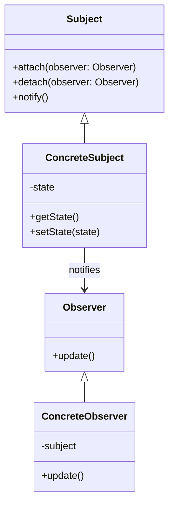

## 6.2 Observer Pattern

The Observer Pattern is a fundamental behavioral design pattern that establishes a one-to-many dependency between objects. This pattern is particularly useful when you need to ensure that multiple objects are automatically notified and updated when another object changes its state. In this section, we will delve into the intricacies of implementing the Observer Pattern in the D programming language, leveraging its unique features such as delegates, events, and the publish-subscribe mechanism.

### Purpose of the Observer Pattern

The primary purpose of the Observer Pattern is to create a system where objects can subscribe to receive updates or notifications from another object, known as the subject. This pattern decouples the subject from its observers, allowing for a flexible and scalable architecture where changes in one part of the system can be propagated to other parts without tight coupling.

### Key Participants

1. **Subject**: The object that holds the state and notifies observers of any changes.
2. **Observer**: The objects that need to be notified of changes in the subject.
3. **ConcreteSubject**: A specific implementation of the subject that maintains the state of interest.
4. **ConcreteObserver**: A specific implementation of the observer that reacts to changes in the subject.

### Implementing Observer in D

#### Delegates and Events

In D, delegates are a powerful feature that can be used to implement the Observer Pattern. A delegate is a type that represents a method with a specific signature, allowing you to store references to methods and invoke them dynamically.

```d
import std.stdio;

class Subject {
    private string _state;
    private delegate void StateChangeDelegate(string newState);
    private StateChangeDelegate[] observers;

    void attach(StateChangeDelegate observer) {
        observers ~= observer;
    }

    void detach(StateChangeDelegate observer) {
        observers = observers.filter!(o => o != observer).array;
    }

    void notify() {
        foreach (observer; observers) {
            observer(_state);
        }
    }

    void changeState(string newState) {
        _state = newState;
        notify();
    }
}

class Observer {
    string name;

    this(string name) {
        this.name = name;
    }

    void update(string newState) {
        writeln(name, " received new state: ", newState);
    }
}

void main() {
    auto subject = new Subject();
    auto observer1 = new Observer("Observer 1");
    auto observer2 = new Observer("Observer 2");

    subject.attach(&observer1.update);
    subject.attach(&observer2.update);

    subject.changeState("State A");
    subject.changeState("State B");
}
```

**Explanation**: In this example, the `Subject` class maintains a list of observers using an array of delegates. The `attach` method adds a new observer, while the `detach` method removes an existing one. The `notify` method iterates over all observers and calls their update methods with the new state.

#### Publish-Subscribe Mechanism

The publish-subscribe mechanism is another way to implement the Observer Pattern, where the subject publishes events, and observers subscribe to these events to receive notifications.

```d
import std.stdio;
import std.algorithm;

class Event {
    private delegate void EventHandler(string message);
    private EventHandler[] subscribers;

    void subscribe(EventHandler handler) {
        subscribers ~= handler;
    }

    void unsubscribe(EventHandler handler) {
        subscribers = subscribers.filter!(s => s != handler).array;
    }

    void publish(string message) {
        foreach (subscriber; subscribers) {
            subscriber(message);
        }
    }
}

void main() {
    auto event = new Event();

    auto subscriber1 = (string msg) => writeln("Subscriber 1 received: ", msg);
    auto subscriber2 = (string msg) => writeln("Subscriber 2 received: ", msg);

    event.subscribe(subscriber1);
    event.subscribe(subscriber2);

    event.publish("Hello, World!");
    event.publish("Observer Pattern in D");
}
```

**Explanation**: Here, the `Event` class acts as the subject, and it maintains a list of subscribers. The `subscribe` method adds a new subscriber, and the `unsubscribe` method removes one. The `publish` method sends a message to all subscribers.

### Use Cases and Examples

#### GUI Applications

In GUI applications, the Observer Pattern is often used to update UI components in response to data changes. For example, when the data model changes, all views displaying the data need to be updated.

```d
class DataModel {
    private string _data;
    private delegate void DataChangeDelegate(string newData);
    private DataChangeDelegate[] views;

    void attach(DataChangeDelegate view) {
        views ~= view;
    }

    void changeData(string newData) {
        _data = newData;
        notifyViews();
    }

    void notifyViews() {
        foreach (view; views) {
            view(_data);
        }
    }
}

class View {
    void display(string data) {
        writeln("Displaying data: ", data);
    }
}

void main() {
    auto model = new DataModel();
    auto view1 = new View();
    auto view2 = new View();

    model.attach(&view1.display);
    model.attach(&view2.display);

    model.changeData("New Data");
}
```

**Explanation**: In this example, the `DataModel` class acts as the subject, and the `View` class acts as the observer. When the data changes, all attached views are notified and updated.

#### Event Handling

The Observer Pattern is also useful for responding to system or user events. For instance, in a logging system, different components can subscribe to log events and handle them accordingly.

```d
class Logger {
    private delegate void LogHandler(string message);
    private LogHandler[] handlers;

    void addHandler(LogHandler handler) {
        handlers ~= handler;
    }

    void log(string message) {
        foreach (handler; handlers) {
            handler(message);
        }
    }
}

void main() {
    auto logger = new Logger();

    auto consoleHandler = (string msg) => writeln("Console: ", msg);
    auto fileHandler = (string msg) => writeln("File: ", msg);

    logger.addHandler(consoleHandler);
    logger.addHandler(fileHandler);

    logger.log("An event occurred.");
}
```

**Explanation**: In this logging system, the `Logger` class acts as the subject, and different handlers act as observers. When a log event occurs, all handlers are notified and process the log message.

### Visualizing the Observer Pattern

To better understand the Observer Pattern, let's visualize the relationships and interactions between the subject and observers using a class diagram.



**Diagram Explanation**: The class diagram illustrates the relationship between the `Subject` and `Observer` classes. The `ConcreteSubject` maintains the state and notifies `ConcreteObserver` instances of any changes.

### Design Considerations

- **Decoupling**: The Observer Pattern decouples the subject from its observers, allowing for a more flexible and maintainable architecture.
- **Performance**: Be mindful of the performance implications when notifying a large number of observers.
- **Memory Management**: Ensure proper memory management to avoid memory leaks, especially when using delegates and closures.

### Differences and Similarities

- **Observer vs. Publish-Subscribe**: While both patterns involve notifying multiple parties of changes, the publish-subscribe mechanism is more decoupled, as it does not require the subject to maintain a list of observers.
- **Observer vs. Mediator**: The Mediator Pattern centralizes communication between objects, whereas the Observer Pattern allows direct communication between the subject and observers.

### Try It Yourself

To deepen your understanding of the Observer Pattern in D, try modifying the code examples:

- Add a new observer to the `Subject` class and see how it reacts to state changes.
- Implement a priority system where certain observers are notified before others.
- Experiment with different types of events in the publish-subscribe example.

### Knowledge Check

- What are the key participants in the Observer Pattern?
- How does the Observer Pattern decouple the subject from its observers?
- What are some common use cases for the Observer Pattern in software development?

### Embrace the Journey

Remember, mastering design patterns is a journey. As you continue to explore the Observer Pattern and other design patterns in D, you'll gain a deeper understanding of how to build flexible, scalable, and maintainable software systems. Keep experimenting, stay curious, and enjoy the process!

## Quiz Time!



### What is the primary purpose of the Observer Pattern?

- [x] To establish a one-to-many dependency between objects.
- [ ] To create a one-to-one relationship between objects.
- [ ] To encapsulate a request as an object.
- [ ] To define a family of algorithms.

> **Explanation:** The Observer Pattern establishes a one-to-many dependency between objects so that when one object changes state, all its dependents are notified and updated automatically.

### Which D language feature is commonly used to implement the Observer Pattern?

- [x] Delegates
- [ ] Interfaces
- [ ] Mixins
- [ ] Templates

> **Explanation:** Delegates in D are commonly used to implement the Observer Pattern as they allow methods to be stored and invoked dynamically.

### In the Observer Pattern, what role does the Subject play?

- [x] It maintains the state and notifies observers of changes.
- [ ] It receives updates from observers.
- [ ] It acts as an intermediary between observers.
- [ ] It encapsulates a request as an object.

> **Explanation:** The Subject maintains the state of interest and notifies observers of any changes to this state.

### How does the publish-subscribe mechanism differ from the Observer Pattern?

- [x] It is more decoupled, as it does not require the subject to maintain a list of observers.
- [ ] It requires a direct connection between the subject and observers.
- [ ] It centralizes communication between objects.
- [ ] It encapsulates a request as an object.

> **Explanation:** The publish-subscribe mechanism is more decoupled because it does not require the subject to maintain a list of observers; instead, observers subscribe to events.

### What is a common use case for the Observer Pattern in GUI applications?

- [x] Updating UI components in response to data changes.
- [ ] Managing memory allocation.
- [ ] Encapsulating a request as an object.
- [ ] Defining a family of algorithms.

> **Explanation:** In GUI applications, the Observer Pattern is commonly used to update UI components in response to data changes.

### What is a potential performance consideration when using the Observer Pattern?

- [x] Notifying a large number of observers can impact performance.
- [ ] It requires a direct connection between the subject and observers.
- [ ] It centralizes communication between objects.
- [ ] It encapsulates a request as an object.

> **Explanation:** Notifying a large number of observers can impact performance, so it's important to consider this when implementing the Observer Pattern.

### How can memory management be a concern in the Observer Pattern?

- [x] Improper management can lead to memory leaks, especially with delegates.
- [ ] It requires a direct connection between the subject and observers.
- [ ] It centralizes communication between objects.
- [ ] It encapsulates a request as an object.

> **Explanation:** Improper memory management, especially when using delegates and closures, can lead to memory leaks in the Observer Pattern.

### What is a key difference between the Observer and Mediator Patterns?

- [x] The Mediator Pattern centralizes communication, while the Observer Pattern allows direct communication.
- [ ] The Observer Pattern centralizes communication, while the Mediator Pattern allows direct communication.
- [ ] Both patterns encapsulate a request as an object.
- [ ] Both patterns define a family of algorithms.

> **Explanation:** The Mediator Pattern centralizes communication between objects, whereas the Observer Pattern allows direct communication between the subject and observers.

### True or False: The Observer Pattern can be used to implement event handling systems.

- [x] True
- [ ] False

> **Explanation:** True. The Observer Pattern is often used to implement event handling systems where multiple components need to respond to events.

### True or False: The Observer Pattern is only applicable in object-oriented programming.

- [ ] True
- [x] False

> **Explanation:** False. The Observer Pattern can be applied in various programming paradigms, not just object-oriented programming.


