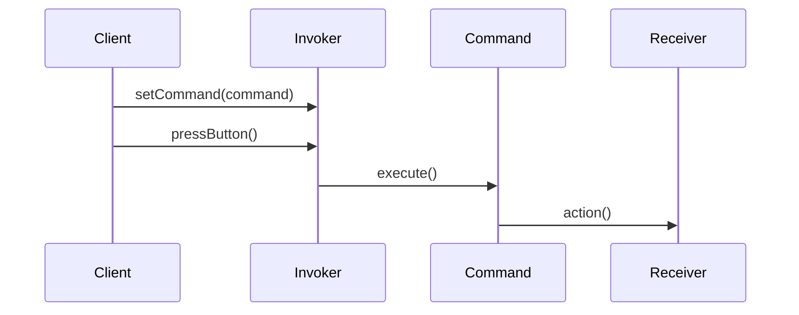

## 6.3 Command Pattern

The Command Pattern is a behavioral design pattern that transforms requests into standalone objects, allowing for the parameterization of clients with queues, requests, and operations. This pattern is particularly beneficial in systems programming, where flexibility and scalability are paramount. In this section, we will delve into the intricacies of implementing the Command Pattern in the D programming language, leveraging its unique features to create robust and maintainable systems.

### Purpose of the Command Pattern

The primary purpose of the Command Pattern is to encapsulate a request as an object, thereby decoupling the sender of the request from the receiver. This decoupling allows for various operations such as queuing requests, logging operations, and supporting undoable operations. By encapsulating requests, the Command Pattern provides a way to parameterize objects with operations, delay execution, and support reversible operations.

### Key Components of the Command Pattern

Before we dive into the implementation, let's outline the key components of the Command Pattern:

- **Command**: An interface or abstract class that declares the execution method.
- **ConcreteCommand**: A class that implements the Command interface and defines the binding between the action and the receiver.
- **Invoker**: The object that knows how to execute a command but does not know how the command is implemented.
- **Receiver**: The object that performs the actual work when the command is executed.
- **Client**: The object that creates and configures the command objects.

### Implementing Command in D

#### Command Objects

In D, command objects can be represented using classes or structs. The choice between classes and structs depends on whether you need reference semantics (classes) or value semantics (structs). Here's a simple example of defining a command interface in D:

```d
interface Command {
    void execute();
}
```

#### ConcreteCommand

A concrete command implements the Command interface and holds a reference to the receiver. It binds the action to the receiver:

```d
class LightOnCommand : Command {
    private Light light;

    this(Light light) {
        this.light = light;
    }

    override void execute() {
        light.turnOn();
    }
}
```

In this example, `LightOnCommand` is a concrete command that turns on a light. The `Light` class represents the receiver:

```d
class Light {
    void turnOn() {
        writeln("The light is on.");
    }

    void turnOff() {
        writeln("The light is off.");
    }
}
```

#### Invoker and Receiver

The invoker is responsible for executing commands. It maintains a reference to the command and triggers its execution:

```d
class RemoteControl {
    private Command command;

    void setCommand(Command command) {
        this.command = command;
    }

    void pressButton() {
        command.execute();
    }
}
```

The receiver, as shown in the `Light` class, performs the actual work when the command is executed.

#### Use Cases and Examples

##### Undo/Redo Functionality

One of the most common use cases for the Command Pattern is implementing undo/redo functionality. By storing executed commands in a stack, you can easily reverse operations:

```d
class LightOffCommand : Command {
    private Light light;

    this(Light light) {
        this.light = light;
    }

    override void execute() {
        light.turnOff();
    }
}

// Usage
void main() {
    Light livingRoomLight = new Light();
    Command lightOn = new LightOnCommand(livingRoomLight);
    Command lightOff = new LightOffCommand(livingRoomLight);

    RemoteControl remote = new RemoteControl();
    remote.setCommand(lightOn);
    remote.pressButton(); // The light is on.

    remote.setCommand(lightOff);
    remote.pressButton(); // The light is off.
}
```

To implement undo functionality, you can maintain a history of commands and execute the inverse operation:

```d
class LightOnCommand : Command {
    private Light light;

    this(Light light) {
        this.light = light;
    }

    override void execute() {
        light.turnOn();
    }

    void undo() {
        light.turnOff();
    }
}

class LightOffCommand : Command {
    private Light light;

    this(Light light) {
        this.light = light;
    }

    override void execute() {
        light.turnOff();
    }

    void undo() {
        light.turnOn();
    }
}

// Extend RemoteControl to support undo
class RemoteControlWithUndo {
    private Command command;
    private Command lastCommand;

    void setCommand(Command command) {
        this.command = command;
    }

    void pressButton() {
        command.execute();
        lastCommand = command;
    }

    void pressUndo() {
        if (lastCommand !is null) {
            lastCommand.undo();
        }
    }
}
```

##### Task Scheduling

The Command Pattern is also useful for task scheduling, where commands are queued for execution at a later time:

```d
class Scheduler {
    private Command[] commandQueue;

    void addCommand(Command command) {
        commandQueue ~= command;
    }

    void executeCommands() {
        foreach (cmd; commandQueue) {
            cmd.execute();
        }
        commandQueue.length = 0; // Clear the queue after execution
    }
}

// Usage
void main() {
    Light kitchenLight = new Light();
    Command kitchenLightOn = new LightOnCommand(kitchenLight);

    Scheduler scheduler = new Scheduler();
    scheduler.addCommand(kitchenLightOn);

    // Execute all scheduled commands
    scheduler.executeCommands(); // The light is on.
}
```

### Visualizing the Command Pattern

To better understand the Command Pattern, let's visualize the interaction between its components using a sequence diagram:



This diagram illustrates how the client sets a command in the invoker, which then executes the command, triggering an action on the receiver.

### Design Considerations

When implementing the Command Pattern in D, consider the following:

- **Command Interface**: Define a clear and concise command interface that all concrete commands must implement.
- **Receiver Logic**: Ensure that the receiver encapsulates the logic necessary to perform the requested action.
- **Invoker Flexibility**: Design the invoker to be flexible and capable of handling various commands.
- **Undo/Redo Support**: If undo/redo functionality is required, ensure that commands can reverse their actions.
- **Task Scheduling**: For task scheduling, consider using a queue to manage command execution.

### Differences and Similarities

The Command Pattern is often compared to other behavioral patterns, such as the Strategy Pattern. While both patterns encapsulate behavior, the Command Pattern focuses on encapsulating requests as objects, whereas the Strategy Pattern encapsulates algorithms. Understanding these distinctions is crucial for selecting the appropriate pattern for your use case.

### Try It Yourself

To deepen your understanding of the Command Pattern, try modifying the code examples provided:

- Implement additional commands, such as `DimLightCommand`, and integrate them with the `RemoteControl`.
- Extend the `Scheduler` to support priority-based command execution.
- Experiment with different receiver classes to see how the pattern adapts to various scenarios.

### Knowledge Check

- What are the key components of the Command Pattern?
- How does the Command Pattern support undo/redo functionality?
- What are some common use cases for the Command Pattern in systems programming?

### Embrace the Journey

Remember, mastering design patterns is a journey. As you explore the Command Pattern in D, you'll gain valuable insights into creating flexible and scalable software systems. Keep experimenting, stay curious, and enjoy the process of learning and applying these powerful design principles.

## Quiz Time!



### What is the primary purpose of the Command Pattern?

- [x] To encapsulate a request as an object
- [ ] To create a family of algorithms
- [ ] To define a one-to-many dependency
- [ ] To provide a way to access elements of an aggregate object sequentially

> **Explanation:** The Command Pattern encapsulates a request as an object, allowing for parameterization of clients with queues, requests, and operations.

### Which component of the Command Pattern is responsible for executing the command?

- [ ] Client
- [x] Invoker
- [ ] Receiver
- [ ] ConcreteCommand

> **Explanation:** The Invoker is responsible for executing the command, while the Receiver performs the actual work.

### How does the Command Pattern support undo functionality?

- [x] By storing executed commands and reversing their actions
- [ ] By creating a new command for each undo operation
- [ ] By using a separate undo interface
- [ ] By modifying the receiver directly

> **Explanation:** The Command Pattern supports undo functionality by storing executed commands and providing a method to reverse their actions.

### What is a common use case for the Command Pattern?

- [ ] Implementing a data structure
- [x] Task scheduling
- [ ] Creating a user interface
- [ ] Managing database connections

> **Explanation:** Task scheduling is a common use case for the Command Pattern, where commands are queued for execution.

### Which D language feature is particularly useful for implementing the Command Pattern?

- [ ] Mixins
- [ ] Templates
- [x] Interfaces
- [ ] Delegates

> **Explanation:** Interfaces in D are useful for defining the command interface that all concrete commands must implement.

### What is the role of the Receiver in the Command Pattern?

- [ ] To execute the command
- [ ] To create the command
- [x] To perform the actual work when the command is executed
- [ ] To manage command execution order

> **Explanation:** The Receiver performs the actual work when the command is executed, as defined by the ConcreteCommand.

### How can the Command Pattern be visualized?

- [ ] Using a class diagram
- [x] Using a sequence diagram
- [ ] Using a flowchart
- [ ] Using a state diagram

> **Explanation:** A sequence diagram is effective for visualizing the interaction between components in the Command Pattern.

### What is a key benefit of using the Command Pattern?

- [ ] It simplifies the codebase
- [x] It decouples the sender of a request from its receiver
- [ ] It reduces memory usage
- [ ] It increases execution speed

> **Explanation:** The Command Pattern decouples the sender of a request from its receiver, enhancing flexibility and scalability.

### Which pattern is often compared to the Command Pattern?

- [ ] Singleton Pattern
- [ ] Observer Pattern
- [x] Strategy Pattern
- [ ] Factory Pattern

> **Explanation:** The Strategy Pattern is often compared to the Command Pattern, as both encapsulate behavior but serve different purposes.

### True or False: The Command Pattern can be used for implementing a macro recording system.

- [x] True
- [ ] False

> **Explanation:** True. The Command Pattern can be used to implement a macro recording system by storing and executing a sequence of commands.


