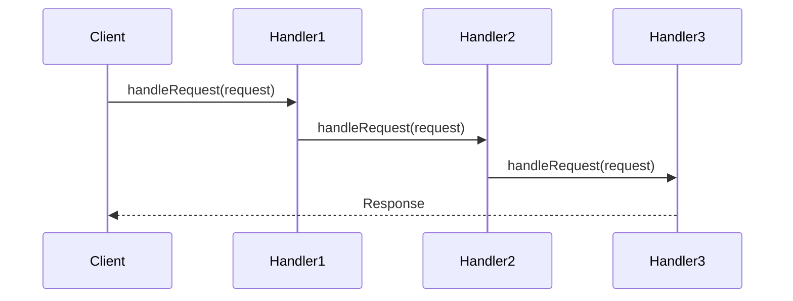

## 6.4 Chain of Responsibility Pattern

In the realm of software design, the Chain of Responsibility pattern is a powerful tool for creating flexible and decoupled systems. This pattern allows a request to be passed along a chain of handlers, where each handler decides whether to process the request or pass it to the next handler in the chain. This approach is particularly useful in scenarios where multiple objects can handle a request, but the specific handler is not known until runtime.

### Purpose

The primary purpose of the Chain of Responsibility pattern is to decouple the sender of a request from its receivers by allowing multiple objects to handle the request without the sender needing to know which object will ultimately process it. This pattern promotes loose coupling and enhances flexibility in assigning responsibilities to objects.

### Implementing Chain of Responsibility in D

#### Handler Interface

The first step in implementing the Chain of Responsibility pattern in D is to define a common interface for all handlers. This interface will declare a method for handling requests and a method for setting the next handler in the chain.

```d
interface Handler {
    void setNext(Handler next);
    void handleRequest(string request);
}
```

In this interface, `setNext` is used to link handlers together, and `handleRequest` is the method that each handler will implement to process the request.

#### Linked Handlers

Next, we need to create concrete handler classes that implement the `Handler` interface. Each handler will have a reference to the next handler in the chain and will decide whether to process the request or pass it along.

```d
class ConcreteHandlerA : Handler {
    private Handler nextHandler;

    override void setNext(Handler next) {
        this.nextHandler = next;
    }

    override void handleRequest(string request) {
        if (canHandle(request)) {
            writeln("ConcreteHandlerA handled the request: ", request);
        } else if (nextHandler !is null) {
            nextHandler.handleRequest(request);
        } else {
            writeln("Request not handled: ", request);
        }
    }

    private bool canHandle(string request) {
        return request == "A";
    }
}

class ConcreteHandlerB : Handler {
    private Handler nextHandler;

    override void setNext(Handler next) {
        this.nextHandler = next;
    }

    override void handleRequest(string request) {
        if (canHandle(request)) {
            writeln("ConcreteHandlerB handled the request: ", request);
        } else if (nextHandler !is null) {
            nextHandler.handleRequest(request);
        } else {
            writeln("Request not handled: ", request);
        }
    }

    private bool canHandle(string request) {
        return request == "B";
    }
}
```

In these classes, `ConcreteHandlerA` and `ConcreteHandlerB`, each handler checks if it can handle the request using the `canHandle` method. If it can, it processes the request; otherwise, it passes the request to the next handler in the chain.

### Use Cases and Examples

#### Event Bubbling

One common use case for the Chain of Responsibility pattern is event bubbling, where events are handled in a hierarchical manner. This is particularly useful in GUI applications where events can be captured and processed at different levels of the component hierarchy.

```d
class EventHandler : Handler {
    private Handler nextHandler;

    override void setNext(Handler next) {
        this.nextHandler = next;
    }

    override void handleRequest(string event) {
        if (canHandle(event)) {
            writeln("EventHandler handled the event: ", event);
        } else if (nextHandler !is null) {
            nextHandler.handleRequest(event);
        } else {
            writeln("Event not handled: ", event);
        }
    }

    private bool canHandle(string event) {
        return event == "click";
    }
}

// Usage
void main() {
    auto handler1 = new EventHandler();
    auto handler2 = new ConcreteHandlerA();
    auto handler3 = new ConcreteHandlerB();

    handler1.setNext(handler2);
    handler2.setNext(handler3);

    handler1.handleRequest("click");
    handler1.handleRequest("A");
    handler1.handleRequest("B");
    handler1.handleRequest("unknown");
}
```

In this example, `EventHandler` is a handler that processes "click" events. The chain is set up such that `handler1` passes requests to `handler2`, which in turn passes them to `handler3`.

#### Logging Systems

Another practical application of the Chain of Responsibility pattern is in logging systems, where log messages are passed through various filters and handlers. Each handler can decide whether to log the message or pass it to the next handler.

```d
class Logger : Handler {
    private Handler nextHandler;
    private string level;

    this(string level) {
        this.level = level;
    }

    override void setNext(Handler next) {
        this.nextHandler = next;
    }

    override void handleRequest(string message) {
        if (canHandle(message)) {
            writeln("Logger [", level, "] logged the message: ", message);
        } else if (nextHandler !is null) {
            nextHandler.handleRequest(message);
        } else {
            writeln("Message not logged: ", message);
        }
    }

    private bool canHandle(string message) {
        return message.startsWith(level);
    }
}

// Usage
void main() {
    auto infoLogger = new Logger("INFO");
    auto debugLogger = new Logger("DEBUG");
    auto errorLogger = new Logger("ERROR");

    infoLogger.setNext(debugLogger);
    debugLogger.setNext(errorLogger);

    infoLogger.handleRequest("INFO: This is an info message.");
    infoLogger.handleRequest("DEBUG: This is a debug message.");
    infoLogger.handleRequest("ERROR: This is an error message.");
    infoLogger.handleRequest("TRACE: This is a trace message.");
}
```

In this logging system, each `Logger` instance handles messages of a specific level. The chain allows messages to be passed through different loggers until one handles it.

### Visualizing the Chain of Responsibility Pattern

To better understand the flow of requests through the chain, let's visualize the Chain of Responsibility pattern using a sequence diagram.



In this diagram, the `Client` sends a request to `Handler1`, which passes it to `Handler2`, and then to `Handler3`. The response is sent back to the `Client` once a handler processes the request.

### Design Considerations

When implementing the Chain of Responsibility pattern, consider the following:

- **Chain Length**: Be mindful of the chain length, as a long chain can lead to performance issues.
- **Handler Order**: The order of handlers in the chain can affect the outcome, so carefully design the sequence.
- **Dynamic Chains**: Consider allowing dynamic modification of the chain to add or remove handlers at runtime.
- **Error Handling**: Ensure that unhandled requests are appropriately managed to avoid unexpected behavior.

### Differences and Similarities

The Chain of Responsibility pattern is often compared to the Command pattern. While both involve processing requests, the Chain of Responsibility pattern focuses on passing requests through a chain of handlers, whereas the Command pattern encapsulates requests as objects.

### Try It Yourself

To deepen your understanding of the Chain of Responsibility pattern, try modifying the code examples:

- Add a new handler to the chain that processes a different type of request.
- Implement a chain that dynamically changes its handlers based on certain conditions.
- Experiment with different logging levels and see how the chain handles them.

### Knowledge Check

Before moving on, let's summarize the key takeaways:

- The Chain of Responsibility pattern allows requests to be passed through a chain of handlers.
- It promotes loose coupling and flexibility in request handling.
- Common use cases include event bubbling and logging systems.
- Consider chain length, handler order, and error handling when implementing this pattern.

## Quiz Time!



### What is the primary purpose of the Chain of Responsibility pattern?

- [x] To decouple the sender of a request from its receivers
- [ ] To encapsulate requests as objects
- [ ] To provide a way to create objects without specifying their concrete classes
- [ ] To define a family of algorithms

> **Explanation:** The Chain of Responsibility pattern decouples the sender of a request from its receivers by allowing multiple objects to handle the request.

### Which method is used to link handlers together in the Chain of Responsibility pattern?

- [x] setNext
- [ ] handleRequest
- [ ] canHandle
- [ ] processRequest

> **Explanation:** The `setNext` method is used to link handlers together in the Chain of Responsibility pattern.

### In the Chain of Responsibility pattern, what happens if no handler processes the request?

- [x] The request is not handled
- [ ] The request is processed by the first handler
- [ ] The request is returned to the sender
- [ ] The request is logged as an error

> **Explanation:** If no handler processes the request, it remains unhandled.

### What is a common use case for the Chain of Responsibility pattern?

- [x] Event bubbling
- [ ] Singleton pattern
- [ ] Factory method
- [ ] Observer pattern

> **Explanation:** Event bubbling is a common use case for the Chain of Responsibility pattern, where events are handled in a hierarchical manner.

### How can the Chain of Responsibility pattern enhance flexibility?

- [x] By allowing dynamic modification of the chain
- [ ] By encapsulating requests as objects
- [ ] By defining a family of algorithms
- [ ] By providing a way to create objects without specifying their concrete classes

> **Explanation:** The Chain of Responsibility pattern enhances flexibility by allowing dynamic modification of the chain.

### What should be considered when implementing the Chain of Responsibility pattern?

- [x] Chain length
- [x] Handler order
- [ ] Singleton pattern
- [ ] Factory method

> **Explanation:** When implementing the Chain of Responsibility pattern, consider chain length and handler order.

### Which pattern is often compared to the Chain of Responsibility pattern?

- [x] Command pattern
- [ ] Singleton pattern
- [ ] Factory method
- [ ] Observer pattern

> **Explanation:** The Chain of Responsibility pattern is often compared to the Command pattern.

### What is the role of the `canHandle` method in the Chain of Responsibility pattern?

- [x] To determine if a handler can process a request
- [ ] To link handlers together
- [ ] To encapsulate requests as objects
- [ ] To define a family of algorithms

> **Explanation:** The `canHandle` method determines if a handler can process a request.

### What is the benefit of using the Chain of Responsibility pattern in logging systems?

- [x] It allows log messages to be passed through various filters
- [ ] It encapsulates log messages as objects
- [ ] It defines a family of logging algorithms
- [ ] It provides a way to create loggers without specifying their concrete classes

> **Explanation:** The Chain of Responsibility pattern allows log messages to be passed through various filters and handlers.

### True or False: The Chain of Responsibility pattern requires the sender to know which handler will process the request.

- [ ] True
- [x] False

> **Explanation:** False. The Chain of Responsibility pattern decouples the sender from the receivers, so the sender does not need to know which handler will process the request.



Remember, this is just the beginning. As you progress, you'll build more complex and interactive systems using the Chain of Responsibility pattern. Keep experimenting, stay curious, and enjoy the journey!
