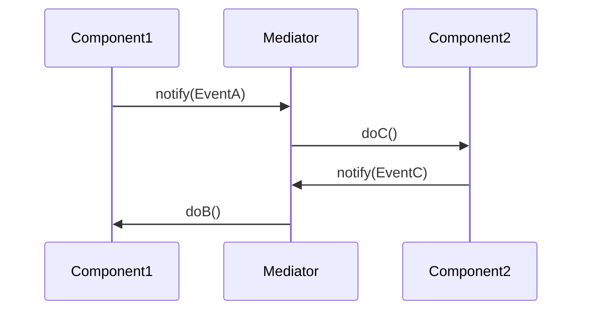

## 6.5 Mediator Pattern

In the realm of software design, the **Mediator Pattern** stands out as a powerful tool for managing complex interactions between objects. By encapsulating communication within a central mediator, this pattern promotes loose coupling and enhances system maintainability. In this section, we will delve into the Mediator Pattern, exploring its purpose, implementation in the D programming language, and practical use cases.

### Purpose

The Mediator Pattern defines an object that encapsulates how a set of objects interact. By centralizing communication, it prevents objects from referring to each other explicitly, thereby reducing dependencies and promoting loose coupling. This pattern is particularly useful in scenarios where multiple objects interact in complex ways, such as in GUI dialogues or communication protocols.

### Implementing Mediator in D

#### Central Mediator Object

The central concept of the Mediator Pattern is the mediator object, which manages communication between various components, known as colleagues. In D, we can leverage interfaces and classes to implement this pattern effectively.

```d
interface Mediator {
    void notify(Object sender, string event);
}

class ConcreteMediator : Mediator {
    private Component1 component1;
    private Component2 component2;

    this(Component1 c1, Component2 c2) {
        component1 = c1;
        component2 = c2;
        component1.setMediator(this);
        component2.setMediator(this);
    }

    override void notify(Object sender, string event) {
        if (event == "EventA") {
            writeln("Mediator reacts on EventA and triggers following operations:");
            component2.doC();
        }
        if (event == "EventB") {
            writeln("Mediator reacts on EventB and triggers following operations:");
            component1.doB();
            component2.doC();
        }
    }
}

class Component1 {
    private Mediator mediator;

    void setMediator(Mediator m) {
        mediator = m;
    }

    void doA() {
        writeln("Component1 does A.");
        mediator.notify(this, "EventA");
    }

    void doB() {
        writeln("Component1 does B.");
    }
}

class Component2 {
    private Mediator mediator;

    void setMediator(Mediator m) {
        mediator = m;
    }

    void doC() {
        writeln("Component2 does C.");
    }
}
```

In this example, `ConcreteMediator` coordinates the interaction between `Component1` and `Component2`. Each component communicates through the mediator, which decides how to handle events.

#### Decoupling Components

By using the Mediator Pattern, we decouple components, reducing dependencies among them. This makes the system more modular and easier to maintain.

```d
void main() {
    auto component1 = new Component1();
    auto component2 = new Component2();
    auto mediator = new ConcreteMediator(component1, component2);

    component1.doA();
    component2.doC();
}
```

In the `main` function, we instantiate the components and the mediator, demonstrating how the mediator manages interactions without direct references between components.

### Use Cases and Examples

#### GUI Dialogues

In graphical user interfaces, the Mediator Pattern is often used to coordinate interactions between controls, such as buttons, text fields, and sliders. By centralizing communication, the mediator simplifies the logic and reduces dependencies.

```d
class DialogMediator : Mediator {
    private Button okButton;
    private TextField textField;

    this(Button btn, TextField tf) {
        okButton = btn;
        textField = tf;
        okButton.setMediator(this);
        textField.setMediator(this);
    }

    override void notify(Object sender, string event) {
        if (event == "TextChanged") {
            writeln("DialogMediator reacts on TextChanged.");
            okButton.setEnabled(textField.getText().length > 0);
        }
    }
}

class Button {
    private Mediator mediator;
    private bool enabled;

    void setMediator(Mediator m) {
        mediator = m;
    }

    void click() {
        if (enabled) {
            writeln("Button clicked.");
            mediator.notify(this, "ButtonClicked");
        }
    }

    void setEnabled(bool state) {
        enabled = state;
        writeln("Button enabled: ", enabled);
    }
}

class TextField {
    private Mediator mediator;
    private string text;

    void setMediator(Mediator m) {
        mediator = m;
    }

    void setText(string t) {
        text = t;
        writeln("TextField text set to: ", text);
        mediator.notify(this, "TextChanged");
    }

    string getText() {
        return text;
    }
}
```

In this GUI example, the `DialogMediator` manages interactions between a `Button` and a `TextField`. The button's enabled state is updated based on the text field's content, demonstrating how the mediator coordinates component behavior.

#### Communication Protocols

In networked applications, the Mediator Pattern can be used to manage message routing and communication protocols. By centralizing message handling, the mediator simplifies protocol implementation and enhances flexibility.

```d
class NetworkMediator : Mediator {
    private Client client;
    private Server server;

    this(Client c, Server s) {
        client = c;
        server = s;
        client.setMediator(this);
        server.setMediator(this);
    }

    override void notify(Object sender, string event) {
        if (event == "MessageSent") {
            writeln("NetworkMediator routes message from client to server.");
            server.receiveMessage(client.getMessage());
        }
    }
}

class Client {
    private Mediator mediator;
    private string message;

    void setMediator(Mediator m) {
        mediator = m;
    }

    void sendMessage(string msg) {
        message = msg;
        writeln("Client sends message: ", message);
        mediator.notify(this, "MessageSent");
    }

    string getMessage() {
        return message;
    }
}

class Server {
    private Mediator mediator;

    void setMediator(Mediator m) {
        mediator = m;
    }

    void receiveMessage(string msg) {
        writeln("Server received message: ", msg);
    }
}
```

In this network communication example, the `NetworkMediator` routes messages between a `Client` and a `Server`. The mediator handles message delivery, allowing the client and server to remain decoupled.

### Visualizing the Mediator Pattern

To better understand the Mediator Pattern, let's visualize the interaction between components using a sequence diagram.



This diagram illustrates how `Component1` and `Component2` interact through the `Mediator`. The mediator receives notifications and coordinates actions between components.

### Design Considerations

When implementing the Mediator Pattern in D, consider the following:

- **Complexity**: While the mediator simplifies component interactions, it can become complex if it handles too many responsibilities. Ensure that the mediator's logic remains manageable.
- **Scalability**: The pattern is well-suited for systems with a moderate number of components. In systems with a large number of components, consider partitioning mediators to manage different groups.
- **Performance**: Centralizing communication can introduce performance bottlenecks. Optimize mediator logic to minimize delays.

### Differences and Similarities

The Mediator Pattern is often compared to the Observer Pattern. While both patterns manage communication between objects, the Mediator Pattern centralizes communication within a single object, whereas the Observer Pattern allows objects to communicate directly through event notifications.

### Try It Yourself

To deepen your understanding of the Mediator Pattern, try modifying the code examples:

- **Add New Components**: Introduce additional components and extend the mediator to manage their interactions.
- **Enhance Logic**: Implement more complex logic within the mediator, such as conditional routing or state management.
- **Optimize Performance**: Experiment with optimizing the mediator's performance by reducing unnecessary notifications.

### Knowledge Check

Before moving on, let's summarize the key takeaways:

- The Mediator Pattern centralizes communication, promoting loose coupling.
- It is useful in scenarios with complex interactions, such as GUI dialogues and communication protocols.
- Implementing the pattern in D involves creating a mediator interface and concrete mediator class.
- The pattern reduces dependencies among components, enhancing system maintainability.

Remember, mastering the Mediator Pattern is just one step in your journey to becoming an expert in design patterns. As you continue exploring, you'll discover new ways to apply this pattern in your projects.

## Quiz Time!



### What is the primary purpose of the Mediator Pattern?

- [x] To encapsulate how a set of objects interact
- [ ] To create a single instance of a class
- [ ] To provide a way to access elements of an aggregate object sequentially
- [ ] To define a family of algorithms

> **Explanation:** The Mediator Pattern encapsulates how a set of objects interact, promoting loose coupling by preventing objects from referring to each other explicitly.

### How does the Mediator Pattern promote loose coupling?

- [x] By centralizing communication within a mediator object
- [ ] By allowing direct communication between objects
- [ ] By using inheritance to share behavior
- [ ] By implementing interfaces for all components

> **Explanation:** The Mediator Pattern promotes loose coupling by centralizing communication within a mediator object, reducing dependencies among components.

### Which of the following is a common use case for the Mediator Pattern?

- [x] GUI dialogues
- [ ] Singleton management
- [ ] Sorting algorithms
- [ ] Data serialization

> **Explanation:** The Mediator Pattern is commonly used in GUI dialogues to coordinate interactions between controls.

### In the provided code example, what does the `notify` method in the `ConcreteMediator` class do?

- [x] It handles events and coordinates actions between components
- [ ] It initializes the mediator with components
- [ ] It sends messages directly to components
- [ ] It creates new instances of components

> **Explanation:** The `notify` method in the `ConcreteMediator` class handles events and coordinates actions between components based on the event type.

### What is a potential drawback of using the Mediator Pattern?

- [x] The mediator can become complex if it handles too many responsibilities
- [ ] It increases dependencies among components
- [ ] It requires all components to be tightly coupled
- [ ] It limits the number of components in a system

> **Explanation:** A potential drawback of the Mediator Pattern is that the mediator can become complex if it handles too many responsibilities, making it difficult to manage.

### How can you optimize the performance of a mediator?

- [x] By minimizing unnecessary notifications
- [ ] By increasing the number of components
- [ ] By using more inheritance
- [ ] By avoiding interfaces

> **Explanation:** Optimizing the performance of a mediator involves minimizing unnecessary notifications to reduce delays and improve efficiency.

### What is the difference between the Mediator Pattern and the Observer Pattern?

- [x] The Mediator Pattern centralizes communication, while the Observer Pattern allows direct communication through events
- [ ] The Mediator Pattern is used for creating single instances, while the Observer Pattern is for iterating over collections
- [ ] The Mediator Pattern is for sorting algorithms, while the Observer Pattern is for data serialization
- [ ] The Mediator Pattern is for defining families of algorithms, while the Observer Pattern is for creating new instances

> **Explanation:** The Mediator Pattern centralizes communication within a single object, whereas the Observer Pattern allows objects to communicate directly through event notifications.

### Which D language feature is particularly useful for implementing the Mediator Pattern?

- [x] Interfaces
- [ ] Mixins
- [ ] Templates
- [ ] Compile-Time Function Execution (CTFE)

> **Explanation:** Interfaces in D are particularly useful for implementing the Mediator Pattern, as they allow for defining a common communication protocol for components.

### What is the role of the `setMediator` method in the component classes?

- [x] To assign a mediator to the component
- [ ] To send messages to other components
- [ ] To initialize component properties
- [ ] To create new instances of the mediator

> **Explanation:** The `setMediator` method in the component classes assigns a mediator to the component, enabling it to communicate through the mediator.

### True or False: The Mediator Pattern is suitable for systems with a large number of components.

- [ ] True
- [x] False

> **Explanation:** The Mediator Pattern is well-suited for systems with a moderate number of components. In systems with a large number of components, the mediator can become a bottleneck, and partitioning mediators may be necessary.



As you continue your journey in mastering design patterns in D, remember that the Mediator Pattern is a valuable tool for managing complex interactions. Keep experimenting, stay curious, and enjoy the process of building more efficient and maintainable software systems!
