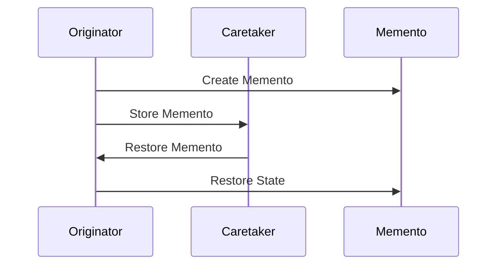

## 6.6 Memento Pattern

The Memento Pattern is a behavioral design pattern that allows you to capture and externalize an object's internal state without violating encapsulation, enabling the object to be restored to this state later. This pattern is particularly useful in scenarios where you need to implement undo functionality or save the state of an application, such as in game development.

### Intent of the Memento Pattern

The primary intent of the Memento Pattern is to provide a way to capture an object's state so that it can be restored later, without exposing the details of the object's implementation. This is achieved by storing the state in a separate object, known as the Memento, which can be used to restore the original object to its previous state.

### Key Participants

1. **Memento**: Stores the internal state of the Originator. It is typically a simple data structure with no methods that operate on the data.
2. **Originator**: The object whose state needs to be saved and restored. It creates a Memento containing a snapshot of its current state and uses the Memento to restore its state.
3. **Caretaker**: Manages the Memento. It is responsible for keeping the Memento safe but does not operate on or examine the contents of the Memento.

### Applicability

The Memento Pattern is applicable in the following scenarios:

- **Undo Mechanisms**: When you need to implement undo functionality that allows users to revert changes.
- **State Restoration**: In applications like text editors or graphic design tools where the state needs to be saved and restored.
- **Game Development**: For saving and loading game states, allowing players to resume from a saved point.

### Implementing Memento in D

Let's explore how to implement the Memento Pattern in the D programming language. We'll break down the implementation into the Memento class, the Originator, and the Caretaker.

#### Memento Class

The Memento class is responsible for storing the state of the Originator. It should be a simple class or struct that holds the necessary state information.

```d
// Memento class to store the state of the Originator
class Memento {
    private string state;

    this(string state) {
        this.state = state;
    }

    string getState() {
        return state;
    }
}
```

#### Originator Class

The Originator is the object whose state needs to be saved and restored. It creates a Memento containing a snapshot of its current state and uses the Memento to restore its state.

```d
// Originator class that creates and restores Mementos
class Originator {
    private string state;

    void setState(string state) {
        this.state = state;
    }

    string getState() {
        return state;
    }

    Memento saveStateToMemento() {
        return new Memento(state);
    }

    void restoreStateFromMemento(Memento memento) {
        state = memento.getState();
    }
}
```

#### Caretaker Class

The Caretaker is responsible for managing the Memento. It keeps track of the Mementos but does not operate on or examine their contents.

```d
// Caretaker class that manages Mementos
class Caretaker {
    private Memento[] mementoList;

    void add(Memento state) {
        mementoList ~= state;
    }

    Memento get(int index) {
        return mementoList[index];
    }
}
```

### Use Cases and Examples

Let's explore some practical use cases of the Memento Pattern in D, focusing on state restoration and game development.

#### State Restoration: Implementing Undo Functionality

One of the most common use cases for the Memento Pattern is implementing undo functionality. Consider a text editor where users can type text and undo their actions.

```d
import std.stdio;

void main() {
    Originator originator = new Originator();
    Caretaker caretaker = new Caretaker();

    originator.setState("State #1");
    caretaker.add(originator.saveStateToMemento());

    originator.setState("State #2");
    caretaker.add(originator.saveStateToMemento());

    originator.setState("State #3");
    writeln("Current State: ", originator.getState());

    originator.restoreStateFromMemento(caretaker.get(1));
    writeln("Restored to State: ", originator.getState());

    originator.restoreStateFromMemento(caretaker.get(0));
    writeln("Restored to State: ", originator.getState());
}
```

**Output:**

```
Current State: State #3
Restored to State: State #2
Restored to State: State #1
```

In this example, the `Caretaker` stores multiple states of the `Originator`, allowing us to restore the `Originator` to any previous state.

#### Game Development: Saving Game States

In game development, the Memento Pattern is useful for saving and loading game states. This allows players to save their progress and resume from a saved point.

```d
import std.stdio;

class Game {
    private string level;
    private int score;

    void setLevel(string level) {
        this.level = level;
    }

    void setScore(int score) {
        this.score = score;
    }

    string getLevel() {
        return level;
    }

    int getScore() {
        return score;
    }

    Memento saveGame() {
        return new Memento(level, score);
    }

    void loadGame(Memento memento) {
        level = memento.getLevel();
        score = memento.getScore();
    }
}

class Memento {
    private string level;
    private int score;

    this(string level, int score) {
        this.level = level;
        this.score = score;
    }

    string getLevel() {
        return level;
    }

    int getScore() {
        return score;
    }
}

void main() {
    Game game = new Game();
    Caretaker caretaker = new Caretaker();

    game.setLevel("Level 1");
    game.setScore(100);
    caretaker.add(game.saveGame());

    game.setLevel("Level 2");
    game.setScore(200);
    caretaker.add(game.saveGame());

    writeln("Current Level: ", game.getLevel(), ", Score: ", game.getScore());

    game.loadGame(caretaker.get(0));
    writeln("Restored to Level: ", game.getLevel(), ", Score: ", game.getScore());
}
```

**Output:**

```
Current Level: Level 2, Score: 200
Restored to Level: Level 1, Score: 100
```

In this example, the `Game` class uses the Memento Pattern to save and load game states, allowing players to resume from a saved point.

### Visualizing the Memento Pattern

To better understand the Memento Pattern, let's visualize the interaction between the Originator, Memento, and Caretaker using a sequence diagram.



**Diagram Description**: The sequence diagram illustrates the interaction between the Originator, Caretaker, and Memento. The Originator creates a Memento to capture its state, which is then stored by the Caretaker. When needed, the Caretaker provides the Memento back to the Originator to restore its state.

### Design Considerations

When implementing the Memento Pattern, consider the following:

- **Encapsulation**: Ensure that the Memento does not expose the internal state of the Originator. The Memento should only be accessible to the Originator.
- **Memory Usage**: Be mindful of the memory usage when storing multiple Mementos, especially in applications with frequent state changes.
- **Serialization**: Consider using serialization for storing Mementos if the state needs to be persisted across sessions.

### Differences and Similarities

The Memento Pattern is often compared to other behavioral patterns like the Command Pattern. While both patterns involve capturing state, the Memento Pattern focuses on storing and restoring the state, whereas the Command Pattern encapsulates a request as an object.

### Try It Yourself

Experiment with the Memento Pattern by modifying the code examples. Try adding additional state variables to the `Originator` or `Game` class and observe how the Memento Pattern handles these changes. Consider implementing a redo functionality alongside undo to further explore the pattern's capabilities.

### Knowledge Check

- What is the primary purpose of the Memento Pattern?
- How does the Memento Pattern maintain encapsulation?
- What are some common use cases for the Memento Pattern?
- How does the Memento Pattern differ from the Command Pattern?

### Embrace the Journey

Remember, mastering design patterns like the Memento Pattern is a journey. As you continue to explore and implement these patterns, you'll gain a deeper understanding of how to build robust and maintainable software systems. Keep experimenting, stay curious, and enjoy the journey!

## Quiz Time!



### What is the primary purpose of the Memento Pattern?

- [x] To capture and restore an object's state without violating encapsulation.
- [ ] To encapsulate a request as an object.
- [ ] To define a family of algorithms.
- [ ] To provide a way to access the elements of an aggregate object sequentially.

> **Explanation:** The Memento Pattern is designed to capture and restore an object's state without violating encapsulation.

### Which component of the Memento Pattern is responsible for storing the object's state?

- [ ] Originator
- [x] Memento
- [ ] Caretaker
- [ ] Command

> **Explanation:** The Memento is responsible for storing the object's state.

### What role does the Caretaker play in the Memento Pattern?

- [ ] It modifies the state of the Originator.
- [x] It manages the Memento and keeps it safe.
- [ ] It creates the Memento.
- [ ] It defines the state to be saved.

> **Explanation:** The Caretaker manages the Memento and keeps it safe without modifying its contents.

### In which scenario is the Memento Pattern particularly useful?

- [x] Implementing undo functionality.
- [ ] Defining a family of algorithms.
- [ ] Encapsulating a request as an object.
- [ ] Providing a way to access elements of an aggregate object sequentially.

> **Explanation:** The Memento Pattern is particularly useful for implementing undo functionality.

### How does the Memento Pattern maintain encapsulation?

- [x] By storing the state in a separate object that is only accessible to the Originator.
- [ ] By exposing the internal state of the Originator.
- [ ] By allowing the Caretaker to modify the state.
- [ ] By using a public interface to access the state.

> **Explanation:** The Memento Pattern maintains encapsulation by storing the state in a separate object that is only accessible to the Originator.

### What is a common use case for the Memento Pattern in game development?

- [x] Saving and loading game states.
- [ ] Defining game algorithms.
- [ ] Encapsulating game requests as objects.
- [ ] Accessing game elements sequentially.

> **Explanation:** A common use case for the Memento Pattern in game development is saving and loading game states.

### How does the Memento Pattern differ from the Command Pattern?

- [x] The Memento Pattern focuses on storing and restoring state, while the Command Pattern encapsulates a request as an object.
- [ ] The Memento Pattern defines a family of algorithms, while the Command Pattern captures state.
- [ ] The Memento Pattern provides a way to access elements sequentially, while the Command Pattern stores state.
- [ ] The Memento Pattern encapsulates a request, while the Command Pattern restores state.

> **Explanation:** The Memento Pattern focuses on storing and restoring state, while the Command Pattern encapsulates a request as an object.

### What should be considered when implementing the Memento Pattern?

- [x] Memory usage and encapsulation.
- [ ] Algorithm efficiency.
- [ ] Request encapsulation.
- [ ] Sequential access.

> **Explanation:** When implementing the Memento Pattern, consider memory usage and encapsulation.

### What is the role of the Originator in the Memento Pattern?

- [x] It creates and restores Mementos.
- [ ] It manages the Memento.
- [ ] It stores the state.
- [ ] It encapsulates a request.

> **Explanation:** The Originator creates and restores Mementos.

### True or False: The Memento Pattern can be used to implement redo functionality.

- [x] True
- [ ] False

> **Explanation:** The Memento Pattern can be extended to implement redo functionality by managing multiple states.


