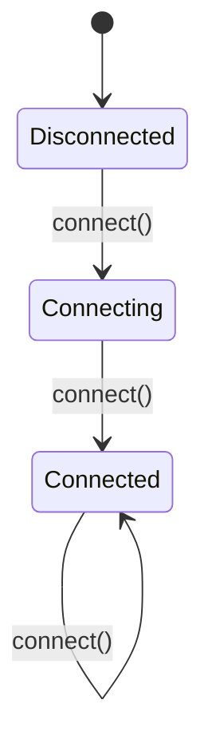

## 6.7 State Pattern

The State Pattern is an essential behavioral design pattern that enables an object to change its behavior when its internal state changes. This pattern is particularly useful in scenarios where an object must exhibit different behaviors in different states, such as state machines or protocol implementations. In this section, we will explore how to implement the State Pattern in the D programming language, leveraging its unique features to create efficient and maintainable code.

### Purpose

The primary purpose of the State Pattern is to allow an object to alter its behavior when its internal state changes, making it appear as if the object has changed its class. This is achieved by encapsulating state-specific behavior within separate state objects and delegating state-dependent behavior to these objects.

### Implementing State in D

To implement the State Pattern in D, we need to define state interfaces and a context object that maintains an instance of a concrete state subclass. Let's break down these components:

#### State Interfaces

State interfaces define the behaviors that are specific to each state. These interfaces are implemented by concrete state classes, each representing a different state of the context object.

```d
interface State {
    void handle(Context context);
}
```

In this example, the `State` interface declares a `handle` method that takes a `Context` object as a parameter. Each concrete state class will implement this method to define state-specific behavior.

#### Context Object

The context object maintains an instance of a concrete state subclass and delegates state-dependent behavior to this state object. The context object also provides a method to change its current state.

```d
class Context {
    private State currentState;

    this(State initialState) {
        this.currentState = initialState;
    }

    void setState(State state) {
        this.currentState = state;
    }

    void request() {
        currentState.handle(this);
    }
}
```

In this example, the `Context` class maintains a reference to the current state and provides a `request` method that delegates the behavior to the current state. The `setState` method allows the context to change its state.

### Use Cases and Examples

The State Pattern is particularly useful in scenarios where an object's behavior changes based on its state. Let's explore some common use cases and examples:

#### State Machines

State machines are a classic example of the State Pattern. They model objects that change behavior based on their state. Consider a simple state machine that models a traffic light:

```d
class TrafficLightContext {
    private State currentState;

    this(State initialState) {
        this.currentState = initialState;
    }

    void setState(State state) {
        this.currentState = state;
    }

    void change() {
        currentState.handle(this);
    }
}

class RedState : State {
    void handle(TrafficLightContext context) {
        writeln("Red Light - Stop");
        context.setState(new GreenState());
    }
}

class GreenState : State {
    void handle(TrafficLightContext context) {
        writeln("Green Light - Go");
        context.setState(new YellowState());
    }
}

class YellowState : State {
    void handle(TrafficLightContext context) {
        writeln("Yellow Light - Caution");
        context.setState(new RedState());
    }
}

void main() {
    auto trafficLight = new TrafficLightContext(new RedState());
    trafficLight.change(); // Red Light - Stop
    trafficLight.change(); // Green Light - Go
    trafficLight.change(); // Yellow Light - Caution
}
```

In this example, the `TrafficLightContext` class represents the context object, and the `RedState`, `GreenState`, and `YellowState` classes represent the concrete state classes. The `change` method in the `TrafficLightContext` class delegates the behavior to the current state, and each state transitions to the next state.

#### Protocol Implementations

The State Pattern is also useful in managing different connection states in protocol implementations. Consider a simple protocol with `Connected`, `Disconnected`, and `Connecting` states:

```d
class ProtocolContext {
    private State currentState;

    this(State initialState) {
        this.currentState = initialState;
    }

    void setState(State state) {
        this.currentState = state;
    }

    void connect() {
        currentState.handle(this);
    }
}

class DisconnectedState : State {
    void handle(ProtocolContext context) {
        writeln("Attempting to connect...");
        context.setState(new ConnectingState());
    }
}

class ConnectingState : State {
    void handle(ProtocolContext context) {
        writeln("Connecting...");
        context.setState(new ConnectedState());
    }
}

class ConnectedState : State {
    void handle(ProtocolContext context) {
        writeln("Already connected.");
    }
}

void main() {
    auto protocol = new ProtocolContext(new DisconnectedState());
    protocol.connect(); // Attempting to connect...
    protocol.connect(); // Connecting...
    protocol.connect(); // Already connected.
}
```

In this example, the `ProtocolContext` class represents the context object, and the `DisconnectedState`, `ConnectingState`, and `ConnectedState` classes represent the concrete state classes. The `connect` method in the `ProtocolContext` class delegates the behavior to the current state, and each state transitions to the next state.

### Diagrams

To better understand the State Pattern, let's visualize the state transitions using a state diagram:



**Diagram Description**: This state diagram represents the state transitions in the protocol implementation example. The initial state is `Disconnected`, which transitions to `Connecting` upon calling `connect()`. The `Connecting` state transitions to `Connected`, and the `Connected` state remains the same upon subsequent `connect()` calls.

### Key Participants

- **State Interface**: Defines the interface for encapsulating the behavior associated with a particular state of the context.
- **Concrete State Classes**: Implement the state-specific behavior.
- **Context Object**: Maintains an instance of a concrete state subclass and delegates state-dependent behavior to this state object.

### Applicability

The State Pattern is applicable in scenarios where:

- An object's behavior depends on its state, and it must change its behavior at runtime depending on that state.
- Operations have large, multipart conditional statements that depend on the object's state.

### Design Considerations

When using the State Pattern, consider the following:

- **State Explosion**: Be cautious of the potential for a large number of states, which can lead to complexity.
- **State Transitions**: Clearly define the transitions between states to avoid unexpected behavior.
- **D Language Features**: Leverage D's powerful features such as interfaces, classes, and polymorphism to implement the State Pattern efficiently.

### Differences and Similarities

The State Pattern is often confused with the Strategy Pattern. While both patterns involve encapsulating behavior, the key difference is that the State Pattern is used to change behavior based on an object's state, whereas the Strategy Pattern is used to change behavior based on a strategy.

### Try It Yourself

To deepen your understanding of the State Pattern, try modifying the examples provided:

- Add a new state to the traffic light example, such as a `Flashing` state.
- Implement a protocol with additional states, such as `Reconnecting` or `Disconnecting`.

### Knowledge Check

- What is the primary purpose of the State Pattern?
- How does the State Pattern differ from the Strategy Pattern?
- What are the key components of the State Pattern?
- How can the State Pattern be used in protocol implementations?

### Embrace the Journey

Remember, mastering design patterns is a journey. As you explore the State Pattern and other design patterns, you'll gain a deeper understanding of how to create flexible and maintainable software systems. Keep experimenting, stay curious, and enjoy the journey!

## Quiz Time!



### What is the primary purpose of the State Pattern?

- [x] To allow an object to alter its behavior when its internal state changes.
- [ ] To encapsulate algorithms within a class.
- [ ] To provide a way to access the elements of an aggregate object sequentially.
- [ ] To define a family of algorithms.

> **Explanation:** The State Pattern allows an object to change its behavior when its internal state changes, making it appear as if the object has changed its class.

### Which component of the State Pattern maintains an instance of a concrete state subclass?

- [x] Context Object
- [ ] State Interface
- [ ] Concrete State Class
- [ ] Strategy Class

> **Explanation:** The Context Object maintains an instance of a concrete state subclass and delegates state-dependent behavior to this state object.

### In the State Pattern, what defines the behaviors specific to each state?

- [x] State Interfaces
- [ ] Context Object
- [ ] Concrete State Classes
- [ ] Strategy Pattern

> **Explanation:** State Interfaces define the behaviors specific to each state, which are implemented by concrete state classes.

### What is a common use case for the State Pattern?

- [x] State Machines
- [ ] Sorting Algorithms
- [ ] Data Structures
- [ ] Network Protocols

> **Explanation:** State Machines are a common use case for the State Pattern, as they model objects that change behavior based on their state.

### How does the State Pattern differ from the Strategy Pattern?

- [x] The State Pattern changes behavior based on an object's state, while the Strategy Pattern changes behavior based on a strategy.
- [ ] The State Pattern is used for sorting algorithms, while the Strategy Pattern is used for state machines.
- [ ] The State Pattern is used for encapsulating algorithms, while the Strategy Pattern is used for data structures.
- [ ] The State Pattern is used for network protocols, while the Strategy Pattern is used for state machines.

> **Explanation:** The State Pattern changes behavior based on an object's state, whereas the Strategy Pattern changes behavior based on a strategy.

### What should be considered when using the State Pattern?

- [x] State Explosion
- [ ] Algorithm Complexity
- [ ] Data Structure Efficiency
- [ ] Network Latency

> **Explanation:** When using the State Pattern, be cautious of the potential for a large number of states, which can lead to complexity, known as state explosion.

### Which D language feature is leveraged in implementing the State Pattern?

- [x] Interfaces
- [ ] Templates
- [ ] Mixins
- [ ] Modules

> **Explanation:** Interfaces are leveraged in implementing the State Pattern to define the behaviors specific to each state.

### What is a potential pitfall of the State Pattern?

- [x] Complexity due to a large number of states.
- [ ] Inefficient data structures.
- [ ] Poor algorithm performance.
- [ ] High network latency.

> **Explanation:** A potential pitfall of the State Pattern is complexity due to a large number of states, which can lead to state explosion.

### True or False: The State Pattern is used to encapsulate algorithms within a class.

- [ ] True
- [x] False

> **Explanation:** False. The State Pattern is used to allow an object to change its behavior when its internal state changes, not to encapsulate algorithms within a class.


