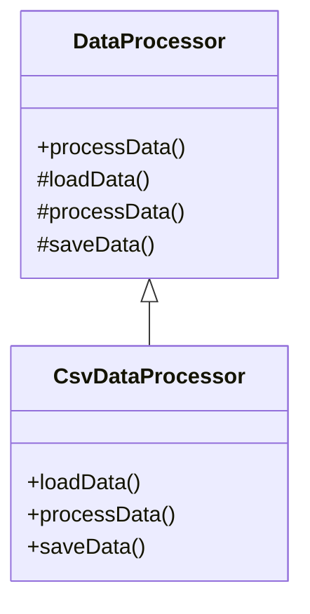

## 6.8 Template Method Pattern

The Template Method Pattern is a behavioral design pattern that defines the skeleton of an algorithm in a base class, allowing subclasses to override specific steps of the algorithm without changing its overall structure. This pattern is particularly useful in scenarios where you want to provide a common algorithmic framework while allowing flexibility for subclasses to implement specific details.

### Purpose

The primary purpose of the Template Method Pattern is to encapsulate the invariant parts of an algorithm in a base class while allowing subclasses to provide specific implementations for certain steps. This promotes code reuse and ensures that the algorithm's structure remains consistent across different implementations.

### Implementing Template Method in D

In the D programming language, the Template Method Pattern can be effectively implemented using abstract classes and hook methods. Let's explore these concepts in detail:

#### Abstract Classes

Abstract classes in D serve as a blueprint for other classes. They can contain both concrete methods with default implementations and abstract methods that subclasses must implement. In the context of the Template Method Pattern, abstract classes define the template method, which outlines the algorithm's structure, and may include default implementations for some steps.

```d
abstract class DataProcessor {
    // Template method defining the skeleton of the algorithm
    final void processData() {
        loadData();
        processData();
        saveData();
    }

    // Abstract method to be implemented by subclasses
    abstract void loadData();

    // Hook method with a default implementation
    void processData() {
        writeln("Processing data...");
    }

    // Abstract method to be implemented by subclasses
    abstract void saveData();
}
```

In this example, `DataProcessor` is an abstract class that defines a template method `processData()`. This method outlines the steps of the algorithm: loading data, processing data, and saving data. The `loadData()` and `saveData()` methods are abstract, meaning subclasses must provide their implementations. The `processData()` method is a hook method with a default implementation, which subclasses can override if needed.

#### Hook Methods

Hook methods are optional methods that subclasses can override to extend or modify the behavior of the algorithm. They provide flexibility in the Template Method Pattern by allowing subclasses to customize specific steps without altering the algorithm's overall structure.

```d
class CsvDataProcessor : DataProcessor {
    override void loadData() {
        writeln("Loading CSV data...");
    }

    override void saveData() {
        writeln("Saving processed CSV data...");
    }

    override void processData() {
        writeln("Custom processing for CSV data...");
    }
}
```

In this example, `CsvDataProcessor` is a subclass of `DataProcessor` that provides specific implementations for the `loadData()` and `saveData()` methods. It also overrides the `processData()` hook method to customize the data processing step for CSV data.

### Use Cases and Examples

The Template Method Pattern is widely used in various scenarios, including algorithm frameworks and batch processing. Let's explore these use cases with examples:

#### Algorithm Frameworks

The Template Method Pattern is ideal for defining invariant parts of algorithms while allowing subclasses to implement specific details. This is particularly useful in algorithm frameworks where the core logic remains consistent, but certain steps may vary.

```d
abstract class SortingAlgorithm {
    final void sort(int[] array) {
        prepare(array);
        doSort(array);
        finish(array);
    }

    abstract void doSort(int[] array);

    void prepare(int[] array) {
        writeln("Preparing array for sorting...");
    }

    void finish(int[] array) {
        writeln("Sorting complete.");
    }
}

class QuickSort : SortingAlgorithm {
    override void doSort(int[] array) {
        writeln("Performing quicksort...");
        // QuickSort logic here
    }
}

class MergeSort : SortingAlgorithm {
    override void doSort(int[] array) {
        writeln("Performing mergesort...");
        // MergeSort logic here
    }
}
```

In this example, `SortingAlgorithm` is an abstract class that defines the template method `sort()`, which outlines the sorting algorithm's structure. Subclasses `QuickSort` and `MergeSort` provide specific implementations for the `doSort()` method, allowing different sorting algorithms to be used while maintaining a consistent framework.

#### Batch Processing

The Template Method Pattern is also useful in batch processing scenarios where you want to customize specific steps in a processing pipeline. By defining the pipeline's structure in a base class, you can ensure consistency while allowing flexibility for subclasses to implement specific processing logic.

```d
abstract class BatchProcessor {
    final void executeBatch() {
        initialize();
        processBatch();
        finalize();
    }

    abstract void processBatch();

    void initialize() {
        writeln("Initializing batch processing...");
    }

    void finalize() {
        writeln("Finalizing batch processing...");
    }
}

class ImageBatchProcessor : BatchProcessor {
    override void processBatch() {
        writeln("Processing image batch...");
        // Image processing logic here
    }
}

class VideoBatchProcessor : BatchProcessor {
    override void processBatch() {
        writeln("Processing video batch...");
        // Video processing logic here
    }
}
```

In this example, `BatchProcessor` is an abstract class that defines the template method `executeBatch()`, which outlines the batch processing pipeline's structure. Subclasses `ImageBatchProcessor` and `VideoBatchProcessor` provide specific implementations for the `processBatch()` method, allowing different types of batch processing to be performed.

### Visualizing the Template Method Pattern

To better understand the Template Method Pattern, let's visualize its structure using a class diagram:



**Diagram Description**: This class diagram illustrates the relationship between the `DataProcessor` abstract class and the `CsvDataProcessor` subclass. The `DataProcessor` class defines the template method `processData()`, which calls the abstract methods `loadData()` and `saveData()`, as well as the hook method `processData()`. The `CsvDataProcessor` subclass provides specific implementations for these methods.

### Key Participants

- **Abstract Class**: Defines the template method and may include default implementations for some steps.
- **Concrete Class**: Subclasses that implement the abstract methods and may override hook methods to customize specific steps of the algorithm.

### Applicability

The Template Method Pattern is applicable in scenarios where:

- You want to define the skeleton of an algorithm in a base class while allowing subclasses to implement specific steps.
- You need to ensure consistency in the algorithm's structure across different implementations.
- You want to promote code reuse by encapsulating invariant parts of an algorithm in a base class.

### Design Considerations

When using the Template Method Pattern in D, consider the following:

- **Abstract Classes**: Use abstract classes to define the template method and abstract methods that subclasses must implement.
- **Hook Methods**: Provide hook methods with default implementations to allow subclasses to customize specific steps.
- **Final Methods**: Mark the template method as `final` to prevent subclasses from altering the algorithm's structure.
- **D Language Features**: Leverage D's powerful features, such as mixins and templates, to enhance the flexibility and reusability of your design.

### Differences and Similarities

The Template Method Pattern is often compared to the Strategy Pattern. While both patterns allow for flexibility in algorithm implementation, they differ in their approach:

- **Template Method Pattern**: Defines the algorithm's structure in a base class and allows subclasses to implement specific steps.
- **Strategy Pattern**: Encapsulates the algorithm in separate strategy classes, allowing the algorithm to be changed at runtime.

### Try It Yourself

To deepen your understanding of the Template Method Pattern, try modifying the code examples provided. For instance, create a new subclass of `DataProcessor` that processes data from a different source, such as a database or an API. Experiment with overriding the hook methods to customize the processing logic.

### Knowledge Check

- What is the primary purpose of the Template Method Pattern?
- How do abstract classes and hook methods contribute to the Template Method Pattern?
- In what scenarios is the Template Method Pattern particularly useful?
- How does the Template Method Pattern differ from the Strategy Pattern?

### Embrace the Journey

Remember, mastering design patterns is a journey. As you explore the Template Method Pattern and other design patterns, you'll gain valuable insights into creating flexible, maintainable, and reusable code. Keep experimenting, stay curious, and enjoy the process of becoming a more proficient software engineer.

## Quiz Time!



### What is the primary purpose of the Template Method Pattern?

- [x] To define the skeleton of an algorithm in a base class while allowing subclasses to implement specific steps.
- [ ] To encapsulate the algorithm in separate strategy classes.
- [ ] To provide a way to change the algorithm at runtime.
- [ ] To allow multiple inheritance in a class hierarchy.

> **Explanation:** The Template Method Pattern defines the skeleton of an algorithm in a base class, allowing subclasses to implement specific steps without altering the algorithm's structure.

### How do abstract classes contribute to the Template Method Pattern?

- [x] By defining the template method and abstract methods that subclasses must implement.
- [ ] By encapsulating the algorithm in separate strategy classes.
- [ ] By allowing the algorithm to be changed at runtime.
- [ ] By providing a way to implement multiple inheritance.

> **Explanation:** Abstract classes define the template method and abstract methods that subclasses must implement, forming the foundation of the Template Method Pattern.

### What role do hook methods play in the Template Method Pattern?

- [x] They allow subclasses to customize specific steps of the algorithm.
- [ ] They encapsulate the algorithm in separate strategy classes.
- [ ] They provide a way to change the algorithm at runtime.
- [ ] They enable multiple inheritance in a class hierarchy.

> **Explanation:** Hook methods allow subclasses to customize specific steps of the algorithm, providing flexibility within the Template Method Pattern.

### In what scenarios is the Template Method Pattern particularly useful?

- [x] When you want to define the skeleton of an algorithm while allowing subclasses to implement specific steps.
- [ ] When you need to encapsulate the algorithm in separate strategy classes.
- [ ] When you want to change the algorithm at runtime.
- [ ] When you need to implement multiple inheritance.

> **Explanation:** The Template Method Pattern is useful when you want to define the skeleton of an algorithm while allowing subclasses to implement specific steps.

### How does the Template Method Pattern differ from the Strategy Pattern?

- [x] The Template Method Pattern defines the algorithm's structure in a base class, while the Strategy Pattern encapsulates the algorithm in separate strategy classes.
- [ ] The Template Method Pattern allows the algorithm to be changed at runtime, while the Strategy Pattern does not.
- [ ] The Template Method Pattern enables multiple inheritance, while the Strategy Pattern does not.
- [ ] The Template Method Pattern is used for encapsulating algorithms, while the Strategy Pattern is not.

> **Explanation:** The Template Method Pattern defines the algorithm's structure in a base class, while the Strategy Pattern encapsulates the algorithm in separate strategy classes.

### What is a key benefit of using the Template Method Pattern?

- [x] It promotes code reuse by encapsulating invariant parts of an algorithm in a base class.
- [ ] It allows the algorithm to be changed at runtime.
- [ ] It enables multiple inheritance in a class hierarchy.
- [ ] It encapsulates the algorithm in separate strategy classes.

> **Explanation:** The Template Method Pattern promotes code reuse by encapsulating invariant parts of an algorithm in a base class.

### Which of the following is a characteristic of the Template Method Pattern?

- [x] It defines the skeleton of an algorithm in a base class.
- [ ] It encapsulates the algorithm in separate strategy classes.
- [ ] It allows the algorithm to be changed at runtime.
- [ ] It enables multiple inheritance in a class hierarchy.

> **Explanation:** The Template Method Pattern defines the skeleton of an algorithm in a base class, allowing subclasses to implement specific steps.

### What is the role of the template method in the Template Method Pattern?

- [x] It outlines the algorithm's structure and calls abstract and hook methods.
- [ ] It encapsulates the algorithm in separate strategy classes.
- [ ] It allows the algorithm to be changed at runtime.
- [ ] It enables multiple inheritance in a class hierarchy.

> **Explanation:** The template method outlines the algorithm's structure and calls abstract and hook methods, forming the core of the Template Method Pattern.

### True or False: The Template Method Pattern allows subclasses to alter the algorithm's structure.

- [ ] True
- [x] False

> **Explanation:** The Template Method Pattern does not allow subclasses to alter the algorithm's structure; it only allows them to implement specific steps.

### Which of the following is an example of a hook method in the Template Method Pattern?

- [x] A method with a default implementation that subclasses can override.
- [ ] A method that encapsulates the algorithm in separate strategy classes.
- [ ] A method that allows the algorithm to be changed at runtime.
- [ ] A method that enables multiple inheritance in a class hierarchy.

> **Explanation:** A hook method is a method with a default implementation that subclasses can override to customize specific steps of the algorithm.


