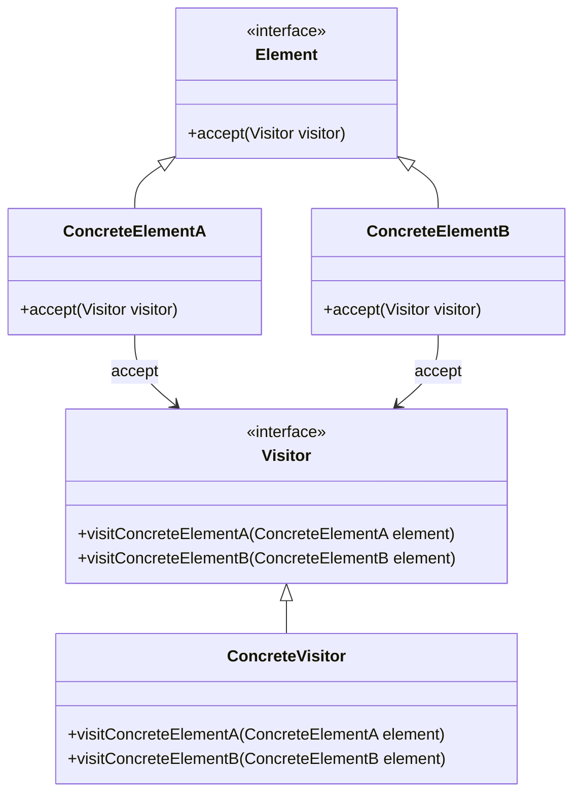

## 6.9 Visitor Pattern

The Visitor Pattern is a powerful behavioral design pattern that allows you to define new operations on an object structure without modifying the classes of the elements on which it operates. This pattern is particularly useful in scenarios where you need to perform various unrelated operations across a set of objects, such as traversing an abstract syntax tree (AST) or adding new functionalities to a class hierarchy.

### Purpose

The primary purpose of the Visitor Pattern is to separate an algorithm from the object structure it operates on. This separation allows you to add new operations without altering the existing object structure, promoting open/closed principle adherence.

### Implementing Visitor in D

In the D programming language, the Visitor Pattern can be implemented effectively using interfaces and polymorphism. Let's break down the implementation into two main components: Visitor Interfaces and Element Interfaces.

#### Visitor Interfaces

Visitor interfaces define a set of operations for different element types. Each operation corresponds to a specific type of element in the object structure.

```d
interface Visitor {
    void visitConcreteElementA(ConcreteElementA element);
    void visitConcreteElementB(ConcreteElementB element);
}
```

In this example, the `Visitor` interface declares methods for visiting different types of elements. Each method takes a specific element type as a parameter, allowing the visitor to perform operations tailored to that element.

#### Element Interfaces

Element interfaces define an `accept` method that takes a visitor as an argument. This method allows the visitor to access the element and perform the appropriate operation.

```d
interface Element {
    void accept(Visitor visitor);
}

class ConcreteElementA : Element {
    void accept(Visitor visitor) {
        visitor.visitConcreteElementA(this);
    }
}

class ConcreteElementB : Element {
    void accept(Visitor visitor) {
        visitor.visitConcreteElementB(this);
    }
}
```

In this implementation, each concrete element class implements the `accept` method, which calls the corresponding visit method on the visitor, passing itself as an argument.

### Use Cases and Examples

The Visitor Pattern is particularly useful in scenarios where you need to perform operations on complex object structures. Let's explore two common use cases: AST Traversal and Object Structure Operations.

#### AST Traversal

Abstract Syntax Trees (ASTs) are commonly used in compilers and interpreters to represent the structure of source code. The Visitor Pattern can be used to traverse an AST and perform operations such as code generation, optimization, or interpretation.

```d
class ASTNode : Element {
    string name;
    this(string name) {
        this.name = name;
    }
    void accept(Visitor visitor) {
        visitor.visitASTNode(this);
    }
}

class PrintVisitor : Visitor {
    void visitASTNode(ASTNode node) {
        writeln("Visiting node: ", node.name);
    }
    void visitConcreteElementA(ConcreteElementA element) {}
    void visitConcreteElementB(ConcreteElementB element) {}
}

void main() {
    ASTNode node = new ASTNode("Root");
    Visitor visitor = new PrintVisitor();
    node.accept(visitor);
}
```

In this example, the `ASTNode` class represents a node in the abstract syntax tree. The `PrintVisitor` class implements the `Visitor` interface and provides a specific operation for visiting `ASTNode` instances. When the `accept` method is called on an `ASTNode`, the `PrintVisitor` prints the node's name.

#### Object Structure Operations

The Visitor Pattern can also be used to add new operations to class hierarchies without modifying the existing classes. This is particularly useful in scenarios where you need to extend the functionality of a library or framework.

```d
class Shape : Element {
    void accept(Visitor visitor) {
        visitor.visitShape(this);
    }
}

class Circle : Shape {}
class Square : Shape {}

class AreaCalculator : Visitor {
    void visitShape(Shape shape) {
        writeln("Calculating area for shape.");
    }
    void visitConcreteElementA(ConcreteElementA element) {}
    void visitConcreteElementB(ConcreteElementB element) {}
}

void main() {
    Shape circle = new Circle();
    Visitor areaCalculator = new AreaCalculator();
    circle.accept(areaCalculator);
}
```

In this example, the `Shape` class hierarchy represents different shapes, such as `Circle` and `Square`. The `AreaCalculator` class implements the `Visitor` interface and provides an operation for calculating the area of a shape. By using the Visitor Pattern, you can add new operations to the `Shape` hierarchy without modifying the existing classes.

### Visualizing the Visitor Pattern

To better understand the Visitor Pattern, let's visualize the interaction between visitors and elements using a class diagram.



**Diagram Description**: This class diagram illustrates the relationship between the `Visitor` interface, `Element` interface, and their concrete implementations. The `ConcreteVisitor` class implements the `Visitor` interface, while `ConcreteElementA` and `ConcreteElementB` implement the `Element` interface.

### Design Considerations

When implementing the Visitor Pattern in D, consider the following design considerations:

- **Double Dispatch**: The Visitor Pattern relies on double dispatch to determine the appropriate operation to perform. Ensure that each element class implements the `accept` method correctly to enable double dispatch.
- **Extensibility**: The Visitor Pattern makes it easy to add new operations to an object structure. However, adding new element types requires modifying the visitor interface and all concrete visitor classes.
- **Performance**: The Visitor Pattern can introduce performance overhead due to the additional method calls required for double dispatch. Consider the performance implications when using this pattern in performance-critical applications.

### Differences and Similarities

The Visitor Pattern is often compared to other behavioral patterns, such as the Strategy Pattern and the Command Pattern. Here are some key differences and similarities:

- **Strategy Pattern**: The Strategy Pattern defines a family of algorithms and makes them interchangeable. In contrast, the Visitor Pattern defines operations on an object structure and allows new operations to be added without modifying the structure.
- **Command Pattern**: The Command Pattern encapsulates a request as an object, allowing you to parameterize clients with different requests. The Visitor Pattern, on the other hand, encapsulates operations on an object structure and allows new operations to be added without modifying the structure.

### Try It Yourself

To deepen your understanding of the Visitor Pattern, try modifying the code examples provided in this section. Here are some suggestions:

- **Add New Element Types**: Extend the `Element` interface with new concrete element classes and update the visitor interface to support these new types.
- **Implement Additional Visitors**: Create additional visitor classes that perform different operations on the object structure, such as serialization or validation.
- **Optimize Performance**: Experiment with optimizing the performance of the Visitor Pattern by reducing the number of method calls or using compile-time optimizations.

### Knowledge Check

To reinforce your understanding of the Visitor Pattern, consider the following questions:

- What is the primary purpose of the Visitor Pattern?
- How does the Visitor Pattern enable the addition of new operations to an object structure?
- What are some common use cases for the Visitor Pattern?
- How does the Visitor Pattern differ from the Strategy Pattern and the Command Pattern?

### Embrace the Journey

Remember, mastering design patterns is a journey. As you continue to explore the Visitor Pattern and other design patterns, you'll gain a deeper understanding of how to build flexible, maintainable, and scalable software systems. Keep experimenting, stay curious, and enjoy the journey!

## Quiz Time!



### What is the primary purpose of the Visitor Pattern?

- [x] To separate an algorithm from the object structure it operates on
- [ ] To encapsulate a request as an object
- [ ] To define a family of algorithms and make them interchangeable
- [ ] To provide a way to access the elements of an aggregate object sequentially

> **Explanation:** The primary purpose of the Visitor Pattern is to separate an algorithm from the object structure it operates on, allowing new operations to be added without modifying the structure.

### How does the Visitor Pattern enable the addition of new operations to an object structure?

- [x] By defining visitor interfaces with operations for different element types
- [ ] By encapsulating requests as objects
- [ ] By making algorithms interchangeable
- [ ] By providing a way to access elements sequentially

> **Explanation:** The Visitor Pattern enables the addition of new operations by defining visitor interfaces with operations for different element types, allowing new operations to be added without modifying the existing object structure.

### What is a common use case for the Visitor Pattern?

- [x] Traversing an abstract syntax tree (AST)
- [ ] Encapsulating a request as an object
- [ ] Making algorithms interchangeable
- [ ] Providing a way to access elements sequentially

> **Explanation:** A common use case for the Visitor Pattern is traversing an abstract syntax tree (AST) to perform operations such as code generation or optimization.

### How does the Visitor Pattern differ from the Strategy Pattern?

- [x] The Visitor Pattern defines operations on an object structure, while the Strategy Pattern defines a family of algorithms
- [ ] The Visitor Pattern encapsulates requests as objects, while the Strategy Pattern makes algorithms interchangeable
- [ ] The Visitor Pattern provides a way to access elements sequentially, while the Strategy Pattern defines a family of algorithms
- [ ] The Visitor Pattern makes algorithms interchangeable, while the Strategy Pattern encapsulates requests as objects

> **Explanation:** The Visitor Pattern defines operations on an object structure and allows new operations to be added without modifying the structure, while the Strategy Pattern defines a family of algorithms and makes them interchangeable.

### How does the Visitor Pattern differ from the Command Pattern?

- [x] The Visitor Pattern encapsulates operations on an object structure, while the Command Pattern encapsulates requests as objects
- [ ] The Visitor Pattern defines a family of algorithms, while the Command Pattern makes algorithms interchangeable
- [ ] The Visitor Pattern provides a way to access elements sequentially, while the Command Pattern encapsulates requests as objects
- [ ] The Visitor Pattern makes algorithms interchangeable, while the Command Pattern defines a family of algorithms

> **Explanation:** The Visitor Pattern encapsulates operations on an object structure and allows new operations to be added without modifying the structure, while the Command Pattern encapsulates a request as an object.

### What is double dispatch in the context of the Visitor Pattern?

- [x] A technique that allows the visitor to determine the appropriate operation to perform based on both the visitor and element types
- [ ] A technique that encapsulates requests as objects
- [ ] A technique that makes algorithms interchangeable
- [ ] A technique that provides a way to access elements sequentially

> **Explanation:** Double dispatch is a technique used in the Visitor Pattern that allows the visitor to determine the appropriate operation to perform based on both the visitor and element types.

### What is a potential performance consideration when using the Visitor Pattern?

- [x] The additional method calls required for double dispatch can introduce performance overhead
- [ ] The encapsulation of requests as objects can introduce performance overhead
- [ ] The interchangeability of algorithms can introduce performance overhead
- [ ] The sequential access of elements can introduce performance overhead

> **Explanation:** The Visitor Pattern can introduce performance overhead due to the additional method calls required for double dispatch.

### What is a benefit of using the Visitor Pattern?

- [x] It allows new operations to be added to an object structure without modifying the existing classes
- [ ] It encapsulates requests as objects
- [ ] It makes algorithms interchangeable
- [ ] It provides a way to access elements sequentially

> **Explanation:** A benefit of using the Visitor Pattern is that it allows new operations to be added to an object structure without modifying the existing classes, promoting adherence to the open/closed principle.

### What is a drawback of using the Visitor Pattern?

- [x] Adding new element types requires modifying the visitor interface and all concrete visitor classes
- [ ] Encapsulating requests as objects can lead to complexity
- [ ] Making algorithms interchangeable can lead to complexity
- [ ] Providing a way to access elements sequentially can lead to complexity

> **Explanation:** A drawback of using the Visitor Pattern is that adding new element types requires modifying the visitor interface and all concrete visitor classes, which can be cumbersome.

### True or False: The Visitor Pattern is only useful for traversing abstract syntax trees.

- [ ] True
- [x] False

> **Explanation:** False. While the Visitor Pattern is commonly used for traversing abstract syntax trees, it is also useful for adding new operations to class hierarchies and other object structures without modifying the existing classes.


