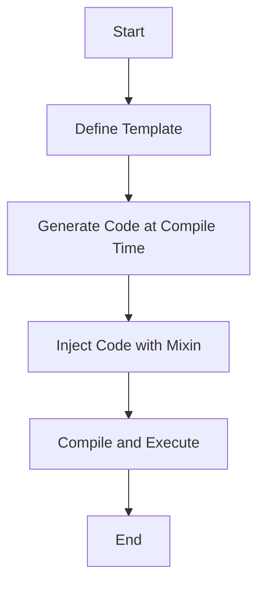

## 7.1 Metaprogramming with Templates and Mixins

Metaprogramming is a powerful paradigm that allows developers to write code that generates other code. In the D programming language, metaprogramming is facilitated through the use of templates and mixins, which provide a robust mechanism for code generation and optimization. This section will delve into the intricacies of using templates and mixins in D, exploring their capabilities, use cases, and best practices.

### Understanding Templates in D

Templates in D are a cornerstone of its metaprogramming capabilities. They allow you to write generic and reusable code that can operate on different data types without sacrificing type safety or performance.

#### Advanced Templates: Utilizing D's Powerful Template System

Templates in D are not just about generic programming; they enable compile-time computation and code generation, which can significantly enhance the efficiency and flexibility of your codebase.

**Key Features of D Templates:**

- **Type Safety**: Templates in D maintain type safety, ensuring that errors are caught at compile time rather than runtime.
- **Compile-Time Execution**: D's templates can execute code at compile time, allowing for optimizations that reduce runtime overhead.
- **Flexibility**: Templates can be used to create highly flexible and reusable code components.

#### Code Generation with Templates

One of the most powerful aspects of templates in D is their ability to generate code at compile time. This can be particularly useful for creating complex data structures or algorithms that need to be optimized for performance.

**Compile-Time Loops: Generating Code Structures**

Compile-time loops are a technique used to generate repetitive code structures without manual duplication. This is achieved by leveraging D's `static if` and `static foreach` constructs.

```d
template GenerateStructs(int count) {
    static if (count > 0) {
        struct Struct~count {
            int value;
        }
        mixin GenerateStructs!(count - 1);
    }
}

mixin GenerateStructs!(3);

// This will generate:
// struct Struct1 { int value; }
// struct Struct2 { int value; }
// struct Struct3 { int value; }
```

In this example, we use a recursive template to generate a series of structs with incrementing names. The `mixin` keyword is used to include the generated code into the current scope.

### Use Cases and Examples

Templates and mixins can be applied in various scenarios to enhance code efficiency and flexibility.

#### Generic Programming: Writing Code That Works with Any Type

Generic programming is a paradigm that allows you to write code that can operate on different data types without modification. In D, templates are the primary tool for achieving this.

```d
template Add(T) {
    T add(T a, T b) {
        return a + b;
    }
}

void main() {
    writeln(Add!int.add(3, 4)); // Outputs: 7
    writeln(Add!double.add(3.5, 4.5)); // Outputs: 8.0
}
```

In this example, the `Add` template defines a generic `add` function that can operate on any type `T` that supports the `+` operator.

#### Optimized Code: Reducing Runtime Overhead

By leveraging compile-time computation, templates can help reduce runtime overhead, leading to more efficient code execution.

```d
template Factorial(int n) {
    enum Factorial = n * Factorial!(n - 1);
}

template Factorial(0) {
    enum Factorial = 1;
}

void main() {
    writeln(Factorial!(5)); // Outputs: 120
}
```

Here, the `Factorial` template computes the factorial of a number at compile time, eliminating the need for runtime computation.

### Mixins in D

Mixins in D provide a mechanism for injecting code into a program at compile time. They are particularly useful for code generation and can be combined with templates to create powerful metaprogramming constructs.

#### Using Mixins for Code Injection

Mixins allow you to inject code into a program dynamically, based on compile-time conditions or computations.

```d
string generateFunction(string name) {
    return q{
        void ~name~() {
            writeln("Function ~name~ called");
        }
    }.replace("~name~", name);
}

mixin(generateFunction("foo"));

void main() {
    foo(); // Outputs: Function foo called
}
```

In this example, the `generateFunction` function returns a string of D code, which is then injected into the program using the `mixin` keyword.

### Combining Templates and Mixins

The true power of D's metaprogramming capabilities is realized when templates and mixins are used together. This combination allows for highly dynamic and flexible code generation.

#### Example: Dynamic Struct Generation

```d
template GenerateFields(string[] names) {
    string code;
    foreach (name; names) {
        code ~= "int " ~ name ~ ";\n";
    }
    mixin(code);
}

struct DynamicStruct {
    mixin GenerateFields!(["field1", "field2", "field3"]);
}

void main() {
    DynamicStruct ds;
    ds.field1 = 10;
    ds.field2 = 20;
    ds.field3 = 30;
    writeln(ds.field1, ds.field2, ds.field3); // Outputs: 102030
}
```

In this example, we use a template to generate fields for a struct dynamically. The `GenerateFields` template constructs a string of code, which is then injected into the `DynamicStruct` using a mixin.

### Visualizing Metaprogramming in D

To better understand the flow of metaprogramming with templates and mixins, let's visualize the process using a Mermaid.js flowchart.



**Diagram Description:** This flowchart illustrates the process of metaprogramming in D, starting with defining a template, generating code at compile time, injecting the code with a mixin, and finally compiling and executing the program.

### Best Practices for Metaprogramming in D

- **Keep It Simple**: Avoid overcomplicating your code with excessive metaprogramming. Use templates and mixins judiciously to maintain readability.
- **Test Thoroughly**: Ensure that your metaprogrammed code is thoroughly tested, as compile-time errors can be difficult to diagnose.
- **Document Your Code**: Provide clear documentation for your templates and mixins to help other developers understand their purpose and usage.
- **Leverage Compile-Time Features**: Take advantage of D's compile-time features to optimize your code and reduce runtime overhead.

### Try It Yourself

Experiment with the code examples provided in this section. Try modifying the templates and mixins to generate different code structures or to operate on different data types. This hands-on approach will deepen your understanding of metaprogramming in D.

### Knowledge Check

- **What are the key features of templates in D?**
- **How can mixins be used for code injection?**
- **What are the benefits of combining templates and mixins?**

### Embrace the Journey

Metaprogramming with templates and mixins in D opens up a world of possibilities for creating efficient, flexible, and reusable code. As you continue to explore these concepts, remember to experiment, stay curious, and enjoy the journey of mastering D's powerful metaprogramming capabilities.

## Quiz Time!



### What is a primary benefit of using templates in D?

- [x] Compile-time type safety
- [ ] Runtime type checking
- [ ] Dynamic memory allocation
- [ ] Simplified syntax

> **Explanation:** Templates in D provide compile-time type safety, ensuring that errors are caught early in the development process.

### How do mixins enhance code flexibility in D?

- [x] By injecting code at compile time
- [ ] By allowing runtime code modification
- [ ] By simplifying syntax
- [ ] By enforcing strict type checks

> **Explanation:** Mixins in D allow for code injection at compile time, enabling dynamic and flexible code generation.

### What is a compile-time loop in D used for?

- [x] Generating repetitive code structures
- [ ] Iterating over arrays at runtime
- [ ] Simplifying syntax
- [ ] Enhancing runtime performance

> **Explanation:** Compile-time loops are used to generate repetitive code structures without manual duplication, optimizing code generation.

### Which keyword is used to include generated code in D?

- [x] mixin
- [ ] template
- [ ] static
- [ ] import

> **Explanation:** The `mixin` keyword is used to include generated code into the current scope in D.

### What is the purpose of the `static if` construct in D?

- [x] To conditionally compile code
- [ ] To execute code at runtime
- [ ] To simplify syntax
- [ ] To enforce type safety

> **Explanation:** The `static if` construct is used to conditionally compile code based on compile-time conditions.

### How can templates reduce runtime overhead?

- [x] By performing computations at compile time
- [ ] By simplifying syntax
- [ ] By enforcing strict type checks
- [ ] By allowing dynamic memory allocation

> **Explanation:** Templates can perform computations at compile time, reducing the need for runtime processing and thus lowering overhead.

### What is a key advantage of using generic programming with templates?

- [x] Code reusability across different data types
- [ ] Simplified syntax
- [ ] Enhanced runtime performance
- [ ] Dynamic memory allocation

> **Explanation:** Generic programming with templates allows for code reusability across different data types, making code more flexible and maintainable.

### What is the role of the `enum` keyword in compile-time computations?

- [x] To define compile-time constants
- [ ] To declare variables
- [ ] To simplify syntax
- [ ] To enforce type safety

> **Explanation:** The `enum` keyword is used to define compile-time constants, which can be used in compile-time computations.

### How do templates and mixins work together in D?

- [x] Templates generate code, and mixins inject it
- [ ] Mixins generate code, and templates inject it
- [ ] Both generate and inject code
- [ ] Neither generate nor inject code

> **Explanation:** In D, templates generate code at compile time, and mixins inject this generated code into the program.

### True or False: Mixins can be used to modify code at runtime.

- [ ] True
- [x] False

> **Explanation:** Mixins in D are used for compile-time code injection, not runtime modification.


