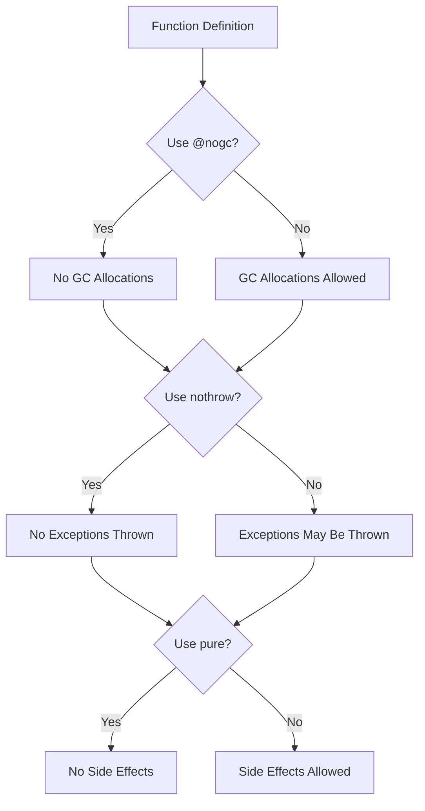

## 7.10 Attribute Usage: `@nogc`, `nothrow`, and `pure`

In the realm of systems programming, where performance and reliability are paramount, the D programming language offers several attributes that allow developers to fine-tune the behavior of their functions. Among these, `@nogc`, `nothrow`, and `pure` stand out as powerful tools for controlling function behavior, optimizing performance, and ensuring code reliability. In this section, we will delve into each of these attributes, exploring their purposes, benefits, and practical applications.

### Controlling Function Behavior

#### `@nogc`: Preventing Garbage Collector Usage

The `@nogc` attribute is a directive that informs the D compiler that a function will not trigger the garbage collector (GC). This is crucial in scenarios where predictable performance is required, such as in real-time systems or high-performance computing applications.

**Key Benefits of `@nogc`:**

- **Predictable Performance**: By avoiding GC pauses, `@nogc` ensures that your application runs smoothly without unexpected delays.
- **Reduced Latency**: Critical in systems where low latency is essential, such as gaming or financial applications.
- **Memory Efficiency**: Encourages developers to use manual memory management techniques, which can lead to more efficient memory usage.

**Example of `@nogc` Usage:**

```d
@nogc
void processData(int[] data) {
    // Perform operations without allocating memory on the heap
    foreach (i; 0 .. data.length) {
        data[i] *= 2; // Simple in-place operation
    }
}
```

In this example, the `processData` function is marked with `@nogc`, indicating that it will not perform any heap allocations that could trigger the garbage collector.

#### `nothrow`: Ensuring Functions Don't Throw Exceptions

The `nothrow` attribute guarantees that a function will not throw any exceptions. This is particularly useful in environments where exception handling overhead is undesirable or where exceptions could lead to system instability.

**Key Benefits of `nothrow`:**

- **Reliability**: Ensures that functions behave predictably without the risk of unexpected exceptions.
- **Performance**: Reduces the overhead associated with exception handling, leading to faster execution.
- **Simplified Error Handling**: Encourages the use of alternative error handling mechanisms, such as error codes or result types.

**Example of `nothrow` Usage:**

```d
nothrow int safeDivide(int numerator, int denominator) {
    if (denominator == 0) {
        return int.min; // Return a sentinel value for error
    }
    return numerator / denominator;
}
```

Here, the `safeDivide` function is marked as `nothrow`, ensuring that it will not throw exceptions even in the case of a division by zero.

#### `pure`: Ensuring Function Purity

The `pure` attribute indicates that a function has no side effects and its return value depends only on its input parameters. Pure functions are a cornerstone of functional programming and offer several advantages in terms of optimization and reasoning about code.

**Key Benefits of `pure`:**

- **Optimizations**: Pure functions can be optimized more aggressively by the compiler, such as through memoization or common subexpression elimination.
- **Testability**: Pure functions are easier to test since they do not rely on or alter external state.
- **Concurrency**: Pure functions are inherently thread-safe, making them ideal for concurrent programming.

**Example of `pure` Usage:**

```d
pure int add(int a, int b) {
    return a + b;
}
```

The `add` function is marked as `pure`, indicating that it has no side effects and its output is solely determined by its inputs.

### Benefits of Using Attributes

#### Performance Gains: Reducing Runtime Overhead

By leveraging `@nogc`, `nothrow`, and `pure`, developers can significantly reduce the runtime overhead of their applications. These attributes enable more efficient use of resources, leading to faster and more responsive software.

- **`@nogc`**: Eliminates the unpredictability of garbage collection pauses, which can be a major source of latency in high-performance applications.
- **`nothrow`**: Removes the overhead of exception handling, allowing for more streamlined and efficient code execution.
- **`pure`**: Facilitates compiler optimizations that can lead to faster code execution and reduced memory usage.

### Use Cases and Examples

#### Real-Time Systems: Avoiding Unpredictable Delays

In real-time systems, where timing is critical, the use of `@nogc` and `nothrow` can help ensure that functions execute within predictable time frames. This is essential for applications such as embedded systems, robotics, and real-time data processing.

**Example:**

```d
@nogc nothrow void controlLoop() {
    // Perform time-sensitive operations without GC or exceptions
    // ...
}
```

#### High-Performance Computing: Maximizing Efficiency

High-performance computing applications, such as scientific simulations or financial modeling, benefit from the efficiency and predictability provided by these attributes. By minimizing overhead, developers can maximize the computational resources available to their applications.

**Example:**

```d
pure @nogc nothrow double compute(double[] values) {
    double result = 0.0;
    foreach (value; values) {
        result += value * value;
    }
    return result;
}
```

In this example, the `compute` function is both pure and `@nogc`, ensuring that it executes efficiently without side effects or garbage collection.

### Visualizing Attribute Usage

To better understand how these attributes interact and their impact on function behavior, let's visualize the process using a flowchart.



**Diagram Description:** This flowchart illustrates the decision-making process when applying `@nogc`, `nothrow`, and `pure` attributes to a function. Each decision point affects the function's behavior and constraints.

### Try It Yourself

To deepen your understanding of these attributes, try modifying the following code examples:

1. **Experiment with `@nogc`:** Attempt to add a heap allocation within a `@nogc` function and observe the compiler's response.
2. **Test `nothrow`:** Introduce an exception within a `nothrow` function and see how the compiler handles it.
3. **Explore `pure`:** Modify a `pure` function to include a side effect and note the compiler's reaction.

### References and Links

- [D Language Specification: Attributes](https://dlang.org/spec/attribute.html)
- [Real-Time Systems and D Programming](https://wiki.dlang.org/Real-time_systems)
- [Functional Programming in D](https://wiki.dlang.org/Functional_Programming)

### Knowledge Check

To reinforce your understanding of `@nogc`, `nothrow`, and `pure`, consider the following questions:

- How does `@nogc` affect garbage collection in D?
- What are the benefits of using `nothrow` in performance-critical applications?
- Why are pure functions advantageous in concurrent programming?

### Embrace the Journey

Remember, mastering these attributes is just one step in your journey to becoming a proficient D programmer. As you continue to explore the language, you'll discover even more ways to optimize and enhance your code. Keep experimenting, stay curious, and enjoy the process!

## Quiz Time!



### What does the `@nogc` attribute do in D?

- [x] Prevents garbage collector usage
- [ ] Ensures functions don't throw exceptions
- [ ] Guarantees function purity
- [ ] Allows heap allocations

> **Explanation:** The `@nogc` attribute prevents functions from triggering the garbage collector, ensuring predictable performance.

### Which attribute ensures that a function does not throw exceptions?

- [ ] `@nogc`
- [x] `nothrow`
- [ ] `pure`
- [ ] `@safe`

> **Explanation:** The `nothrow` attribute guarantees that a function will not throw exceptions, reducing exception handling overhead.

### What is a key benefit of using `pure` functions?

- [x] They have no side effects
- [ ] They allow garbage collection
- [ ] They can throw exceptions
- [ ] They are slower to execute

> **Explanation:** Pure functions have no side effects and their output depends only on their input parameters, making them easier to test and optimize.

### How does `nothrow` contribute to performance optimization?

- [x] By reducing exception handling overhead
- [ ] By preventing garbage collection
- [ ] By allowing side effects
- [ ] By increasing memory usage

> **Explanation:** `nothrow` reduces the overhead associated with exception handling, leading to faster execution.

### In which scenarios is `@nogc` particularly useful?

- [x] Real-time systems
- [x] High-performance computing
- [ ] GUI applications
- [ ] Simple scripting tasks

> **Explanation:** `@nogc` is useful in real-time systems and high-performance computing where predictable performance is crucial.

### What happens if you try to allocate memory in a `@nogc` function?

- [ ] The function will execute normally
- [x] The compiler will produce an error
- [ ] The garbage collector will be triggered
- [ ] The function will throw an exception

> **Explanation:** Attempting to allocate memory in a `@nogc` function will result in a compiler error, as it violates the attribute's constraints.

### Why are pure functions inherently thread-safe?

- [x] They have no side effects
- [ ] They use garbage collection
- [ ] They throw exceptions
- [ ] They modify global state

> **Explanation:** Pure functions are thread-safe because they have no side effects and do not modify shared state.

### Which attribute combination is ideal for a function in a real-time system?

- [x] `@nogc` and `nothrow`
- [ ] `pure` and `@nogc`
- [ ] `nothrow` and `pure`
- [ ] `@safe` and `pure`

> **Explanation:** `@nogc` and `nothrow` are ideal for real-time systems to ensure predictable performance and reliability.

### What is a potential downside of using `pure` functions?

- [ ] They are difficult to test
- [ ] They have side effects
- [x] They cannot modify external state
- [ ] They increase memory usage

> **Explanation:** A potential downside of pure functions is that they cannot modify external state, which may limit their applicability in certain scenarios.

### True or False: `nothrow` functions can still throw exceptions if they are caught within the function.

- [ ] True
- [x] False

> **Explanation:** `nothrow` functions cannot throw exceptions at all, even if they are caught within the function. The attribute enforces this constraint.


