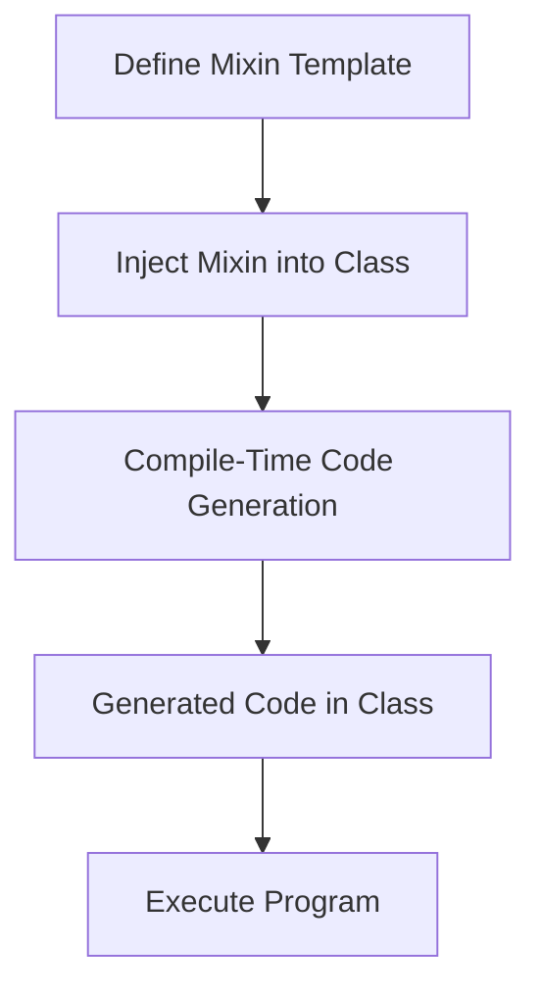

## 7.11 Mixins for Code Generation and Reuse

In the realm of advanced systems programming, the D language offers powerful features for code generation and reuse through mixins. Mixins in D can be broadly categorized into two types: **string mixins** and **template mixins**. Each serves a unique purpose and provides distinct advantages in software design and architecture. In this section, we will delve into these mixins, exploring their capabilities, use cases, and practical applications.

### String Mixins: Injecting Code via Strings

String mixins in D allow developers to inject code dynamically at compile time using strings. This feature is particularly useful for generating repetitive code patterns or embedding domain-specific languages (DSLs) within your application.

#### How String Mixins Work

String mixins work by evaluating a string as D code at compile time. This allows for the dynamic generation of code based on compile-time conditions or configurations. Here's a basic example to illustrate the concept:

```d
import std.stdio;

void main() {
    string code = q{
        writeln("Hello, World from a string mixin!");
    };
    mixin(code);
}
```

In this example, the `mixin` keyword is used to inject the code contained in the `code` string into the program. The `q{}` syntax is a convenient way to define multi-line strings in D.

#### Use Cases for String Mixins

1. **Aspect-Oriented Programming (AOP)**: String mixins can be used to inject cross-cutting concerns, such as logging or security checks, into multiple parts of your codebase without modifying the core logic.

2. **Domain-Specific Languages (DSLs)**: By embedding DSLs within your application, you can create specialized syntax for specific tasks, improving readability and maintainability.

3. **Code Generation**: Automate the creation of boilerplate code, such as getters and setters, serialization methods, or interface implementations.

#### Example: Aspect-Oriented Programming with String Mixins

Consider a scenario where you want to add logging to multiple functions without cluttering the core logic. String mixins can help achieve this:

```d
import std.stdio;

void log(string message) {
    writeln("Log: ", message);
}

void main() {
    mixin(generateLogging("function1"));
    function1();

    mixin(generateLogging("function2"));
    function2();
}

string generateLogging(string functionName) {
    return q{
        void ~functionName~() {
            log("Entering " ~ functionName ~ "()");
            // Function logic here
            log("Exiting " ~ functionName ~ "()");
        }
    }.replace("~functionName~", functionName);
}
```

In this example, the `generateLogging` function returns a string that defines a function with logging statements. The `mixin` keyword then injects this code into the program.

### Template Mixins: Code Reuse with Templates

Template mixins in D provide a mechanism for code reuse by allowing you to define reusable code snippets that can be included in multiple places. Unlike string mixins, template mixins are type-safe and integrate seamlessly with D's template system.

#### How Template Mixins Work

Template mixins are defined using the `mixin template` keyword and can include any valid D code. They are instantiated using the `mixin` keyword, similar to string mixins. Here's a basic example:

```d
import std.stdio;

mixin template Logger() {
    void log(string message) {
        writeln("Log: ", message);
    }
}

class MyClass {
    mixin Logger;

    void doSomething() {
        log("Doing something...");
    }
}

void main() {
    auto obj = new MyClass();
    obj.doSomething();
}
```

In this example, the `Logger` mixin template defines a `log` function that can be reused in any class or struct by including the `mixin Logger;` statement.

#### Use Cases for Template Mixins

1. **Code Reuse**: Share common functionality across multiple classes or modules without duplication.

2. **Aspect-Oriented Programming**: Similar to string mixins, template mixins can be used to inject cross-cutting concerns.

3. **DSLs**: Define reusable components of a DSL that can be mixed into different parts of your application.

4. **Generic Programming**: Combine with D's powerful template system to create highly generic and reusable components.

#### Example: Reusable Logging with Template Mixins

Let's revisit the logging example, this time using template mixins:

```d
import std.stdio;

mixin template Logger() {
    void log(string message) {
        writeln("Log: ", message);
    }
}

class Service {
    mixin Logger;

    void start() {
        log("Service started");
    }

    void stop() {
        log("Service stopped");
    }
}

void main() {
    auto service = new Service();
    service.start();
    service.stop();
}
```

Here, the `Logger` mixin template is included in the `Service` class, providing logging functionality without duplicating code.

### Use Cases and Examples

#### Aspect-Oriented Programming: Injecting Cross-Cutting Concerns

Aspect-Oriented Programming (AOP) is a programming paradigm that aims to increase modularity by allowing the separation of cross-cutting concerns. Mixins in D, both string and template, can be used to implement AOP by injecting code into multiple parts of an application.

**Example: Security Checks with Mixins**

```d
import std.stdio;

mixin template SecurityCheck() {
    void checkSecurity() {
        writeln("Security check passed.");
    }
}

class SecureService {
    mixin SecurityCheck;

    void performAction() {
        checkSecurity();
        writeln("Action performed.");
    }
}

void main() {
    auto service = new SecureService();
    service.performAction();
}
```

In this example, the `SecurityCheck` mixin template adds a security check to the `SecureService` class, ensuring that the check is performed before any action.

#### DSLs: Building Domain-Specific Constructs

Domain-Specific Languages (DSLs) are specialized languages tailored to a specific application domain. Mixins can be used to embed DSLs within your application, providing a concise and expressive syntax for domain-specific tasks.

**Example: Simple DSL for Mathematical Expressions**

```d
import std.stdio;

mixin template ExpressionDSL() {
    int add(int a, int b) {
        return a + b;
    }

    int multiply(int a, int b) {
        return a * b;
    }
}

class Calculator {
    mixin ExpressionDSL;

    void calculate() {
        writeln("3 + 4 = ", add(3, 4));
        writeln("3 * 4 = ", multiply(3, 4));
    }
}

void main() {
    auto calc = new Calculator();
    calc.calculate();
}
```

In this example, the `ExpressionDSL` mixin template provides a simple DSL for mathematical expressions, which can be used in the `Calculator` class.

### Design Considerations

When using mixins for code generation and reuse, consider the following:

- **Readability**: While mixins can reduce code duplication, they can also make code harder to read if overused. Ensure that the use of mixins enhances, rather than detracts from, code clarity.

- **Maintainability**: Mixins should be used judiciously to avoid creating tightly coupled code. Keep mixin templates focused and specific to a particular task or concern.

- **Performance**: Mixins are evaluated at compile time, so they do not incur runtime overhead. However, excessive use of string mixins can increase compile times.

- **Debugging**: Debugging code generated by string mixins can be challenging. Use descriptive variable names and comments within mixin-generated code to aid debugging.

### Differences and Similarities

- **String Mixins vs. Template Mixins**: String mixins offer more flexibility as they can generate any code dynamically, but they lack type safety. Template mixins, on the other hand, are type-safe and integrate seamlessly with D's template system, making them more suitable for reusable components.

- **Use Cases**: Both types of mixins can be used for AOP and DSLs, but template mixins are generally preferred for code reuse due to their type safety and integration with D's template system.

### Try It Yourself

To get hands-on experience with mixins, try modifying the examples provided:

- **Experiment with String Mixins**: Create a string mixin that generates a series of functions with different names and parameters.

- **Enhance Template Mixins**: Extend the `Logger` mixin template to include different log levels (e.g., info, warning, error).

- **Build a DSL**: Use mixins to create a simple DSL for a specific domain, such as a configuration language or a query language.

### Visualizing Mixins in D

To better understand how mixins work in D, let's visualize the process of injecting code using mixins:



**Diagram Description**: This flowchart illustrates the process of using mixins in D. First, a mixin template is defined. Then, it is injected into a class at compile time, generating the necessary code. Finally, the program is executed with the generated code.

### References and Links

- [D Programming Language Official Documentation](https://dlang.org/)
- [D Language Mixins](https://dlang.org/spec/template-mixin.html)
- [Aspect-Oriented Programming](https://en.wikipedia.org/wiki/Aspect-oriented_programming)
- [Domain-Specific Language](https://en.wikipedia.org/wiki/Domain-specific_language)

### Knowledge Check

Before moving on, let's reinforce what we've learned:

- **What are the two types of mixins in D?**
- **How do string mixins differ from template mixins?**
- **What are some use cases for mixins in D?**
- **What are the design considerations when using mixins?**

### Embrace the Journey

As we explore the power of mixins in D, remember that this is just the beginning. Mixins offer a flexible and powerful way to generate and reuse code, enabling you to build more maintainable and scalable software systems. Keep experimenting, stay curious, and enjoy the journey!

## Quiz Time!



### What is a primary advantage of using string mixins in D?

- [x] Dynamic code generation at compile time
- [ ] Improved runtime performance
- [ ] Enhanced type safety
- [ ] Simplified debugging

> **Explanation:** String mixins allow for dynamic code generation at compile time, enabling flexible and powerful code injection.

### How do template mixins differ from string mixins?

- [x] Template mixins are type-safe
- [ ] Template mixins are evaluated at runtime
- [ ] String mixins are type-safe
- [ ] String mixins are evaluated at runtime

> **Explanation:** Template mixins are type-safe and integrate with D's template system, while string mixins are not type-safe and are evaluated at compile time.

### Which of the following is a use case for mixins in D?

- [x] Aspect-Oriented Programming
- [ ] Real-time data processing
- [ ] Network communication
- [ ] User interface design

> **Explanation:** Mixins are commonly used for Aspect-Oriented Programming to inject cross-cutting concerns like logging or security checks.

### What is a potential drawback of using string mixins?

- [x] Increased compile times
- [ ] Reduced runtime performance
- [ ] Decreased code readability
- [ ] Limited code reuse

> **Explanation:** Excessive use of string mixins can increase compile times due to the dynamic code generation process.

### Which mixin type is preferred for reusable components?

- [x] Template mixins
- [ ] String mixins
- [ ] Inline mixins
- [ ] Dynamic mixins

> **Explanation:** Template mixins are preferred for reusable components due to their type safety and integration with D's template system.

### What is a key design consideration when using mixins?

- [x] Maintainability
- [ ] Runtime performance
- [ ] User interface design
- [ ] Network latency

> **Explanation:** Maintainability is crucial when using mixins to ensure that the generated code is clear and manageable.

### How can mixins be used in Domain-Specific Languages (DSLs)?

- [x] By embedding DSL constructs within the application
- [ ] By improving network communication
- [ ] By enhancing user interface design
- [ ] By optimizing runtime performance

> **Explanation:** Mixins can be used to embed DSL constructs within an application, providing a concise and expressive syntax for domain-specific tasks.

### What is a common use case for template mixins?

- [x] Code reuse
- [ ] Real-time data processing
- [ ] Network communication
- [ ] User interface design

> **Explanation:** Template mixins are commonly used for code reuse, allowing developers to share common functionality across multiple classes or modules.

### Which of the following is NOT a benefit of using mixins?

- [x] Simplified debugging
- [ ] Code reuse
- [ ] Dynamic code generation
- [ ] Aspect-Oriented Programming

> **Explanation:** While mixins offer many benefits, they can complicate debugging due to the dynamic nature of code generation.

### True or False: Mixins in D incur runtime overhead.

- [ ] True
- [x] False

> **Explanation:** Mixins in D are evaluated at compile time, so they do not incur runtime overhead.


