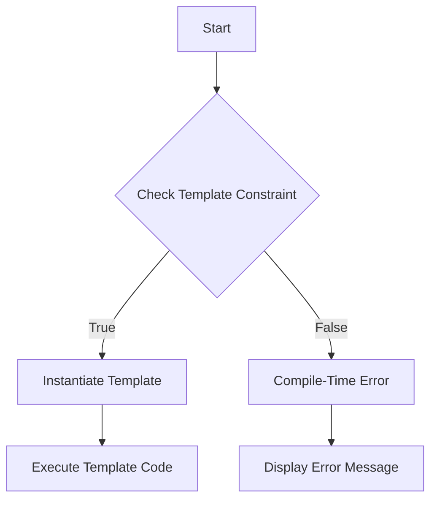

## 7.12 Template Constraints and Concepts

In the realm of D programming, templates serve as a powerful tool for creating generic, reusable code. However, with great power comes the responsibility to ensure that templates are used correctly and effectively. This is where template constraints and concepts come into play. By leveraging these features, we can enforce compile-time checks, provide meaningful error messages, and create robust, user-friendly APIs. In this section, we will delve into the intricacies of template constraints and concepts, exploring their applications in generic programming and library development.

### Understanding Template Constraints

Template constraints in D are a mechanism to control the instantiation of templates based on certain conditions. They allow us to specify requirements that types must meet to be used with a particular template. This ensures that templates are used correctly and helps prevent errors at compile time.

#### Constraining Templates with `if`

The primary way to constrain templates in D is by using the `if` condition. This condition is placed after the template parameter list and before the template body. It acts as a guard, allowing the template to be instantiated only if the condition evaluates to true.

```d
// Example of a constrained template
template isIntegral(T)
{
    enum isIntegral = is(T == int) || is(T == long) || is(T == short);
}

void process(T)(T value) if (isIntegral!T)
{
    // Function body
    writeln("Processing integral type: ", value);
}
```

In this example, the `process` function template is constrained to only accept integral types. The `isIntegral` template checks if the type `T` is one of the integral types (`int`, `long`, or `short`). If the condition is not met, the template cannot be instantiated, preventing incorrect usage.

#### Ensuring Correct Usage

One of the key benefits of using template constraints is the ability to provide meaningful compile-time error messages. This helps developers understand why a particular template instantiation failed and how to fix it.

##### Providing Meaningful Compile-Time Errors

When a template constraint is not satisfied, D's compiler generates an error message. By crafting these messages carefully, we can guide users towards the correct usage of the template.

```d
// Example with a custom error message
template isFloatingPoint(T)
{
    enum isFloatingPoint = is(T == float) || is(T == double);
}

void calculate(T)(T value) if (isFloatingPoint!T)
{
    // Function body
    writeln("Calculating with floating-point type: ", value);
}

void main()
{
    // This will cause a compile-time error with a meaningful message
    // calculate(42); // Error: template instance calculate!(int) does not match template declaration
}
```

In this example, attempting to call `calculate` with an integer will result in a compile-time error. The error message indicates that the template instance does not match the template declaration, helping the developer identify the issue.

### Use Cases and Examples

Template constraints are particularly useful in scenarios where type safety and reusability are paramount. Let's explore some common use cases and examples.

#### Generic Programming

In generic programming, templates are used to write code that works with any data type. By using template constraints, we can ensure that only compatible types are used, enhancing type safety and reducing runtime errors.

```d
// Example of a generic function with constraints
template isNumeric(T)
{
    enum isNumeric = is(T == int) || is(T == float) || is(T == double);
}

T add(T)(T a, T b) if (isNumeric!T)
{
    return a + b;
}

void main()
{
    writeln(add(3, 4));       // Works with integers
    writeln(add(3.5, 4.5));   // Works with floats
    // writeln(add("3", "4")); // Compile-time error
}
```

In this example, the `add` function is constrained to numeric types, ensuring that only integers and floating-point numbers can be added. Attempting to add strings will result in a compile-time error, preventing potential runtime issues.

#### Library Development

When developing libraries, it's crucial to provide a robust and user-friendly API. Template constraints can help achieve this by enforcing correct usage patterns and providing clear error messages.

```d
// Example of a library function with constraints
template isContainer(T)
{
    enum isContainer = is(typeof(T.init.length) == size_t);
}

void printContainer(T)(T container) if (isContainer!T)
{
    foreach (element; container)
    {
        writeln(element);
    }
}

void main()
{
    int[] numbers = [1, 2, 3, 4, 5];
    printContainer(numbers); // Works with arrays

    // string text = "Hello";
    // printContainer(text); // Compile-time error
}
```

In this example, the `printContainer` function is constrained to types that have a `length` property, such as arrays. This ensures that only valid container types can be passed to the function, providing a clear and consistent API.

### Visualizing Template Constraints

To better understand how template constraints work, let's visualize the process using a flowchart. This diagram illustrates the decision-making process when instantiating a template with constraints.



**Figure 1: Template Constraint Flowchart**

This flowchart shows that when a template is instantiated, the constraint is checked. If the constraint is satisfied, the template is instantiated, and the code is executed. If not, a compile-time error is generated, and an error message is displayed.

### Advanced Concepts: Concepts in D

While D does not have a formal concept system like C++, it provides similar functionality through template constraints and traits. Concepts in D can be thought of as a set of requirements that a type must satisfy to be used with a template.

#### Defining Concepts with Traits

D's `std.traits` module provides a variety of traits that can be used to define concepts. These traits allow us to query properties of types and enforce specific requirements.

```d
import std.traits;

// Example of defining a concept with traits
template isIterable(T)
{
    enum isIterable = isInputRange!T;
}

void iterate(T)(T range) if (isIterable!T)
{
    foreach (element; range)
    {
        writeln(element);
    }
}

void main()
{
    int[] numbers = [1, 2, 3, 4, 5];
    iterate(numbers); // Works with arrays

    // int number = 42;
    // iterate(number); // Compile-time error
}
```

In this example, the `isIterable` concept is defined using the `isInputRange` trait from `std.traits`. This ensures that only types that satisfy the input range requirements can be used with the `iterate` function.

### Practical Applications and Best Practices

When using template constraints and concepts in D, it's essential to follow best practices to ensure code quality and maintainability.

#### Best Practices for Template Constraints

1. **Keep Constraints Simple**: Avoid overly complex constraints that are difficult to understand and maintain.
2. **Provide Clear Error Messages**: Use meaningful error messages to guide users towards correct usage.
3. **Use Traits for Common Patterns**: Leverage D's `std.traits` module to define common concepts and constraints.
4. **Test Constraints Thoroughly**: Ensure that constraints are tested with a variety of types to catch potential issues early.

#### Try It Yourself

To solidify your understanding of template constraints and concepts, try modifying the code examples provided. Experiment with different types and constraints to see how they affect template instantiation. Consider creating your own concepts using traits and applying them to generic functions.

### Conclusion

Template constraints and concepts are powerful tools in D programming that enable us to write type-safe, reusable code. By enforcing compile-time checks and providing meaningful error messages, we can create robust and user-friendly APIs. Whether you're working on generic programming or library development, understanding and applying these concepts will enhance your ability to write high-quality D code.

## Quiz Time!



### What is the primary purpose of template constraints in D?

- [x] To control template instantiation based on conditions
- [ ] To optimize runtime performance
- [ ] To simplify code syntax
- [ ] To enhance runtime error handling

> **Explanation:** Template constraints are used to control the instantiation of templates based on specific conditions, ensuring correct usage.

### How are template constraints specified in D?

- [x] Using `if` conditions after the template parameter list
- [ ] Using `switch` statements within the template body
- [ ] Using `for` loops in the template declaration
- [ ] Using `while` loops in the template implementation

> **Explanation:** Template constraints are specified using `if` conditions placed after the template parameter list.

### What is a key benefit of using template constraints?

- [x] Providing meaningful compile-time error messages
- [ ] Reducing the size of the compiled binary
- [ ] Increasing runtime execution speed
- [ ] Simplifying the codebase

> **Explanation:** Template constraints allow for meaningful compile-time error messages, guiding developers towards correct usage.

### Which module in D provides traits for defining concepts?

- [x] `std.traits`
- [ ] `std.algorithm`
- [ ] `std.range`
- [ ] `std.typecons`

> **Explanation:** The `std.traits` module provides various traits that can be used to define concepts in D.

### What is the role of the `isInputRange` trait in D?

- [x] To check if a type satisfies input range requirements
- [ ] To determine if a type is a numeric type
- [ ] To verify if a type is a floating-point type
- [ ] To ensure a type is a container type

> **Explanation:** The `isInputRange` trait checks if a type satisfies the input range requirements, making it iterable.

### What should be avoided when defining template constraints?

- [x] Overly complex constraints
- [ ] Simple constraints
- [ ] Using traits
- [ ] Providing error messages

> **Explanation:** Overly complex constraints should be avoided as they can be difficult to understand and maintain.

### What is a practical application of template constraints?

- [x] Ensuring type safety in generic programming
- [ ] Optimizing memory usage
- [ ] Simplifying user interfaces
- [ ] Enhancing graphical rendering

> **Explanation:** Template constraints ensure type safety in generic programming by enforcing specific type requirements.

### How can meaningful error messages be provided in template constraints?

- [x] By crafting custom error messages in the constraint
- [ ] By using runtime assertions
- [ ] By logging errors to a file
- [ ] By displaying errors in the user interface

> **Explanation:** Custom error messages can be crafted in the constraint to provide meaningful feedback at compile time.

### What is a best practice for using template constraints?

- [x] Testing constraints with a variety of types
- [ ] Avoiding the use of traits
- [ ] Using constraints only in library development
- [ ] Keeping constraints as complex as possible

> **Explanation:** Testing constraints with a variety of types ensures they work correctly and catch potential issues early.

### True or False: D has a formal concept system like C++.

- [ ] True
- [x] False

> **Explanation:** D does not have a formal concept system like C++, but it provides similar functionality through template constraints and traits.



Remember, mastering template constraints and concepts is just one step on your journey to becoming an expert in D programming. Keep experimenting, stay curious, and enjoy the process of learning and growing as a developer!
