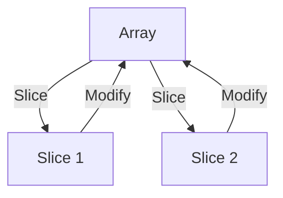

## 7.13 Slices and Memory Management Patterns

In the realm of systems programming, efficient memory management is crucial for building high-performance applications. The D programming language offers powerful features for managing memory, with slices being one of the most versatile tools at your disposal. In this section, we'll delve into the concept of slices, explore common pitfalls such as slice aliasing, and demonstrate how to use slices for efficient data processing and safe interfacing with C.

### Understanding Slices

Slices in D are a powerful abstraction over arrays, allowing you to work with subarrays without copying data. A slice is essentially a view into an array, defined by a pointer to the data and a length. This makes slices both efficient and flexible, as they can be resized and manipulated without reallocating memory.

#### Key Characteristics of Slices

- **Non-owning**: Slices do not own the memory they reference. They are views into existing arrays.
- **Dynamic**: Slices can be resized, but this may involve reallocating the underlying array.
- **Safe**: Slices provide bounds checking, preventing out-of-bounds access.

#### Basic Slice Operations

Let's start with some basic operations you can perform with slices in D.

```d
void main() {
    int[] array = [1, 2, 3, 4, 5];
    int[] slice = array[1..4]; // Slice of elements 2, 3, and 4

    // Modifying the slice affects the original array
    slice[0] = 10;
    assert(array[1] == 10);

    // Resizing a slice
    slice.length = 2; // Now contains elements 10 and 3
}
```

In this example, we create a slice from an array and demonstrate how modifying the slice affects the original array. This highlights the non-owning nature of slices.

### Avoiding Common Pitfalls

While slices are powerful, they come with potential pitfalls. One of the most common issues is slice aliasing, which can lead to unintended data sharing and bugs.

#### Slice Aliasing

Slice aliasing occurs when multiple slices reference overlapping parts of an array. Modifying one slice can inadvertently affect others, leading to unexpected behavior.

```d
void main() {
    int[] array = [1, 2, 3, 4, 5];
    int[] slice1 = array[1..4];
    int[] slice2 = array[2..5];

    slice1[1] = 20; // Affects both slice1 and slice2
    assert(slice2[0] == 20); // True, due to aliasing
}
```

To prevent aliasing issues, be mindful of how slices are created and modified. Consider using the `dup` property to create a copy of a slice when necessary.

```d
void main() {
    int[] array = [1, 2, 3, 4, 5];
    int[] slice1 = array[1..4].dup; // Duplicate slice
    int[] slice2 = array[2..5];

    slice1[1] = 20; // Does not affect slice2
    assert(slice2[0] == 3); // True, no aliasing
}
```

### Use Cases and Examples

Slices are particularly useful in scenarios involving large datasets and interfacing with C code. Let's explore these use cases in detail.

#### Efficient Data Processing

Slices allow you to manipulate large datasets efficiently by avoiding unnecessary data copying. This is particularly beneficial in data processing tasks where performance is critical.

```d
void processLargeDataset(int[] data) {
    // Process data in chunks using slices
    foreach (i; 0 .. data.length / 1000) {
        int[] chunk = data[i * 1000 .. (i + 1) * 1000];
        // Perform operations on the chunk
    }
}

void main() {
    int[] largeData = new int[10000];
    processLargeDataset(largeData);
}
```

In this example, we process a large dataset in chunks using slices, which allows us to work with manageable portions of data without copying the entire array.

#### Interfacing with C

When interfacing with C code, slices provide a safe and efficient way to manage raw memory. D's slices can be used to wrap C arrays, enabling seamless integration between D and C.

```d
extern(C) void cFunction(int* data, size_t length);

void callCFunction(int[] data) {
    cFunction(data.ptr, data.length);
}

void main() {
    int[] array = [1, 2, 3, 4, 5];
    callCFunction(array);
}
```

In this example, we pass a D slice to a C function by using the `ptr` property to obtain a pointer to the data and the `length` property to specify the number of elements.

### Visualizing Slice Operations

To better understand how slices work, let's visualize the relationship between arrays and slices using a diagram.



**Diagram Description**: This diagram illustrates how slices are views into an array. Modifying a slice affects the original array, demonstrating the non-owning nature of slices.

### Design Considerations

When using slices, consider the following design considerations:

- **Performance**: Slices provide efficient access to array data, but resizing a slice may involve reallocating the underlying array.
- **Safety**: Slices offer bounds checking, but be cautious of aliasing issues.
- **Interfacing**: Use slices to safely interface with C code, leveraging D's ability to manage raw memory.

### Differences and Similarities

Slices in D are similar to pointers in C in that they provide direct access to memory. However, slices offer additional safety features such as bounds checking and dynamic resizing, making them a more robust choice for memory management.

### Try It Yourself

Experiment with the code examples provided in this section. Try modifying the slices, resizing them, and interfacing with C functions. Observe how changes to slices affect the original arrays and explore ways to prevent aliasing issues.

### Knowledge Check

- What are the key characteristics of slices in D?
- How can you prevent slice aliasing?
- What are some use cases for slices in data processing?
- How do slices facilitate interfacing with C code?

### Embrace the Journey

Remember, mastering slices and memory management patterns in D is a journey. As you continue to explore these concepts, you'll gain a deeper understanding of how to build efficient and high-performance applications. Keep experimenting, stay curious, and enjoy the process!

## Quiz Time!



### What is a key characteristic of slices in D?

- [x] Slices are non-owning views into arrays.
- [ ] Slices always own the memory they reference.
- [ ] Slices cannot be resized.
- [ ] Slices do not provide bounds checking.

> **Explanation:** Slices in D are non-owning views into arrays, meaning they reference existing memory without owning it. They can be resized, and they provide bounds checking for safety.

### How can you prevent slice aliasing in D?

- [x] Use the `dup` property to create a copy of a slice.
- [ ] Always use pointers instead of slices.
- [ ] Avoid using slices altogether.
- [ ] Use the `ptr` property to prevent aliasing.

> **Explanation:** To prevent slice aliasing, you can use the `dup` property to create a copy of a slice, ensuring that modifications to one slice do not affect others.

### What is a common use case for slices in D?

- [x] Efficient data processing by avoiding unnecessary copying.
- [ ] Replacing pointers in all scenarios.
- [ ] Managing memory without bounds checking.
- [ ] Creating new arrays from scratch.

> **Explanation:** Slices are commonly used for efficient data processing because they allow you to work with subarrays without copying data, reducing memory overhead.

### How do slices facilitate interfacing with C code?

- [x] By providing a pointer to the data and the length of the slice.
- [ ] By automatically converting D arrays to C arrays.
- [ ] By copying the data to a new C array.
- [ ] By using a special C interface library.

> **Explanation:** Slices facilitate interfacing with C code by providing a pointer to the data and the length of the slice, allowing seamless integration with C functions.

### What is the effect of modifying a slice in D?

- [x] It affects the original array the slice references.
- [ ] It creates a new array with the modifications.
- [ ] It has no effect on the original array.
- [ ] It causes a runtime error.

> **Explanation:** Modifying a slice in D affects the original array the slice references, as slices are views into existing arrays.

### What is the purpose of the `dup` property in D?

- [x] To create a copy of a slice.
- [ ] To resize a slice.
- [ ] To convert a slice to a pointer.
- [ ] To delete a slice.

> **Explanation:** The `dup` property in D is used to create a copy of a slice, ensuring that modifications to the copy do not affect the original array.

### What safety feature do slices in D provide?

- [x] Bounds checking to prevent out-of-bounds access.
- [ ] Automatic memory deallocation.
- [ ] Type conversion between arrays and slices.
- [ ] Automatic resizing of arrays.

> **Explanation:** Slices in D provide bounds checking to prevent out-of-bounds access, enhancing safety when working with arrays.

### How can you resize a slice in D?

- [x] By setting the `length` property of the slice.
- [ ] By using the `dup` property.
- [ ] By converting it to a pointer.
- [ ] By creating a new array.

> **Explanation:** You can resize a slice in D by setting the `length` property, which may involve reallocating the underlying array.

### What is a potential pitfall of using slices in D?

- [x] Slice aliasing, leading to unintended data sharing.
- [ ] Automatic memory deallocation.
- [ ] Lack of bounds checking.
- [ ] Inability to interface with C code.

> **Explanation:** A potential pitfall of using slices in D is slice aliasing, where multiple slices reference overlapping parts of an array, leading to unintended data sharing.

### True or False: Slices in D are similar to pointers in C but offer additional safety features.

- [x] True
- [ ] False

> **Explanation:** True. Slices in D are similar to pointers in C in that they provide direct access to memory, but they offer additional safety features such as bounds checking and dynamic resizing.


