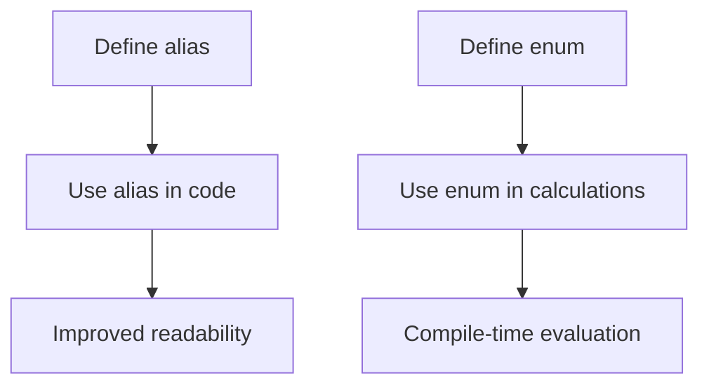

## 7.14 Using `alias` and `enum` for Metaprogramming

In the realm of systems programming, the D language offers powerful tools for metaprogramming, enabling developers to write more expressive, efficient, and maintainable code. Among these tools, `alias` and `enum` play pivotal roles. This section delves into how these constructs can be leveraged for metaprogramming, focusing on creating type aliases, function shortcuts, and compile-time constants. We will explore their use cases, provide practical examples, and discuss how they contribute to code clarity and simplification of complex logic.

### Understanding `alias` Declarations

The `alias` keyword in D is a versatile tool used to create type aliases and function shortcuts. It allows developers to define alternative names for types, functions, or even expressions, enhancing code readability and maintainability.

#### Creating Type Aliases

Type aliases are particularly useful when dealing with complex types or when you want to provide a more meaningful name to a type. This can be especially beneficial in large codebases where consistency and clarity are paramount.

```d
alias StringList = string[];
alias IntFunction = int function(int, int);

void main() {
    StringList names = ["Alice", "Bob", "Charlie"];
    IntFunction add = (a, b) => a + b;

    writeln(names);
    writeln(add(5, 3));
}
```

In this example, `StringList` is an alias for an array of strings, and `IntFunction` is an alias for a function that takes two integers and returns an integer. This abstraction makes the code more readable and easier to understand.

#### Function Shortcuts

Aliases can also be used to create shortcuts for functions, which can be particularly useful when dealing with long or frequently used function names.

```d
import std.stdio;

alias Print = writeln;

void main() {
    Print("Hello, World!");
}
```

Here, `Print` is an alias for the `writeln` function, simplifying the code and making it more concise.

### Compile-Time Constants with `enum`

The `enum` keyword in D is used to define compile-time constants. Unlike runtime variables, these constants are evaluated at compile time, which can lead to performance improvements and safer code.

#### Defining `enum` Variables

Enums in D can be used to define both simple constants and more complex expressions that are evaluated at compile time.

```d
enum PI = 3.14159;
enum CircleArea(double radius) = PI * radius * radius;

void main() {
    double area = CircleArea(5.0);
    writeln("Area of the circle: ", area);
}
```

In this example, `PI` is a simple compile-time constant, while `CircleArea` is a compile-time function that calculates the area of a circle given its radius. This approach ensures that the calculation is done at compile time, reducing runtime overhead.

### Use Cases and Examples

#### Code Clarity

One of the primary benefits of using `alias` and `enum` is the improvement in code clarity. By providing meaningful names and compile-time constants, developers can write code that is easier to read and understand.

```d
alias Kilometers = double;
enum SpeedOfLight = 299792.458; // in kilometers per second

void main() {
    Kilometers distance = 1.0e6;
    auto time = distance / SpeedOfLight;
    writeln("Time to travel ", distance, " km at the speed of light: ", time, " seconds");
}
```

In this example, using `Kilometers` as an alias for `double` and `SpeedOfLight` as a compile-time constant makes the code self-explanatory.

#### Metaprogramming Tricks

Metaprogramming often involves simplifying complex code structures. `alias` and `enum` can be used to achieve this by abstracting repetitive patterns or calculations.

```d
alias Square = (int x) => x * x;
enum Factorial(int n) = n <= 1 ? 1 : n * Factorial!(n - 1);

void main() {
    writeln("Square of 4: ", Square(4));
    writeln("Factorial of 5: ", Factorial!5);
}
```

Here, `Square` is a function alias for squaring a number, and `Factorial` is a recursive compile-time function. These abstractions reduce code complexity and enhance maintainability.

### Visualizing `alias` and `enum` Usage

To better understand the flow and relationships when using `alias` and `enum`, let's visualize their usage in a simple program.



This diagram illustrates how defining aliases and enums leads to improved readability and compile-time evaluation, respectively.

### Try It Yourself

Experiment with the following code snippets to deepen your understanding of `alias` and `enum` in D. Try modifying the examples to see how changes affect the output and behavior.

1. **Modify Type Aliases**: Change the `StringList` alias to a different type and observe how it affects the code.
2. **Create New Function Shortcuts**: Define an alias for a different standard library function and use it in your program.
3. **Experiment with Enums**: Create a new compile-time constant using `enum` and use it in a calculation.

### References and Further Reading

- [D Language Specification: Alias](https://dlang.org/spec/declaration.html#AliasDeclaration)
- [D Language Specification: Enum](https://dlang.org/spec/enum.html)
- [Metaprogramming in D](https://dlang.org/articles/metaprogramming.html)

### Knowledge Check

Before moving on, consider the following questions to test your understanding of `alias` and `enum` in D.

1. What are the benefits of using `alias` for type definitions?
2. How does `enum` improve performance in D programs?
3. Can `alias` be used for expressions, or is it limited to types and functions?
4. What are some common use cases for `enum` in D?

### Embrace the Journey

Remember, mastering `alias` and `enum` is just one step in your journey to becoming an expert in D programming. Keep experimenting, stay curious, and enjoy the process of learning and discovery.

## Quiz Time!



### What is the primary purpose of using `alias` in D?

- [x] To create type aliases and function shortcuts
- [ ] To define runtime variables
- [ ] To perform arithmetic operations
- [ ] To manage memory allocation

> **Explanation:** `alias` is used to create type aliases and function shortcuts, enhancing code readability and maintainability.

### How does `enum` improve performance in D programs?

- [x] By defining compile-time constants
- [ ] By reducing memory usage
- [ ] By optimizing runtime execution
- [ ] By simplifying syntax

> **Explanation:** `enum` defines constants that are evaluated at compile time, reducing runtime overhead and improving performance.

### Can `alias` be used for expressions in D?

- [x] Yes
- [ ] No

> **Explanation:** `alias` can be used for expressions, types, and functions, providing flexibility in code abstraction.

### What is a common use case for `enum` in D?

- [x] Defining compile-time constants
- [ ] Managing runtime state
- [ ] Handling exceptions
- [ ] Allocating memory

> **Explanation:** `enum` is commonly used to define compile-time constants, which are evaluated during compilation.

### Which of the following is a benefit of using `alias`?

- [x] Improved code readability
- [ ] Increased runtime speed
- [ ] Reduced memory usage
- [ ] Simplified error handling

> **Explanation:** `alias` improves code readability by providing meaningful names for types and functions.

### What does the following code do? `alias Print = writeln;`

- [x] Creates a shortcut for the `writeln` function
- [ ] Defines a new function called `Print`
- [ ] Allocates memory for a string
- [ ] Initializes a variable

> **Explanation:** This code creates a shortcut for the `writeln` function, allowing it to be called using `Print`.

### What is the result of using `enum` for a variable?

- [x] The variable is evaluated at compile time
- [ ] The variable is mutable
- [ ] The variable is stored in heap memory
- [ ] The variable is initialized at runtime

> **Explanation:** `enum` variables are evaluated at compile time, making them immutable and efficient.

### How can `alias` contribute to metaprogramming?

- [x] By abstracting complex code patterns
- [ ] By managing memory allocation
- [ ] By handling exceptions
- [ ] By optimizing runtime execution

> **Explanation:** `alias` abstracts complex code patterns, simplifying metaprogramming tasks and enhancing maintainability.

### What is a key advantage of using `enum` over regular variables?

- [x] Compile-time evaluation
- [ ] Increased memory usage
- [ ] Simplified syntax
- [ ] Enhanced error handling

> **Explanation:** `enum` provides compile-time evaluation, reducing runtime overhead and improving performance.

### True or False: `alias` can only be used for types in D.

- [ ] True
- [x] False

> **Explanation:** `alias` can be used for types, functions, and expressions, offering flexibility in code abstraction.



By mastering the use of `alias` and `enum` in D, you can significantly enhance your metaprogramming capabilities, leading to more efficient and maintainable code. Keep exploring these powerful tools and apply them to your projects to unlock their full potential.
