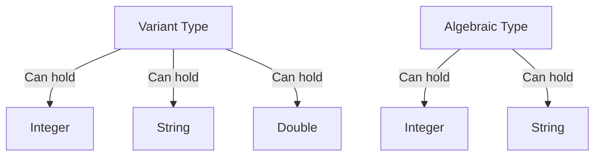

## 7.15 Dealing with Variant Types and Algebraic Data Types

In the realm of advanced systems programming, the ability to handle data that can take on multiple forms is crucial. The D programming language offers powerful tools for this purpose: **Variant** and **Algebraic** data types. These constructs allow developers to create flexible APIs and model complex data structures efficiently. In this section, we will delve into these types, explore pattern matching with the `visit` function, and provide practical use cases and examples.

### Understanding Variant and Algebraic Data Types

#### Variant Type

The `Variant` type in D is a flexible container that can hold any type of value. It is akin to a union in C but with added safety and convenience. `Variant` is part of the `std.variant` module and is designed to store a value of any type, allowing for dynamic type handling.

```d
import std.variant;

void main() {
    Variant v;
    v = 42; // Store an integer
    writeln(v); // Outputs: 42

    v = "Hello, D!"; // Store a string
    writeln(v); // Outputs: Hello, D!
}
```

In this example, the `Variant` type is used to store both an integer and a string. The ability to switch between types dynamically makes `Variant` a powerful tool for handling heterogeneous data.

#### Algebraic Type

The `Algebraic` type is a more type-safe alternative to `Variant`. It is a discriminated union that can hold one of several specified types. This ensures that only the defined types can be stored, providing compile-time type safety.

```d
import std.variant;

void main() {
    alias MyType = Algebraic!(int, string);

    MyType a = 10; // Store an integer
    writeln(a); // Outputs: 10

    a = "D Language"; // Store a string
    writeln(a); // Outputs: D Language
}
```

Here, `MyType` is defined as an `Algebraic` type that can hold either an `int` or a `string`. This restricts the possible types, enhancing safety and predictability.

### Pattern Matching with the `visit` Function

Pattern matching is a technique used to execute code based on the type of data being handled. In D, the `visit` function is used with `Variant` and `Algebraic` types to apply actions depending on the contained type.

#### Using `visit` with Variant

The `visit` function allows you to define handlers for each possible type stored in a `Variant`. This enables you to perform type-specific operations safely.

```d
import std.variant;
import std.stdio;

void main() {
    Variant v = 3.14;

    v.visit!(
        (int i) => writeln("Integer: ", i),
        (double d) => writeln("Double: ", d),
        (string s) => writeln("String: ", s)
    );
}
```

In this example, `visit` is used to handle different types stored in `v`. The function executes the appropriate handler based on the actual type of the value.

#### Using `visit` with Algebraic

Similarly, `visit` can be used with `Algebraic` types to provide type-specific logic.

```d
import std.variant;
import std.stdio;

void main() {
    alias MyType = Algebraic!(int, string);
    MyType a = "Pattern Matching";

    a.visit!(
        (int i) => writeln("Integer: ", i),
        (string s) => writeln("String: ", s)
    );
}
```

Here, `visit` ensures that only the defined types are handled, providing a safe and efficient way to manage different data forms.

### Use Cases and Examples

#### Flexible APIs

One of the primary use cases for `Variant` and `Algebraic` types is in designing flexible APIs that can accept multiple input types. This is particularly useful in libraries and frameworks where functions need to handle various data forms.

```d
import std.variant;
import std.stdio;

void processInput(Variant input) {
    input.visit!(
        (int i) => writeln("Processing integer: ", i),
        (string s) => writeln("Processing string: ", s),
        (double d) => writeln("Processing double: ", d)
    );
}

void main() {
    processInput(42);
    processInput("Hello, API!");
    processInput(3.14);
}
```

In this example, `processInput` can handle integers, strings, and doubles, making it a versatile function for different input types.

#### Data Modeling

`Variant` and `Algebraic` types are also invaluable in data modeling, where complex data structures need to be represented efficiently. They allow for the creation of data models that can adapt to various scenarios without sacrificing type safety.

```d
import std.variant;
import std.stdio;

struct Shape {
    Algebraic!(Circle, Rectangle) shape;

    void describe() {
        shape.visit!(
            (Circle c) => writeln("Circle with radius: ", c.radius),
            (Rectangle r) => writeln("Rectangle with width: ", r.width, " and height: ", r.height)
        );
    }
}

struct Circle {
    double radius;
}

struct Rectangle {
    double width, height;
}

void main() {
    Shape circleShape = Shape(Circle(5.0));
    Shape rectangleShape = Shape(Rectangle(4.0, 6.0));

    circleShape.describe();
    rectangleShape.describe();
}
```

In this example, a `Shape` can be either a `Circle` or a `Rectangle`, and the `describe` method uses `visit` to provide type-specific descriptions.

### Visualizing Variant and Algebraic Data Types

To better understand how `Variant` and `Algebraic` types work, let's visualize their structure and behavior using Mermaid.js diagrams.



**Diagram Description**: This diagram illustrates that a `Variant` type can hold any type of value, while an `Algebraic` type is restricted to specific types, such as `Integer` and `String`.

### Design Considerations

When using `Variant` and `Algebraic` types, consider the following:

- **Type Safety**: `Algebraic` provides compile-time type safety, making it preferable when the possible types are known in advance.
- **Performance**: `Variant` may incur a performance overhead due to its dynamic nature. Use `Algebraic` for better performance when possible.
- **Complexity**: While these types offer flexibility, they can also introduce complexity. Ensure that their use is justified by the problem domain.

### Differences and Similarities

- **Variant vs. Algebraic**: `Variant` is more flexible but less type-safe compared to `Algebraic`. Use `Variant` when the types are not known beforehand, and `Algebraic` when they are.
- **Pattern Matching**: Both types support pattern matching with `visit`, but `Algebraic` ensures that only the specified types are handled.

### Try It Yourself

Experiment with the code examples provided. Try adding new types to the `Algebraic` definition or modifying the `visit` handlers to perform different actions. This hands-on approach will deepen your understanding of these powerful constructs.

### Knowledge Check

- Explain the difference between `Variant` and `Algebraic` types.
- How does the `visit` function enhance type safety?
- What are some practical use cases for `Variant` and `Algebraic` types?

### Embrace the Journey

Remember, mastering `Variant` and `Algebraic` types is just one step in your journey as a D programmer. Keep experimenting, stay curious, and enjoy the process of building robust and flexible software systems.

## Quiz Time!



### What is a Variant type in D?

- [x] A flexible container that can hold any type of value.
- [ ] A type that can only hold integers.
- [ ] A type that can only hold strings.
- [ ] A type that can only hold doubles.

> **Explanation:** The Variant type in D is a flexible container that can hold any type of value, allowing for dynamic type handling.

### What is an Algebraic type in D?

- [x] A discriminated union that can hold one of several specified types.
- [ ] A type that can hold any type of value.
- [ ] A type that can only hold integers.
- [ ] A type that can only hold strings.

> **Explanation:** An Algebraic type is a discriminated union that can hold one of several specified types, providing compile-time type safety.

### How does the visit function work with Variant types?

- [x] It applies actions based on the contained type.
- [ ] It converts the Variant to a string.
- [ ] It deletes the Variant.
- [ ] It duplicates the Variant.

> **Explanation:** The visit function applies actions based on the contained type, allowing for type-specific operations.

### How does the visit function work with Algebraic types?

- [x] It provides type-specific logic for the defined types.
- [ ] It converts the Algebraic to a string.
- [ ] It deletes the Algebraic.
- [ ] It duplicates the Algebraic.

> **Explanation:** The visit function provides type-specific logic for the defined types, ensuring that only the specified types are handled.

### What is a primary use case for Variant types?

- [x] Designing flexible APIs that can accept multiple input types.
- [ ] Storing only integer values.
- [ ] Storing only string values.
- [ ] Storing only double values.

> **Explanation:** A primary use case for Variant types is designing flexible APIs that can accept multiple input types, making them versatile for different data forms.

### What is a primary use case for Algebraic types?

- [x] Data modeling with type safety.
- [ ] Storing only integer values.
- [ ] Storing only string values.
- [ ] Storing only double values.

> **Explanation:** A primary use case for Algebraic types is data modeling with type safety, allowing for the creation of data models that can adapt to various scenarios.

### What is a key difference between Variant and Algebraic types?

- [x] Variant is more flexible but less type-safe compared to Algebraic.
- [ ] Algebraic is more flexible but less type-safe compared to Variant.
- [ ] Both are equally flexible and type-safe.
- [ ] Neither is flexible or type-safe.

> **Explanation:** Variant is more flexible but less type-safe compared to Algebraic, which provides compile-time type safety.

### What is a potential performance consideration when using Variant types?

- [x] Variant may incur a performance overhead due to its dynamic nature.
- [ ] Variant is always faster than Algebraic.
- [ ] Variant is always slower than Algebraic.
- [ ] Variant has no performance considerations.

> **Explanation:** Variant may incur a performance overhead due to its dynamic nature, so it's important to consider this when choosing between Variant and Algebraic.

### Can the visit function be used with both Variant and Algebraic types?

- [x] True
- [ ] False

> **Explanation:** The visit function can be used with both Variant and Algebraic types to apply type-specific logic.

### What should you consider when using Variant and Algebraic types?

- [x] Type safety, performance, and complexity.
- [ ] Only type safety.
- [ ] Only performance.
- [ ] Only complexity.

> **Explanation:** When using Variant and Algebraic types, consider type safety, performance, and complexity to ensure their use is justified by the problem domain.


