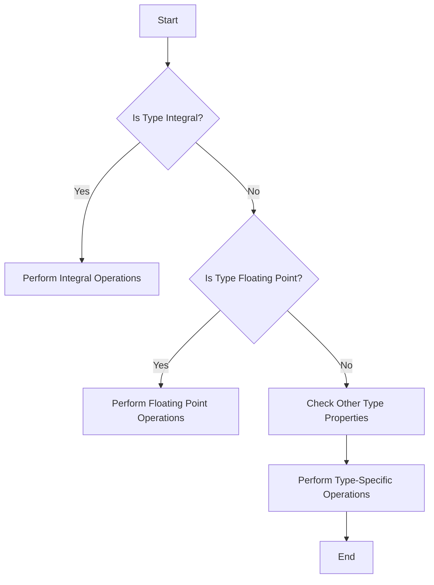

## 7.2 Compile-Time Reflection and Traits

In the realm of advanced systems programming, the ability to introspect and manipulate types at compile time is a powerful tool. The D programming language offers robust support for compile-time reflection and traits, allowing developers to write more flexible, efficient, and type-safe code. In this section, we will delve into the concepts of compile-time reflection and traits, explore the `std.traits` module, and examine practical use cases and examples.

### Understanding Compile-Time Reflection

Compile-time reflection in D allows you to examine and manipulate types and structures during the compilation process. This capability is essential for creating generic and reusable code components, as it enables you to write code that adapts to the types it operates on without sacrificing performance.

#### Key Concepts

- **Introspection**: The process of examining the properties and characteristics of types at compile time.
- **Traits**: Compile-time utilities that provide information about types, such as their properties, methods, and relationships.

### The `std.traits` Module

The `std.traits` module is a cornerstone of D's compile-time reflection capabilities. It provides a rich set of templates and utilities for querying and manipulating type information. Let's explore some of the key features of this module.

#### Type Properties

The `std.traits` module offers a variety of templates to retrieve information about types. Here are some commonly used type properties:

- **`isIntegral`**: Checks if a type is an integral type.
- **`isFloatingPoint`**: Checks if a type is a floating-point type.
- **`isArray`**: Checks if a type is an array.
- **`isAssociativeArray`**: Checks if a type is an associative array.
- **`isPointer`**: Checks if a type is a pointer.
- **`isClass`**: Checks if a type is a class.
- **`isStruct`**: Checks if a type is a struct.

#### Example: Using Type Properties

Let's see how we can use these type properties in a practical example:

```d
import std.stdio;
import std.traits;

void main() {
    static if (isIntegral!int) {
        writeln("int is an integral type.");
    }

    static if (isFloatingPoint!double) {
        writeln("double is a floating-point type.");
    }

    static if (isArray!(int[])) {
        writeln("int[] is an array type.");
    }

    static if (isClass!Object) {
        writeln("Object is a class type.");
    }
}
```

In this example, we use `static if` to conditionally compile code based on the properties of types. This allows us to tailor our code to the specific types we are working with.

### Use Cases and Examples

Compile-time reflection and traits are invaluable tools in various programming scenarios. Let's explore some practical use cases where these features shine.

#### Generic Serialization

Serialization is a common task in software development, where data structures are converted to a format suitable for storage or transmission. With compile-time reflection, we can automatically generate serialization routines for different types.

##### Example: Generic Serialization

```d
import std.stdio;
import std.traits;
import std.conv;

struct Person {
    string name;
    int age;
}

template Serialize(T) {
    string serialize(T obj) {
        string result = "{";
        foreach (member; __traits(allMembers, T)) {
            static if (__traits(compiles, mixin("obj." ~ member))) {
                result ~= member ~ ": " ~ to!string(mixin("obj." ~ member)) ~ ", ";
            }
        }
        return result ~ "}";
    }
}

void main() {
    Person person = Person("Alice", 30);
    writeln(Serialize!Person.serialize(person));
}
```

In this example, we use `__traits(allMembers, T)` to iterate over all members of a struct and generate a JSON-like serialization string. This approach allows us to create serialization routines that adapt to the structure of the types we are working with.

#### Framework Development

Frameworks often need to be flexible and type-aware to accommodate a wide range of use cases. Compile-time reflection and traits enable the creation of frameworks that can adapt to different types and provide powerful abstractions.

##### Example: Type-Aware Framework

```d
import std.stdio;
import std.traits;

template RegisterType(T) {
    void registerType() {
        writeln("Registering type: ", T.stringof);
        static if (isClass!T) {
            writeln(T.stringof, " is a class.");
        } else static if (isStruct!T) {
            writeln(T.stringof, " is a struct.");
        }
    }
}

class MyClass {}
struct MyStruct {}

void main() {
    RegisterType!MyClass.registerType();
    RegisterType!MyStruct.registerType();
}
```

In this example, we define a template `RegisterType` that registers types and provides information about their nature (class or struct). This pattern can be extended to build more complex frameworks that leverage type information.

### Visualizing Compile-Time Reflection

To better understand how compile-time reflection works, let's visualize the process using a flowchart.



**Figure 1: Flowchart of Compile-Time Reflection Process**

This flowchart illustrates the decision-making process involved in compile-time reflection, where type properties are checked, and operations are performed based on the results.

### Try It Yourself

To deepen your understanding of compile-time reflection and traits, try modifying the examples provided:

- **Add More Type Properties**: Extend the examples to check for additional type properties, such as `isPointer` or `isAssociativeArray`.
- **Enhance Serialization**: Modify the serialization example to handle nested structs or arrays.
- **Build a Mini Framework**: Create a simple framework that registers types and performs operations based on their properties.

### References and Further Reading

- [D Programming Language Documentation](https://dlang.org/)
- [std.traits Module Documentation](https://dlang.org/phobos/std_traits.html)
- [Compile-Time Reflection in D](https://wiki.dlang.org/Compile-time_Reflection)

### Knowledge Check

Before we conclude, let's reinforce what we've learned with a few questions:

1. What is compile-time reflection, and why is it useful in D programming?
2. How does the `std.traits` module facilitate compile-time reflection?
3. What are some practical use cases for compile-time reflection and traits?
4. How can you use `__traits(allMembers, T)` to iterate over struct members?
5. What are the benefits of using compile-time reflection in framework development?

### Embrace the Journey

Remember, mastering compile-time reflection and traits is just one step in your journey to becoming an expert D programmer. As you continue to explore and experiment with these powerful features, you'll unlock new possibilities for creating efficient, type-safe, and flexible software systems. Keep experimenting, stay curious, and enjoy the journey!

## Quiz Time!



### What is the primary purpose of compile-time reflection in D?

- [x] To examine and manipulate types during compilation
- [ ] To execute code at runtime
- [ ] To optimize memory usage
- [ ] To handle exceptions

> **Explanation:** Compile-time reflection allows developers to examine and manipulate types during the compilation process, enabling more flexible and efficient code.

### Which module in D provides utilities for compile-time reflection?

- [ ] std.conv
- [ ] std.stdio
- [x] std.traits
- [ ] std.algorithm

> **Explanation:** The `std.traits` module provides a rich set of templates and utilities for compile-time reflection in D.

### How can you check if a type is a class using `std.traits`?

- [ ] isStruct
- [x] isClass
- [ ] isArray
- [ ] isPointer

> **Explanation:** The `isClass` template in `std.traits` checks if a type is a class.

### What is a practical use case for compile-time reflection?

- [ ] Memory management
- [x] Generic serialization
- [ ] Exception handling
- [ ] Network programming

> **Explanation:** Compile-time reflection is useful for tasks like generic serialization, where type information is needed to generate serialization routines.

### What does `__traits(allMembers, T)` do?

- [x] Iterates over all members of a type
- [ ] Checks if a type is an array
- [ ] Converts a type to a string
- [ ] Executes code at runtime

> **Explanation:** `__traits(allMembers, T)` is used to iterate over all members of a type, such as a struct.

### Which of the following is NOT a type property in `std.traits`?

- [ ] isIntegral
- [ ] isFloatingPoint
- [x] isSerializable
- [ ] isArray

> **Explanation:** `isSerializable` is not a type property in `std.traits`. The module provides properties like `isIntegral`, `isFloatingPoint`, and `isArray`.

### What is the benefit of using compile-time reflection in framework development?

- [x] It allows frameworks to adapt to different types
- [ ] It reduces runtime errors
- [ ] It simplifies memory management
- [ ] It enhances network security

> **Explanation:** Compile-time reflection allows frameworks to be flexible and type-aware, adapting to different types and providing powerful abstractions.

### How can you conditionally compile code based on type properties?

- [ ] Using runtime checks
- [x] Using static if
- [ ] Using dynamic casting
- [ ] Using exception handling

> **Explanation:** `static if` allows you to conditionally compile code based on type properties, enabling type-specific operations.

### True or False: Compile-time reflection can be used to optimize memory usage.

- [ ] True
- [x] False

> **Explanation:** Compile-time reflection is primarily used for examining and manipulating types, not for optimizing memory usage.

### What should you do to deepen your understanding of compile-time reflection?

- [x] Experiment with code examples and modify them
- [ ] Focus only on theoretical concepts
- [ ] Avoid using `std.traits`
- [ ] Ignore type properties

> **Explanation:** Experimenting with code examples and modifying them helps deepen your understanding of compile-time reflection and its practical applications.


