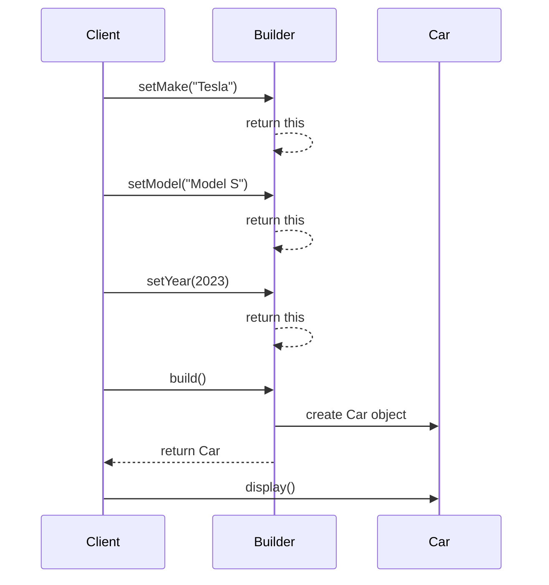

## 7.4 Uniform Function Call Syntax (UFCS) and Method Chaining

Uniform Function Call Syntax (UFCS) is a powerful feature in the D programming language that allows functions to be called as if they were methods of an object. This capability not only enhances code readability but also facilitates the creation of fluent interfaces and method chaining, which are essential for developing expressive and maintainable code. In this section, we will delve into the concepts of UFCS and method chaining, explore their use cases, and provide practical examples to illustrate their application in D programming.

### Understanding Uniform Function Call Syntax (UFCS)

UFCS in D allows you to call a function using the dot notation, even if the function is not a member of the object. This feature provides a uniform way to call functions, whether they are member functions or free functions, and is particularly useful in creating domain-specific languages (DSLs) and builder patterns.

#### Key Concepts of UFCS

- **Function as Method**: UFCS enables you to call a function as if it were a method of an object, enhancing the readability and expressiveness of the code.
- **Chaining Functions**: By using UFCS, you can chain multiple function calls together, creating a fluent interface that is easy to read and understand.
- **Flexibility**: UFCS provides the flexibility to extend existing types with new functionality without modifying their original implementation.

#### Example of UFCS

```d
import std.stdio;

// A simple function that can be called using UFCS
void greet(string name) {
    writeln("Hello, ", name);
}

void main() {
    string name = "D Programmer";
    
    // Using UFCS to call the greet function
    name.greet(); // Outputs: Hello, D Programmer
}
```

In this example, the `greet` function is called using the dot notation, even though it is not a member function of the `string` type. This demonstrates the power and flexibility of UFCS in D.

### Method Chaining and Fluent Interfaces

Method chaining is a technique that allows you to call multiple methods on the same object in a single statement. This is achieved by having each method return the object itself, enabling a sequence of method calls to be chained together. Fluent interfaces leverage method chaining to create expressive and readable code.

#### Benefits of Method Chaining

- **Improved Readability**: Method chaining creates a natural flow in the code, making it easier to read and understand.
- **Conciseness**: By chaining methods, you can reduce the verbosity of the code, making it more concise and elegant.
- **Expressiveness**: Fluent interfaces allow you to express complex operations in a clear and intuitive manner.

#### Example of Method Chaining

```d
import std.stdio;

// A simple class demonstrating method chaining
class Builder {
    private string result;

    this() {
        result = "";
    }

    Builder append(string text) {
        result ~= text;
        return this;
    }

    Builder newline() {
        result ~= "\n";
        return this;
    }

    void print() {
        writeln(result);
    }
}

void main() {
    auto builder = new Builder();

    // Using method chaining to build a string
    builder.append("Hello, ")
           .append("world!")
           .newline()
           .append("Welcome to D programming.")
           .print();
}
```

In this example, the `Builder` class uses method chaining to construct a string. Each method returns the `Builder` object itself, allowing multiple method calls to be chained together.

### Use Cases and Examples

#### Domain-Specific Languages (DSLs)

UFCS and method chaining are particularly useful in creating domain-specific languages (DSLs), which are tailored to a specific problem domain. DSLs provide a high-level abstraction that simplifies complex operations and enhances code readability.

##### Example of a DSL

```d
import std.stdio;

// A simple DSL for building SQL queries
class QueryBuilder {
    private string query;

    this() {
        query = "SELECT ";
    }

    QueryBuilder select(string columns) {
        query ~= columns;
        return this;
    }

    QueryBuilder from(string table) {
        query ~= " FROM " ~ table;
        return this;
    }

    QueryBuilder where(string condition) {
        query ~= " WHERE " ~ condition;
        return this;
    }

    void execute() {
        writeln("Executing query: ", query);
    }
}

void main() {
    auto query = new QueryBuilder();

    // Using the DSL to build and execute a query
    query.select("name, age")
         .from("users")
         .where("age > 18")
         .execute();
}
```

In this example, the `QueryBuilder` class provides a DSL for building SQL queries. The use of method chaining creates a fluent interface that closely resembles the structure of an SQL query, making it easy to read and understand.

#### Builder Patterns

The builder pattern is a creational design pattern that provides a flexible solution for constructing complex objects. UFCS and method chaining can simplify the implementation of builder patterns by creating a fluent interface for configuring and constructing objects.

##### Example of a Builder Pattern

```d
import std.stdio;

// A simple class representing a car
class Car {
    string make;
    string model;
    int year;

    void display() {
        writeln("Car: ", make, " ", model, " (", year, ")");
    }
}

// A builder class for constructing Car objects
class CarBuilder {
    private Car car;

    this() {
        car = new Car();
    }

    CarBuilder setMake(string make) {
        car.make = make;
        return this;
    }

    CarBuilder setModel(string model) {
        car.model = model;
        return this;
    }

    CarBuilder setYear(int year) {
        car.year = year;
        return this;
    }

    Car build() {
        return car;
    }
}

void main() {
    auto carBuilder = new CarBuilder();

    // Using the builder pattern to construct a Car object
    auto car = carBuilder.setMake("Tesla")
                         .setModel("Model S")
                         .setYear(2023)
                         .build();

    car.display(); // Outputs: Car: Tesla Model S (2023)
}
```

In this example, the `CarBuilder` class uses method chaining to configure and construct a `Car` object. Each method returns the `CarBuilder` object itself, allowing the configuration methods to be chained together.

### Visualizing UFCS and Method Chaining

To better understand the flow of UFCS and method chaining, let's visualize the process using a sequence diagram.



**Diagram Description**: This sequence diagram illustrates the flow of method chaining in the `CarBuilder` example. The client calls the `setMake`, `setModel`, and `setYear` methods on the `Builder` object, each returning the `Builder` itself, allowing the calls to be chained. Finally, the `build` method creates and returns the `Car` object.

### Try It Yourself

To deepen your understanding of UFCS and method chaining, try modifying the examples provided:

- **Experiment with UFCS**: Create your own functions and call them using UFCS. Try extending existing types with new functionality.
- **Enhance the DSL**: Add more methods to the `QueryBuilder` class to support additional SQL operations, such as `JOIN` or `ORDER BY`.
- **Customize the Builder Pattern**: Modify the `CarBuilder` class to include additional attributes, such as color or engine type, and update the `Car` class accordingly.

### References and Further Reading

- [D Language Specification - UFCS](https://dlang.org/spec/function.html#pseudo-member)
- [Fluent Interface Pattern](https://martinfowler.com/bliki/FluentInterface.html)
- [Builder Pattern](https://refactoring.guru/design-patterns/builder)

### Knowledge Check

To reinforce your understanding of UFCS and method chaining, consider the following questions:

1. What is the primary benefit of using UFCS in D programming?
2. How does method chaining improve code readability?
3. What is a fluent interface, and how does it relate to method chaining?
4. How can UFCS be used to extend existing types with new functionality?
5. What are some common use cases for method chaining in software design?

### Embrace the Journey

Remember, mastering UFCS and method chaining is just the beginning of your journey in D programming. As you continue to explore these concepts, you'll discover new ways to enhance the expressiveness and readability of your code. Keep experimenting, stay curious, and enjoy the journey!

## Quiz Time!



### What is Uniform Function Call Syntax (UFCS) in D?

- [x] A feature that allows functions to be called as if they were methods of an object.
- [ ] A syntax for defining uniform interfaces.
- [ ] A method for optimizing function calls.
- [ ] A way to enforce type safety in function calls.

> **Explanation:** UFCS allows functions to be called using the dot notation, even if they are not member functions of an object.

### How does method chaining enhance code readability?

- [x] By allowing multiple method calls to be combined into a single statement.
- [ ] By enforcing strict type checks on method calls.
- [ ] By reducing the number of lines of code.
- [ ] By automatically generating documentation for methods.

> **Explanation:** Method chaining allows multiple method calls to be combined into a single statement, creating a natural flow in the code.

### What is a fluent interface?

- [x] An interface that allows method chaining to create expressive and readable code.
- [ ] An interface that enforces strict type safety.
- [ ] An interface that automatically generates documentation.
- [ ] An interface that optimizes function calls.

> **Explanation:** A fluent interface leverages method chaining to create expressive and readable code.

### How can UFCS be used to extend existing types?

- [x] By allowing new functions to be called as if they were methods of the type.
- [ ] By modifying the original implementation of the type.
- [ ] By enforcing strict type safety on the type.
- [ ] By automatically generating documentation for the type.

> **Explanation:** UFCS allows new functions to be called as if they were methods of an existing type, without modifying the original implementation.

### What is a common use case for method chaining?

- [x] Creating domain-specific languages (DSLs).
- [ ] Enforcing strict type safety.
- [ ] Automatically generating documentation.
- [ ] Optimizing function calls.

> **Explanation:** Method chaining is commonly used in creating domain-specific languages (DSLs) to enhance code readability and expressiveness.

### Which of the following is an example of method chaining?

- [x] `object.method1().method2().method3();`
- [ ] `object.method1(); object.method2(); object.method3();`
- [ ] `object.method1(); method2(object); method3(object);`
- [ ] `method1(object); method2(object); method3(object);`

> **Explanation:** Method chaining involves calling multiple methods on the same object in a single statement.

### What is the primary advantage of using UFCS?

- [x] It enhances code readability by allowing functions to be called as methods.
- [ ] It enforces strict type safety in function calls.
- [ ] It automatically generates documentation for functions.
- [ ] It optimizes function calls for performance.

> **Explanation:** UFCS enhances code readability by allowing functions to be called using the dot notation, as if they were methods.

### How does a builder pattern benefit from method chaining?

- [x] It simplifies the construction of complex objects by providing a fluent interface.
- [ ] It enforces strict type safety during object construction.
- [ ] It automatically generates documentation for the constructed objects.
- [ ] It optimizes the performance of object construction.

> **Explanation:** Method chaining simplifies the construction of complex objects by providing a fluent interface, which is a key aspect of the builder pattern.

### What is a DSL in the context of programming?

- [x] A domain-specific language tailored to a specific problem domain.
- [ ] A language that enforces strict type safety.
- [ ] A language that automatically generates documentation.
- [ ] A language that optimizes function calls.

> **Explanation:** A domain-specific language (DSL) is tailored to a specific problem domain and provides a high-level abstraction to simplify complex operations.

### True or False: UFCS can only be used with member functions of a class.

- [ ] True
- [x] False

> **Explanation:** False. UFCS can be used with both member functions and free functions, allowing them to be called as if they were methods of an object.


