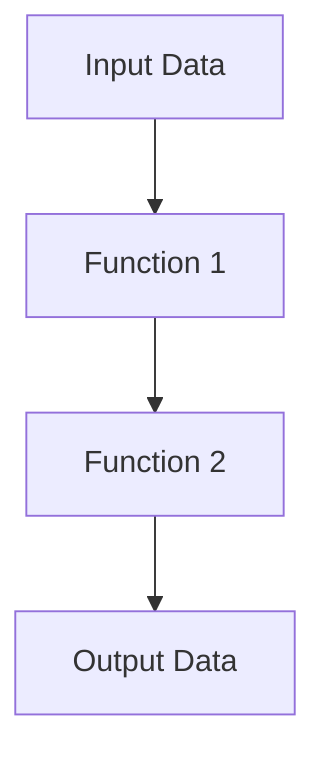

## 7.5 Functional Programming Paradigms in D

Functional programming is a paradigm that treats computation as the evaluation of mathematical functions and avoids changing state or mutable data. In the D programming language, functional programming paradigms can be seamlessly integrated with imperative and object-oriented styles, offering a powerful toolkit for expert developers. Let's delve into the core concepts of functional programming in D, focusing on immutability, pure functions, and the `std.functional` module.

### Immutability and Pure Functions

**Immutability** is a cornerstone of functional programming. It refers to the practice of ensuring that data structures cannot be modified after they are created. This leads to more predictable and bug-free code, as functions that operate on immutable data cannot have side effects that alter the state of the program.

**Pure functions** are functions where the output value is determined only by its input values, without observable side effects. This means that given the same inputs, a pure function will always return the same output, making it easier to reason about and test.

#### Benefits of Immutability and Pure Functions

1. **Predictability**: Code becomes easier to understand and reason about since functions do not depend on external state.
2. **Concurrency**: Immutability makes it easier to write concurrent programs, as there is no need to worry about race conditions or data corruption.
3. **Testability**: Pure functions are inherently easier to test because they do not rely on or modify external state.
4. **Refactoring**: Code can be refactored with confidence, knowing that changes in one part of the program will not affect others.

#### Implementing Immutability in D

In D, immutability can be enforced using the `immutable` keyword. Let's look at an example:

```d
immutable int x = 10;

// Attempting to modify `x` will result in a compile-time error
// x = 20; // Error: cannot modify immutable variable
```

By declaring a variable as `immutable`, we ensure that its value cannot be changed after initialization. This is particularly useful in multi-threaded environments where shared state can lead to complex bugs.

#### Pure Functions in D

A pure function in D can be declared using the `pure` keyword. Here's a simple example:

```d
pure int add(int a, int b) {
    return a + b;
}

void main() {
    int result = add(3, 4); // Always returns 7
}
```

The `add` function is pure because it always returns the same result for the same inputs and does not cause any side effects.

### The `std.functional` Module

The `std.functional` module in D provides a collection of utilities to support functional programming. One of its key features is **function composition**, which allows you to combine simple functions to build more complex ones.

#### Function Composition

Function composition is the process of combining two or more functions to produce a new function. This is a powerful technique in functional programming, enabling the creation of complex operations from simple building blocks.

Here's how you can use function composition in D:

```d
import std.functional : compose;

int square(int x) {
    return x * x;
}

int increment(int x) {
    return x + 1;
}

void main() {
    auto squareThenIncrement = compose!(increment, square);
    int result = squareThenIncrement(3); // (3 * 3) + 1 = 10
    writeln(result);
}
```

In this example, `compose!(increment, square)` creates a new function that first squares a number and then increments it. This demonstrates the power of function composition in building complex logic from simple functions.

### Use Cases and Examples

#### Parallel Computing

Functional programming paradigms, particularly immutability and pure functions, are well-suited for parallel computing. Since pure functions do not have side effects, they can be executed in parallel without the risk of data races or inconsistent state.

Consider the following example of parallel computation using D's `std.parallelism`:

```d
import std.parallelism;
import std.stdio;

pure int compute(int x) {
    return x * x;
}

void main() {
    auto data = [1, 2, 3, 4, 5];
    auto results = taskPool.map!(compute)(data);
    writeln(results); // Output: [1, 4, 9, 16, 25]
}
```

In this example, the `compute` function is pure, allowing us to safely execute it in parallel on a list of numbers. The `taskPool.map` function distributes the computation across multiple threads, improving performance.

#### Predictable Behavior

Functional programming encourages writing code with predictable behavior, making it easier to debug and maintain. By relying on pure functions and immutable data, we can ensure that our code behaves consistently.

Consider a scenario where we need to transform a list of strings to uppercase:

```d
import std.algorithm : map;
import std.array : array;
import std.stdio;

pure string toUpperCase(string s) {
    return s.toUpper();
}

void main() {
    auto words = ["hello", "world"];
    auto uppercasedWords = words.map!(toUpperCase).array;
    writeln(uppercasedWords); // Output: ["HELLO", "WORLD"]
}
```

The `toUpperCase` function is pure, and the use of `map` ensures that each string is transformed independently, leading to predictable and reliable behavior.

### Visualizing Functional Programming in D

To better understand the flow of data in functional programming, let's visualize the process of function composition using a flowchart.



In this diagram, data flows from the input through a series of functions, each transforming the data before passing it to the next. This linear flow is characteristic of functional programming, where each function is a transformation step.

### Try It Yourself

Experiment with the code examples provided by modifying them to suit different scenarios. For instance, try creating a new function that combines multiple operations, or explore parallel computing with different data sets. By actively engaging with the code, you'll deepen your understanding of functional programming in D.

### References and Links

- [D Language Official Documentation](https://dlang.org/)
- [Functional Programming Concepts](https://en.wikipedia.org/wiki/Functional_programming)
- [MDN Web Docs on Functional Programming](https://developer.mozilla.org/en-US/docs/Glossary/Functional_programming)

### Knowledge Check

1. Explain the benefits of using immutability in functional programming.
2. Demonstrate how to declare a pure function in D.
3. Provide an example of function composition using the `std.functional` module.
4. Discuss how functional programming can improve parallel computing.
5. Describe the role of the `immutable` keyword in D.

### Embrace the Journey

Remember, this is just the beginning of your journey into functional programming with D. As you explore these paradigms, you'll discover new ways to write efficient, reliable, and maintainable code. Keep experimenting, stay curious, and enjoy the journey!

## Quiz Time!



### What is a pure function?

- [x] A function that always returns the same result for the same inputs and has no side effects.
- [ ] A function that modifies global variables.
- [ ] A function that can return different results for the same inputs.
- [ ] A function that relies on external state.

> **Explanation:** A pure function always returns the same result for the same inputs and does not cause side effects, making it predictable and easy to test.

### How does immutability benefit concurrent programming?

- [x] It prevents race conditions by ensuring data cannot be modified.
- [ ] It allows data to be modified by multiple threads simultaneously.
- [ ] It increases the complexity of managing shared state.
- [ ] It requires additional synchronization mechanisms.

> **Explanation:** Immutability ensures that data cannot be modified, preventing race conditions and making concurrent programming safer and more straightforward.

### What is the purpose of the `std.functional` module in D?

- [x] To provide utilities for functional programming, such as function composition.
- [ ] To handle file input and output operations.
- [ ] To manage memory allocation and deallocation.
- [ ] To facilitate network communication.

> **Explanation:** The `std.functional` module provides utilities for functional programming, including function composition, enabling developers to build complex functions from simpler ones.

### Which keyword is used to declare immutable variables in D?

- [x] `immutable`
- [ ] `const`
- [ ] `static`
- [ ] `final`

> **Explanation:** The `immutable` keyword in D is used to declare variables that cannot be modified after initialization, ensuring data integrity.

### What is function composition?

- [x] Combining two or more functions to create a new function.
- [ ] Splitting a function into multiple smaller functions.
- [ ] Executing functions in parallel.
- [ ] Modifying a function's behavior at runtime.

> **Explanation:** Function composition involves combining two or more functions to create a new function, allowing complex operations to be built from simple ones.

### How can pure functions improve testability?

- [x] They do not rely on or modify external state, making them predictable.
- [ ] They require complex setup and teardown procedures.
- [ ] They depend on global variables for their behavior.
- [ ] They introduce side effects that affect other tests.

> **Explanation:** Pure functions do not rely on or modify external state, making them predictable and easy to test in isolation.

### What is a key characteristic of functional programming?

- [x] Avoidance of changing state or mutable data.
- [ ] Extensive use of global variables.
- [ ] Reliance on side effects for computation.
- [ ] Emphasis on object-oriented design.

> **Explanation:** Functional programming emphasizes the avoidance of changing state or mutable data, focusing on pure functions and immutability.

### Why is immutability important in functional programming?

- [x] It ensures data consistency and prevents unintended modifications.
- [ ] It allows functions to modify data in place.
- [ ] It requires additional memory management techniques.
- [ ] It complicates the process of debugging.

> **Explanation:** Immutability ensures data consistency and prevents unintended modifications, leading to more reliable and predictable code.

### What is the result of composing the functions `square` and `increment` in the given example?

- [x] A function that squares a number and then increments it.
- [ ] A function that increments a number and then squares it.
- [ ] A function that only squares a number.
- [ ] A function that only increments a number.

> **Explanation:** The composed function first squares a number and then increments the result, as demonstrated in the example.

### True or False: Functional programming in D can be seamlessly integrated with imperative and object-oriented styles.

- [x] True
- [ ] False

> **Explanation:** True. D allows for the seamless integration of functional programming paradigms with imperative and object-oriented styles, providing a versatile toolkit for developers.




