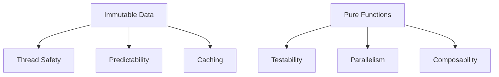

## 7.7 Immutability and Pure Functions

In the realm of advanced systems programming, immutability and pure functions play a pivotal role in crafting robust, efficient, and maintainable software. The D programming language, with its rich feature set, provides powerful tools to leverage these concepts effectively. In this section, we will delve into the principles of immutability and pure functions, explore their benefits, and demonstrate their application in D programming.

### Understanding Immutability

Immutability refers to the concept of data that cannot be altered once it is created. In D, this is achieved using the `immutable` keyword. When a variable is declared as `immutable`, its value is fixed for its entire lifetime. This characteristic is particularly beneficial in concurrent programming, where data consistency and thread safety are paramount.

#### The `immutable` Keyword

The `immutable` keyword in D is used to declare variables that are immutable. Once a variable is marked as `immutable`, any attempt to modify it will result in a compile-time error. This ensures that the data remains constant and unchangeable.

```d
immutable int x = 42;
// x = 43; // Error: cannot modify immutable variable
```

In the above example, the integer `x` is declared as `immutable`, meaning its value cannot be changed after initialization.

#### Benefits of Immutability

1. **Thread Safety**: Immutability inherently provides thread safety. Since immutable data cannot be modified, it can be safely shared across multiple threads without the need for synchronization mechanisms like locks or mutexes.

2. **Predictability**: Immutable data leads to more predictable code behavior. Since the data does not change, functions that operate on immutable data are easier to reason about and debug.

3. **Caching and Optimization**: Immutable data can be cached without concerns about data consistency. This allows for performance optimizations, such as memoization, where function results are cached based on their inputs.

4. **Functional Programming**: Immutability is a core principle of functional programming, enabling the creation of pure functions that produce no side effects.

### Use Cases and Examples

#### Concurrent Programming

In concurrent programming, immutability is a powerful tool for ensuring data consistency and thread safety. By sharing immutable data across threads, we eliminate the risk of race conditions and data corruption.

```d
import std.concurrency;

void worker(immutable int[] data) {
    foreach (value; data) {
        // Process each value
    }
}

void main() {
    immutable int[] sharedData = [1, 2, 3, 4, 5];
    auto tid = spawn(&worker, sharedData);
    // No need for locks or synchronization
}
```

In this example, the `sharedData` array is immutable, allowing it to be safely shared with the `worker` function running in a separate thread.

#### Caching Results

Immutability facilitates caching strategies by ensuring that cached values remain consistent. This is particularly useful in scenarios where function results are reused.

```d
import std.stdio;

immutable int computeExpensiveOperation(int input) {
    // Simulate an expensive computation
    return input * input;
}

void main() {
    immutable int result = computeExpensiveOperation(10);
    writeln("Cached Result: ", result);
    // The result can be safely reused without recomputation
}
```

Here, the result of `computeExpensiveOperation` is cached as an immutable value, allowing it to be reused without recomputation.

### Pure Functions

Pure functions are functions that have no side effects and always produce the same output for the same input. They do not modify any state or interact with the outside world, making them predictable and easy to test.

#### Characteristics of Pure Functions

1. **Deterministic**: A pure function always returns the same result given the same input.
2. **No Side Effects**: Pure functions do not modify any external state or variables.
3. **Referential Transparency**: Pure functions can be replaced with their output value without changing the program's behavior.

#### Writing Pure Functions in D

In D, writing pure functions involves ensuring that the function does not modify any external state and relies solely on its input parameters.

```d
pure int add(int a, int b) {
    return a + b;
}

void main() {
    int result = add(3, 4);
    writeln("Result: ", result);
}
```

The `add` function is a pure function because it does not modify any external state and always returns the same result for the same inputs.

#### Benefits of Pure Functions

1. **Testability**: Pure functions are easy to test because they do not depend on external state. Unit tests can be written to verify their behavior with different inputs.

2. **Parallelism**: Pure functions can be executed in parallel without concerns about data races or side effects, making them ideal for concurrent programming.

3. **Composability**: Pure functions can be composed together to build complex operations from simple, reusable components.

### Visualizing Immutability and Pure Functions

To better understand the concepts of immutability and pure functions, let's visualize their interactions and benefits using a flowchart.



**Figure 1: Visualizing the Benefits of Immutability and Pure Functions**

In this diagram, we see how immutable data contributes to thread safety, predictability, and caching, while pure functions enhance testability, parallelism, and composability.

### Design Considerations

When designing systems with immutability and pure functions, consider the following:

- **Performance Trade-offs**: While immutability provides numerous benefits, it can also lead to increased memory usage due to the creation of new objects. Evaluate the trade-offs between immutability and performance in your specific use case.

- **Functional vs. Imperative**: Embrace a functional programming mindset when working with immutability and pure functions. This may require a shift from traditional imperative programming practices.

- **Integration with Existing Code**: When integrating immutability and pure functions into existing codebases, ensure that the transition is gradual and does not disrupt existing functionality.

### Differences and Similarities

Immutability and pure functions are often discussed together due to their complementary nature. However, they are distinct concepts:

- **Immutability** focuses on data that cannot change, while **pure functions** focus on functions that do not produce side effects.

- Both concepts promote predictability and reliability in software, making them valuable tools for building robust systems.

### Try It Yourself

To solidify your understanding of immutability and pure functions, try modifying the provided code examples. Experiment with creating your own immutable data structures and pure functions. Observe how these changes impact the behavior and performance of your programs.

### Further Reading

For more information on immutability and pure functions, consider exploring the following resources:

- [MDN Web Docs on Immutability](https://developer.mozilla.org/en-US/docs/Glossary/Immutable)
- [Functional Programming in D](https://dlang.org/articles/functional-programming.html)

### Knowledge Check

Before moving on, let's reinforce your understanding with a few questions:

1. What is the primary benefit of using immutable data in concurrent programming?
2. How do pure functions enhance testability?
3. What is referential transparency, and why is it important in pure functions?

### Embrace the Journey

Remember, mastering immutability and pure functions is a journey. As you continue to explore these concepts, you'll discover new ways to enhance the reliability and performance of your software. Keep experimenting, stay curious, and enjoy the process!

## Quiz Time!



### What is the primary benefit of using immutable data in concurrent programming?

- [x] Thread safety
- [ ] Increased performance
- [ ] Reduced memory usage
- [ ] Easier debugging

> **Explanation:** Immutable data is inherently thread-safe because it cannot be modified, eliminating the need for synchronization.

### How do pure functions enhance testability?

- [x] They have no side effects
- [ ] They modify external state
- [ ] They depend on global variables
- [ ] They produce different outputs for the same inputs

> **Explanation:** Pure functions have no side effects and always produce the same output for the same input, making them easy to test.

### What is referential transparency?

- [x] The ability to replace a function call with its result
- [ ] The ability to modify external state
- [ ] The ability to produce side effects
- [ ] The ability to use global variables

> **Explanation:** Referential transparency means that a function call can be replaced with its result without changing the program's behavior.

### Which keyword is used in D to declare immutable variables?

- [x] immutable
- [ ] const
- [ ] final
- [ ] static

> **Explanation:** The `immutable` keyword is used in D to declare variables that cannot be changed after initialization.

### What is a characteristic of pure functions?

- [x] Deterministic behavior
- [ ] Modifies external state
- [x] No side effects
- [ ] Depends on global variables

> **Explanation:** Pure functions are deterministic and have no side effects, making them predictable and reliable.

### How can immutability lead to increased memory usage?

- [x] By creating new objects for each change
- [ ] By modifying existing objects
- [ ] By reducing object creation
- [ ] By sharing objects between threads

> **Explanation:** Immutability can lead to increased memory usage because new objects are created for each change, rather than modifying existing ones.

### Why are pure functions ideal for parallelism?

- [x] They have no side effects
- [ ] They modify shared state
- [x] They are deterministic
- [ ] They depend on external variables

> **Explanation:** Pure functions have no side effects and are deterministic, allowing them to be executed in parallel without concerns about data races.

### What is a potential trade-off of using immutability?

- [x] Increased memory usage
- [ ] Reduced code readability
- [ ] Increased complexity
- [ ] Decreased reliability

> **Explanation:** While immutability provides many benefits, it can lead to increased memory usage due to the creation of new objects.

### How can immutability facilitate caching?

- [x] By ensuring cached values remain consistent
- [ ] By allowing cached values to change
- [ ] By modifying cached values
- [ ] By reducing cache size

> **Explanation:** Immutability ensures that cached values remain consistent, allowing for reliable caching strategies.

### True or False: Pure functions can modify global variables.

- [ ] True
- [x] False

> **Explanation:** Pure functions cannot modify global variables as they have no side effects and rely solely on their input parameters.




