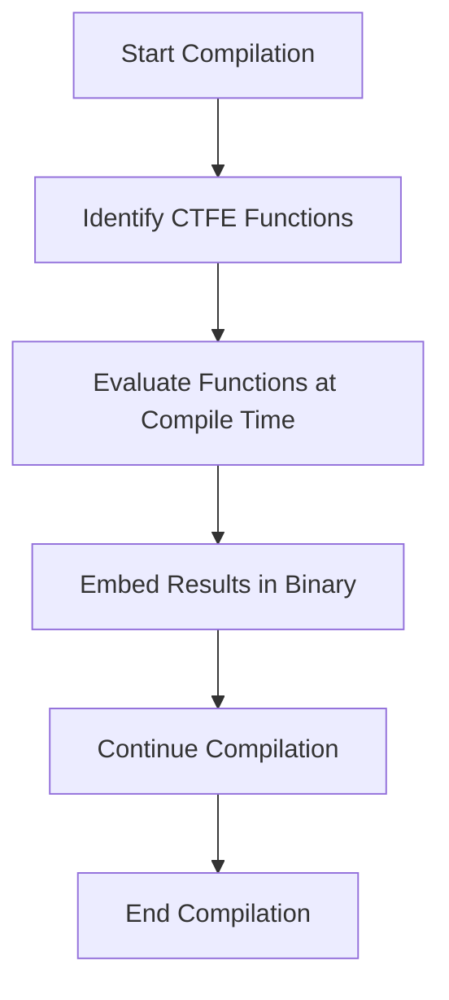

## 7.8 Compile-Time Function Execution (CTFE)

Compile-Time Function Execution (CTFE) is a powerful feature of the D programming language that allows functions to be evaluated during the compilation process. This capability enables developers to perform computations, validations, and optimizations at compile time, leading to more efficient and robust code. In this section, we will explore the concept of CTFE, its use cases, and how to effectively leverage it in your D programs.

### Understanding Compile-Time Function Execution

CTFE in D allows certain functions to be executed during the compilation phase rather than at runtime. This means that the results of these functions are computed once and embedded directly into the compiled binary, reducing runtime overhead and enabling more efficient code execution.

#### Key Concepts

- **Compile-Time Computation**: The process of evaluating functions during compilation to produce constant values or perform checks.
- **Static Initialization**: Using CTFE to compute constants and initialize data structures at compile time.
- **Validation**: Ensuring certain conditions are met at compile time, preventing potential runtime errors.

### Use Cases for CTFE

CTFE can be applied in various scenarios to enhance the performance and reliability of your D programs. Here are some common use cases:

#### Static Initialization

One of the primary uses of CTFE is to compute constant values that can be used for static initialization. This is particularly useful for initializing large data structures or lookup tables that do not change at runtime.

```d
// Example of static initialization using CTFE
import std.stdio;

int factorial(int n) {
    return n <= 1 ? 1 : n * factorial(n - 1);
}

enum int FACTORIAL_5 = factorial(5);

void main() {
    writeln("Factorial of 5 is: ", FACTORIAL_5);
}
```

In this example, the `factorial` function is evaluated at compile time to compute the factorial of 5, and the result is stored in the `FACTORIAL_5` constant.

#### Validation

CTFE can be used to perform compile-time validation, ensuring that certain conditions are met before the program is compiled. This can help catch errors early in the development process.

```d
// Example of compile-time validation
import std.stdio;

enum bool isPrime(int n) {
    if (n <= 1) return false;
    foreach (i; 2 .. n) {
        if (n % i == 0) return false;
    }
    return true;
}

static assert(isPrime(7), "7 is not a prime number!");

void main() {
    writeln("7 is a prime number.");
}
```

In this example, the `isPrime` function is used to validate that 7 is a prime number at compile time. If the condition fails, a compile-time error is generated.

### Examples of CTFE in Action

Let's explore some practical examples of CTFE to understand how it can be applied in real-world scenarios.

#### Precomputed Tables

CTFE can be used to generate lookup tables at compile time, which can significantly improve the performance of your program by avoiding repetitive calculations at runtime.

```d
// Example of precomputed table using CTFE
import std.stdio;

enum int[] SQUARES = generateSquares(10);

int[] generateSquares(int n) {
    int[] squares;
    foreach (i; 0 .. n) {
        squares ~= i * i;
    }
    return squares;
}

void main() {
    writeln("Squares: ", SQUARES);
}
```

In this example, the `generateSquares` function computes the squares of numbers from 0 to 9 at compile time, and the results are stored in the `SQUARES` array.

#### Compile-Time Assertions

Compile-time assertions can be used to ensure code correctness by verifying assumptions and invariants during compilation.

```d
// Example of compile-time assertion
import std.stdio;

enum int MAX_VALUE = 100;

static assert(MAX_VALUE > 0, "MAX_VALUE must be positive!");

void main() {
    writeln("MAX_VALUE is valid.");
}
```

In this example, a compile-time assertion is used to ensure that `MAX_VALUE` is positive. If the condition is not met, a compile-time error is generated.

### Visualizing CTFE

To better understand the flow of CTFE, let's visualize the process using a flowchart.



**Figure 1: Flowchart of Compile-Time Function Execution (CTFE) Process**

This flowchart illustrates the steps involved in CTFE, from identifying functions that can be executed at compile time to embedding the results in the compiled binary.

### Design Considerations

When using CTFE, it's important to consider the following:

- **Function Limitations**: Not all functions can be executed at compile time. Functions that involve I/O operations or runtime-dependent computations are not suitable for CTFE.
- **Complexity**: While CTFE can improve performance, overly complex compile-time computations can increase compilation time.
- **Debugging**: Debugging CTFE code can be challenging, as errors are reported at compile time rather than runtime.

### Differences and Similarities with Other Patterns

CTFE is often compared to other compile-time techniques, such as template metaprogramming. While both involve compile-time computations, CTFE focuses on executing functions, whereas template metaprogramming involves generating code through templates.

### Try It Yourself

To get hands-on experience with CTFE, try modifying the code examples provided. For instance, change the range of numbers in the `generateSquares` function or test different values in the `isPrime` function. Experimenting with these examples will help solidify your understanding of CTFE.

### References and Further Reading

For more information on CTFE and related topics, consider exploring the following resources:

- [D Programming Language Documentation](https://dlang.org/)
- [CTFE in D: A Comprehensive Guide](https://dlang.org/articles/ctfe.html)
- [Compile-Time Function Execution in D](https://wiki.dlang.org/CTFE)

### Knowledge Check

Before moving on, let's review some key takeaways:

- CTFE allows functions to be executed during compilation, enabling static initialization and validation.
- It can be used to generate precomputed tables and perform compile-time assertions.
- Understanding the limitations and design considerations of CTFE is crucial for effective use.

### Embrace the Journey

Remember, mastering CTFE is just one step in your journey to becoming an expert in D programming. Keep experimenting, stay curious, and enjoy the process of learning and applying new concepts.

## Quiz Time!



### What is the primary purpose of CTFE in D?

- [x] To execute functions during compilation
- [ ] To execute functions during runtime
- [ ] To optimize memory usage
- [ ] To enhance error handling

> **Explanation:** CTFE allows functions to be executed during the compilation process, embedding the results directly into the compiled binary.

### Which of the following is a use case for CTFE?

- [x] Static initialization
- [ ] Dynamic memory allocation
- [ ] Runtime error handling
- [ ] Multithreading

> **Explanation:** CTFE is used for static initialization, allowing computations to be performed at compile time.

### What is a limitation of CTFE?

- [x] Cannot perform I/O operations
- [ ] Cannot handle exceptions
- [ ] Cannot be used with templates
- [ ] Cannot be used with structs

> **Explanation:** CTFE cannot perform I/O operations or runtime-dependent computations.

### How does CTFE improve performance?

- [x] By reducing runtime overhead
- [ ] By increasing memory usage
- [ ] By simplifying code logic
- [ ] By enhancing error messages

> **Explanation:** CTFE reduces runtime overhead by computing values at compile time and embedding them in the binary.

### What is a compile-time assertion?

- [x] A check performed during compilation
- [ ] A check performed during runtime
- [ ] A check performed during linking
- [ ] A check performed during execution

> **Explanation:** Compile-time assertions are checks performed during compilation to ensure code correctness.

### Which function is suitable for CTFE?

- [x] A function that computes factorials
- [ ] A function that reads from a file
- [ ] A function that writes to a database
- [ ] A function that handles user input

> **Explanation:** Functions that do not involve I/O operations or runtime dependencies are suitable for CTFE.

### What is the result of a CTFE function?

- [x] A constant value embedded in the binary
- [ ] A variable value computed at runtime
- [ ] A dynamic value stored in memory
- [ ] A temporary value used for debugging

> **Explanation:** CTFE functions produce constant values that are embedded in the compiled binary.

### What is the relationship between CTFE and template metaprogramming?

- [x] Both involve compile-time computations
- [ ] Both involve runtime optimizations
- [ ] Both involve dynamic memory allocation
- [ ] Both involve error handling

> **Explanation:** CTFE and template metaprogramming both involve compile-time computations, but they serve different purposes.

### Can CTFE be used for validation?

- [x] True
- [ ] False

> **Explanation:** CTFE can be used for compile-time validation, ensuring conditions are met before compilation.

### What should you consider when using CTFE?

- [x] Function limitations and complexity
- [ ] Runtime performance and memory usage
- [ ] User interface and experience
- [ ] Network latency and bandwidth

> **Explanation:** When using CTFE, consider function limitations, complexity, and potential increases in compilation time.


