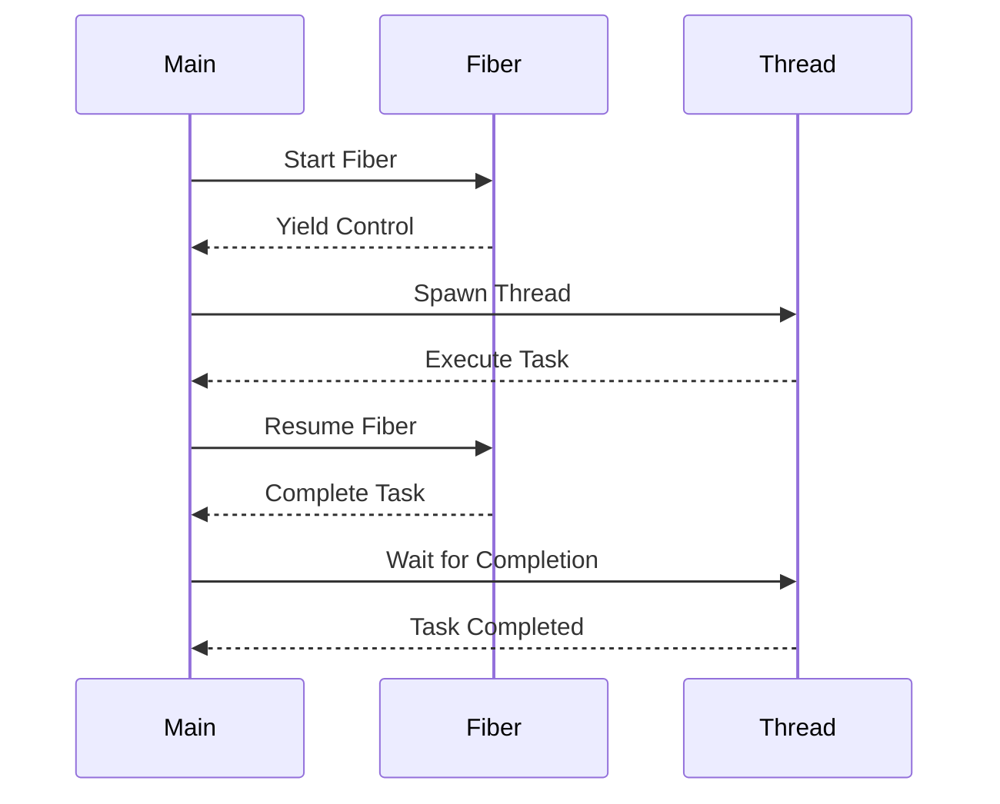

## 8.1 Introduction to Concurrency in D

Concurrency is a fundamental aspect of modern software development, enabling programs to perform multiple tasks simultaneously. In the D programming language, concurrency is supported through a variety of models, including fibers and threads, which offer developers the flexibility to choose the most appropriate tool for their specific use case. In this section, we will explore D's concurrency support, focusing on its concurrency models, the use of fibers and threads, and practical examples of asynchronous I/O and concurrent computations.

### Concurrency Models in D

Concurrency in D is designed to be both powerful and flexible, allowing developers to write efficient and scalable applications. The language provides several concurrency models, each with its own strengths and use cases. Understanding these models is crucial for leveraging D's concurrency capabilities effectively.

#### Fibers and Threads

D supports two primary concurrency models: fibers and threads. Each model offers unique advantages and is suited to different types of tasks.

##### Lightweight Concurrency with Fibers

Fibers in D are lightweight units of execution that allow for cooperative multitasking. Unlike threads, which are managed by the operating system, fibers are managed by the D runtime, making them more efficient in terms of resource usage. Fibers are particularly useful for tasks that require frequent context switching, such as I/O-bound operations.

**Key Features of Fibers:**

- **Low Overhead:** Fibers have minimal overhead compared to threads, making them ideal for applications that require a large number of concurrent tasks.
- **Cooperative Scheduling:** Fibers yield control explicitly, allowing the developer to manage execution flow.
- **Efficient Context Switching:** Switching between fibers is faster than switching between threads, as it does not involve the operating system.

**Example: Basic Fiber Usage**

```d
import std.concurrency;
import std.stdio;

void main() {
    auto fiber = new Fiber({
        writeln("Fiber started");
        Fiber.yield(); // Yield control back to the main thread
        writeln("Fiber resumed");
    });

    fiber.call(); // Start the fiber
    writeln("Main thread");
    fiber.call(); // Resume the fiber
}
```

In this example, we create a fiber that prints messages before and after yielding control. The main thread starts the fiber and resumes it after yielding.

##### Threads for Parallel Execution

Threads in D are similar to threads in other programming languages, providing true parallel execution by leveraging multiple CPU cores. Threads are suitable for CPU-bound tasks that can benefit from parallel processing.

**Key Features of Threads:**

- **Parallel Execution:** Threads can run on multiple CPU cores, providing true parallelism.
- **Preemptive Scheduling:** The operating system manages thread scheduling, allowing for automatic context switching.
- **Suitable for CPU-Bound Tasks:** Threads are ideal for tasks that require significant computational resources.

**Example: Basic Thread Usage**

```d
import std.concurrency;
import std.stdio;

void threadFunction() {
    writeln("Thread started");
}

void main() {
    auto tid = spawn(&threadFunction); // Spawn a new thread
    writeln("Main thread");
    receiveOnly!Tid(); // Wait for the thread to finish
}
```

In this example, we spawn a new thread that executes the `threadFunction`. The main thread waits for the spawned thread to complete using `receiveOnly`.

### Use Cases and Examples

Concurrency in D is not just about fibers and threads; it's about applying these tools to solve real-world problems efficiently. Let's explore some common use cases and examples.

#### Asynchronous I/O: Non-Blocking Operations

Asynchronous I/O is a powerful technique for improving the performance of applications that perform I/O operations, such as reading from or writing to files, network sockets, or databases. By using non-blocking operations, applications can continue executing other tasks while waiting for I/O operations to complete.

**Example: Asynchronous File Reading**

```d
import std.stdio;
import std.file;
import std.concurrency;

void main() {
    auto filePath = "example.txt";
    auto fiber = new Fiber({
        auto content = readText(filePath);
        writeln("File content: ", content);
    });

    fiber.call(); // Start the fiber
    writeln("Main thread continues");
    fiber.call(); // Resume the fiber
}
```

In this example, we use a fiber to read a file asynchronously. The main thread continues executing while the fiber reads the file content.

#### Concurrent Computations: Distributing Workloads

Concurrent computations involve distributing workloads across multiple execution units to improve performance and responsiveness. This is particularly useful for tasks that can be divided into smaller, independent units of work.

**Example: Parallel Sum Calculation**

```d
import std.parallelism;
import std.stdio;

void main() {
    auto numbers = [1, 2, 3, 4, 5, 6, 7, 8, 9, 10];
    auto sum = taskPool.reduce!((a, b) => a + b)(numbers);
    writeln("Sum: ", sum);
}
```

In this example, we use D's `std.parallelism` module to calculate the sum of an array of numbers in parallel. The `reduce` function distributes the workload across multiple threads, improving performance for large datasets.

### Visualizing Concurrency in D

To better understand how concurrency works in D, let's visualize the interaction between fibers, threads, and the main program flow using a sequence diagram.



**Diagram Description:** This sequence diagram illustrates the interaction between the main program, a fiber, and a thread. The main program starts a fiber, which yields control back to the main program. The main program then spawns a thread to execute a task. Once the thread completes its task, the main program resumes the fiber to complete its execution.

### References and Further Reading

- [D Language Concurrency](https://dlang.org/concurrency.html)
- [D Programming Language Specification](https://dlang.org/spec/spec.html)
- [Asynchronous Programming in D](https://dlang.org/blog/2017/06/20/asynchronous-programming-in-d/)

### Knowledge Check

Let's reinforce what we've learned with some questions and exercises.

1. **What are the main differences between fibers and threads in D?**
2. **How can you use fibers to perform asynchronous I/O operations?**
3. **What are some advantages of using threads for concurrent computations?**
4. **Try modifying the parallel sum calculation example to calculate the product of the numbers instead.**

### Embrace the Journey

Remember, mastering concurrency in D is a journey. As you continue to explore and experiment with fibers, threads, and asynchronous programming, you'll discover new ways to optimize your applications and improve their performance. Keep experimenting, stay curious, and enjoy the journey!

## Quiz Time!



### What is a key advantage of using fibers in D?

- [x] Low overhead and efficient context switching
- [ ] True parallel execution on multiple cores
- [ ] Preemptive scheduling by the operating system
- [ ] Automatic memory management

> **Explanation:** Fibers in D have low overhead and efficient context switching, making them ideal for lightweight concurrency.

### How do fibers differ from threads in terms of scheduling?

- [x] Fibers use cooperative scheduling
- [ ] Fibers use preemptive scheduling
- [ ] Threads use cooperative scheduling
- [ ] Threads are managed by the D runtime

> **Explanation:** Fibers use cooperative scheduling, where control is explicitly yielded, while threads use preemptive scheduling managed by the OS.

### Which concurrency model is best suited for CPU-bound tasks?

- [ ] Fibers
- [x] Threads
- [ ] Asynchronous I/O
- [ ] Event loops

> **Explanation:** Threads are best suited for CPU-bound tasks as they can leverage multiple CPU cores for parallel execution.

### What is the primary benefit of asynchronous I/O?

- [ ] Increased memory usage
- [x] Non-blocking operations
- [ ] Simplified code structure
- [ ] Reduced code complexity

> **Explanation:** Asynchronous I/O allows for non-blocking operations, enabling the application to continue executing other tasks while waiting for I/O operations to complete.

### In the context of D, what does `std.parallelism` provide?

- [ ] Fiber management
- [x] Parallel algorithms and task distribution
- [ ] Asynchronous I/O utilities
- [ ] Memory management tools

> **Explanation:** `std.parallelism` provides parallel algorithms and task distribution capabilities in D.

### What is a common use case for fibers in D?

- [x] I/O-bound operations
- [ ] CPU-bound computations
- [ ] Memory management
- [ ] Network security

> **Explanation:** Fibers are commonly used for I/O-bound operations due to their low overhead and efficient context switching.

### How can you achieve parallel execution in D?

- [ ] Using only fibers
- [x] Using threads
- [ ] Using synchronous I/O
- [ ] Using event loops

> **Explanation:** Parallel execution in D can be achieved using threads, which can run on multiple CPU cores.

### What is the role of `Fiber.yield()` in D?

- [x] To yield control back to the main thread
- [ ] To start a new fiber
- [ ] To terminate a fiber
- [ ] To spawn a new thread

> **Explanation:** `Fiber.yield()` is used to yield control back to the main thread, allowing for cooperative multitasking.

### What does the `reduce` function in `std.parallelism` do?

- [ ] Manages fiber execution
- [x] Distributes workload across threads
- [ ] Handles asynchronous I/O
- [ ] Manages memory allocation

> **Explanation:** The `reduce` function in `std.parallelism` distributes workload across threads for parallel execution.

### True or False: Fibers in D are managed by the operating system.

- [ ] True
- [x] False

> **Explanation:** False. Fibers in D are managed by the D runtime, not the operating system.


