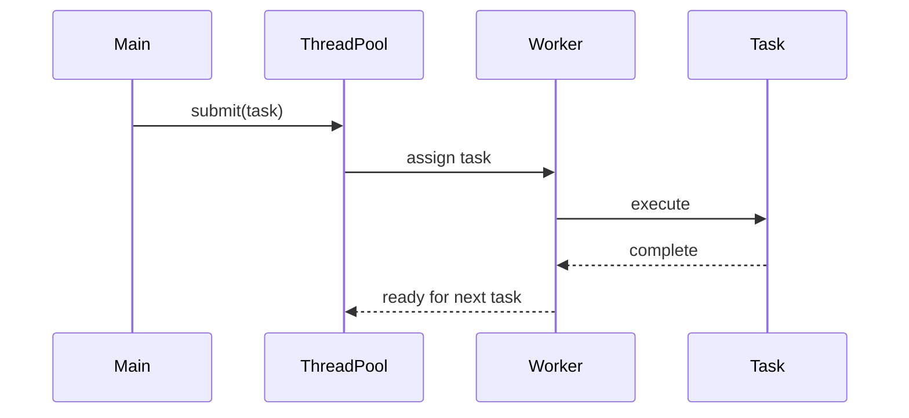

## 8.10 Concurrency Utilities and Patterns

Concurrency is a fundamental aspect of modern software development, enabling applications to perform multiple tasks simultaneously, thereby improving performance and responsiveness. In the D programming language, concurrency is supported through a variety of utilities and patterns that allow developers to efficiently manage resources and handle asynchronous results. In this section, we will explore key concurrency utilities and patterns in D, including thread pools, futures, and promises, and demonstrate their use in real-world scenarios such as web servers and event processing.

### Thread Pools: Managing Resources Efficiently

Thread pools are a powerful concurrency utility that allows developers to manage a pool of worker threads for executing tasks. By reusing threads, thread pools reduce the overhead associated with thread creation and destruction, leading to more efficient resource management.

#### Key Concepts

- **Thread Reuse**: Instead of creating a new thread for each task, a thread pool reuses existing threads, reducing the overhead of thread management.
- **Task Queue**: Tasks are submitted to a queue, and worker threads pick up tasks from the queue for execution.
- **Scalability**: Thread pools can be configured to adjust the number of threads based on workload, improving scalability.

#### Implementing a Thread Pool in D

Let's implement a simple thread pool in D to understand how it works. We'll use D's `std.concurrency` module to manage threads and tasks.

```d
import std.concurrency;
import std.stdio;
import std.array;

class ThreadPool {
    private Tid[] workers;
    private Tid manager;
    private bool running = true;

    this(size_t numThreads) {
        manager = spawn(&taskManager);
        workers = new Tid[](numThreads);
        foreach (i; 0 .. numThreads) {
            workers[i] = spawnLinked(&worker);
        }
    }

    void submit(void delegate() task) {
        send(manager, task);
    }

    void stop() {
        running = false;
        foreach (worker; workers) {
            send(worker, "stop");
        }
    }

    private void taskManager() {
        while (running) {
            receive(
                (void delegate() task) {
                    auto worker = workers.front;
                    send(worker, task);
                    workers = workers[1 .. $] ~ worker;
                }
            );
        }
    }

    private void worker() {
        while (true) {
            receive(
                (void delegate() task) {
                    task();
                },
                (string msg) {
                    if (msg == "stop") break;
                }
            );
        }
    }
}

void main() {
    auto pool = new ThreadPool(4);

    foreach (i; 0 .. 10) {
        pool.submit(() {
            writeln("Task ", i, " executed by ", thisTid);
        });
    }

    pool.stop();
}
```

**Explanation:**

- **ThreadPool Class**: Manages a pool of worker threads and a task manager.
- **submit Method**: Adds tasks to the queue by sending them to the task manager.
- **taskManager Method**: Distributes tasks to worker threads in a round-robin fashion.
- **worker Method**: Executes tasks and listens for a stop signal.

### Futures and Promises: Handling Asynchronous Results

Futures and promises are abstractions for handling asynchronous computations. A future represents a value that may not yet be available, while a promise is a mechanism to set the value of a future.

#### Key Concepts

- **Future**: An object that acts as a placeholder for a result that is initially unknown but will be computed asynchronously.
- **Promise**: An object that provides a way to set the value of a future once the computation is complete.
- **Asynchronous Programming**: Futures and promises enable non-blocking operations, allowing programs to continue executing while waiting for results.

#### Implementing Futures and Promises in D

Let's implement a simple example of futures and promises in D using `std.concurrency`.

```d
import std.concurrency;
import std.stdio;

void asyncComputation(Promise!int promise) {
    // Simulate a long-running computation
    import core.thread : Thread;
    Thread.sleep(1.seconds);
    promise.put(42); // Set the result of the computation
}

void main() {
    auto promise = new Promise!int;
    auto future = promise.getFuture();

    spawn(&asyncComputation, promise);

    writeln("Waiting for result...");
    int result = future.get();
    writeln("Result: ", result);
}
```

**Explanation:**

- **Promise!int**: A promise that will eventually hold an integer result.
- **getFuture Method**: Returns a future associated with the promise.
- **asyncComputation Function**: Simulates a long-running computation and sets the result using the promise.

### Use Cases and Examples

Concurrency utilities and patterns are widely used in various applications to improve performance and responsiveness. Let's explore some common use cases.

#### Web Servers: Handling Concurrent Requests

Web servers often need to handle multiple requests simultaneously. By using thread pools and futures, we can efficiently manage concurrent requests.

```d
import std.concurrency;
import std.stdio;
import std.socket;

void handleRequest(Socket client) {
    // Simulate request processing
    writeln("Handling request from ", client.remoteAddress);
    client.close();
}

void main() {
    auto pool = new ThreadPool(4);
    auto server = new TcpListener(SocketAddress("127.0.0.1", 8080));

    while (true) {
        auto client = server.accept();
        pool.submit(() => handleRequest(client));
    }
}
```

**Explanation:**

- **TcpListener**: Listens for incoming connections on a specified address and port.
- **handleRequest Function**: Processes each client request in a separate thread from the pool.

#### Event Processing: Managing Long-Running Tasks

Event-driven systems often require handling long-running tasks without blocking the main event loop. Futures and promises can be used to manage these tasks asynchronously.

```d
import std.concurrency;
import std.stdio;

void longRunningTask(Promise!string promise) {
    // Simulate a long-running task
    import core.thread : Thread;
    Thread.sleep(2.seconds);
    promise.put("Task Completed");
}

void main() {
    auto promise = new Promise!string;
    auto future = promise.getFuture();

    spawn(&longRunningTask, promise);

    writeln("Processing events...");
    while (!future.isReady()) {
        // Simulate event processing
        writeln("Handling other events...");
        import core.thread : Thread;
        Thread.sleep(500.msecs);
    }

    writeln("Result: ", future.get());
}
```

**Explanation:**

- **longRunningTask Function**: Simulates a long-running task and sets the result using a promise.
- **Event Loop**: Continues processing other events while waiting for the task to complete.

### Visualizing Concurrency Patterns

To better understand the flow of concurrency patterns, let's visualize the interaction between components using a sequence diagram.



**Diagram Explanation:**

- **Main**: Submits tasks to the thread pool.
- **ThreadPool**: Distributes tasks to available workers.
- **Worker**: Executes tasks and signals completion.

### Design Considerations

When implementing concurrency patterns, consider the following:

- **Thread Safety**: Ensure that shared resources are accessed in a thread-safe manner.
- **Deadlocks**: Avoid situations where threads wait indefinitely for resources held by each other.
- **Scalability**: Design thread pools and task queues to handle varying workloads efficiently.
- **Error Handling**: Implement robust error handling to manage exceptions in asynchronous tasks.

### Differences and Similarities

Concurrency patterns such as thread pools, futures, and promises are often compared to other concurrency models like actors and coroutines. While actors encapsulate state and behavior, futures and promises focus on managing asynchronous results. Coroutines, on the other hand, provide a more lightweight mechanism for concurrency by allowing functions to be paused and resumed.

### Try It Yourself

Experiment with the provided code examples by modifying the number of threads in the thread pool or the duration of simulated tasks. Observe how these changes affect the performance and responsiveness of the application.

### References and Links

- [D Programming Language Documentation](https://dlang.org/)
- [Concurrency in D](https://dlang.org/phobos/std_concurrency.html)
- [Thread Pools](https://en.wikipedia.org/wiki/Thread_pool)
- [Futures and Promises](https://en.wikipedia.org/wiki/Futures_and_promises)

### Knowledge Check

- What are the benefits of using thread pools in concurrent applications?
- How do futures and promises facilitate asynchronous programming?
- What are some common pitfalls to avoid when implementing concurrency patterns?

### Embrace the Journey

Concurrency is a complex but rewarding aspect of software development. As you continue to explore concurrency patterns in D, remember to experiment, learn from real-world scenarios, and apply best practices to build efficient and scalable applications.

## Quiz Time!



### What is the primary benefit of using a thread pool?

- [x] Reduces the overhead of thread creation and destruction
- [ ] Increases the number of threads available
- [ ] Simplifies code readability
- [ ] Ensures thread safety

> **Explanation:** Thread pools reduce the overhead of creating and destroying threads by reusing existing threads.

### How do futures and promises facilitate asynchronous programming?

- [x] By allowing non-blocking operations
- [ ] By ensuring thread safety
- [ ] By reducing memory usage
- [ ] By simplifying error handling

> **Explanation:** Futures and promises enable non-blocking operations, allowing programs to continue executing while waiting for results.

### In the provided thread pool example, what is the role of the `taskManager` method?

- [x] Distributes tasks to worker threads
- [ ] Executes tasks directly
- [ ] Manages thread creation
- [ ] Handles error logging

> **Explanation:** The `taskManager` method distributes tasks to worker threads in a round-robin fashion.

### What is a common use case for futures and promises?

- [x] Managing long-running tasks asynchronously
- [ ] Simplifying code readability
- [ ] Ensuring thread safety
- [ ] Reducing memory usage

> **Explanation:** Futures and promises are commonly used to manage long-running tasks asynchronously, allowing other operations to continue.

### Which of the following is a potential pitfall when implementing concurrency patterns?

- [x] Deadlocks
- [ ] Increased memory usage
- [ ] Simplified error handling
- [ ] Reduced code readability

> **Explanation:** Deadlocks occur when threads wait indefinitely for resources held by each other, which is a potential pitfall in concurrency.

### What is the purpose of the `Promise` object in D?

- [x] To set the value of a future once the computation is complete
- [ ] To execute tasks directly
- [ ] To manage thread creation
- [ ] To handle error logging

> **Explanation:** A `Promise` object provides a way to set the value of a future once the computation is complete.

### How does the `worker` method in the thread pool example know when to stop?

- [x] It receives a "stop" signal
- [ ] It checks a global variable
- [ ] It times out after a set period
- [ ] It finishes when all tasks are complete

> **Explanation:** The `worker` method listens for a "stop" signal to know when to terminate.

### What is a key consideration when designing thread pools?

- [x] Scalability
- [ ] Code readability
- [ ] Memory usage
- [ ] Error logging

> **Explanation:** Scalability is important to ensure that thread pools can handle varying workloads efficiently.

### Which concurrency model focuses on managing asynchronous results?

- [x] Futures and Promises
- [ ] Actors
- [ ] Coroutines
- [ ] Thread Pools

> **Explanation:** Futures and promises focus on managing asynchronous results, while actors encapsulate state and behavior.

### True or False: Coroutines provide a more lightweight mechanism for concurrency by allowing functions to be paused and resumed.

- [x] True
- [ ] False

> **Explanation:** Coroutines allow functions to be paused and resumed, providing a lightweight mechanism for concurrency.


