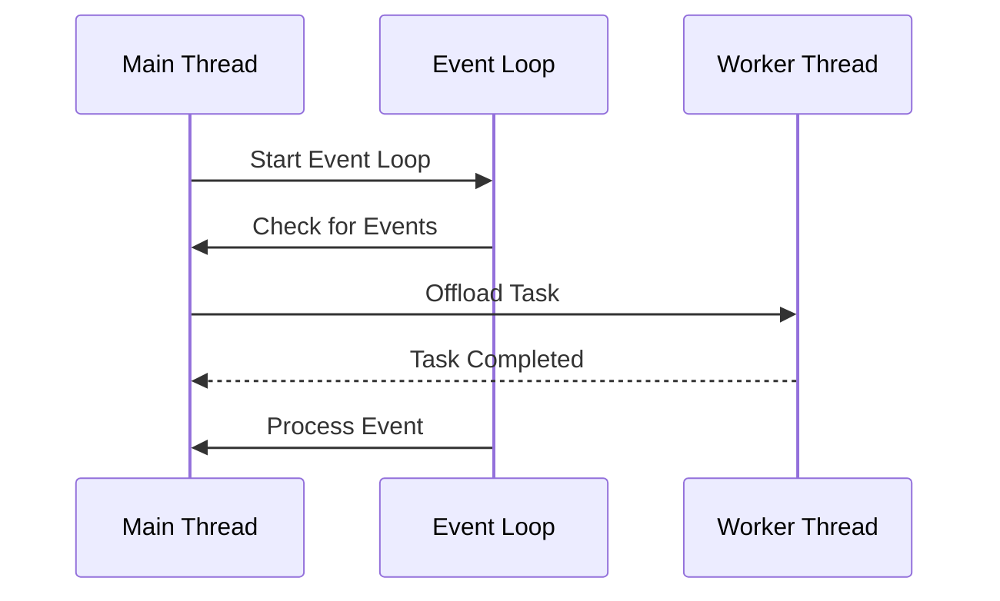

## 8.11 Handling Concurrency in GUI Applications

In the realm of GUI applications, concurrency is a critical aspect that ensures responsiveness and a smooth user experience. As expert software engineers and architects, mastering concurrency in GUI applications using the D programming language involves understanding event loops, leveraging worker threads, and implementing design patterns that enhance performance and maintainability. In this section, we will delve into these concepts, providing you with the knowledge and tools to build high-performance GUI applications.

### Event Loops: Managing GUI Responsiveness

The event loop is the backbone of any GUI application. It continuously listens for events, such as user inputs or system messages, and dispatches them to the appropriate handlers. In D, managing an event loop efficiently is crucial for maintaining a responsive interface.

#### Understanding the Event Loop

An event loop is essentially a loop that waits for and dispatches events or messages in a program. It works by repeatedly checking for new events and processing them one at a time. This model is particularly effective in GUI applications where user interactions are asynchronous and unpredictable.

```d
import std.stdio;
import std.concurrency;
import std.datetime;

void main() {
    auto eventLoop = new EventLoop();
    eventLoop.run();
}

class EventLoop {
    bool running = true;

    void run() {
        while (running) {
            // Simulate checking for events
            writeln("Checking for events...");
            // Simulate processing an event
            processEvent();
            // Sleep to simulate time between events
            Thread.sleep(1.seconds);
        }
    }

    void processEvent() {
        writeln("Processing event...");
        // Event processing logic here
    }
}
```

In this example, the `EventLoop` class represents a simple event loop that continuously checks for and processes events. The `run` method simulates the event loop, and the `processEvent` method represents the logic for handling an event.

#### Key Considerations for Event Loops

- **Responsiveness**: Ensure that event processing is quick to avoid blocking the loop.
- **Non-blocking Operations**: Use non-blocking I/O and asynchronous operations to prevent the UI from freezing.
- **Prioritization**: Implement a mechanism to prioritize events, ensuring critical events are handled promptly.

### Worker Threads: Offloading Work

To keep the UI responsive, it's essential to offload heavy computations or blocking operations to worker threads. This allows the main thread to remain free for handling user interactions and rendering updates.

#### Implementing Worker Threads

Worker threads can be used to perform tasks in the background, freeing up the main thread for UI operations. In D, you can use the `std.concurrency` module to create and manage worker threads.

```d
import std.stdio;
import std.concurrency;
import std.datetime;

void main() {
    auto worker = spawn(&heavyComputation);
    writeln("Main thread is free to handle UI...");
    // Simulate UI operations
    Thread.sleep(2.seconds);
    writeln("UI operations completed.");
}

void heavyComputation() {
    writeln("Worker thread: Starting heavy computation...");
    // Simulate a long-running task
    Thread.sleep(3.seconds);
    writeln("Worker thread: Computation completed.");
}
```

In this example, the `heavyComputation` function is executed in a separate thread using the `spawn` function from the `std.concurrency` module. This allows the main thread to remain responsive while the computation is performed in the background.

#### Use Cases for Worker Threads

- **Data Processing**: Offload data processing tasks to worker threads to prevent UI lag.
- **Network Operations**: Perform network requests in the background to avoid blocking the main thread.
- **File I/O**: Handle file read/write operations asynchronously to maintain responsiveness.

### Use Cases and Examples

Let's explore some practical use cases where concurrency patterns can significantly enhance the performance and user experience of GUI applications.

#### Data Visualization: Processing Data Without Freezing

In data visualization applications, rendering complex graphs or charts can be computationally intensive. By offloading data processing to worker threads, you can ensure that the UI remains responsive while the data is being prepared.

```d
import std.stdio;
import std.concurrency;
import std.datetime;

void main() {
    auto dataProcessor = spawn(&processData);
    writeln("Main thread: Preparing UI for data visualization...");
    // Simulate UI preparation
    Thread.sleep(1.seconds);
    writeln("Main thread: UI ready.");
}

void processData() {
    writeln("Worker thread: Processing data...");
    // Simulate data processing
    Thread.sleep(4.seconds);
    writeln("Worker thread: Data processing completed.");
}
```

In this example, the `processData` function simulates data processing in a worker thread, allowing the main thread to focus on preparing the UI.

#### User Interactions: Providing Smooth Experiences

User interactions, such as clicking buttons or dragging elements, should be smooth and instantaneous. By using concurrency patterns, you can ensure that these interactions are handled promptly, even when the application is performing other tasks.

```d
import std.stdio;
import std.concurrency;
import std.datetime;

void main() {
    auto interactionHandler = spawn(&handleUserInteraction);
    writeln("Main thread: Listening for user interactions...");
    // Simulate user interaction
    Thread.sleep(2.seconds);
    writeln("Main thread: User interaction handled.");
}

void handleUserInteraction() {
    writeln("Worker thread: Handling user interaction...");
    // Simulate interaction handling
    Thread.sleep(1.seconds);
    writeln("Worker thread: Interaction handled.");
}
```

In this example, the `handleUserInteraction` function is executed in a worker thread, allowing the main thread to remain responsive to other interactions.

### Visualizing Concurrency in GUI Applications

To better understand the flow of concurrency in GUI applications, let's visualize the interaction between the main thread, event loop, and worker threads.



**Diagram Description**: This sequence diagram illustrates the interaction between the main thread, event loop, and worker threads. The main thread starts the event loop, which checks for events and processes them. Tasks are offloaded to worker threads, which notify the main thread upon completion.

### Best Practices for Concurrency in GUI Applications

- **Thread Safety**: Ensure that shared resources are accessed safely using synchronization mechanisms.
- **Error Handling**: Implement robust error handling to manage exceptions in worker threads.
- **Resource Management**: Properly manage resources to avoid memory leaks and ensure efficient use of system resources.
- **Testing and Debugging**: Thoroughly test and debug concurrent code to identify and resolve race conditions and deadlocks.

### Try It Yourself

Experiment with the provided code examples by modifying the sleep durations or adding additional tasks to the worker threads. Observe how these changes affect the responsiveness of the main thread and the overall application.

### References and Further Reading

- [D Programming Language: Concurrency](https://dlang.org/concurrency.html)
- [MDN Web Docs: Event Loop](https://developer.mozilla.org/en-US/docs/Web/JavaScript/EventLoop)
- [Concurrency in GUI Applications](https://www.geeksforgeeks.org/concurrency-in-gui-applications/)

### Knowledge Check

- What is the primary purpose of an event loop in a GUI application?
- How can worker threads improve the responsiveness of a GUI application?
- What are some common use cases for offloading tasks to worker threads?

### Embrace the Journey

Remember, mastering concurrency in GUI applications is a journey. As you experiment with different patterns and techniques, you'll gain a deeper understanding of how to build responsive and efficient applications. Keep exploring, stay curious, and enjoy the process!

## Quiz Time!



### What is the primary role of an event loop in a GUI application?

- [x] To continuously check for and process events
- [ ] To manage memory allocation
- [ ] To handle network requests
- [ ] To perform data visualization

> **Explanation:** The event loop's primary role is to continuously check for and process events, ensuring the application remains responsive.

### How do worker threads contribute to GUI application performance?

- [x] By offloading heavy computations from the main thread
- [ ] By increasing memory usage
- [ ] By reducing the number of events processed
- [ ] By handling user interactions directly

> **Explanation:** Worker threads offload heavy computations from the main thread, allowing it to remain responsive to user interactions.

### Which module in D is commonly used for creating and managing worker threads?

- [x] std.concurrency
- [ ] std.parallelism
- [ ] std.threading
- [ ] std.async

> **Explanation:** The `std.concurrency` module in D is used for creating and managing worker threads.

### What is a key consideration when implementing an event loop?

- [x] Ensuring non-blocking operations
- [ ] Maximizing memory usage
- [ ] Reducing the number of threads
- [ ] Increasing the number of events

> **Explanation:** Ensuring non-blocking operations is crucial to prevent the event loop from freezing and maintain responsiveness.

### What is a common use case for offloading tasks to worker threads?

- [x] Data processing
- [ ] Memory management
- [ ] Event loop management
- [ ] UI rendering

> **Explanation:** Data processing is a common use case for offloading tasks to worker threads to prevent UI lag.

### How can you ensure thread safety when accessing shared resources?

- [x] Using synchronization mechanisms
- [ ] Increasing the number of threads
- [ ] Reducing memory usage
- [ ] Avoiding error handling

> **Explanation:** Using synchronization mechanisms ensures thread safety when accessing shared resources.

### What is a potential issue when not properly managing resources in concurrent applications?

- [x] Memory leaks
- [ ] Increased responsiveness
- [ ] Reduced event processing
- [ ] Enhanced user interactions

> **Explanation:** Not properly managing resources can lead to memory leaks, affecting application performance.

### Why is robust error handling important in worker threads?

- [x] To manage exceptions and prevent crashes
- [ ] To increase memory usage
- [ ] To reduce the number of threads
- [ ] To handle user interactions

> **Explanation:** Robust error handling is important to manage exceptions and prevent crashes in worker threads.

### What is a benefit of testing and debugging concurrent code?

- [x] Identifying and resolving race conditions
- [ ] Increasing the number of threads
- [ ] Reducing memory usage
- [ ] Enhancing user interactions

> **Explanation:** Testing and debugging concurrent code helps identify and resolve race conditions, improving application stability.

### True or False: The main thread should handle all heavy computations in a GUI application.

- [ ] True
- [x] False

> **Explanation:** False. Heavy computations should be offloaded to worker threads to keep the main thread responsive.


