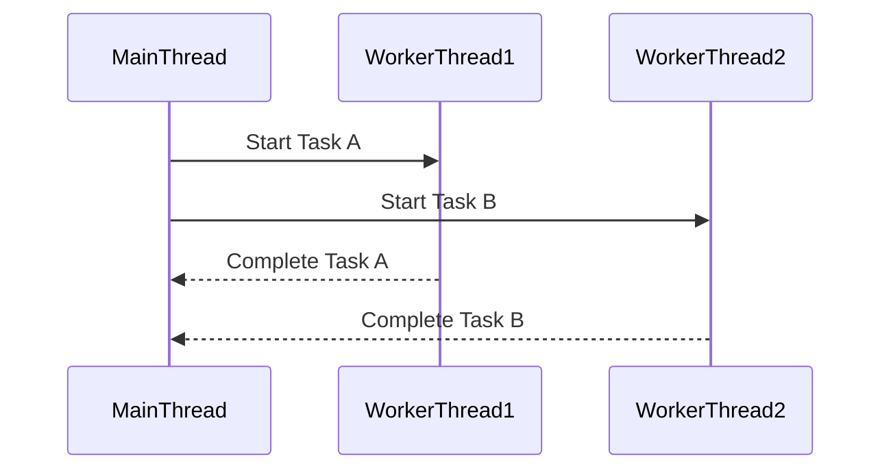
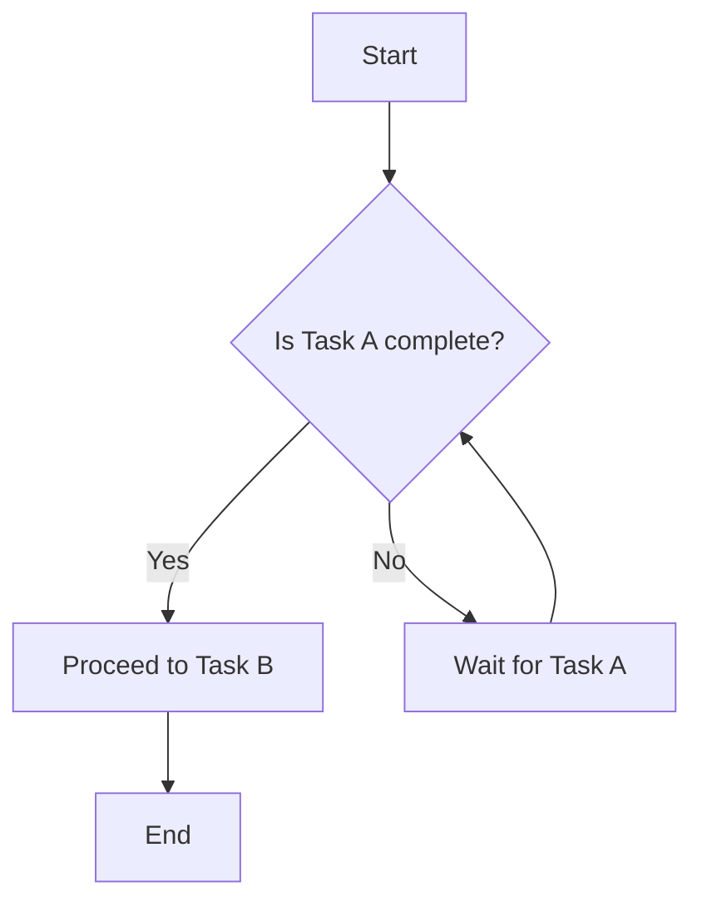

## 8.12 Best Practices for Concurrent Programming

Concurrent programming is a powerful paradigm that allows software to perform multiple operations simultaneously, making efficient use of system resources. In the D programming language, concurrent programming is facilitated by features such as fibers, message passing, and shared memory concurrency. However, with great power comes great responsibility. Managing concurrency effectively requires careful consideration to avoid common pitfalls such as deadlocks and race conditions. In this section, we will explore best practices for concurrent programming in D, focusing on debugging concurrency issues, avoiding deadlocks and races, and optimizing performance for scalable applications.

### Debugging Concurrency Issues

Concurrency bugs can be elusive and difficult to reproduce, making debugging a challenging task. Here are some tools and techniques to help you identify and resolve concurrency issues:

1. **Logging and Monitoring**: Implement detailed logging to capture the sequence of events leading up to a concurrency issue. Use timestamps to track the timing of operations and identify potential race conditions.

2. **Thread Sanitizers**: Utilize tools like ThreadSanitizer to detect data races and deadlocks. These tools can provide insights into the interactions between threads and help pinpoint problematic code.

3. **Reproducible Test Cases**: Create test cases that can reliably reproduce concurrency issues. This may involve simulating specific timing conditions or using mock objects to control the execution flow.

4. **Code Review and Pair Programming**: Engage in code reviews and pair programming sessions to identify potential concurrency issues early in the development process. Fresh eyes can often spot problems that the original developer might miss.

5. **Static Analysis Tools**: Use static analysis tools to detect potential concurrency issues in your code. These tools can analyze your codebase for patterns that may lead to deadlocks or race conditions.

6. **Visualizing Execution Flow**: Use diagrams to visualize the execution flow of concurrent operations. This can help you understand the interactions between different parts of your code and identify potential bottlenecks or conflicts.



*Diagram: Visualizing the interaction between main and worker threads.*

### Avoiding Deadlocks and Races

Deadlocks and race conditions are two of the most common issues in concurrent programming. Here are some strategies to prevent them:

#### Design Strategies: Proactive Prevention

1. **Lock Hierarchies**: Establish a strict order for acquiring locks to prevent circular dependencies that can lead to deadlocks. Always acquire locks in the same order across different threads.

2. **Timeouts and Deadlock Detection**: Implement timeouts for lock acquisition and use deadlock detection algorithms to identify and resolve deadlocks dynamically.

3. **Immutable Data Structures**: Use immutable data structures to eliminate race conditions. Immutable objects can be safely shared between threads without the need for synchronization.

4. **Atomic Operations**: Use atomic operations for simple data manipulations to avoid race conditions. The D standard library provides atomic operations that can be used for this purpose.

5. **Fine-Grained Locking**: Use fine-grained locking to minimize contention between threads. This involves locking only the necessary data structures rather than using a single lock for multiple resources.

6. **Avoid Shared State**: Design your system to minimize shared state between threads. Use message passing or other techniques to communicate between threads without sharing data directly.

```d
import std.concurrency;

void worker() {
    receive((int msg) {
        writeln("Received message: ", msg);
    });
}

void main() {
    auto tid = spawn(&worker);
    send(tid, 42);
}
```

*Code Example: Using message passing to avoid shared state.*

### Use Cases and Examples

#### Application Stability: Ensuring Reliability

Ensuring application stability in a concurrent environment involves careful design and testing. Here are some best practices:

1. **Graceful Shutdown**: Implement mechanisms for gracefully shutting down concurrent operations. This includes signaling threads to terminate and waiting for them to complete their tasks.

2. **Error Handling**: Use robust error handling to manage exceptions in concurrent operations. Ensure that exceptions in one thread do not crash the entire application.

3. **Resource Management**: Properly manage resources such as file handles and network connections in concurrent applications. Use RAII (Resource Acquisition Is Initialization) to ensure resources are released when no longer needed.

4. **Testing Under Load**: Test your application under realistic load conditions to identify concurrency issues that may not appear in a development environment.

5. **Redundancy and Failover**: Implement redundancy and failover mechanisms to ensure continued operation in case of failures in concurrent components.

```d
import std.stdio;
import std.concurrency;

void worker() {
    try {
        // Simulate work
        throw new Exception("Simulated error");
    } catch (Exception e) {
        writeln("Caught exception: ", e.msg);
    }
}

void main() {
    auto tid = spawn(&worker);
    receiveOnly!Tid(); // Wait for worker to finish
}
```

*Code Example: Handling exceptions in a concurrent worker.*

#### Performance Optimization: Achieving Scalability

Optimizing performance in concurrent applications involves balancing resource utilization and minimizing contention. Here are some strategies:

1. **Load Balancing**: Distribute work evenly across threads to prevent bottlenecks. Use work-stealing algorithms to dynamically balance the load.

2. **Non-blocking Algorithms**: Use non-blocking algorithms to improve performance in high-concurrency scenarios. These algorithms avoid locking and instead use atomic operations to manage shared data.

3. **Parallel Processing**: Leverage D's `std.parallelism` module to parallelize computationally intensive tasks. This can significantly improve performance on multi-core systems.

4. **Cache Optimization**: Optimize cache usage by minimizing false sharing and aligning data structures to cache line boundaries.

5. **Profiling and Tuning**: Use profiling tools to identify performance bottlenecks and tune your application for optimal performance.

```d
import std.parallelism;
import std.algorithm;
import std.range;

void main() {
    auto data = iota(1, 1000000);
    auto sum = taskPool.reduce!"a + b"(0, data);
    writeln("Sum: ", sum);
}
```

*Code Example: Using parallel processing to sum a large range of numbers.*

### Try It Yourself

Experiment with the provided code examples by modifying them to suit your needs. For instance, try changing the number of worker threads or the size of the data set in the parallel processing example. Observe how these changes affect performance and stability.

### Visualizing Concurrency Concepts

To further aid understanding, let's visualize some concurrency concepts using diagrams.



*Diagram: Flowchart illustrating task dependency and completion.*

### References and Links

For further reading on concurrent programming in D, consider the following resources:

- [D Language Concurrency](https://dlang.org/spec/concurrency.html)
- [ThreadSanitizer](https://clang.llvm.org/docs/ThreadSanitizer.html)
- [RAII in D](https://dlang.org/spec/garbage.html#raii)

### Knowledge Check

To reinforce your understanding, consider the following questions:

- What are some common tools for debugging concurrency issues?
- How can you prevent deadlocks in a concurrent application?
- What is the benefit of using immutable data structures in concurrent programming?
- How can you optimize performance in a concurrent application?

### Embrace the Journey

Remember, mastering concurrent programming is a journey. As you progress, you'll gain a deeper understanding of how to design and implement efficient, reliable concurrent systems. Keep experimenting, stay curious, and enjoy the journey!

## Quiz Time!



### What is a common tool for detecting data races in concurrent applications?

- [x] ThreadSanitizer
- [ ] MemoryLeakDetector
- [ ] CodeAnalyzer
- [ ] DebuggerPro

> **Explanation:** ThreadSanitizer is a tool specifically designed to detect data races and other concurrency issues.

### Which strategy helps prevent deadlocks by establishing a strict order for acquiring locks?

- [x] Lock Hierarchies
- [ ] Timeout Mechanisms
- [ ] Immutable Data Structures
- [ ] Atomic Operations

> **Explanation:** Lock hierarchies establish a strict order for acquiring locks, preventing circular dependencies that can lead to deadlocks.

### What is the benefit of using immutable data structures in concurrent programming?

- [x] They eliminate race conditions.
- [ ] They improve memory usage.
- [ ] They simplify error handling.
- [ ] They enhance code readability.

> **Explanation:** Immutable data structures can be safely shared between threads without the need for synchronization, eliminating race conditions.

### How can you optimize performance in a concurrent application?

- [x] Use non-blocking algorithms.
- [ ] Increase the number of threads indefinitely.
- [ ] Minimize logging.
- [ ] Avoid using atomic operations.

> **Explanation:** Non-blocking algorithms improve performance by avoiding locking, which can be a bottleneck in high-concurrency scenarios.

### What is a key benefit of using message passing in concurrent programming?

- [x] It avoids shared state.
- [ ] It increases memory usage.
- [ ] It simplifies code structure.
- [ ] It reduces the number of threads.

> **Explanation:** Message passing allows threads to communicate without sharing state, reducing the risk of race conditions.

### Which of the following is a strategy for achieving load balancing in concurrent applications?

- [x] Work-stealing algorithms
- [ ] Increasing thread priority
- [ ] Reducing task size
- [ ] Using a single thread

> **Explanation:** Work-stealing algorithms dynamically balance the load by redistributing tasks among threads.

### What is the purpose of using RAII in concurrent programming?

- [x] To manage resources efficiently
- [ ] To increase execution speed
- [ ] To simplify code readability
- [ ] To reduce memory usage

> **Explanation:** RAII ensures that resources are properly acquired and released, preventing resource leaks in concurrent applications.

### What is a common issue that can occur when multiple threads access shared data without proper synchronization?

- [x] Race conditions
- [ ] Deadlocks
- [ ] Memory leaks
- [ ] Stack overflow

> **Explanation:** Race conditions occur when multiple threads access shared data without proper synchronization, leading to unpredictable results.

### Which D module can be used for parallel processing of computationally intensive tasks?

- [x] std.parallelism
- [ ] std.concurrency
- [ ] std.algorithm
- [ ] std.range

> **Explanation:** The `std.parallelism` module provides tools for parallel processing, improving performance on multi-core systems.

### True or False: Immutable objects can be safely shared between threads without synchronization.

- [x] True
- [ ] False

> **Explanation:** Immutable objects do not change state, so they can be safely shared between threads without synchronization.


