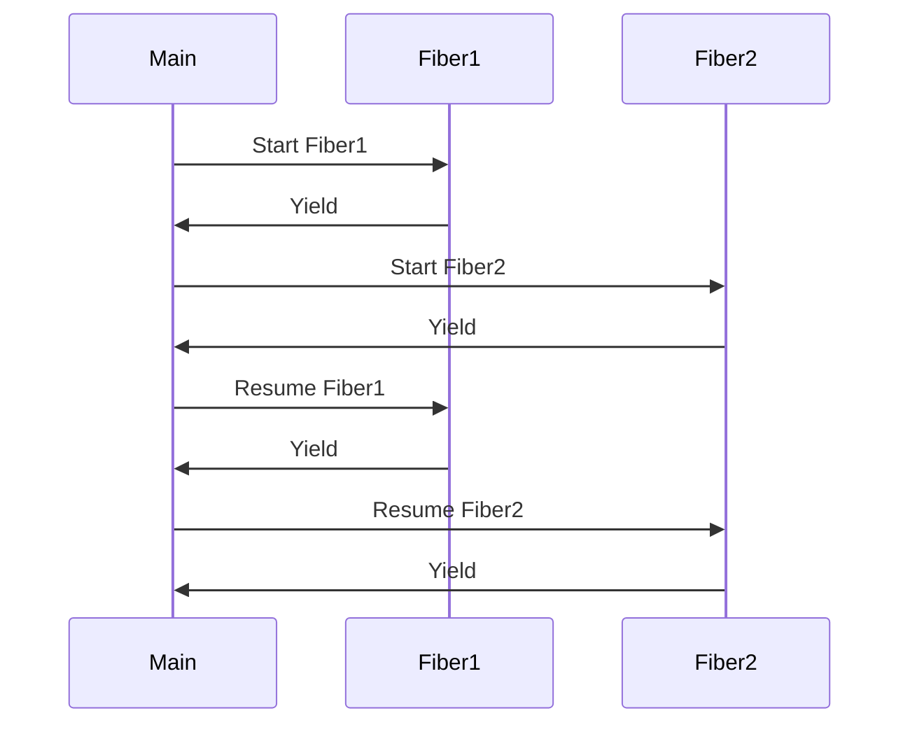

## 8.2 Fibers and Asynchronous Programming

In the realm of advanced systems programming, managing concurrency efficiently is paramount. The D programming language offers a powerful tool for this purpose: fibers. Fibers enable cooperative multitasking, allowing developers to write asynchronous code that is both efficient and easy to understand. In this section, we will delve into the concept of fibers, explore how to implement asynchronous tasks using event loops, and examine practical use cases such as I/O-bound and server applications.

### Understanding Fibers in D

Fibers in D provide a mechanism for cooperative multitasking, where multiple tasks yield control to each other voluntarily. Unlike threads, which are preemptively scheduled by the operating system, fibers are managed by the application, allowing for fine-grained control over task execution.

#### Key Concepts of Fibers

- **Cooperative Multitasking**: Fibers yield control explicitly, allowing other fibers to run. This contrasts with preemptive multitasking, where the operating system interrupts tasks.
- **Lightweight**: Fibers are more lightweight than threads, as they do not require context switching at the OS level.
- **Stack Management**: Each fiber has its own stack, which is managed by the D runtime.

#### Implementing Fibers in D

To implement fibers in D, we use the `core.thread.Fiber` class. Let's explore a basic example:

```d
import core.thread;

void fiberFunction()
{
    writeln("Fiber started");
    Fiber.yield(); // Yield control to another fiber
    writeln("Fiber resumed");
}

void main()
{
    auto fiber = new Fiber(&fiberFunction);
    fiber.call(); // Start the fiber
    writeln("Main function");
    fiber.call(); // Resume the fiber
}
```

In this example, we define a fiber function that prints a message, yields control, and then resumes. The main function creates and starts the fiber, demonstrating the cooperative nature of fibers.

### Implementing Asynchronous Tasks

Asynchronous programming is essential for building responsive applications, especially when dealing with I/O-bound operations. In D, fibers can be used to implement asynchronous tasks efficiently.

#### Event Loops: Managing Fiber Execution

An event loop is a programming construct that waits for and dispatches events or messages in a program. In the context of fibers, an event loop can manage the execution of multiple fibers, allowing them to yield and resume as needed.

Here's a simple event loop implementation using fibers:

```d
import core.thread;
import std.stdio;

void fiberTask(string taskName)
{
    for (int i = 0; i < 3; i++)
    {
        writeln(taskName, " iteration ", i);
        Fiber.yield(); // Yield control to the event loop
    }
}

void main()
{
    auto fiber1 = new Fiber(() => fiberTask("Task 1"));
    auto fiber2 = new Fiber(() => fiberTask("Task 2"));

    while (!fiber1.done || !fiber2.done)
    {
        if (!fiber1.done) fiber1.call();
        if (!fiber2.done) fiber2.call();
    }
}
```

In this example, we create two fibers, each representing a task. The event loop alternates between the fibers, allowing them to yield and resume execution.

#### Use Cases and Examples

Fibers and asynchronous programming are particularly useful in scenarios where responsiveness and efficient resource utilization are critical. Let's explore two common use cases: I/O-bound applications and server applications.

##### I/O-bound Applications: Improving Responsiveness

I/O-bound applications, such as those performing network or file operations, often spend a significant amount of time waiting for I/O operations to complete. By using fibers, we can keep the application responsive while waiting for these operations.

Consider a network application that handles multiple connections:

```d
import core.thread;
import std.stdio;
import std.socket;

void handleConnection(Socket socket)
{
    writeln("Handling connection from ", socket.remoteAddress);
    // Simulate I/O operation
    Fiber.yield();
    writeln("Finished handling connection");
}

void main()
{
    auto listener = new TcpListener(new InternetAddress(8080));
    listener.listen();

    while (true)
    {
        auto socket = listener.accept();
        auto fiber = new Fiber(() => handleConnection(socket));
        fiber.call();
    }
}
```

In this example, each connection is handled by a separate fiber, allowing the application to accept new connections while processing existing ones.

##### Server Applications: Handling Multiple Connections

Server applications often need to handle multiple client connections simultaneously. Fibers provide an efficient way to manage these connections without the overhead of creating a new thread for each connection.

Here's an example of a simple HTTP server using fibers:

```d
import core.thread;
import std.stdio;
import std.socket;

void handleRequest(Socket socket)
{
    writeln("Received request from ", socket.remoteAddress);
    // Simulate processing request
    Fiber.yield();
    writeln("Response sent to ", socket.remoteAddress);
}

void main()
{
    auto listener = new TcpListener(new InternetAddress(8080));
    listener.listen();

    while (true)
    {
        auto socket = listener.accept();
        auto fiber = new Fiber(() => handleRequest(socket));
        fiber.call();
    }
}
```

In this server, each request is processed by a separate fiber, allowing the server to handle multiple requests concurrently.

### Visualizing Fiber Execution

To better understand how fibers manage task execution, let's visualize the process using a sequence diagram:



This diagram illustrates the cooperative nature of fibers, where control is explicitly yielded and resumed between the main function and the fibers.

### Try It Yourself

To gain a deeper understanding of fibers and asynchronous programming in D, try modifying the examples provided:

- **Experiment with Different Tasks**: Create additional fibers with different tasks and observe how the event loop manages them.
- **Simulate I/O Operations**: Introduce delays or simulate I/O operations within the fiber tasks to see how they affect execution.
- **Implement a More Complex Event Loop**: Enhance the event loop to handle more complex scenarios, such as prioritizing certain tasks or handling errors.

### Knowledge Check

Before we conclude, let's reinforce what we've learned:

- **What are fibers, and how do they differ from threads?**
- **How can fibers be used to implement asynchronous tasks?**
- **What are the benefits of using fibers in I/O-bound and server applications?**

### Conclusion

Fibers and asynchronous programming in D offer powerful tools for managing concurrency in high-performance systems. By leveraging cooperative multitasking, developers can write efficient and responsive applications that handle multiple tasks seamlessly. As you continue your journey in mastering D, remember to experiment with fibers and explore their potential in your projects.

## Quiz Time!



### What is the primary advantage of using fibers over threads in D?

- [x] Fibers are more lightweight and allow for cooperative multitasking.
- [ ] Fibers are managed by the operating system.
- [ ] Fibers provide preemptive multitasking.
- [ ] Fibers require more resources than threads.

> **Explanation:** Fibers are more lightweight than threads and allow for cooperative multitasking, where tasks yield control explicitly.

### How do fibers yield control in D?

- [x] By calling the `Fiber.yield()` method.
- [ ] By using the `Fiber.pause()` method.
- [ ] By throwing an exception.
- [ ] By returning from the function.

> **Explanation:** Fibers yield control by calling the `Fiber.yield()` method, allowing other fibers to run.

### What is an event loop in the context of fibers?

- [x] A construct that manages the execution of multiple fibers.
- [ ] A loop that runs indefinitely without yielding.
- [ ] A mechanism for preemptive multitasking.
- [ ] A way to handle exceptions in fibers.

> **Explanation:** An event loop is a construct that manages the execution of multiple fibers, allowing them to yield and resume as needed.

### In the provided example, what does the `Fiber.call()` method do?

- [x] Starts or resumes the execution of a fiber.
- [ ] Terminates the fiber.
- [ ] Pauses the fiber.
- [ ] Creates a new fiber.

> **Explanation:** The `Fiber.call()` method starts or resumes the execution of a fiber.

### What is a common use case for fibers in server applications?

- [x] Handling multiple client connections concurrently.
- [ ] Performing CPU-bound calculations.
- [ ] Managing hardware interrupts.
- [ ] Running background tasks without yielding.

> **Explanation:** Fibers are commonly used in server applications to handle multiple client connections concurrently.

### How can fibers improve the responsiveness of I/O-bound applications?

- [x] By allowing the application to perform other tasks while waiting for I/O operations.
- [ ] By increasing the priority of I/O operations.
- [ ] By reducing the number of I/O operations.
- [ ] By using more threads.

> **Explanation:** Fibers improve responsiveness by allowing the application to perform other tasks while waiting for I/O operations to complete.

### What is the role of the `core.thread.Fiber` class in D?

- [x] It provides the implementation for fibers in D.
- [ ] It manages threads at the OS level.
- [ ] It handles memory allocation for fibers.
- [ ] It provides synchronization primitives for fibers.

> **Explanation:** The `core.thread.Fiber` class provides the implementation for fibers in D, allowing for cooperative multitasking.

### What is the main difference between cooperative and preemptive multitasking?

- [x] Cooperative multitasking requires tasks to yield control explicitly.
- [ ] Preemptive multitasking requires tasks to yield control explicitly.
- [ ] Cooperative multitasking is managed by the OS.
- [ ] Preemptive multitasking is managed by the application.

> **Explanation:** In cooperative multitasking, tasks yield control explicitly, whereas in preemptive multitasking, the OS manages task switching.

### Which method is used to create a new fiber in D?

- [x] `new Fiber(&function)`
- [ ] `Fiber.create(&function)`
- [ ] `Fiber.start(&function)`
- [ ] `Fiber.init(&function)`

> **Explanation:** A new fiber is created in D using the `new Fiber(&function)` syntax.

### True or False: Fibers in D can be used for both I/O-bound and CPU-bound tasks.

- [x] True
- [ ] False

> **Explanation:** Fibers can be used for both I/O-bound and CPU-bound tasks, although they are particularly beneficial for I/O-bound tasks due to their cooperative nature.


