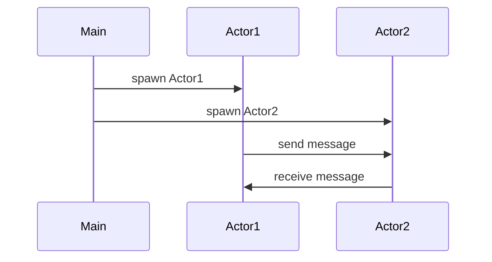

## 8.3 Message Passing with `std.concurrency`

Concurrency is a cornerstone of modern software development, enabling applications to perform multiple tasks simultaneously. In the D programming language, the `std.concurrency` module provides a robust framework for message passing, allowing developers to implement the Actor Model efficiently. This section will guide you through the concepts of message passing, the Actor Model, and how to leverage `std.concurrency` to build scalable and concurrent systems.

### Understanding the Actor Model

The Actor Model is a conceptual model that treats "actors" as the fundamental units of computation. Each actor can:

- Receive messages.
- Process messages.
- Send messages to other actors.
- Create new actors.

This model isolates state within actors, ensuring that they communicate solely through message passing. This isolation simplifies reasoning about concurrent systems and reduces the risk of race conditions.

#### Key Concepts of the Actor Model

- **Isolation**: Actors do not share state. Each actor maintains its own state, which is modified only by processing messages.
- **Message Passing**: Actors communicate by sending and receiving messages. This decouples the sender and receiver, allowing them to operate independently.
- **Asynchronous Processing**: Actors process messages asynchronously, enabling non-blocking operations and efficient resource utilization.

### Implementing Actors in D

In D, the `std.concurrency` module provides the necessary tools to implement the Actor Model. Let's explore how to create actors and facilitate message passing using this module.

#### Creating Actors

Actors in D are typically implemented as threads that handle messages. The `spawn` function is used to create a new actor, which runs a specified function in a separate thread.

```d
import std.concurrency;
import std.stdio;

void actorFunction()
{
    while (true)
    {
        receive(
            (int msg) => writeln("Received integer: ", msg),
            (string msg) => writeln("Received string: ", msg)
        );
    }
}

void main()
{
    auto actorTid = spawn(&actorFunction);
    send(actorTid, 42);
    send(actorTid, "Hello, Actor!");
}
```

In this example, `actorFunction` is an actor that receives and processes messages. The `receive` function is used to handle different types of messages, such as integers and strings.

#### Sending and Receiving Messages

The `send` function is used to send messages to an actor. It takes the actor's thread identifier (`Tid`) and the message as arguments. The `receive` function, on the other hand, is used within an actor to handle incoming messages.

```d
// Sending a message
send(actorTid, "Message Content");

// Receiving messages
receive(
    (int msg) => writeln("Processing integer: ", msg),
    (string msg) => writeln("Processing string: ", msg)
);
```

### Use Cases and Examples

Message passing with `std.concurrency` is particularly useful in scenarios where tasks can be decomposed into independent units of work. Let's explore some practical use cases.

#### Parallel Pipelines

In a parallel pipeline, data flows through a series of processing stages, each handled by a separate actor. This pattern is ideal for tasks like data transformation, where each stage performs a specific operation on the data.

```d
import std.concurrency;
import std.stdio;

void stage1(Tid nextStage)
{
    for (int i = 0; i < 10; i++)
    {
        send(nextStage, i * 2);
    }
}

void stage2()
{
    while (true)
    {
        receive(
            (int msg) => writeln("Processed value: ", msg + 1)
        );
    }
}

void main()
{
    auto stage2Tid = spawn(&stage2);
    auto stage1Tid = spawn(&stage1, stage2Tid);
}
```

In this example, `stage1` doubles each integer and sends it to `stage2`, which increments the value by one. This demonstrates a simple two-stage pipeline.

#### Concurrent Systems

Building scalable applications often involves managing multiple concurrent tasks. Message passing allows these tasks to communicate without shared state, enhancing scalability and maintainability.

Consider a chat server where each client connection is handled by an actor. Messages from clients are passed to a central actor that broadcasts them to other clients.

```d
import std.concurrency;
import std.stdio;

void clientActor(Tid serverTid)
{
    send(serverTid, "Hello from client!");
}

void serverActor()
{
    while (true)
    {
        receive(
            (string msg) => writeln("Broadcasting message: ", msg)
        );
    }
}

void main()
{
    auto serverTid = spawn(&serverActor);
    auto clientTid1 = spawn(&clientActor, serverTid);
    auto clientTid2 = spawn(&clientActor, serverTid);
}
```

In this setup, each client sends messages to the server actor, which then broadcasts them. This pattern can be extended to handle more complex communication protocols.

### Design Considerations

When implementing message passing systems, consider the following:

- **Message Types**: Define clear message types and handlers to ensure that actors process messages correctly.
- **Error Handling**: Implement robust error handling to manage unexpected messages or failures.
- **Performance**: Monitor the performance of your actors and optimize message processing to prevent bottlenecks.

### Differences and Similarities with Other Patterns

Message passing with `std.concurrency` shares similarities with other concurrency models, such as:

- **Shared Memory Concurrency**: Unlike shared memory, message passing avoids direct state sharing, reducing synchronization complexity.
- **Event-Driven Programming**: Both models rely on handling discrete events or messages, but message passing emphasizes isolation and decoupling.

### Visualizing Message Passing

To better understand the flow of messages between actors, let's visualize a simple message passing system using a sequence diagram.



This diagram illustrates the interaction between two actors, `Actor1` and `Actor2`, with the main thread spawning both actors and facilitating message exchange.

### Try It Yourself

Experiment with the provided examples by modifying the message types or adding new actors. Consider implementing a more complex pipeline with additional stages or a chat server with multiple clients.

### References and Links

For further reading on concurrency and the Actor Model, consider the following resources:

- [D Language Documentation on `std.concurrency`](https://dlang.org/phobos/std_concurrency.html)
- [Actor Model on Wikipedia](https://en.wikipedia.org/wiki/Actor_model)
- [Concurrency in D Programming](https://dlang.org/articles/concurrency.html)

### Knowledge Check

To reinforce your understanding, try answering the following questions:

## Quiz Time!



### What is the primary benefit of using the Actor Model in concurrent systems?

- [x] Isolation of state and communication via messages
- [ ] Direct access to shared memory
- [ ] Simplified error handling
- [ ] Synchronous message processing

> **Explanation:** The Actor Model isolates state within actors and facilitates communication through message passing, reducing the complexity of shared state management.

### Which function is used to create a new actor in D?

- [x] `spawn`
- [ ] `create`
- [ ] `launch`
- [ ] `init`

> **Explanation:** The `spawn` function is used to create a new actor by running a specified function in a separate thread.

### How do actors communicate in the Actor Model?

- [x] By sending and receiving messages
- [ ] By sharing global variables
- [ ] By using mutexes
- [ ] By direct function calls

> **Explanation:** Actors communicate by sending and receiving messages, ensuring decoupled and isolated interactions.

### What is the role of the `receive` function in an actor?

- [x] To handle incoming messages
- [ ] To send messages to other actors
- [ ] To terminate the actor
- [ ] To initialize the actor's state

> **Explanation:** The `receive` function is used within an actor to handle and process incoming messages.

### Which pattern is demonstrated by a series of actors processing data in stages?

- [x] Parallel Pipeline
- [ ] Singleton
- [ ] Observer
- [ ] Factory Method

> **Explanation:** A parallel pipeline involves a series of actors processing data in stages, each performing a specific operation.

### What should be considered when designing message passing systems?

- [x] Message types and handlers
- [ ] Direct state sharing
- [ ] Synchronous processing
- [ ] Global error handling

> **Explanation:** It's important to define clear message types and handlers to ensure correct message processing in a message passing system.

### How does message passing differ from shared memory concurrency?

- [x] It avoids direct state sharing
- [ ] It requires more synchronization
- [ ] It is less efficient
- [ ] It uses global variables

> **Explanation:** Message passing avoids direct state sharing, reducing the need for complex synchronization mechanisms.

### What is a common use case for message passing with `std.concurrency`?

- [x] Building scalable concurrent systems
- [ ] Implementing single-threaded applications
- [ ] Managing global state
- [ ] Performing synchronous I/O operations

> **Explanation:** Message passing with `std.concurrency` is ideal for building scalable concurrent systems by decoupling tasks.

### Which of the following is NOT a feature of the Actor Model?

- [ ] Isolation of state
- [ ] Asynchronous processing
- [x] Direct state sharing
- [ ] Message passing

> **Explanation:** The Actor Model emphasizes isolation of state and communication through message passing, avoiding direct state sharing.

### True or False: The `send` function is used to receive messages in an actor.

- [ ] True
- [x] False

> **Explanation:** The `send` function is used to send messages to an actor, while the `receive` function is used to handle incoming messages.



Remember, mastering message passing with `std.concurrency` is just the beginning. As you continue to explore concurrency patterns in D, you'll unlock new possibilities for building efficient and scalable applications. Keep experimenting, stay curious, and enjoy the journey!
