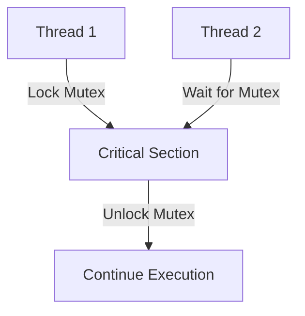

## 8.4 Shared Memory Concurrency and Synchronization

In the realm of systems programming, shared memory concurrency is a critical concept that allows multiple threads or processes to access and modify shared data. However, this power comes with the responsibility of ensuring data integrity and preventing race conditions. In this section, we will delve into the intricacies of shared memory concurrency and synchronization in the D programming language, focusing on shared data management, synchronization primitives, and performance optimization.

### Shared Data Management: Dealing with Shared Memory Safely

Shared memory concurrency involves multiple threads accessing the same memory space. This can lead to race conditions, where the outcome of a program depends on the sequence or timing of uncontrollable events. To manage shared data safely, we need to employ synchronization mechanisms that coordinate access to shared resources.

#### Understanding Race Conditions

A race condition occurs when two or more threads access shared data and try to change it at the same time. If the threads are not synchronized, the final state of the data may depend on the order of execution, leading to unpredictable results.

**Example of a Race Condition:**

```d
import std.stdio;
import core.thread;

int sharedCounter = 0;

void incrementCounter() {
    foreach (i; 0 .. 1000) {
        sharedCounter++;
    }
}

void main() {
    auto t1 = new Thread(&incrementCounter);
    auto t2 = new Thread(&incrementCounter);

    t1.start();
    t2.start();

    t1.join();
    t2.join();

    writeln("Final counter value: ", sharedCounter);
}
```

In this example, two threads increment the `sharedCounter` variable. Without synchronization, the final value of `sharedCounter` is unpredictable due to race conditions.

### Synchronization Primitives

To prevent race conditions, we use synchronization primitives such as mutexes, locks, and condition variables. These tools help control access to shared resources, ensuring that only one thread can modify the data at a time.

#### Mutexes and Locks

A mutex (short for mutual exclusion) is a synchronization primitive that allows only one thread to access a resource at a time. When a thread locks a mutex, other threads attempting to lock it will block until the mutex is unlocked.

**Using Mutexes in D:**

```d
import std.stdio;
import core.sync.mutex;
import core.thread;

int sharedCounter = 0;
Mutex mtx;

void incrementCounter() {
    foreach (i; 0 .. 1000) {
        synchronized(mtx) {
            sharedCounter++;
        }
    }
}

void main() {
    auto t1 = new Thread(&incrementCounter);
    auto t2 = new Thread(&incrementCounter);

    t1.start();
    t2.start();

    t1.join();
    t2.join();

    writeln("Final counter value: ", sharedCounter);
}
```

In this example, the `synchronized` block ensures that only one thread can increment `sharedCounter` at a time, preventing race conditions.

#### Condition Variables

Condition variables are used to block a thread until a particular condition is met. They are often used in conjunction with mutexes to allow threads to wait for certain conditions to be true before proceeding.

**Using Condition Variables in D:**

```d
import std.stdio;
import core.sync.mutex;
import core.sync.condition;
import core.thread;

int sharedCounter = 0;
Mutex mtx;
Condition cond;

void incrementCounter() {
    synchronized(mtx) {
        foreach (i; 0 .. 1000) {
            sharedCounter++;
        }
        cond.notifyAll();
    }
}

void waitForCounter() {
    synchronized(mtx) {
        while (sharedCounter < 2000) {
            cond.wait(mtx);
        }
    }
    writeln("Counter reached 2000");
}

void main() {
    auto t1 = new Thread(&incrementCounter);
    auto t2 = new Thread(&incrementCounter);
    auto t3 = new Thread(&waitForCounter);

    t1.start();
    t2.start();
    t3.start();

    t1.join();
    t2.join();
    t3.join();
}
```

In this example, `waitForCounter` waits until `sharedCounter` reaches 2000. The `cond.notifyAll()` call wakes up all waiting threads once the condition is met.

### Use Cases and Examples

#### Data Integrity: Preventing Race Conditions

Ensuring data integrity is crucial in concurrent programming. By using synchronization primitives, we can prevent race conditions and ensure that shared data is accessed safely.

**Example: Bank Account Simulation**

```d
import std.stdio;
import core.sync.mutex;
import core.thread;

class BankAccount {
    private int balance;
    private Mutex mtx;

    this(int initialBalance) {
        balance = initialBalance;
    }

    void deposit(int amount) {
        synchronized(mtx) {
            balance += amount;
        }
    }

    void withdraw(int amount) {
        synchronized(mtx) {
            if (balance >= amount) {
                balance -= amount;
            } else {
                writeln("Insufficient funds");
            }
        }
    }

    int getBalance() {
        synchronized(mtx) {
            return balance;
        }
    }
}

void main() {
    auto account = new BankAccount(1000);

    auto t1 = new Thread(() => account.deposit(500));
    auto t2 = new Thread(() => account.withdraw(200));

    t1.start();
    t2.start();

    t1.join();
    t2.join();

    writeln("Final balance: ", account.getBalance());
}
```

In this example, a `BankAccount` class uses a mutex to ensure that deposits and withdrawals are performed atomically, preventing race conditions.

#### Performance Optimization: Minimizing Contention

While synchronization is necessary for data integrity, excessive locking can lead to contention, where threads are blocked waiting for a lock to be released. To optimize performance, we should minimize contention by reducing the scope of locks and using lock-free data structures when possible.

**Example: Reducing Lock Scope**

```d
import std.stdio;
import core.sync.mutex;
import core.thread;

int sharedCounter = 0;
Mutex mtx;

void incrementCounter() {
    foreach (i; 0 .. 1000) {
        // Minimize lock scope
        synchronized(mtx) {
            sharedCounter++;
        }
    }
}

void main() {
    auto t1 = new Thread(&incrementCounter);
    auto t2 = new Thread(&incrementCounter);

    t1.start();
    t2.start();

    t1.join();
    t2.join();

    writeln("Final counter value: ", sharedCounter);
}
```

In this example, the lock scope is minimized to only the critical section where `sharedCounter` is incremented, reducing contention and improving performance.

### Visualizing Shared Memory Concurrency

To better understand shared memory concurrency and synchronization, let's visualize the process using a diagram.



**Diagram Description:** This diagram illustrates two threads, Thread 1 and Thread 2, attempting to access a critical section protected by a mutex. Thread 1 locks the mutex and enters the critical section, while Thread 2 waits for the mutex to be unlocked before proceeding.

### Try It Yourself

To deepen your understanding of shared memory concurrency and synchronization, try modifying the code examples provided. Experiment with different synchronization primitives, such as read-write locks, and observe how they affect performance and data integrity.

### References and Links

- [D Programming Language: Concurrency](https://dlang.org/concurrency.html)
- [Mutexes and Locks in D](https://dlang.org/phobos/core_sync_mutex.html)
- [Condition Variables in D](https://dlang.org/phobos/core_sync_condition.html)

### Knowledge Check

- What is a race condition, and how can it be prevented?
- How do mutexes and locks ensure data integrity in concurrent programming?
- What is the role of condition variables in synchronization?
- How can we minimize contention to optimize performance in concurrent applications?

### Embrace the Journey

Remember, mastering shared memory concurrency and synchronization is a journey. As you progress, you'll build more complex and efficient concurrent applications. Keep experimenting, stay curious, and enjoy the journey!

## Quiz Time!



### What is a race condition?

- [x] A situation where the outcome depends on the sequence or timing of uncontrollable events.
- [ ] A condition where a program runs faster than expected.
- [ ] A scenario where threads never access shared data.
- [ ] A situation where a program crashes due to a lack of memory.

> **Explanation:** A race condition occurs when the outcome of a program depends on the sequence or timing of uncontrollable events, often leading to unpredictable results.

### How do mutexes help in shared memory concurrency?

- [x] By allowing only one thread to access a resource at a time.
- [ ] By speeding up the execution of threads.
- [ ] By preventing threads from accessing shared data.
- [ ] By duplicating shared data for each thread.

> **Explanation:** Mutexes allow only one thread to access a resource at a time, ensuring data integrity and preventing race conditions.

### What is the purpose of condition variables?

- [x] To block a thread until a particular condition is met.
- [ ] To increase the speed of thread execution.
- [ ] To duplicate data for each thread.
- [ ] To prevent threads from accessing shared data.

> **Explanation:** Condition variables are used to block a thread until a particular condition is met, allowing threads to wait for certain conditions to be true before proceeding.

### How can we minimize contention in concurrent applications?

- [x] By reducing the scope of locks.
- [ ] By increasing the number of threads.
- [ ] By duplicating shared data.
- [ ] By using more mutexes.

> **Explanation:** Minimizing the scope of locks reduces contention by allowing other threads to access shared resources more frequently.

### What is the role of a mutex in a critical section?

- [x] To ensure that only one thread can execute the critical section at a time.
- [ ] To speed up the execution of the critical section.
- [ ] To duplicate the critical section for each thread.
- [ ] To prevent threads from accessing the critical section.

> **Explanation:** A mutex ensures that only one thread can execute the critical section at a time, preventing race conditions.

### What is a critical section?

- [x] A section of code that accesses shared resources and must be executed by only one thread at a time.
- [ ] A section of code that runs faster than other sections.
- [ ] A section of code that is duplicated for each thread.
- [ ] A section of code that does not access shared resources.

> **Explanation:** A critical section is a section of code that accesses shared resources and must be executed by only one thread at a time to prevent race conditions.

### What is the benefit of using condition variables with mutexes?

- [x] They allow threads to wait for specific conditions while holding a lock.
- [ ] They speed up thread execution.
- [ ] They duplicate data for each thread.
- [ ] They prevent threads from accessing shared data.

> **Explanation:** Condition variables allow threads to wait for specific conditions while holding a lock, coordinating access to shared resources.

### How does reducing lock scope improve performance?

- [x] By allowing other threads to access shared resources more frequently.
- [ ] By increasing the speed of thread execution.
- [ ] By duplicating shared data.
- [ ] By using more mutexes.

> **Explanation:** Reducing lock scope improves performance by allowing other threads to access shared resources more frequently, reducing contention.

### What is the primary goal of synchronization in concurrent programming?

- [x] To ensure data integrity and prevent race conditions.
- [ ] To speed up thread execution.
- [ ] To duplicate data for each thread.
- [ ] To prevent threads from accessing shared data.

> **Explanation:** The primary goal of synchronization in concurrent programming is to ensure data integrity and prevent race conditions.

### True or False: Excessive locking can lead to contention.

- [x] True
- [ ] False

> **Explanation:** True. Excessive locking can lead to contention, where threads are blocked waiting for a lock to be released, affecting performance.


