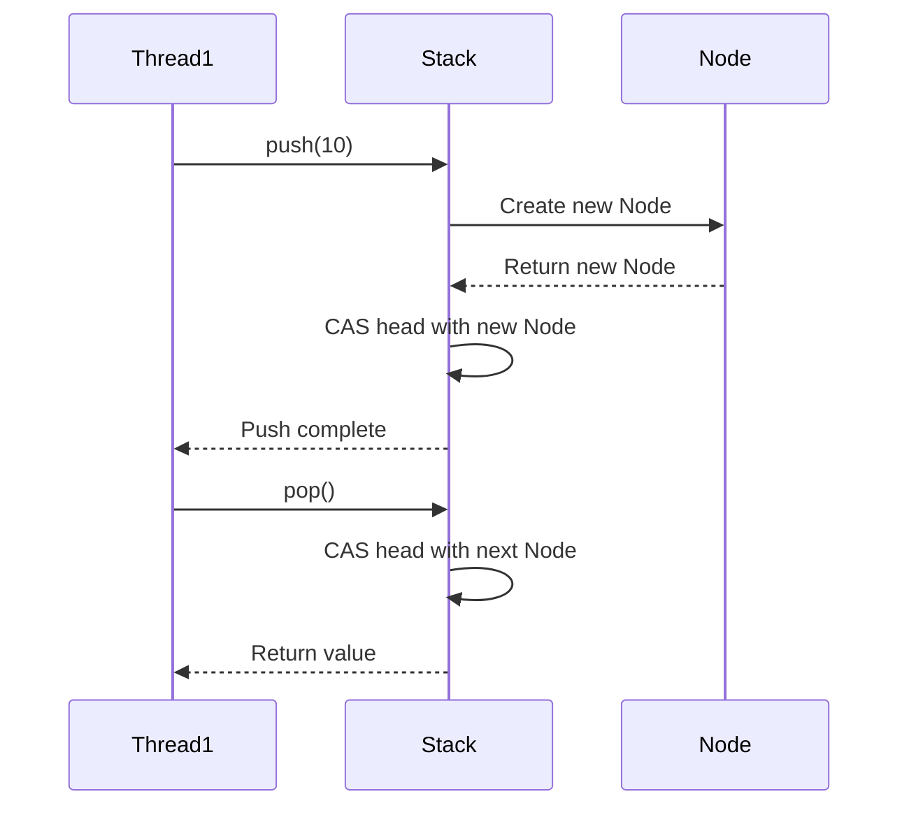

## 8.5 Atomic Operations and Lock-Free Programming

In the realm of concurrent programming, ensuring data integrity and consistency without sacrificing performance is a critical challenge. This is where atomic operations and lock-free programming come into play. In this section, we will delve into these concepts, focusing on their implementation in the D programming language. We will explore atomic primitives, the use of compare-and-swap (CAS) operations, and the design of high-performance, non-blocking data structures suitable for real-time systems.

### Understanding Atomic Operations

**Atomic operations** are fundamental building blocks in concurrent programming that allow you to perform operations on shared data without the need for locks. These operations are indivisible, meaning they complete without interruption, ensuring data consistency even in the presence of concurrent threads.

#### Key Characteristics of Atomic Operations

- **Indivisibility**: An atomic operation is executed as a single, uninterruptible step.
- **Consistency**: Ensures that shared data remains consistent across threads.
- **Efficiency**: Reduces the overhead associated with locking mechanisms.

#### Atomic Primitives in D

The D programming language provides a set of atomic primitives that facilitate lock-free programming. These primitives are available in the `core.atomic` module and include operations such as `atomicLoad`, `atomicStore`, `atomicExchange`, and `atomicCompareExchange`.

```d
import core.atomic;

void exampleAtomicOperations()
{
    int sharedData = 0;

    // Atomic load
    int value = atomicLoad!(int)(sharedData);

    // Atomic store
    atomicStore!(int)(sharedData, 42);

    // Atomic exchange
    int oldValue = atomicExchange!(int)(sharedData, 100);

    // Atomic compare and exchange
    int expected = 100;
    int desired = 200;
    bool success = atomicCompareExchange!(int)(sharedData, expected, desired);
}
```

### Implementing Lock-Free Structures

Lock-free programming aims to design data structures that do not require locks for synchronization, thus avoiding common pitfalls such as deadlocks and priority inversion. One of the key techniques in lock-free programming is the use of **compare-and-swap (CAS) operations**.

#### Compare-and-Swap (CAS) Operations

CAS is an atomic instruction used to achieve synchronization in concurrent programming. It compares the contents of a memory location to a given value and, only if they are the same, modifies the contents of that memory location to a new given value.

```d
bool compareAndSwapExample(ref int sharedData, int expected, int newValue)
{
    return atomicCompareExchange!(int)(sharedData, expected, newValue);
}
```

CAS operations are the cornerstone of many lock-free data structures, enabling them to perform updates without locking.

#### Designing a Lock-Free Stack

Let's implement a simple lock-free stack using CAS operations. This stack will allow concurrent push and pop operations without the need for locks.

```d
import core.atomic;
import std.stdio;

struct Node
{
    int value;
    Node* next;
}

class LockFreeStack
{
    private Node* head = null;

    void push(int value)
    {
        Node* newNode = new Node(value, null);
        Node* oldHead;

        do
        {
            oldHead = head;
            newNode.next = oldHead;
        } while (!atomicCompareExchange!(Node*)(head, oldHead, newNode));
    }

    int pop()
    {
        Node* oldHead;
        Node* newHead;

        do
        {
            oldHead = head;
            if (oldHead is null)
            {
                throw new Exception("Stack is empty");
            }
            newHead = oldHead.next;
        } while (!atomicCompareExchange!(Node*)(head, oldHead, newHead));

        return oldHead.value;
    }
}

void main()
{
    auto stack = new LockFreeStack();
    stack.push(10);
    stack.push(20);
    writeln(stack.pop()); // Outputs: 20
    writeln(stack.pop()); // Outputs: 10
}
```

### Use Cases and Examples

Lock-free programming is particularly beneficial in scenarios where high performance and low latency are critical. Let's explore some common use cases.

#### High-Performance Queues

High-performance queues are essential in systems where tasks need to be processed concurrently without bottlenecks. Lock-free queues, such as the Michael-Scott queue, leverage CAS operations to achieve non-blocking behavior.

```d
// Implementation of a lock-free queue using CAS operations
```

#### Real-Time Systems

In real-time systems, reducing latency is crucial. Lock-free programming helps achieve this by minimizing the time threads spend waiting for locks, thus improving responsiveness.

### Visualizing Lock-Free Programming

To better understand the flow of lock-free operations, let's visualize a simple lock-free stack operation using a sequence diagram.



### Try It Yourself

Experiment with the lock-free stack implementation by modifying the code to handle different data types or adding additional methods such as `peek`. Observe how the lock-free nature of the stack affects performance under concurrent access.

### References and Further Reading

- [D Language Documentation](https://dlang.org/)
- [Concurrency in D](https://dlang.org/library/std/concurrency.html)
- [Lock-Free Programming](https://en.wikipedia.org/wiki/Lock-free_and_wait-free_algorithms)

### Knowledge Check

1. Explain the concept of atomic operations and their importance in concurrent programming.
2. Describe how CAS operations work and their role in lock-free programming.
3. Implement a lock-free queue using CAS operations.
4. Discuss the benefits of lock-free programming in real-time systems.

### Embrace the Journey

Remember, mastering atomic operations and lock-free programming is a journey. As you continue to explore these concepts, you'll gain the skills needed to build high-performance, scalable systems. Keep experimenting, stay curious, and enjoy the journey!

## Quiz Time!



### What is an atomic operation?

- [x] An indivisible operation that completes without interruption.
- [ ] An operation that requires locks to ensure data consistency.
- [ ] A high-level operation that abstracts away concurrency details.
- [ ] An operation that can be interrupted by other threads.

> **Explanation:** Atomic operations are indivisible and complete without interruption, ensuring data consistency in concurrent environments.

### What does CAS stand for in concurrent programming?

- [x] Compare-and-Swap
- [ ] Compare-and-Store
- [ ] Compare-and-Set
- [ ] Compare-and-Synchronize

> **Explanation:** CAS stands for Compare-and-Swap, a fundamental atomic operation used in lock-free programming.

### Which D module provides atomic primitives?

- [x] core.atomic
- [ ] std.concurrency
- [ ] std.parallelism
- [ ] core.sync

> **Explanation:** The `core.atomic` module in D provides atomic primitives for lock-free programming.

### What is the primary benefit of lock-free programming?

- [x] Reduces latency and avoids deadlocks.
- [ ] Simplifies code by using locks.
- [ ] Ensures data consistency through locking.
- [ ] Increases memory usage.

> **Explanation:** Lock-free programming reduces latency and avoids deadlocks by eliminating the need for locks.

### In a lock-free stack, what operation is typically used to update the head pointer?

- [x] Compare-and-Swap (CAS)
- [ ] Atomic Load
- [ ] Atomic Store
- [ ] Atomic Exchange

> **Explanation:** Compare-and-Swap (CAS) is used to update the head pointer in a lock-free stack.

### What is a common use case for lock-free programming?

- [x] High-performance queues
- [ ] Single-threaded applications
- [ ] File I/O operations
- [ ] GUI applications

> **Explanation:** Lock-free programming is commonly used in high-performance queues to avoid bottlenecks.

### How does lock-free programming benefit real-time systems?

- [x] Reduces latency and improves responsiveness.
- [ ] Increases complexity and code size.
- [ ] Simplifies debugging and testing.
- [ ] Ensures data consistency through locks.

> **Explanation:** Lock-free programming reduces latency and improves responsiveness, which is crucial for real-time systems.

### What is the role of atomic primitives in lock-free programming?

- [x] Provide basic operations for synchronization without locks.
- [ ] Simplify code by using high-level abstractions.
- [ ] Ensure data consistency through locking mechanisms.
- [ ] Increase memory usage for better performance.

> **Explanation:** Atomic primitives provide basic operations for synchronization without the need for locks.

### Which of the following is NOT an atomic primitive in D?

- [x] atomicIncrement
- [ ] atomicLoad
- [ ] atomicStore
- [ ] atomicCompareExchange

> **Explanation:** `atomicIncrement` is not a standard atomic primitive in D; the others are provided by `core.atomic`.

### True or False: Lock-free programming eliminates the need for synchronization in concurrent systems.

- [ ] True
- [x] False

> **Explanation:** Lock-free programming does not eliminate the need for synchronization; it provides a way to achieve synchronization without locks.


