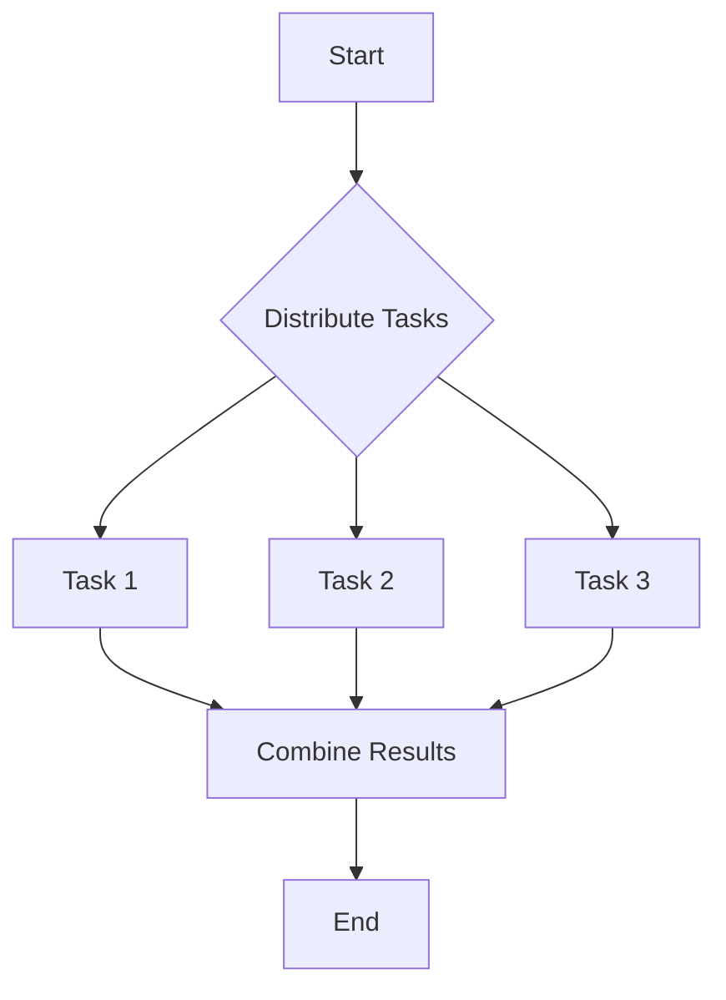

## 8.6 Parallel Algorithms with `std.parallelism`

In the realm of systems programming, achieving high performance is often synonymous with leveraging parallelism. The D programming language, with its robust `std.parallelism` module, provides powerful tools to harness the capabilities of modern multi-core processors. This section delves into the concepts of parallel algorithms, focusing on data parallelism, and explores how to implement these algorithms using D's `std.parallelism`.

### Understanding Data Parallelism

**Data Parallelism** involves distributing data across multiple processors to perform computations simultaneously. This approach is particularly effective for tasks that can be divided into independent subtasks, such as numerical computations and batch processing. By executing these subtasks concurrently, we can significantly reduce the overall execution time.

#### Key Concepts of Data Parallelism

- **Task Decomposition**: Breaking down a large task into smaller, independent tasks that can be executed in parallel.
- **Load Balancing**: Ensuring that each processor receives an approximately equal amount of work to maximize efficiency.
- **Synchronization**: Coordinating the execution of parallel tasks to ensure correct results, often involving mechanisms like locks or atomic operations.

### Parallel Functions in `std.parallelism`

The `std.parallelism` module in D provides several constructs to facilitate parallel programming. Two of the most commonly used are `parallel` and `taskPool`.

#### `parallel` Function

The `parallel` function is a high-level construct that simplifies the execution of parallel loops. It automatically manages the distribution of work across available cores.

```d
import std.parallelism;
import std.stdio;

void main() {
    auto data = [1, 2, 3, 4, 5, 6, 7, 8, 9, 10];
    auto result = parallel!(a => a * a)(data);
    writeln(result); // Outputs: [1, 4, 9, 16, 25, 36, 49, 64, 81, 100]
}
```

**Explanation**: In this example, the `parallel` function applies the lambda expression `a => a * a` to each element of the `data` array concurrently. The result is a new array containing the squares of the original elements.

#### `taskPool` Function

The `taskPool` function provides a more flexible approach to parallelism, allowing for the creation and management of a pool of tasks.

```d
import std.parallelism;
import std.stdio;

void main() {
    auto pool = taskPool();
    auto tasks = iota(1, 11).map!(i => pool.task!(() => i * i)).array;
    auto results = tasks.map!(t => t.get).array;
    writeln(results); // Outputs: [1, 4, 9, 16, 25, 36, 49, 64, 81, 100]
}
```

**Explanation**: Here, we create a pool of tasks using `taskPool`. Each task computes the square of a number. The `get` method is used to retrieve the result of each task once it completes.

### Use Cases and Examples

#### Numeric Computations

Parallel algorithms are particularly beneficial in numeric computations, where large datasets or complex calculations can be divided into smaller, parallelizable tasks.

**Example: Matrix Multiplication**

Matrix multiplication is a classic example of a problem that can benefit from parallelism. By dividing the computation of matrix elements across multiple cores, we can achieve significant performance improvements.

```d
import std.parallelism;
import std.stdio;

void main() {
    size_t n = 1000;
    double[][] A = new double[][](n, n);
    double[][] B = new double[][](n, n);
    double[][] C = new double[][](n, n);

    // Initialize matrices A and B
    foreach (i; 0 .. n) {
        foreach (j; 0 .. n) {
            A[i][j] = i + j;
            B[i][j] = i - j;
        }
    }

    // Parallel matrix multiplication
    parallel(0, n, 1, (i) {
        foreach (j; 0 .. n) {
            double sum = 0;
            foreach (k; 0 .. n) {
                sum += A[i][k] * B[k][j];
            }
            C[i][j] = sum;
        }
    });

    writeln("Matrix multiplication completed.");
}
```

**Explanation**: In this example, we perform matrix multiplication using the `parallel` function to distribute the computation of each row of the resulting matrix `C` across multiple threads.

#### Batch Processing

Batch processing involves handling large datasets by processing data in chunks. This approach is well-suited for parallelism, as each chunk can be processed independently.

**Example: Image Processing**

Consider a scenario where we need to apply a filter to a large set of images. By processing each image in parallel, we can significantly reduce the time required.

```d
import std.parallelism;
import std.stdio;
import std.file;

void processImage(string filename) {
    // Simulate image processing
    writeln("Processing ", filename);
}

void main() {
    auto files = dirEntries(".", "*.jpg").map!(e => e.name).array;
    parallel(files, &processImage);
    writeln("Image processing completed.");
}
```

**Explanation**: This example demonstrates parallel image processing using the `parallel` function. Each image file is processed concurrently, leveraging the power of multiple cores.

### Visualizing Parallel Execution

To better understand how parallel execution works, let's visualize the process using a flowchart.



**Description**: This flowchart illustrates the parallel execution process. Tasks are distributed among available cores, executed concurrently, and the results are combined at the end.

### Design Considerations

When implementing parallel algorithms, consider the following:

- **Granularity**: Choose an appropriate level of granularity for tasks. Too fine-grained tasks may lead to excessive overhead, while too coarse-grained tasks may underutilize available cores.
- **Data Dependencies**: Ensure that tasks are independent or properly synchronized to avoid race conditions.
- **Scalability**: Design algorithms that scale well with the number of available cores.

### Differences and Similarities

Parallel algorithms can sometimes be confused with concurrent algorithms. While both involve multiple tasks, parallel algorithms focus on dividing a single task into subtasks that can be executed simultaneously, whereas concurrent algorithms manage multiple tasks that may not necessarily run at the same time.

### Try It Yourself

Experiment with the provided code examples by:

- Modifying the size of the matrices in the matrix multiplication example to observe performance changes.
- Adding more complex image processing operations in the image processing example.
- Creating your own parallel algorithms using `std.parallelism`.

### References and Links

- [D Programming Language Documentation](https://dlang.org/library/std/parallelism.html)
- [Concurrency and Parallelism in D](https://wiki.dlang.org/Concurrency_and_parallelism)

### Knowledge Check

- What is data parallelism, and how does it differ from task parallelism?
- How does the `parallel` function in D simplify parallel programming?
- What are some common use cases for parallel algorithms?

### Embrace the Journey

Remember, mastering parallel algorithms is a journey. As you experiment and refine your skills, you'll unlock new levels of performance and efficiency in your systems programming projects. Keep exploring, stay curious, and enjoy the process!

## Quiz Time!



### What is the primary goal of data parallelism?

- [x] Distributing data across multiple processors for simultaneous computation
- [ ] Managing multiple tasks that may not run at the same time
- [ ] Ensuring tasks are executed sequentially
- [ ] Reducing the number of tasks to improve performance

> **Explanation:** Data parallelism focuses on distributing data across processors to perform computations simultaneously, enhancing performance.

### Which function in `std.parallelism` is used for high-level parallel loops?

- [x] `parallel`
- [ ] `taskPool`
- [ ] `async`
- [ ] `future`

> **Explanation:** The `parallel` function is used for high-level parallel loops, simplifying the distribution of work across cores.

### What is a key consideration when designing parallel algorithms?

- [x] Granularity of tasks
- [ ] Number of variables
- [ ] Length of code
- [ ] Use of global variables

> **Explanation:** Granularity is crucial in parallel algorithms to balance overhead and core utilization.

### In the matrix multiplication example, what does the `parallel` function do?

- [x] Distributes the computation of each row across multiple threads
- [ ] Executes the entire matrix multiplication in a single thread
- [ ] Combines the matrices into a single result
- [ ] Initializes the matrices with random values

> **Explanation:** The `parallel` function distributes the computation of each row across multiple threads, enhancing performance.

### What is a common use case for parallel algorithms?

- [x] Numeric computations
- [ ] Single-threaded applications
- [ ] Simple arithmetic operations
- [ ] Sequential data processing

> **Explanation:** Numeric computations often benefit from parallel algorithms due to their ability to handle large datasets efficiently.

### How does the `taskPool` function differ from `parallel`?

- [x] It provides more flexibility in creating and managing tasks
- [ ] It is used for sequential execution
- [ ] It automatically manages task distribution
- [ ] It is only used for I/O operations

> **Explanation:** `taskPool` offers more flexibility in task management compared to `parallel`, which automatically handles task distribution.

### What is a potential pitfall of too fine-grained tasks in parallel algorithms?

- [x] Excessive overhead
- [ ] Underutilization of cores
- [ ] Increased memory usage
- [ ] Slower execution

> **Explanation:** Too fine-grained tasks can lead to excessive overhead, reducing the efficiency of parallel execution.

### What is the role of synchronization in parallel algorithms?

- [x] Coordinating the execution of parallel tasks to ensure correct results
- [ ] Increasing the speed of execution
- [ ] Reducing the number of tasks
- [ ] Simplifying the code structure

> **Explanation:** Synchronization ensures that parallel tasks are coordinated correctly, preventing race conditions and ensuring accurate results.

### What is a benefit of using `std.parallelism` in D?

- [x] Simplifies the implementation of parallel algorithms
- [ ] Reduces the need for data structures
- [ ] Eliminates the need for error handling
- [ ] Increases the complexity of code

> **Explanation:** `std.parallelism` simplifies the implementation of parallel algorithms, making it easier to leverage multi-core processors.

### True or False: Parallel algorithms focus on managing multiple tasks that may not run at the same time.

- [ ] True
- [x] False

> **Explanation:** Parallel algorithms focus on dividing a single task into subtasks that can be executed simultaneously, unlike concurrent algorithms.


