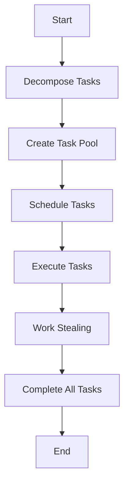

## 8.7 Task-Based Concurrency

In the realm of advanced systems programming, task-based concurrency is a powerful paradigm that allows developers to efficiently manage and execute multiple tasks in parallel. This approach is particularly beneficial in the D programming language, which offers robust features for handling concurrency. In this section, we will delve into the concepts of task decomposition, task scheduling, and explore practical use cases such as responsive applications and background processing.

### Understanding Task-Based Concurrency

Task-based concurrency involves breaking down a program into smaller, independent tasks that can be executed concurrently. This approach contrasts with thread-based concurrency, where the focus is on managing threads rather than tasks. By focusing on tasks, developers can achieve better scalability and performance, as tasks can be distributed across multiple processors more efficiently.

#### Key Concepts

- **Task Decomposition**: The process of dividing a program into discrete tasks that can be executed independently. This is crucial for maximizing parallelism and ensuring that tasks do not depend on each other, which could lead to bottlenecks.

- **Task Scheduling**: The mechanism by which tasks are assigned to available processors for execution. Effective scheduling is essential for balancing the load and ensuring that all processors are utilized efficiently.

- **Work Stealing**: A dynamic load balancing technique where idle processors can "steal" tasks from busy processors. This helps in maintaining an even distribution of tasks and prevents any single processor from becoming a bottleneck.

### Task Decomposition

Task decomposition is the first step in implementing task-based concurrency. It involves identifying independent units of work that can be executed concurrently. This requires a deep understanding of the problem domain and the ability to identify tasks that do not have dependencies on each other.

#### Example: Matrix Multiplication

Consider the problem of multiplying two matrices. This problem can be decomposed into smaller tasks, where each task is responsible for computing a single element of the resulting matrix. This decomposition allows each task to be executed independently, making it an ideal candidate for parallel execution.

```d
import std.parallelism;

void matrixMultiply(int[][] A, int[][] B, int[][] C) {
    int rows = A.length;
    int cols = B[0].length;
    int n = B.length;

    // Decompose the task into smaller tasks for each element of the resulting matrix
    foreach (i; 0 .. rows) {
        foreach (j; 0 .. cols) {
            task!({
                int sum = 0;
                foreach (k; 0 .. n) {
                    sum += A[i][k] * B[k][j];
                }
                C[i][j] = sum;
            })();
        }
    }
}
```

In this example, each element of the resulting matrix `C` is computed independently, allowing for parallel execution of tasks.

### Task Scheduling

Once tasks are decomposed, they need to be scheduled for execution. Task scheduling is crucial for ensuring that all available processors are utilized efficiently. In D, the `std.parallelism` module provides tools for task scheduling and execution.

#### Work Stealing

Work stealing is a popular scheduling strategy used in task-based concurrency. It allows idle processors to "steal" tasks from busy processors, ensuring an even distribution of work. This dynamic load balancing technique is particularly useful in scenarios where the workload is unpredictable or varies over time.

```d
import std.parallelism;

void performTasks() {
    auto tasks = new TaskPool();

    foreach (i; 0 .. 100) {
        tasks.put(task!({
            // Simulate some work
            writeln("Task ", i, " is running on thread ", thisTid);
        }));
    }

    tasks.finish(); // Wait for all tasks to complete
}
```

In this example, a `TaskPool` is used to manage and execute tasks. The work stealing mechanism ensures that tasks are distributed evenly across available threads.

### Use Cases and Examples

Task-based concurrency is particularly useful in scenarios where responsiveness and background processing are critical. Let's explore some practical use cases.

#### Responsive Applications

In modern applications, maintaining a responsive user interface is crucial. Task-based concurrency allows developers to offload time-consuming operations to background tasks, ensuring that the main thread remains responsive.

**Example: Image Processing**

Consider an application that processes images. Image processing can be computationally intensive, and performing it on the main thread can lead to a sluggish user interface. By offloading image processing to background tasks, the application can remain responsive.

```d
import std.parallelism;
import std.stdio;

void processImage(string imagePath) {
    // Simulate image processing
    writeln("Processing image: ", imagePath);
}

void main() {
    auto tasks = new TaskPool();

    foreach (imagePath; ["image1.jpg", "image2.jpg", "image3.jpg"]) {
        tasks.put(task!({
            processImage(imagePath);
        }));
    }

    tasks.finish(); // Wait for all tasks to complete
    writeln("All images processed.");
}
```

In this example, each image is processed in a separate task, allowing the main thread to remain responsive.

#### Background Processing

Background processing is another common use case for task-based concurrency. It involves executing tasks that do not require immediate attention, allowing the main application to focus on more critical tasks.

**Example: Data Backup**

Consider an application that needs to back up data periodically. By performing the backup operation in the background, the application can continue to perform other tasks without interruption.

```d
import std.parallelism;
import std.stdio;

void backupData(string data) {
    // Simulate data backup
    writeln("Backing up data: ", data);
}

void main() {
    auto tasks = new TaskPool();

    foreach (data; ["data1", "data2", "data3"]) {
        tasks.put(task!({
            backupData(data);
        }));
    }

    tasks.finish(); // Wait for all tasks to complete
    writeln("All data backed up.");
}
```

In this example, each data backup operation is performed in a separate task, allowing the application to continue executing other tasks concurrently.

### Visualizing Task-Based Concurrency

To better understand task-based concurrency, let's visualize the process using a flowchart.



**Figure 1: Task-Based Concurrency Flowchart**

This flowchart illustrates the process of task-based concurrency, from task decomposition to execution and completion.

### Design Considerations

When implementing task-based concurrency, there are several design considerations to keep in mind:

- **Task Granularity**: Ensure that tasks are neither too small nor too large. Small tasks can lead to excessive overhead, while large tasks can reduce parallelism.

- **Data Dependencies**: Identify and minimize dependencies between tasks to maximize parallelism.

- **Resource Management**: Be mindful of resource usage, such as memory and I/O, to avoid contention and bottlenecks.

- **Error Handling**: Implement robust error handling to ensure that failures in one task do not affect others.

### Differences and Similarities with Other Patterns

Task-based concurrency shares similarities with other concurrency patterns, such as thread-based concurrency. However, it differs in its focus on tasks rather than threads, allowing for more efficient load balancing and scalability.

### Try It Yourself

To gain a deeper understanding of task-based concurrency, try modifying the code examples provided. Experiment with different task sizes, scheduling strategies, and error handling mechanisms. Observe how these changes affect performance and responsiveness.

### References and Links

- [D Language Documentation](https://dlang.org/)
- [std.parallelism Module](https://dlang.org/phobos/std_parallelism.html)
- [Concurrency in D](https://wiki.dlang.org/Concurrency)

### Knowledge Check

To reinforce your understanding of task-based concurrency, consider the following questions:

- What are the benefits of task-based concurrency over thread-based concurrency?
- How does work stealing improve load balancing in task-based concurrency?
- What are some common use cases for task-based concurrency?

### Embrace the Journey

Remember, mastering task-based concurrency is a journey. As you continue to explore and experiment with these concepts, you'll gain a deeper understanding of how to build high-performance, responsive applications. Keep experimenting, stay curious, and enjoy the journey!

## Quiz Time!



### What is task-based concurrency?

- [x] A concurrency model that focuses on dividing work into independent tasks.
- [ ] A concurrency model that focuses on managing threads.
- [ ] A concurrency model that focuses on managing processes.
- [ ] A concurrency model that focuses on managing memory.

> **Explanation:** Task-based concurrency focuses on dividing work into independent tasks that can be executed concurrently.

### What is task decomposition?

- [x] The process of breaking down a program into smaller, independent tasks.
- [ ] The process of combining multiple tasks into a single task.
- [ ] The process of scheduling tasks for execution.
- [ ] The process of executing tasks concurrently.

> **Explanation:** Task decomposition involves breaking down a program into smaller, independent tasks that can be executed concurrently.

### What is work stealing?

- [x] A dynamic load balancing technique where idle processors steal tasks from busy processors.
- [ ] A static load balancing technique where tasks are evenly distributed at the start.
- [ ] A technique for managing memory in concurrent programs.
- [ ] A technique for managing threads in concurrent programs.

> **Explanation:** Work stealing is a dynamic load balancing technique where idle processors can steal tasks from busy processors to maintain an even distribution of work.

### What is a common use case for task-based concurrency?

- [x] Keeping user interfaces responsive by offloading tasks to the background.
- [ ] Managing memory allocation in concurrent programs.
- [ ] Managing thread creation and destruction.
- [ ] Managing process creation and destruction.

> **Explanation:** Task-based concurrency is commonly used to keep user interfaces responsive by offloading tasks to the background.

### How does task-based concurrency differ from thread-based concurrency?

- [x] Task-based concurrency focuses on tasks, while thread-based concurrency focuses on threads.
- [ ] Task-based concurrency focuses on threads, while thread-based concurrency focuses on tasks.
- [ ] Task-based concurrency focuses on processes, while thread-based concurrency focuses on threads.
- [ ] Task-based concurrency focuses on memory, while thread-based concurrency focuses on threads.

> **Explanation:** Task-based concurrency focuses on tasks, allowing for more efficient load balancing and scalability compared to thread-based concurrency, which focuses on managing threads.

### What is a TaskPool in D?

- [x] A collection of tasks that can be scheduled and executed concurrently.
- [ ] A collection of threads that can be scheduled and executed concurrently.
- [ ] A collection of processes that can be scheduled and executed concurrently.
- [ ] A collection of memory blocks that can be scheduled and executed concurrently.

> **Explanation:** A TaskPool in D is a collection of tasks that can be scheduled and executed concurrently.

### What is the benefit of using work stealing in task-based concurrency?

- [x] It helps maintain an even distribution of tasks across processors.
- [ ] It helps reduce memory usage in concurrent programs.
- [ ] It helps manage thread creation and destruction.
- [ ] It helps manage process creation and destruction.

> **Explanation:** Work stealing helps maintain an even distribution of tasks across processors, improving load balancing and performance.

### What is a key consideration when implementing task-based concurrency?

- [x] Ensuring tasks are neither too small nor too large.
- [ ] Ensuring tasks are executed in a specific order.
- [ ] Ensuring tasks are executed on a single processor.
- [ ] Ensuring tasks are executed without any dependencies.

> **Explanation:** Ensuring tasks are neither too small nor too large is important to avoid excessive overhead or reduced parallelism.

### What is the role of task scheduling in task-based concurrency?

- [x] Assigning tasks to available processors for execution.
- [ ] Managing memory allocation for concurrent programs.
- [ ] Managing thread creation and destruction.
- [ ] Managing process creation and destruction.

> **Explanation:** Task scheduling involves assigning tasks to available processors for execution, ensuring efficient utilization of resources.

### True or False: Task-based concurrency is only useful for background processing.

- [ ] True
- [x] False

> **Explanation:** Task-based concurrency is useful for both background processing and maintaining responsive applications, among other use cases.


