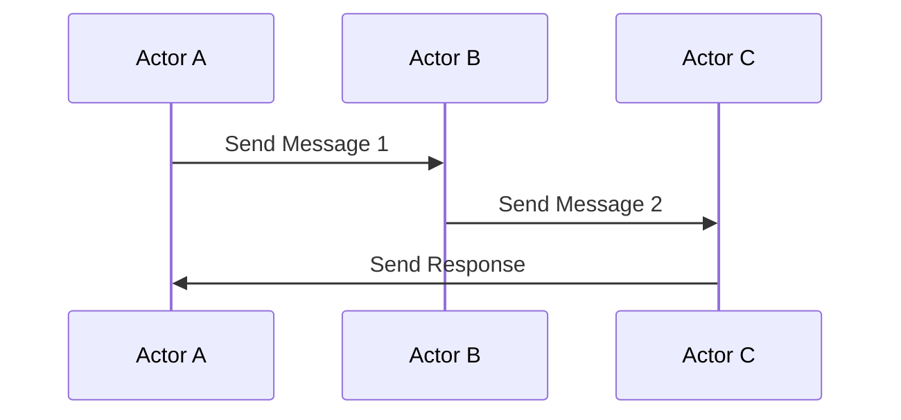

## 8.8 Actor Model in D

The Actor Model is a powerful design pattern for managing concurrency and parallelism in software systems. It provides a high-level abstraction for dealing with state and communication between concurrent entities, known as actors. In this section, we will delve into the Actor Model as implemented in the D programming language, exploring its core concepts, practical applications, and how it leverages D's unique features to build robust, scalable, and fault-tolerant systems.

### Introduction to the Actor Model

The Actor Model was introduced by Carl Hewitt in 1973 as a conceptual model for dealing with concurrent computation. It treats "actors" as the fundamental units of computation. Each actor is an independent entity that encapsulates its own state and behavior, and interacts with other actors solely through message passing. This model is particularly well-suited for distributed systems, where components need to operate independently and communicate asynchronously.

#### Key Concepts

- **Encapsulation of State**: Each actor maintains its own state, which is not directly accessible by other actors. This encapsulation ensures that state changes are controlled and predictable.
- **Message Passing**: Actors communicate by sending and receiving messages. This decouples the sender and receiver, allowing for asynchronous communication.
- **Concurrency and Isolation**: Actors operate concurrently and are isolated from each other, which helps in avoiding shared state issues and race conditions.

### Implementing the Actor Model in D

D provides robust support for concurrency through its standard library, `std.concurrency`, which facilitates the implementation of the Actor Model. Let's explore how we can leverage D's features to implement actors.

#### Creating Actors

In D, actors can be implemented using threads or fibers, with `std.concurrency` providing the necessary primitives for message passing. Here's a simple example of creating an actor in D:

```d
import std.stdio;
import std.concurrency;

// Define a simple actor function
void actorFunction() {
    while (true) {
        // Receive a message
        auto msg = receiveOnly!(string);
        writeln("Received message: ", msg);
    }
}

void main() {
    // Spawn an actor
    auto actorTid = spawn(&actorFunction);

    // Send a message to the actor
    send(actorTid, "Hello, Actor!");

    // Allow some time for the actor to process the message
    Thread.sleep(1.seconds);
}
```

In this example, we define an `actorFunction` that continuously waits to receive messages. We use `spawn` to create a new actor, and `send` to pass messages to it. The `receiveOnly` function ensures that the actor only processes messages of a specific type, in this case, `string`.

#### Asynchronous Communication

The Actor Model's strength lies in its asynchronous communication. By decoupling the sender and receiver, actors can operate independently, which is crucial for building scalable systems. D's `std.concurrency` provides a seamless way to achieve this.

### Use Cases and Examples

The Actor Model is particularly useful in scenarios where scalability and fault tolerance are critical. Let's explore some common use cases.

#### Distributed Systems

In distributed systems, components often need to run on different machines and communicate over a network. The Actor Model's message-passing mechanism is ideal for such scenarios, as it naturally supports asynchronous communication and decoupling.

```d
import std.stdio;
import std.concurrency;

// Define a distributed actor
void distributedActor() {
    while (true) {
        auto msg = receiveOnly!(string);
        writeln("Distributed Actor received: ", msg);
    }
}

void main() {
    auto actorTid = spawn(&distributedActor);

    // Simulate sending messages from different nodes
    send(actorTid, "Message from Node 1");
    send(actorTid, "Message from Node 2");

    Thread.sleep(2.seconds);
}
```

In this example, we simulate a distributed system by sending messages from different "nodes" to a single actor. This demonstrates how actors can be used to manage communication in a distributed environment.

#### Fault Tolerance

One of the key benefits of the Actor Model is its ability to isolate failures. Since actors are independent, a failure in one actor does not directly affect others. This makes it easier to implement fault-tolerant systems.

```d
import std.stdio;
import std.concurrency;

// Define a fault-tolerant actor
void faultTolerantActor() {
    while (true) {
        try {
            auto msg = receiveOnly!(string);
            if (msg == "fail") {
                throw new Exception("Simulated failure");
            }
            writeln("Processed message: ", msg);
        } catch (Exception e) {
            writeln("Error: ", e.msg);
        }
    }
}

void main() {
    auto actorTid = spawn(&faultTolerantActor);

    send(actorTid, "Hello");
    send(actorTid, "fail"); // This will trigger an exception
    send(actorTid, "World");

    Thread.sleep(3.seconds);
}
```

In this example, the `faultTolerantActor` is designed to handle exceptions gracefully. When a "fail" message is received, it throws an exception, which is caught and logged, allowing the actor to continue processing subsequent messages.

### Design Considerations

When implementing the Actor Model in D, there are several design considerations to keep in mind:

- **Message Types**: Define clear and consistent message types to ensure that actors can process messages correctly.
- **Error Handling**: Implement robust error handling within actors to manage failures gracefully.
- **Resource Management**: Consider the lifecycle of actors and manage resources efficiently to avoid memory leaks and resource exhaustion.

### Differences and Similarities with Other Models

The Actor Model is often compared to other concurrency models, such as threads and locks, or the CSP (Communicating Sequential Processes) model. Here are some key differences and similarities:

- **Isolation vs. Shared State**: Unlike threads and locks, the Actor Model emphasizes isolation and avoids shared state, reducing the risk of race conditions.
- **Message Passing vs. Direct Communication**: The Actor Model uses message passing, similar to CSP, but focuses on actors as the primary units of computation.
- **Scalability**: The Actor Model is inherently scalable, making it suitable for distributed systems, whereas traditional threading models may struggle with scalability.

### Visualizing the Actor Model

To better understand the Actor Model, let's visualize the interaction between actors using a sequence diagram.



This diagram illustrates a simple interaction between three actors, where Actor A sends a message to Actor B, which in turn communicates with Actor C, and finally, Actor C responds back to Actor A.

### Try It Yourself

Experiment with the Actor Model in D by modifying the examples provided. Try creating additional actors, sending different types of messages, or implementing more complex interactions. Consider how you might handle scenarios such as message prioritization or actor supervision.

### Further Reading and Resources

For more information on the Actor Model and its implementation in D, consider exploring the following resources:

- [D Language Documentation](https://dlang.org/)
- [std.concurrency Module](https://dlang.org/phobos/std_concurrency.html)
- [Actor Model on Wikipedia](https://en.wikipedia.org/wiki/Actor_model)

### Knowledge Check

To reinforce your understanding of the Actor Model in D, consider the following questions and exercises:

- What are the key benefits of using the Actor Model for concurrency?
- How does message passing in the Actor Model differ from direct communication in traditional threading models?
- Implement a simple actor system that simulates a chat application with multiple users.

### Embrace the Journey

Remember, mastering the Actor Model in D is just one step in your journey to becoming an expert in concurrency and parallelism. Keep experimenting, stay curious, and enjoy the process of building robust and scalable systems.

## Quiz Time!



### What is the primary unit of computation in the Actor Model?

- [x] Actor
- [ ] Thread
- [ ] Process
- [ ] Fiber

> **Explanation:** In the Actor Model, the primary unit of computation is the actor, which encapsulates state and behavior.

### How do actors communicate in the Actor Model?

- [x] Message Passing
- [ ] Shared Memory
- [ ] Direct Method Calls
- [ ] Global Variables

> **Explanation:** Actors communicate through message passing, which decouples the sender and receiver.

### What is a key benefit of the Actor Model in distributed systems?

- [x] Scalability
- [ ] Synchronous Communication
- [ ] Shared State
- [ ] Direct Access to Other Actors' State

> **Explanation:** The Actor Model's asynchronous communication and decoupling make it highly scalable, ideal for distributed systems.

### How does the Actor Model handle failures?

- [x] By isolating failures within individual actors
- [ ] By sharing state across actors
- [ ] By using global error handlers
- [ ] By stopping all actors

> **Explanation:** The Actor Model isolates failures within individual actors, allowing the system to continue operating.

### Which D module provides support for implementing the Actor Model?

- [x] std.concurrency
- [ ] std.parallelism
- [ ] std.async
- [ ] std.threads

> **Explanation:** The `std.concurrency` module in D provides primitives for implementing the Actor Model.

### What is a common design consideration when implementing actors?

- [x] Defining clear message types
- [ ] Sharing state between actors
- [ ] Using global variables
- [ ] Avoiding error handling

> **Explanation:** Defining clear message types ensures that actors can process messages correctly.

### What is the main difference between the Actor Model and traditional threading models?

- [x] Isolation and message passing
- [ ] Shared state and direct communication
- [ ] Use of global variables
- [ ] Synchronous execution

> **Explanation:** The Actor Model emphasizes isolation and message passing, unlike traditional threading models that often use shared state.

### What is a potential use case for the Actor Model?

- [x] Fault-tolerant systems
- [ ] Single-threaded applications
- [ ] Direct memory access
- [ ] Global state management

> **Explanation:** The Actor Model is well-suited for fault-tolerant systems due to its isolation of failures.

### How can actors be created in D?

- [x] Using the spawn function from std.concurrency
- [ ] By declaring global variables
- [ ] By using direct method calls
- [ ] By sharing memory

> **Explanation:** Actors can be created using the `spawn` function from the `std.concurrency` module.

### True or False: In the Actor Model, actors can directly access each other's state.

- [ ] True
- [x] False

> **Explanation:** Actors cannot directly access each other's state; they communicate through message passing.


