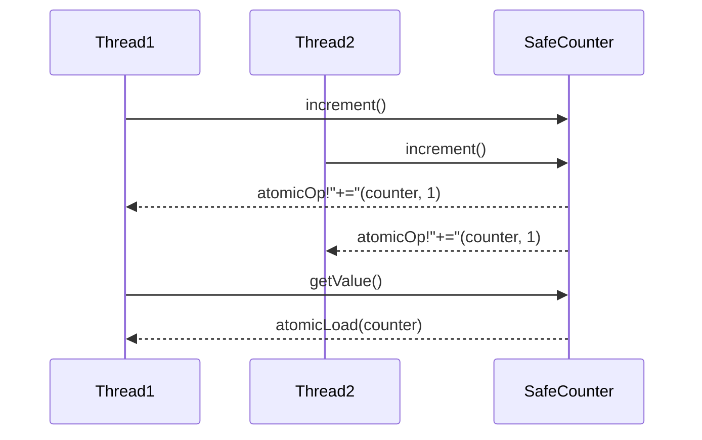

## 8.9 Designing Concurrency-Safe APIs

In the realm of modern software development, concurrency is a crucial aspect that allows applications to perform multiple operations simultaneously, improving performance and responsiveness. However, designing concurrency-safe APIs is a complex task that requires careful consideration to avoid pitfalls such as race conditions, deadlocks, and data corruption. In this section, we will explore the principles and practices for designing concurrency-safe APIs in the D programming language, focusing on minimizing shared state, ensuring thread safety, and providing robust tools for library development.

### Avoiding Shared State

One of the primary challenges in designing concurrency-safe APIs is managing shared state. Shared state can lead to race conditions, where multiple threads access and modify the same data concurrently, resulting in unpredictable behavior. To mitigate these issues, it's essential to design APIs that minimize shared data.

#### Stateless Functions

Stateless functions are a powerful tool in the arsenal of concurrency-safe API design. A stateless function does not rely on any external state or mutable data, making it inherently thread-safe. By ensuring that functions do not modify shared state, we can avoid many concurrency-related issues.

**Benefits of Stateless Functions:**

- **Reentrancy**: Stateless functions can be re-entered by multiple threads simultaneously without causing data corruption.
- **Predictability**: The behavior of stateless functions is consistent, as they do not depend on external state.
- **Ease of Testing**: Stateless functions are easier to test, as they do not require complex setup or teardown of shared state.

#### Reentrancy and Thread Safety

Reentrancy is a property of functions that allows them to be interrupted and safely called again ("re-entered") before the previous executions are complete. For a function to be reentrant, it must not rely on any shared state that could be modified by other threads.

**Ensuring Reentrancy and Thread Safety:**

1. **Avoid Global Variables**: Global variables are shared across threads and can lead to race conditions. Instead, use local variables or thread-local storage.
2. **Use Immutable Data**: Immutable data cannot be modified after creation, making it inherently thread-safe. Use `const` or `immutable` in D to define immutable data.
3. **Leverage Functional Programming**: Functional programming paradigms, such as pure functions and higher-order functions, promote statelessness and immutability.

### Use Cases and Examples

Designing concurrency-safe APIs is particularly important in library development, where the goal is to provide robust tools that can be safely used by other developers. Let's explore some use cases and examples of concurrency-safe API design in D.

#### Library Development

When developing libraries, it's crucial to provide APIs that are safe to use in concurrent environments. This involves designing functions and data structures that minimize shared state and ensure thread safety.

**Example: A Concurrency-Safe Counter**

Let's consider a simple example of a concurrency-safe counter implemented in D. This counter will use atomic operations to ensure thread safety without relying on locks, which can introduce contention and reduce performance.

```d
import core.atomic;

class SafeCounter {
    private shared int counter = 0;

    void increment() {
        atomicOp!"+="(counter, 1);
    }

    int getValue() {
        return atomicLoad(counter);
    }
}

void main() {
    auto counter = new SafeCounter();

    // Simulate concurrent increments
    import std.parallelism;
    parallel(10, i => counter.increment());

    writeln("Counter value: ", counter.getValue());
}
```

**Key Points:**

- **Atomic Operations**: We use `atomicOp` and `atomicLoad` to perform thread-safe operations on the shared counter variable.
- **Shared State**: The `counter` variable is marked as `shared`, indicating that it is accessed by multiple threads.

### Visualizing Concurrency-Safe API Design

To better understand the principles of concurrency-safe API design, let's visualize the interaction between threads and shared state using a sequence diagram.



**Diagram Description:**

- **Thread1 and Thread2**: Two threads concurrently calling the `increment` method on the `SafeCounter` instance.
- **SafeCounter**: The shared counter object that uses atomic operations to ensure thread safety.

### Designing Concurrency-Safe APIs: Best Practices

When designing concurrency-safe APIs, consider the following best practices to ensure robustness and reliability:

1. **Minimize Shared State**: Design APIs that minimize the use of shared state. Use local variables and thread-local storage whenever possible.
2. **Use Immutable Data Structures**: Immutable data structures are inherently thread-safe and can be shared across threads without synchronization.
3. **Leverage Atomic Operations**: Use atomic operations for simple data types to avoid the overhead of locks.
4. **Provide Clear Documentation**: Clearly document the concurrency behavior of your APIs, including any assumptions or limitations.
5. **Test for Concurrency Issues**: Use tools and techniques to test your APIs for concurrency issues, such as race conditions and deadlocks.

### Try It Yourself

To deepen your understanding of concurrency-safe API design, try modifying the `SafeCounter` example to include additional operations, such as decrementing the counter or resetting it to zero. Experiment with different synchronization techniques, such as locks or condition variables, and observe their impact on performance and thread safety.

### References and Links

For further reading on concurrency and thread safety, consider the following resources:

- [D Language Concurrency](https://dlang.org/concurrency.html)
- [Atomic Operations in D](https://dlang.org/phobos/core_atomic.html)
- [Thread Safety in D](https://dlang.org/phobos/std_concurrency.html)

### Knowledge Check

Before moving on, let's summarize the key takeaways from this section:

- Designing concurrency-safe APIs involves minimizing shared state and ensuring thread safety.
- Stateless functions and immutable data structures are powerful tools for achieving thread safety.
- Atomic operations can be used to perform thread-safe operations without locks.
- Clear documentation and thorough testing are essential for robust concurrency-safe APIs.

## Quiz Time!



### What is a primary challenge in designing concurrency-safe APIs?

- [x] Managing shared state
- [ ] Ensuring code readability
- [ ] Reducing code duplication
- [ ] Improving user interface design

> **Explanation:** Managing shared state is a primary challenge in designing concurrency-safe APIs, as it can lead to race conditions and data corruption.

### What is a benefit of stateless functions in concurrency-safe API design?

- [x] Reentrancy
- [ ] Increased memory usage
- [ ] Complex testing requirements
- [ ] Dependency on global variables

> **Explanation:** Stateless functions are reentrant, meaning they can be safely called by multiple threads simultaneously without causing data corruption.

### Which of the following is NOT a best practice for designing concurrency-safe APIs?

- [ ] Minimize shared state
- [ ] Use immutable data structures
- [x] Rely on global variables
- [ ] Leverage atomic operations

> **Explanation:** Relying on global variables is not a best practice for designing concurrency-safe APIs, as it can lead to race conditions.

### What is the purpose of using atomic operations in concurrency-safe API design?

- [x] To perform thread-safe operations without locks
- [ ] To increase code complexity
- [ ] To reduce code readability
- [ ] To introduce race conditions

> **Explanation:** Atomic operations allow for thread-safe operations on shared data without the need for locks, reducing contention and improving performance.

### Which D language feature can be used to define immutable data?

- [x] `const` or `immutable`
- [ ] `shared`
- [ ] `synchronized`
- [ ] `volatile`

> **Explanation:** In D, `const` or `immutable` can be used to define data that cannot be modified after creation, making it thread-safe.

### What is reentrancy in the context of concurrency-safe API design?

- [x] The ability of a function to be safely called by multiple threads simultaneously
- [ ] The ability of a function to modify global variables
- [ ] The ability of a function to increase memory usage
- [ ] The ability of a function to reduce code readability

> **Explanation:** Reentrancy refers to the ability of a function to be safely called by multiple threads simultaneously without causing data corruption.

### Which of the following is a tool for testing concurrency issues in APIs?

- [x] Race condition detection tools
- [ ] Code beautifiers
- [ ] User interface testing tools
- [ ] Code obfuscators

> **Explanation:** Race condition detection tools are used to test APIs for concurrency issues, such as race conditions and deadlocks.

### What is the role of documentation in concurrency-safe API design?

- [x] To clearly document the concurrency behavior of APIs
- [ ] To increase code complexity
- [ ] To reduce code readability
- [ ] To introduce race conditions

> **Explanation:** Documentation plays a crucial role in concurrency-safe API design by clearly documenting the concurrency behavior, assumptions, and limitations of APIs.

### Which of the following is a common pitfall in concurrency-safe API design?

- [x] Over-reliance on locks
- [ ] Use of immutable data structures
- [ ] Leveraging atomic operations
- [ ] Minimizing shared state

> **Explanation:** Over-reliance on locks can introduce contention and reduce performance, making it a common pitfall in concurrency-safe API design.

### True or False: Immutable data structures are inherently thread-safe.

- [x] True
- [ ] False

> **Explanation:** Immutable data structures cannot be modified after creation, making them inherently thread-safe and suitable for use in concurrent environments.



Remember, designing concurrency-safe APIs is a journey that requires continuous learning and experimentation. As you progress, you'll build more robust and reliable software systems. Keep exploring, stay curious, and enjoy the journey!
