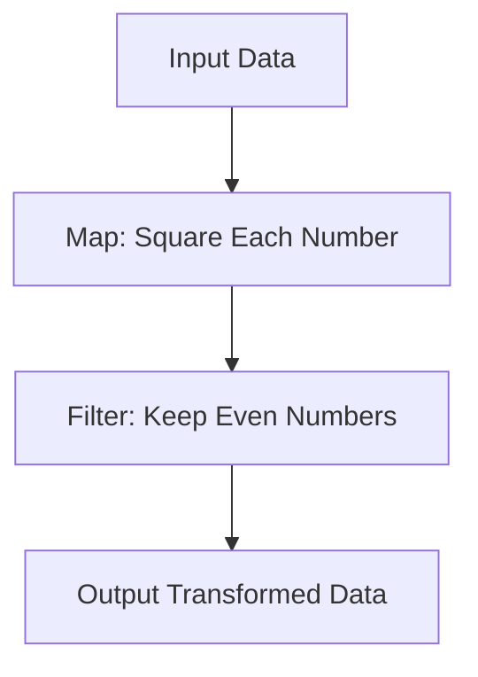

## 9.1 Embracing Functional Programming in D

Functional programming (FP) is a paradigm that treats computation as the evaluation of mathematical functions and avoids changing state or mutable data. In the D programming language, embracing functional programming can lead to more predictable, maintainable, and concurrent code. This section will guide you through the principles of functional programming, its benefits, and practical use cases in D, focusing on data transformation and concurrency.

### Principles of Functional Programming

Functional programming is built on several core principles that distinguish it from other paradigms like imperative or object-oriented programming. Let's explore these principles and how they apply to D.

#### 1. Pure Functions

Pure functions are the cornerstone of functional programming. A pure function is one where the output value is determined only by its input values, without observable side effects. This means that calling a pure function with the same arguments will always produce the same result.

```d
// Example of a pure function in D
int add(int a, int b) {
    return a + b; // No side effects, output depends only on inputs
}
```

**Benefits of Pure Functions:**

- **Predictability**: Easier to reason about and test.
- **Concurrency**: Safe to execute in parallel since they don't modify shared state.

#### 2. Immutability

Immutability is the concept of data that cannot be changed once created. In D, you can declare variables as `immutable` to ensure they remain constant.

```d
// Example of immutability in D
immutable int x = 10;
// x = 20; // Error: cannot modify immutable variable
```

**Benefits of Immutability:**

- **Safety**: Prevents accidental changes to data.
- **Concurrency**: Reduces the need for locks, as immutable data can be shared safely between threads.

#### 3. First-Class and Higher-Order Functions

In functional programming, functions are first-class citizens. This means they can be passed as arguments, returned from other functions, and assigned to variables. Higher-order functions are functions that take other functions as arguments or return them as results.

```d
// Example of higher-order function in D
int applyFunction(int a, int b, int function(int, int)) {
    return function(a, b);
}

int multiply(int x, int y) {
    return x * y;
}

void main() {
    writeln(applyFunction(5, 10, &multiply)); // Outputs: 50
}
```

**Benefits of Higher-Order Functions:**

- **Reusability**: Functions can be composed and reused in different contexts.
- **Abstraction**: Simplifies complex operations by abstracting behavior.

#### 4. Recursion

Recursion is a technique where a function calls itself to solve a problem. In functional programming, recursion is often used instead of loops for iteration.

```d
// Example of recursion in D
int factorial(int n) {
    if (n <= 1) return 1;
    return n * factorial(n - 1);
}

void main() {
    writeln(factorial(5)); // Outputs: 120
}
```

**Benefits of Recursion:**

- **Simplicity**: Often leads to simpler and more elegant solutions.
- **Expressiveness**: Naturally expresses problems that have a recursive structure.

### Benefits of Functional Programming in D

Functional programming offers several advantages, especially when combined with D's unique features.

#### Predictability

Functional programming's reliance on pure functions and immutability makes code more predictable. This predictability simplifies debugging and testing, as functions behave consistently and independently of external state.

#### Concurrency

Functional programming's emphasis on immutability and pure functions aligns well with concurrent programming. Since pure functions don't modify shared state, they can be executed in parallel without the risk of race conditions. This makes it easier to write safe and efficient concurrent code in D.

### Use Cases and Examples

Let's explore some practical use cases of functional programming in D, focusing on data transformation and concurrency.

#### Data Transformation

Functional programming excels at transforming data through a series of operations. In D, you can use ranges and higher-order functions to streamline data pipelines.

```d
import std.algorithm;
import std.range;
import std.stdio;

void main() {
    auto numbers = iota(1, 10); // Range of numbers from 1 to 9
    auto transformed = numbers
        .map!(x => x * x) // Square each number
        .filter!(x => x % 2 == 0); // Keep only even numbers

    writeln(transformed.array); // Outputs: [4, 16, 36, 64]
}
```

**Explanation:**

- **`iota`**: Generates a range of numbers.
- **`map`**: Applies a function to each element in the range.
- **`filter`**: Removes elements that don't satisfy a condition.

#### Concurrency

Functional programming simplifies concurrent programming by eliminating shared mutable state. In D, you can leverage functional programming to write concurrent code using `std.parallelism`.

```d
import std.parallelism;
import std.stdio;

void main() {
    auto numbers = iota(1, 1000000);
    auto sum = taskPool.reduce!"a + b"(0, numbers);
    writeln("Sum: ", sum); // Outputs the sum of numbers from 1 to 999999
}
```

**Explanation:**

- **`taskPool.reduce`**: Performs a parallel reduction on the range of numbers.

### Visualizing Functional Programming Concepts

To better understand the flow of data in functional programming, let's visualize a simple data transformation pipeline using a flowchart.



**Description:** This flowchart represents a data transformation pipeline where input data is first squared and then filtered to keep only even numbers.

### Try It Yourself

Experiment with the code examples provided by modifying the functions or adding new operations. For instance, try changing the transformation function in the `map` operation or adding a `reduce` step to calculate the sum of the transformed numbers.

### References and Links

- [MDN Web Docs on Functional Programming](https://developer.mozilla.org/en-US/docs/Glossary/Functional_programming)
- [D Programming Language Official Website](https://dlang.org/)
- [Functional Programming in D](https://wiki.dlang.org/Functional_Programming)

### Knowledge Check

- What are pure functions, and why are they important in functional programming?
- How does immutability contribute to safer concurrent programming?
- What is the role of higher-order functions in functional programming?
- How can recursion be used to solve problems in functional programming?
- What are the benefits of using functional programming for data transformation?

### Embrace the Journey

Remember, embracing functional programming in D is just the beginning. As you progress, you'll discover more ways to leverage functional paradigms to write efficient, maintainable, and concurrent code. Keep experimenting, stay curious, and enjoy the journey!

## Quiz Time!



### What is a pure function in functional programming?

- [x] A function that always produces the same output for the same input and has no side effects.
- [ ] A function that can modify global state.
- [ ] A function that relies on external input for its behavior.
- [ ] A function that can produce different outputs for the same input.

> **Explanation:** A pure function is one that always produces the same output for the same input and does not cause any side effects, making it predictable and easy to test.

### How does immutability benefit concurrent programming?

- [x] It allows data to be shared safely between threads without locks.
- [ ] It makes data mutable and changeable.
- [ ] It requires more complex synchronization mechanisms.
- [ ] It increases the risk of race conditions.

> **Explanation:** Immutability ensures that data cannot be changed, allowing it to be shared safely between threads without the need for locks, reducing the risk of race conditions.

### What is a higher-order function?

- [x] A function that takes other functions as arguments or returns them as results.
- [ ] A function that only operates on primitive data types.
- [ ] A function that cannot be passed as an argument.
- [ ] A function that modifies global state.

> **Explanation:** Higher-order functions are functions that can take other functions as arguments or return them as results, enabling powerful abstractions and code reuse.

### Why is recursion often used in functional programming?

- [x] It naturally expresses problems with a recursive structure and can lead to simpler solutions.
- [ ] It is the only way to iterate over data in functional programming.
- [ ] It is always more efficient than loops.
- [ ] It requires less memory than iterative solutions.

> **Explanation:** Recursion is often used in functional programming because it naturally expresses problems with a recursive structure and can lead to simpler and more elegant solutions.

### What is the main advantage of using functional programming for data transformation?

- [x] It allows for concise and expressive data pipelines using operations like map, filter, and reduce.
- [ ] It requires more boilerplate code.
- [ ] It makes data transformation more complex.
- [ ] It limits the types of data that can be transformed.

> **Explanation:** Functional programming allows for concise and expressive data pipelines using operations like map, filter, and reduce, simplifying data transformation tasks.

### What is the role of `std.parallelism` in D's functional programming?

- [x] It enables parallel execution of functional operations like reduce.
- [ ] It is used for serial execution of tasks.
- [ ] It provides a way to write imperative code.
- [ ] It is unrelated to functional programming.

> **Explanation:** `std.parallelism` in D enables parallel execution of functional operations like reduce, making it easier to write concurrent and efficient code.

### How can you ensure a function is pure in D?

- [x] By ensuring it has no side effects and its output depends only on its input.
- [ ] By allowing it to modify global variables.
- [ ] By using mutable data structures.
- [ ] By relying on external input for its behavior.

> **Explanation:** To ensure a function is pure in D, it should have no side effects and its output should depend only on its input, making it predictable and easy to test.

### What is the benefit of using `immutable` in D?

- [x] It prevents accidental changes to data, enhancing safety and concurrency.
- [ ] It allows data to be modified freely.
- [ ] It requires more complex synchronization mechanisms.
- [ ] It increases the risk of race conditions.

> **Explanation:** Using `immutable` in D prevents accidental changes to data, enhancing safety and concurrency by allowing data to be shared safely between threads.

### What is the purpose of the `map` function in functional programming?

- [x] To apply a function to each element in a collection, transforming it.
- [ ] To filter elements from a collection.
- [ ] To reduce a collection to a single value.
- [ ] To sort elements in a collection.

> **Explanation:** The `map` function in functional programming is used to apply a function to each element in a collection, transforming it and producing a new collection.

### True or False: Functional programming in D can simplify concurrent programming.

- [x] True
- [ ] False

> **Explanation:** True. Functional programming in D can simplify concurrent programming by eliminating shared mutable state and using pure functions, reducing the risk of race conditions.


