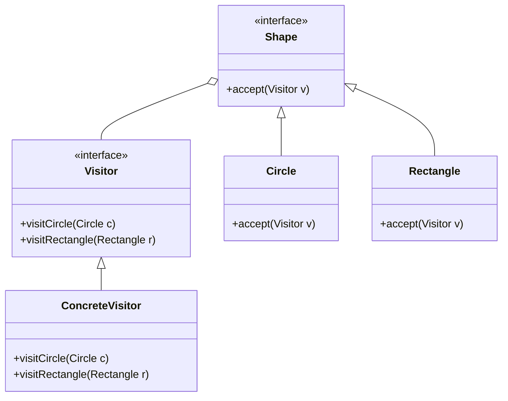

## 9.10 Pattern Matching Techniques

Pattern matching is a powerful feature in many functional programming languages, allowing developers to perform complex data manipulations and control flow operations with ease. While D does not natively support pattern matching as seen in languages like Haskell or Scala, it provides a rich set of features that can be leveraged to simulate pattern matching effectively. In this section, we will explore how to use D's capabilities to implement pattern matching techniques, focusing on the Visitor Pattern and its applications in handling algebraic data types and data processing.

### Simulating Pattern Matching in D

Pattern matching involves checking a value against a pattern and executing code based on the match. In D, we can simulate this behavior using a combination of object-oriented and functional programming techniques. The Visitor Pattern is particularly useful in this context, as it allows us to define operations on objects without modifying their classes.

#### Implementing the Visitor Pattern

The Visitor Pattern is a behavioral design pattern that lets you separate algorithms from the objects on which they operate. It involves creating a visitor class that implements a visit method for each type of element in a structure. This pattern is ideal for simulating pattern matching because it allows you to define different operations for different types of data.

**Key Participants:**
- **Visitor**: An interface or abstract class declaring visit methods for each type of element.
- **ConcreteVisitor**: A class implementing the visitor interface, defining operations for each element type.
- **Element**: An interface or abstract class declaring an accept method that takes a visitor.
- **ConcreteElement**: A class implementing the element interface, calling the visitor's visit method in its accept method.

**Sample Code Snippet:**

```d
// Define the Visitor interface
interface Visitor {
    void visitCircle(Circle c);
    void visitRectangle(Rectangle r);
}

// Define the Element interface
interface Shape {
    void accept(Visitor v);
}

// ConcreteElement: Circle
class Circle : Shape {
    double radius;
    
    this(double radius) {
        this.radius = radius;
    }
    
    override void accept(Visitor v) {
        v.visitCircle(this);
    }
}

// ConcreteElement: Rectangle
class Rectangle : Shape {
    double width, height;
    
    this(double width, double height) {
        this.width = width;
        this.height = height;
    }
    
    override void accept(Visitor v) {
        v.visitRectangle(this);
    }
}

// ConcreteVisitor: AreaCalculator
class AreaCalculator : Visitor {
    double area;
    
    override void visitCircle(Circle c) {
        area = 3.14159 * c.radius * c.radius;
    }
    
    override void visitRectangle(Rectangle r) {
        area = r.width * r.height;
    }
}

// Usage
void main() {
    Shape[] shapes = [new Circle(5), new Rectangle(4, 6)];
    AreaCalculator calculator = new AreaCalculator();
    
    foreach (shape; shapes) {
        shape.accept(calculator);
        writeln("Area: ", calculator.area);
    }
}
```

In this example, we define a `Visitor` interface with methods for each shape type, `Circle` and `Rectangle`. The `AreaCalculator` class implements the `Visitor` interface and calculates the area for each shape. Each shape class implements the `Shape` interface and calls the appropriate visit method in its `accept` method.

#### Use Cases and Examples

##### Algebraic Data Types

Algebraic data types (ADTs) are a way to define composite types by combining other types. They are common in functional programming and can be effectively handled using pattern matching techniques. In D, we can use the Visitor Pattern to simulate pattern matching for ADTs.

**Example:**

```d
// Define an algebraic data type for an expression
interface Expr {
    void accept(ExprVisitor v);
}

class Number : Expr {
    double value;
    
    this(double value) {
        this.value = value;
    }
    
    override void accept(ExprVisitor v) {
        v.visitNumber(this);
    }
}

class Add : Expr {
    Expr left, right;
    
    this(Expr left, Expr right) {
        this.left = left;
        this.right = right;
    }
    
    override void accept(ExprVisitor v) {
        v.visitAdd(this);
    }
}

interface ExprVisitor {
    void visitNumber(Number n);
    void visitAdd(Add a);
}

class EvalVisitor : ExprVisitor {
    double result;
    
    override void visitNumber(Number n) {
        result = n.value;
    }
    
    override void visitAdd(Add a) {
        a.left.accept(this);
        double leftResult = result;
        a.right.accept(this);
        double rightResult = result;
        result = leftResult + rightResult;
    }
}

// Usage
void main() {
    Expr expr = new Add(new Number(1), new Add(new Number(2), new Number(3)));
    EvalVisitor evaluator = new EvalVisitor();
    expr.accept(evaluator);
    writeln("Result: ", evaluator.result);
}
```

In this example, we define an algebraic data type for mathematical expressions using the `Expr` interface and its implementations `Number` and `Add`. The `EvalVisitor` class evaluates the expression by visiting each node and performing the appropriate operations.

##### Data Processing

Pattern matching can simplify control flow in data processing tasks by allowing you to define operations based on data types or values. In D, you can use the Visitor Pattern to achieve similar results.

**Example:**

```d
// Define a data processing visitor
interface DataVisitor {
    void visitInt(int value);
    void visitString(string value);
}

class PrintVisitor : DataVisitor {
    override void visitInt(int value) {
        writeln("Integer: ", value);
    }
    
    override void visitString(string value) {
        writeln("String: ", value);
    }
}

// Usage
void processData(DataVisitor visitor, Variant data) {
    if (data.type == typeid(int)) {
        visitor.visitInt(data.get!int);
    } else if (data.type == typeid(string)) {
        visitor.visitString(data.get!string);
    }
}

void main() {
    Variant[] data = [Variant(42), Variant("Hello")];
    PrintVisitor printer = new PrintVisitor();
    
    foreach (item; data) {
        processData(printer, item);
    }
}
```

In this example, we define a `DataVisitor` interface with methods for processing integers and strings. The `PrintVisitor` class implements this interface and prints the data. The `processData` function uses the visitor to process each item in the data array based on its type.

### Design Considerations

When simulating pattern matching in D, consider the following:

- **Complexity**: The Visitor Pattern can introduce complexity, especially with a large number of element types. Ensure that the benefits of pattern matching outweigh the added complexity.
- **Extensibility**: The Visitor Pattern makes it easy to add new operations without modifying existing classes. However, adding new element types requires changes to the visitor interface and all concrete visitors.
- **Performance**: Consider the performance implications of using the Visitor Pattern, especially in performance-critical applications. The overhead of method calls and dynamic dispatch can impact performance.

### Differences and Similarities

The Visitor Pattern is often compared to other design patterns, such as the Strategy Pattern and the Command Pattern. While all three patterns involve defining operations separately from the objects they operate on, they differ in their intent and structure:

- **Visitor Pattern**: Focuses on defining operations for a fixed set of element types. It is ideal for simulating pattern matching and handling ADTs.
- **Strategy Pattern**: Encapsulates algorithms within a family of interchangeable strategies. It is used to define a set of algorithms and make them interchangeable.
- **Command Pattern**: Encapsulates a request as an object, allowing parameterization of clients with queues, requests, and operations.

### Try It Yourself

Experiment with the code examples provided by:

- Adding new shape types, such as `Triangle` or `Ellipse`, and updating the `AreaCalculator` visitor to handle them.
- Extending the algebraic data type example with new operations, such as subtraction or multiplication, and implementing a new visitor to evaluate them.
- Modifying the data processing example to handle additional data types, such as `double` or `bool`, and updating the `PrintVisitor` accordingly.

### Visualizing the Visitor Pattern

To better understand the Visitor Pattern, let's visualize its structure using a class diagram.



This diagram illustrates the relationships between the `Visitor`, `ConcreteVisitor`, `Shape`, `Circle`, and `Rectangle` classes. The `Visitor` interface defines the visit methods, and the `ConcreteVisitor` class implements these methods. The `Shape` interface defines the `accept` method, which is implemented by the `Circle` and `Rectangle` classes.

### References and Links

For further reading on pattern matching and the Visitor Pattern, consider the following resources:

- [Design Patterns: Elements of Reusable Object-Oriented Software](https://en.wikipedia.org/wiki/Design_Patterns) by Erich Gamma, Richard Helm, Ralph Johnson, and John Vlissides
- [Visitor Pattern on Wikipedia](https://en.wikipedia.org/wiki/Visitor_pattern)
- [Functional Programming in D](https://dlang.org/blog/2017/05/24/functional-programming-in-d/) - D Language Blog

### Knowledge Check

To reinforce your understanding of pattern matching techniques in D, try answering the following questions:

## Quiz Time!



### What is the primary purpose of the Visitor Pattern in D?

- [x] To separate algorithms from the objects they operate on
- [ ] To encapsulate a request as an object
- [ ] To define a family of interchangeable algorithms
- [ ] To manage object creation

> **Explanation:** The Visitor Pattern is used to separate algorithms from the objects they operate on, allowing for operations to be defined without modifying the object classes.

### Which of the following is a key participant in the Visitor Pattern?

- [x] Visitor
- [ ] Strategy
- [ ] Command
- [ ] Factory

> **Explanation:** The Visitor Pattern involves key participants such as the Visitor, ConcreteVisitor, Element, and ConcreteElement.

### How does the Visitor Pattern simulate pattern matching in D?

- [x] By defining operations for each type of element in a structure
- [ ] By encapsulating requests as objects
- [ ] By defining a family of interchangeable algorithms
- [ ] By managing object creation

> **Explanation:** The Visitor Pattern simulates pattern matching by defining operations for each type of element in a structure, allowing for different operations based on element types.

### What is a potential drawback of using the Visitor Pattern?

- [x] Complexity with a large number of element types
- [ ] Difficulty in adding new operations
- [ ] Lack of flexibility in algorithm interchangeability
- [ ] Inefficient object creation

> **Explanation:** The Visitor Pattern can introduce complexity, especially with a large number of element types, as it requires changes to the visitor interface and all concrete visitors.

### Which pattern is often compared to the Visitor Pattern?

- [x] Strategy Pattern
- [x] Command Pattern
- [ ] Singleton Pattern
- [ ] Factory Pattern

> **Explanation:** The Visitor Pattern is often compared to the Strategy Pattern and the Command Pattern, as they all involve defining operations separately from the objects they operate on.

### In the provided code example, what does the `accept` method do?

- [x] Calls the appropriate visit method on the visitor
- [ ] Encapsulates a request as an object
- [ ] Defines a family of interchangeable algorithms
- [ ] Manages object creation

> **Explanation:** The `accept` method in the Visitor Pattern calls the appropriate visit method on the visitor, allowing the visitor to perform operations on the element.

### What is an algebraic data type (ADT)?

- [x] A composite type defined by combining other types
- [ ] A type that encapsulates a request as an object
- [ ] A type that defines a family of interchangeable algorithms
- [ ] A type that manages object creation

> **Explanation:** An algebraic data type (ADT) is a composite type defined by combining other types, commonly used in functional programming.

### How can the Visitor Pattern be used in data processing?

- [x] By defining operations based on data types or values
- [ ] By encapsulating requests as objects
- [ ] By defining a family of interchangeable algorithms
- [ ] By managing object creation

> **Explanation:** The Visitor Pattern can be used in data processing by defining operations based on data types or values, simplifying control flow.

### What is a benefit of using the Visitor Pattern?

- [x] Easy to add new operations without modifying existing classes
- [ ] Simplifies object creation
- [ ] Provides algorithm interchangeability
- [ ] Reduces method calls

> **Explanation:** The Visitor Pattern makes it easy to add new operations without modifying existing classes, enhancing extensibility.

### True or False: The Visitor Pattern is ideal for handling algebraic data types in D.

- [x] True
- [ ] False

> **Explanation:** True. The Visitor Pattern is ideal for handling algebraic data types in D, as it allows for operations to be defined based on element types.



Remember, this is just the beginning. As you progress, you'll build more complex and interactive applications using pattern matching techniques in D. Keep experimenting, stay curious, and enjoy the journey!
