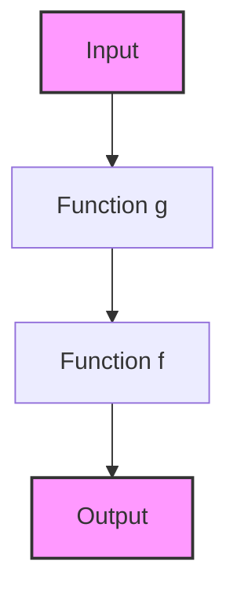
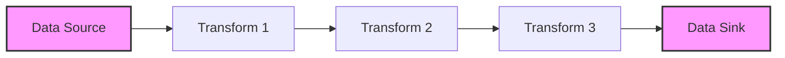

## 9.11 Function Composition and Pipelines

In the realm of functional programming, function composition and pipelines are powerful concepts that allow developers to build complex operations from simpler, reusable functions. In the D programming language, these concepts are particularly useful for creating efficient, readable, and maintainable code. This section will delve into the intricacies of function composition and pipelines, providing you with the knowledge to leverage these techniques in your advanced systems programming projects.

### Understanding Function Composition

**Function Composition** is the process of combining two or more functions to produce a new function. This new function represents the application of the composed functions in sequence. In mathematical terms, if you have two functions `f` and `g`, the composition `f ∘ g` is defined as `f(g(x))`. In programming, this concept allows us to build complex operations by chaining simpler functions together.

#### Benefits of Function Composition

- **Reusability**: By breaking down complex operations into smaller functions, you can reuse these components across different parts of your codebase.
- **Readability**: Composed functions can make your code more readable by clearly expressing the sequence of operations.
- **Maintainability**: Smaller, well-defined functions are easier to test and maintain.

#### Function Composition in D

In D, function composition can be achieved using higher-order functions and delegates. Let's explore how to implement function composition in D with a simple example.

```d
import std.stdio;

// Define a simple function to add 2
int addTwo(int x) {
    return x + 2;
}

// Define another function to multiply by 3
int multiplyByThree(int x) {
    return x * 3;
}

// Function to compose two functions
int function(int) compose(int function(int) f, int function(int) g) {
    return (int x) => f(g(x));
}

void main() {
    // Compose addTwo and multiplyByThree
    auto composedFunction = compose(&addTwo, &multiplyByThree);

    // Apply the composed function
    writeln(composedFunction(5)); // Output: 17
}
```

In this example, we define two simple functions, `addTwo` and `multiplyByThree`, and a `compose` function that takes two functions as arguments and returns their composition. The composed function is then applied to an input value.

### Creating Pipelines

**Pipelines** are a natural extension of function composition, where data flows through a series of functions, each transforming the data in some way. This pattern is particularly useful for data processing tasks, such as ETL (Extract, Transform, Load) processes and signal processing.

#### Building a Pipeline in D

To build a pipeline in D, we can use the concept of ranges and UFCS (Uniform Function Call Syntax) to chain function calls in a readable and efficient manner.

```d
import std.stdio;
import std.algorithm;
import std.range;

// Define a range of numbers
auto numbers = iota(1, 10);

// Define a pipeline of transformations
auto pipeline = numbers
    .map!(x => x * 2) // Double each number
    .filter!(x => x % 3 == 0) // Keep only numbers divisible by 3
    .array; // Convert the result to an array

void main() {
    writeln(pipeline); // Output: [6, 12, 18]
}
```

In this example, we define a range of numbers and apply a series of transformations using `map` and `filter`. The result is a pipeline that doubles each number and filters out those not divisible by 3.

### Use Cases and Examples

Function composition and pipelines are versatile tools that can be applied to a wide range of real-world scenarios. Let's explore some common use cases.

#### ETL Processes

ETL (Extract, Transform, Load) processes involve extracting data from various sources, transforming it into a suitable format, and loading it into a destination system. Function composition and pipelines can simplify these processes by breaking them down into smaller, manageable steps.

```d
import std.stdio;
import std.algorithm;
import std.array;

// Simulate data extraction
string[] extractData() {
    return ["1", "2", "3", "4", "5"];
}

// Transform data: convert strings to integers and double them
int[] transformData(string[] data) {
    return data
        .map!(to!int)
        .map!(x => x * 2)
        .array;
}

// Load data: print to console
void loadData(int[] data) {
    writeln("Loading data: ", data);
}

void main() {
    // ETL pipeline
    auto data = extractData();
    auto transformedData = transformData(data);
    loadData(transformedData);
}
```

In this ETL example, we define three functions: `extractData`, `transformData`, and `loadData`. The pipeline extracts data as strings, transforms them into integers and doubles their values, and finally loads the data by printing it to the console.

#### Signal Processing

Signal processing often involves applying a series of transformations to a signal, such as filtering, amplifying, and encoding. Pipelines can streamline these operations by chaining the necessary functions.

```d
import std.stdio;
import std.algorithm;
import std.range;

// Simulate a signal as a range of values
auto signal = iota(0, 100);

// Define a pipeline for signal processing
auto processedSignal = signal
    .map!(x => x * 0.5) // Attenuate the signal
    .filter!(x => x > 10) // Filter out low values
    .map!(x => x + 5) // Add a bias
    .array;

void main() {
    writeln(processedSignal);
}
```

In this signal processing example, we define a signal as a range of values and apply a series of transformations to attenuate, filter, and bias the signal.

### Visualizing Function Composition and Pipelines

To better understand how function composition and pipelines work, let's visualize these concepts using diagrams.

#### Function Composition Diagram



**Description**: This diagram illustrates the flow of data through a composed function, where the output of `Function g` becomes the input to `Function f`.

#### Pipeline Diagram



**Description**: This diagram represents a data pipeline, where data flows from a source through a series of transformations before reaching a sink.

### Try It Yourself

To deepen your understanding of function composition and pipelines, try modifying the code examples provided. Here are some suggestions:

- **Modify the ETL pipeline** to include additional transformations, such as filtering out specific values or aggregating data.
- **Experiment with different signal processing operations**, such as applying a moving average filter or normalizing the signal.
- **Create your own pipeline** for a different domain, such as image processing or financial data analysis.

### Key Takeaways

- Function composition allows you to build complex functions from simpler ones, enhancing reusability and maintainability.
- Pipelines enable efficient data transformation by chaining functions in a readable and logical sequence.
- These concepts are applicable to a wide range of domains, including ETL processes and signal processing.

### References and Further Reading

- [MDN Web Docs: Function Composition](https://developer.mozilla.org/en-US/docs/Web/JavaScript/Guide/Functions#function_composition)
- [W3Schools: Functional Programming](https://www.w3schools.com/js/js_functional.asp)
- [D Language Documentation](https://dlang.org/)

### Embrace the Journey

Remember, mastering function composition and pipelines is just the beginning. As you continue to explore these concepts, you'll discover new ways to simplify complex operations and enhance the readability and maintainability of your code. Keep experimenting, stay curious, and enjoy the journey!

## Quiz Time!



### What is function composition?

- [x] Combining two or more functions to produce a new function.
- [ ] A method for optimizing code execution.
- [ ] A way to handle errors in functional programming.
- [ ] A technique for managing memory allocation.

> **Explanation:** Function composition involves combining two or more functions to create a new function that represents the application of the composed functions in sequence.

### What is the primary benefit of using pipelines in programming?

- [x] Efficient data transformation through a series of functions.
- [ ] Improved error handling capabilities.
- [ ] Enhanced memory management.
- [ ] Simplified user interface design.

> **Explanation:** Pipelines allow for efficient data transformation by passing data through a series of functions, each performing a specific operation.

### In D, which feature is commonly used to implement pipelines?

- [x] Ranges and UFCS (Uniform Function Call Syntax).
- [ ] Inline assembly.
- [ ] Garbage collection.
- [ ] Exception handling.

> **Explanation:** Ranges and UFCS are commonly used in D to implement pipelines, allowing for chaining function calls in a readable and efficient manner.

### What is a common use case for function composition and pipelines?

- [x] ETL processes and signal processing.
- [ ] User interface design.
- [ ] Memory management.
- [ ] Network communication.

> **Explanation:** Function composition and pipelines are commonly used in ETL processes and signal processing to streamline data transformation tasks.

### How does function composition enhance code maintainability?

- [x] By breaking down complex operations into smaller, reusable functions.
- [ ] By reducing the need for error handling.
- [ ] By optimizing memory usage.
- [ ] By simplifying user interface design.

> **Explanation:** Function composition enhances code maintainability by breaking down complex operations into smaller, reusable functions that are easier to test and maintain.

### What is the output of the composed function in the provided example?

- [x] 17
- [ ] 15
- [ ] 10
- [ ] 20

> **Explanation:** The composed function applies `multiplyByThree` first, resulting in 15, and then `addTwo`, resulting in 17.

### Which D feature allows chaining of function calls in pipelines?

- [x] UFCS (Uniform Function Call Syntax).
- [ ] Inline assembly.
- [ ] Exception handling.
- [ ] Garbage collection.

> **Explanation:** UFCS allows chaining of function calls in pipelines, making the code more readable and efficient.

### What transformation is applied first in the signal processing example?

- [x] Attenuation (multiplying by 0.5).
- [ ] Filtering out low values.
- [ ] Adding a bias.
- [ ] Normalization.

> **Explanation:** The first transformation applied in the signal processing example is attenuation, where each value is multiplied by 0.5.

### What is the purpose of the `filter` function in the pipeline examples?

- [x] To remove elements that do not meet a specified condition.
- [ ] To double the values of elements.
- [ ] To convert elements to a different type.
- [ ] To add a bias to the elements.

> **Explanation:** The `filter` function is used to remove elements that do not meet a specified condition, such as being divisible by 3.

### True or False: Function composition and pipelines are only applicable to functional programming languages.

- [ ] True
- [x] False

> **Explanation:** Function composition and pipelines are applicable to a wide range of programming languages, not just functional ones, as they are general programming concepts.


