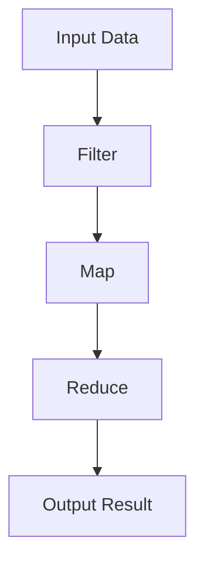

## 9.12 Real-World Functional Programming Examples

Functional programming (FP) is a paradigm that treats computation as the evaluation of mathematical functions and avoids changing state and mutable data. In the D programming language, FP can be leveraged to create robust, maintainable, and efficient software systems. In this section, we will explore real-world examples of functional programming in D, focusing on financial systems and concurrent applications. We will also discuss best practices and lessons learned from applying functional techniques effectively.

### Introduction to Functional Programming in D

Before diving into real-world examples, let's briefly recap the core principles of functional programming:

- **Immutability**: Data is immutable, meaning it cannot be changed once created. This leads to safer and more predictable code.
- **First-Class Functions**: Functions are treated as first-class citizens, allowing them to be passed as arguments, returned from other functions, and assigned to variables.
- **Higher-Order Functions**: Functions that take other functions as arguments or return them as results.
- **Pure Functions**: Functions that have no side effects and return the same output given the same input.
- **Lazy Evaluation**: Evaluation of expressions is delayed until their values are needed, which can improve performance.

D supports functional programming through features like first-class functions, lambda expressions, and the `std.functional` module. Let's explore how these features can be applied in real-world scenarios.

### Case Study: Financial Systems

Financial systems require high accuracy and reliability due to the sensitive nature of the data they handle. Functional programming can help achieve these goals by providing a clear and concise way to express complex logic while minimizing side effects.

#### Example: Calculating Compound Interest

In financial systems, calculating compound interest is a common task. Let's see how we can implement this using functional programming in D.

```d
import std.stdio;
import std.functional;

// Define a pure function to calculate compound interest
pure double compoundInterest(double principal, double rate, int times, int years) {
    return principal * (1 + rate / times) ^^ (times * years);
}

void main() {
    double principal = 1000.0;
    double rate = 0.05;
    int times = 4; // Quarterly compounding
    int years = 10;

    // Calculate compound interest using a pure function
    double amount = compoundInterest(principal, rate, times, years);
    writeln("Compound Interest: ", amount);
}
```

In this example, the `compoundInterest` function is pure, meaning it has no side effects and always produces the same result given the same inputs. This makes the function easy to test and reason about.

#### Example: Functional Data Transformation

Financial systems often require data transformation, such as converting raw transaction data into a more usable format. Functional programming can simplify this process.

```d
import std.stdio;
import std.algorithm;
import std.range;

// Define a struct to represent a transaction
struct Transaction {
    string id;
    double amount;
    string type;
}

// Define a function to filter and transform transactions
auto processTransactions(Transaction[] transactions) {
    return transactions
        .filter!(t => t.type == "credit")
        .map!(t => t.amount * 1.1) // Apply a 10% bonus
        .array;
}

void main() {
    Transaction[] transactions = [
        Transaction("1", 100.0, "credit"),
        Transaction("2", 200.0, "debit"),
        Transaction("3", 150.0, "credit")
    ];

    // Process transactions using functional data transformation
    auto processed = processTransactions(transactions);
    writeln("Processed Transactions: ", processed);
}
```

Here, we use the `filter` and `map` functions from the `std.algorithm` module to process transactions. This approach is concise and expressive, making it easy to understand and maintain.

### Case Study: Concurrent Applications

Concurrent applications can benefit from functional programming by simplifying complex logic and reducing the risk of race conditions. D's support for functional programming, combined with its concurrency features, makes it an excellent choice for building concurrent systems.

#### Example: Parallel Data Processing

Consider a scenario where we need to process a large dataset in parallel. Functional programming can help us achieve this efficiently.

```d
import std.stdio;
import std.parallelism;
import std.algorithm;

// Define a function to process data in parallel
auto parallelProcess(int[] data) {
    return taskPool.parallel(data)
        .map!(x => x * x) // Square each element
        .array;
}

void main() {
    int[] data = [1, 2, 3, 4, 5, 6, 7, 8, 9, 10];

    // Process data in parallel using functional programming
    auto result = parallelProcess(data);
    writeln("Parallel Processed Data: ", result);
}
```

In this example, we use the `taskPool.parallel` function from the `std.parallelism` module to process data in parallel. The `map` function is used to apply a transformation to each element, demonstrating the power of combining functional programming with concurrency.

#### Example: Asynchronous Event Handling

Functional programming can also simplify asynchronous event handling by using higher-order functions and delegates.

```d
import std.stdio;
import std.concurrency;

// Define a function to handle events asynchronously
void handleEvent(string event, void delegate(string) callback) {
    spawn(() => {
        // Simulate event processing
        Thread.sleep(1.seconds);
        callback(event);
    });
}

void main() {
    // Define a callback function
    void onEventProcessed(string event) {
        writeln("Event Processed: ", event);
    }

    // Handle events asynchronously using functional programming
    handleEvent("Event1", &onEventProcessed);
    handleEvent("Event2", &onEventProcessed);

    // Wait for events to be processed
    Thread.sleep(2.seconds);
}
```

In this example, we use the `spawn` function from the `std.concurrency` module to handle events asynchronously. The `handleEvent` function takes a callback delegate, allowing us to define custom behavior for each event.

### Lessons Learned: Best Practices

Through these examples, we can derive several best practices for applying functional programming in real-world scenarios:

1. **Embrace Immutability**: Use immutable data structures whenever possible to reduce side effects and improve code reliability.

2. **Leverage Higher-Order Functions**: Use higher-order functions to encapsulate common patterns and reduce code duplication.

3. **Use Pure Functions**: Write pure functions to make your code more predictable and easier to test.

4. **Combine Functional and Imperative Styles**: While functional programming offers many benefits, it's important to combine it with imperative styles when necessary to achieve optimal performance and readability.

5. **Utilize D's Concurrency Features**: Take advantage of D's concurrency features, such as `std.parallelism` and `std.concurrency`, to build efficient and scalable applications.

### Visualizing Functional Programming Concepts

To better understand the flow of data and transformations in functional programming, let's visualize a simple data processing pipeline using a flowchart.



**Figure 1**: A flowchart representing a functional data processing pipeline. Data flows through a series of transformations, including filtering, mapping, and reducing, to produce the final result.

### Try It Yourself

To deepen your understanding of functional programming in D, try modifying the code examples provided:

- **Experiment with Different Transformations**: Modify the `processTransactions` function to apply different transformations, such as converting amounts to different currencies or applying discounts.

- **Implement Additional Concurrent Tasks**: Extend the `parallelProcess` function to perform more complex operations, such as filtering or aggregating data.

- **Create Custom Event Handlers**: Define additional callback functions for the `handleEvent` example to handle different types of events.

### References and Further Reading

- [D Programming Language Official Website](https://dlang.org/)
- [Functional Programming in D](https://wiki.dlang.org/Functional_Programming)
- [Concurrency in D](https://dlang.org/phobos/std_concurrency.html)
- [Parallelism in D](https://dlang.org/phobos/std_parallelism.html)

### Knowledge Check

To reinforce your understanding of functional programming in D, consider the following questions:

1. What are the benefits of using pure functions in financial systems?
2. How can functional programming simplify concurrent application development?
3. What are some best practices for combining functional and imperative styles in D?

### Embrace the Journey

Remember, mastering functional programming in D is a journey. As you continue to explore and experiment with these concepts, you'll discover new ways to build efficient, reliable, and maintainable software systems. Keep experimenting, stay curious, and enjoy the journey!

## Quiz Time!



### What is a key benefit of using pure functions in financial systems?

- [x] They have no side effects and produce consistent results.
- [ ] They allow for mutable data structures.
- [ ] They increase the complexity of the code.
- [ ] They require more memory.

> **Explanation:** Pure functions have no side effects and always produce the same result given the same input, making them ideal for financial systems where accuracy and consistency are crucial.

### How does functional programming help in concurrent application development?

- [x] By simplifying complex logic and reducing race conditions.
- [ ] By increasing the number of threads required.
- [ ] By making code less readable.
- [ ] By requiring more manual synchronization.

> **Explanation:** Functional programming simplifies complex logic and reduces race conditions by promoting immutability and statelessness, which are beneficial in concurrent applications.

### Which D module is used for parallel data processing?

- [x] std.parallelism
- [ ] std.functional
- [ ] std.algorithm
- [ ] std.concurrency

> **Explanation:** The `std.parallelism` module in D is used for parallel data processing, allowing efficient execution of tasks across multiple threads.

### What is the purpose of higher-order functions in functional programming?

- [x] To encapsulate common patterns and reduce code duplication.
- [ ] To increase the complexity of the code.
- [ ] To allow for mutable data structures.
- [ ] To make functions impure.

> **Explanation:** Higher-order functions encapsulate common patterns and reduce code duplication by allowing functions to be passed as arguments or returned as results.

### Which feature of D is used to handle events asynchronously?

- [x] std.concurrency
- [ ] std.algorithm
- [ ] std.functional
- [ ] std.parallelism

> **Explanation:** The `std.concurrency` module in D is used to handle events asynchronously, providing tools for concurrent programming.

### What is a common practice when using functional programming in D?

- [x] Embrace immutability to reduce side effects.
- [ ] Use mutable data structures for flexibility.
- [ ] Avoid using higher-order functions.
- [ ] Write impure functions for better performance.

> **Explanation:** Embracing immutability is a common practice in functional programming to reduce side effects and improve code reliability.

### How can you modify the `processTransactions` function to apply different transformations?

- [x] By changing the operations in the `map` function.
- [ ] By using mutable data structures.
- [ ] By increasing the number of threads.
- [ ] By making the function impure.

> **Explanation:** You can modify the `processTransactions` function to apply different transformations by changing the operations in the `map` function, which applies a transformation to each element.

### What is the role of the `spawn` function in D?

- [x] To create a new thread for asynchronous execution.
- [ ] To filter data in a range.
- [ ] To map data in a range.
- [ ] To reduce data in a range.

> **Explanation:** The `spawn` function in D is used to create a new thread for asynchronous execution, allowing concurrent processing of tasks.

### What is a benefit of using lazy evaluation in functional programming?

- [x] It improves performance by delaying computation until needed.
- [ ] It increases the complexity of the code.
- [ ] It requires more memory.
- [ ] It makes code less readable.

> **Explanation:** Lazy evaluation improves performance by delaying computation until the result is needed, which can lead to more efficient use of resources.

### True or False: Functional programming in D can only be used for financial systems.

- [ ] True
- [x] False

> **Explanation:** Functional programming in D is versatile and can be applied to various domains, including financial systems, concurrent applications, and more.


