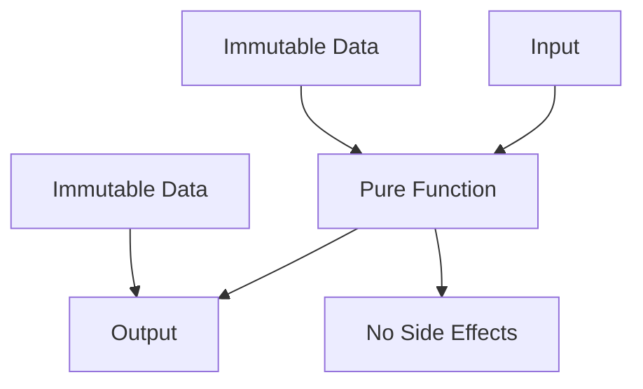

## 9.2 Pure Functions and Immutability

In the realm of functional programming, pure functions and immutability are foundational concepts that significantly contribute to the reliability, maintainability, and performance of software systems. The D programming language, with its robust support for functional programming paradigms, provides powerful tools to implement these concepts effectively. In this section, we will delve into the intricacies of pure functions and immutability, exploring their definitions, benefits, and practical applications in D.

### Defining Pure Functions

Pure functions are a cornerstone of functional programming. A function is considered pure if it satisfies two main criteria:

1. **Deterministic Output**: Given the same input, a pure function always produces the same output.
2. **No Side Effects**: Pure functions do not alter any state outside their scope or interact with external systems (e.g., file systems, databases).

These characteristics make pure functions predictable and easy to test, as their behavior is entirely determined by their input parameters.

#### Benefits of Pure Functions

- **Testability**: Pure functions are inherently easier to test because they do not depend on or modify external state.
- **Concurrency**: Since pure functions do not alter shared state, they are naturally thread-safe, making them ideal for concurrent execution.
- **Memoization**: Pure functions can be memoized, allowing their results to be cached and reused, improving performance.

#### Example of a Pure Function in D

```d
// A simple pure function to calculate the square of a number
pure int square(int x) {
    return x * x;
}

void main() {
    writeln(square(5)); // Output: 25
    writeln(square(5)); // Output: 25 (consistent output)
}
```

In this example, the `square` function is pure because it consistently returns the same result for the same input and does not modify any external state.

### Immutability Practices

Immutability refers to the practice of ensuring that data cannot be modified after it is created. In D, immutability is enforced using the `immutable` keyword, which guarantees that a variable's value cannot change once it is initialized.

#### Using `immutable` in D

The `immutable` keyword in D is a powerful tool for enforcing data integrity. By declaring a variable as `immutable`, you ensure that its value remains constant throughout its lifetime.

```d
void main() {
    immutable int x = 10;
    // x = 20; // Error: cannot modify immutable variable
    writeln(x); // Output: 10
}
```

In this example, attempting to modify `x` after its initialization would result in a compile-time error, preserving data integrity.

#### Benefits of Immutability

- **Data Integrity**: Immutability prevents accidental or unauthorized modifications to data, ensuring its integrity.
- **Simplified Reasoning**: With immutable data, you can reason about code more easily, as you do not need to track changes to state.
- **Concurrency**: Immutable data structures are inherently thread-safe, as they cannot be modified by concurrent processes.

### Use Cases and Examples

#### Mathematical Computations

Pure functions and immutability are particularly beneficial in mathematical computations, where correctness and precision are paramount. By ensuring that functions are pure and data is immutable, you can guarantee that computations are consistent and free from unintended side effects.

```d
pure double calculateArea(immutable double radius) {
    return 3.14159 * radius * radius;
}

void main() {
    immutable double radius = 5.0;
    writeln(calculateArea(radius)); // Output: 78.53975
}
```

In this example, the `calculateArea` function is pure, and the `radius` is immutable, ensuring that the calculation is both correct and reliable.

#### Caching Results with Memoization

Memoization is a technique used to cache the results of expensive function calls and return the cached result when the same inputs occur again. Pure functions are ideal candidates for memoization because their output depends solely on their input.

```d
import std.functional: memoize;

pure int fibonacci(int n) {
    if (n <= 1) return n;
    return fibonacci(n - 1) + fibonacci(n - 2);
}

void main() {
    auto memoizedFibonacci = &memoize!fibonacci;
    writeln(memoizedFibonacci(40)); // Output: 102334155
    writeln(memoizedFibonacci(40)); // Output: 102334155 (cached result)
}
```

In this example, the `fibonacci` function is pure, allowing us to use the `memoize` function from the `std.functional` module to cache its results, significantly improving performance for repeated calls.

### Visualizing Pure Functions and Immutability

To better understand the relationship between pure functions and immutability, consider the following diagram:



**Diagram Description**: This diagram illustrates how pure functions transform input into output without side effects, leveraging immutable data to ensure consistency and reliability.

### Practical Considerations

When implementing pure functions and immutability in D, consider the following:

- **Use `pure` Keyword**: Annotate functions with the `pure` keyword to enforce purity and enable compiler optimizations.
- **Leverage `immutable`**: Use the `immutable` keyword to protect data from unintended modifications.
- **Combine with Other Functional Features**: Integrate pure functions and immutability with other functional programming features in D, such as higher-order functions and ranges, to create robust and efficient code.

### Try It Yourself

To deepen your understanding of pure functions and immutability, try modifying the code examples provided:

- **Experiment with Different Inputs**: Change the inputs to the pure functions and observe the consistent outputs.
- **Implement Additional Pure Functions**: Create your own pure functions for different mathematical operations or algorithms.
- **Explore Memoization**: Apply memoization to other pure functions and measure the performance improvements.

### References and Further Reading

- [D Language Specification](https://dlang.org/spec/spec.html)
- [Functional Programming in D](https://wiki.dlang.org/Functional_Programming)
- [Memoization in D](https://dlang.org/phobos/std_functional.html)

### Knowledge Check

To reinforce your understanding of pure functions and immutability, consider the following questions and exercises:

- **What are the key characteristics of a pure function?**
- **How does immutability contribute to data integrity?**
- **Implement a pure function to calculate the factorial of a number.**
- **Apply memoization to a recursive function and measure the performance improvement.**

### Embrace the Journey

Remember, mastering pure functions and immutability is a journey that enhances your ability to write reliable and efficient software. As you continue to explore these concepts, you'll discover new ways to leverage them in your projects. Keep experimenting, stay curious, and enjoy the journey!

## Quiz Time!



### What is a key characteristic of a pure function?

- [x] It always produces the same output for the same input.
- [ ] It can modify external state.
- [ ] It relies on global variables.
- [ ] It can have side effects.

> **Explanation:** A pure function always produces the same output for the same input and does not have side effects.

### Why is immutability important in programming?

- [x] It ensures data integrity by preventing modifications.
- [ ] It allows functions to modify data freely.
- [ ] It makes code harder to understand.
- [ ] It is only useful in object-oriented programming.

> **Explanation:** Immutability ensures data integrity by preventing modifications, making code easier to reason about.

### How does memoization benefit pure functions?

- [x] It caches results to improve performance.
- [ ] It allows functions to have side effects.
- [ ] It makes functions impure.
- [ ] It increases memory usage without benefits.

> **Explanation:** Memoization caches results of pure functions to improve performance by avoiding redundant calculations.

### Which keyword is used in D to enforce function purity?

- [x] pure
- [ ] immutable
- [ ] const
- [ ] static

> **Explanation:** The `pure` keyword is used in D to enforce function purity, ensuring no side effects.

### What does the `immutable` keyword do in D?

- [x] It prevents data from being modified after initialization.
- [ ] It allows data to be modified freely.
- [ ] It makes data mutable.
- [ ] It is used for temporary variables.

> **Explanation:** The `immutable` keyword in D prevents data from being modified after initialization, ensuring data integrity.

### How can pure functions improve concurrency?

- [x] They are naturally thread-safe due to no shared state modification.
- [ ] They require locks to manage shared state.
- [ ] They increase the risk of race conditions.
- [ ] They depend on global variables.

> **Explanation:** Pure functions are naturally thread-safe because they do not modify shared state, making them ideal for concurrent execution.

### What is a benefit of using pure functions in testing?

- [x] They are easier to test due to predictable outputs.
- [ ] They require complex test setups.
- [ ] They depend on external systems.
- [ ] They have unpredictable behavior.

> **Explanation:** Pure functions are easier to test because they produce predictable outputs based solely on their inputs.

### Which of the following is NOT a characteristic of pure functions?

- [ ] Deterministic output
- [ ] No side effects
- [x] Modifies global state
- [ ] Consistent behavior

> **Explanation:** Pure functions do not modify global state; they have deterministic output and no side effects.

### Can immutable data be modified after initialization in D?

- [ ] True
- [x] False

> **Explanation:** Immutable data in D cannot be modified after initialization, ensuring data integrity.

### What is a common use case for pure functions?

- [x] Mathematical computations
- [ ] Modifying global variables
- [ ] Interacting with databases
- [ ] Handling user input

> **Explanation:** Pure functions are commonly used in mathematical computations due to their predictable and consistent behavior.


