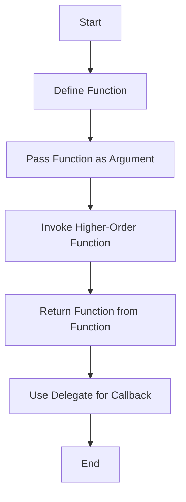

## 9.3 Higher-Order Functions and Delegates

In the realm of functional programming, higher-order functions and delegates play a pivotal role in creating flexible and reusable code. The D programming language, with its powerful features, allows developers to harness these concepts effectively. In this section, we will delve into the intricacies of higher-order functions and delegates, exploring their applications and benefits in advanced systems programming.

### Functions as First-Class Citizens

In D, functions are first-class citizens, meaning they can be passed as arguments, returned from other functions, and assigned to variables. This capability is fundamental to functional programming and enables the creation of higher-order functions.

#### Passing and Returning Functions

Higher-order functions are those that can take other functions as parameters or return them as results. This allows for a high degree of abstraction and code reuse.

**Example: Passing Functions as Arguments**

```d
import std.stdio;

// A simple function that takes an integer and returns its square
int square(int x) {
    return x * x;
}

// A higher-order function that applies a given function to an integer
int applyFunction(int x, int function(int)) {
    return function(x);
}

void main() {
    int number = 5;
    writeln("Square of ", number, " is ", applyFunction(number, &square));
}
```

In this example, `applyFunction` is a higher-order function that takes another function as an argument and applies it to an integer. The `square` function is passed to `applyFunction`, demonstrating how functions can be used as parameters.

**Example: Returning Functions from Functions**

```d
import std.stdio;

// A function that returns another function
int function(int) getMultiplier(int factor) {
    return (int x) => x * factor;
}

void main() {
    auto doubleValue = getMultiplier(2);
    writeln("Double of 10 is ", doubleValue(10));
}
```

Here, `getMultiplier` returns a function that multiplies its input by a specified factor. This showcases how functions can be returned from other functions, enabling dynamic behavior.

### Delegates and Function Pointers

Delegates in D are similar to function pointers but are more powerful as they can capture the context in which they are created. This makes them ideal for defining callbacks and customizing behavior.

#### Defining Callbacks

Callbacks are functions that are passed as arguments to other functions and are invoked at a later time. They are commonly used in event-driven programming and asynchronous operations.

**Example: Using Delegates for Callbacks**

```d
import std.stdio;

// A function that takes a delegate as a callback
void performOperation(int x, void delegate(int) callback) {
    writeln("Performing operation on ", x);
    callback(x);
}

void main() {
    // Define a callback delegate
    void printResult(int result) {
        writeln("Result is ", result);
    }

    performOperation(10, &printResult);
}
```

In this example, `performOperation` takes a delegate as a callback, which is invoked after performing an operation. The `printResult` delegate is passed to `performOperation`, illustrating how delegates can be used to define callbacks.

### Use Cases and Examples

Higher-order functions and delegates have numerous applications in software development. Let's explore some common use cases.

#### Event Handling

In event-driven programming, higher-order functions and delegates provide a flexible mechanism for responding to events.

**Example: Event Handling with Delegates**

```d
import std.stdio;

// Define an event handler delegate
alias EventHandler = void delegate(string);

// A class that manages events
class EventManager {
    private EventHandler[] handlers;

    // Register an event handler
    void addHandler(EventHandler handler) {
        handlers ~= handler;
    }

    // Trigger an event
    void triggerEvent(string event) {
        foreach (handler; handlers) {
            handler(event);
        }
    }
}

void main() {
    auto manager = new EventManager();

    // Add event handlers
    manager.addHandler((event) => writeln("Handler 1 received: ", event));
    manager.addHandler((event) => writeln("Handler 2 received: ", event));

    // Trigger an event
    manager.triggerEvent("Event A");
}
```

In this example, `EventManager` manages a list of event handlers, which are delegates. When an event is triggered, all registered handlers are invoked, demonstrating the flexibility of delegates in event handling.

#### Algorithm Customization

Higher-order functions enable the customization of algorithms by injecting behavior.

**Example: Customizing Algorithms with Higher-Order Functions**

```d
import std.stdio;

// A function that sorts an array using a custom comparison function
void sortArray(int[] arr, int delegate(int, int) compare) {
    arr.sort!compare;
}

void main() {
    int[] numbers = [5, 2, 9, 1, 5, 6];

    // Sort in ascending order
    sortArray(numbers, (a, b) => a < b);
    writeln("Ascending: ", numbers);

    // Sort in descending order
    sortArray(numbers, (a, b) => a > b);
    writeln("Descending: ", numbers);
}
```

In this example, `sortArray` is a higher-order function that sorts an array using a custom comparison function. This allows for flexible sorting behavior, showcasing the power of higher-order functions in algorithm customization.

### Visualizing Higher-Order Functions and Delegates

To better understand the flow of higher-order functions and delegates, let's visualize the process using a flowchart.



**Figure 1: Flow of Higher-Order Functions and Delegates**

This flowchart illustrates the process of defining functions, passing them as arguments, invoking higher-order functions, returning functions, and using delegates for callbacks.

### Try It Yourself

Experiment with the code examples provided in this section. Try modifying the functions, delegates, and callbacks to see how they affect the behavior of the program. For instance, create a new delegate that performs a different operation or modify the comparison function in the sorting example to sort based on different criteria.

### References and Links

For further reading on higher-order functions and delegates, consider the following resources:

- [D Programming Language Official Documentation](https://dlang.org/)
- [Functional Programming in D](https://wiki.dlang.org/Functional_Programming)
- [Higher-Order Functions on Wikipedia](https://en.wikipedia.org/wiki/Higher-order_function)

### Knowledge Check

Let's reinforce what we've learned with some questions and exercises.

## Quiz Time!



### What is a higher-order function?

- [x] A function that takes other functions as parameters or returns them as results
- [ ] A function that performs complex mathematical operations
- [ ] A function that is defined at a higher level in the code
- [ ] A function that only works with integers

> **Explanation:** Higher-order functions can take other functions as parameters or return them as results, enabling abstraction and code reuse.

### What is a delegate in D?

- [x] A type that represents a function with a context
- [ ] A pointer to a function
- [ ] A type that can only be used for event handling
- [ ] A function that is defined within another function

> **Explanation:** Delegates in D are similar to function pointers but can capture the context in which they are created.

### How can you define a callback in D?

- [x] By using a delegate
- [ ] By using a function pointer
- [ ] By using a class
- [ ] By using a struct

> **Explanation:** Delegates are used to define callbacks in D, allowing functions to be passed as arguments and invoked later.

### What is the purpose of higher-order functions in algorithm customization?

- [x] To inject behavior into algorithms
- [ ] To simplify algorithms
- [ ] To make algorithms run faster
- [ ] To make algorithms more complex

> **Explanation:** Higher-order functions allow for the injection of behavior into algorithms, enabling customization and flexibility.

### Which of the following is a use case for delegates?

- [x] Event handling
- [ ] Memory management
- [ ] Data storage
- [ ] File I/O

> **Explanation:** Delegates are commonly used in event handling to define flexible responses to events.

### What is the benefit of using functions as first-class citizens?

- [x] They can be passed as arguments and returned from other functions
- [ ] They can only be used in specific contexts
- [ ] They are faster than other functions
- [ ] They are easier to write

> **Explanation:** Functions as first-class citizens can be passed as arguments and returned from other functions, enabling greater flexibility and code reuse.

### How do you pass a function as an argument in D?

- [x] By using a function pointer or delegate
- [ ] By using a class
- [ ] By using a struct
- [ ] By using a macro

> **Explanation:** Functions can be passed as arguments in D using function pointers or delegates.

### What is the difference between a function pointer and a delegate?

- [x] A delegate can capture context, while a function pointer cannot
- [ ] A function pointer can capture context, while a delegate cannot
- [ ] There is no difference
- [ ] A delegate is faster than a function pointer

> **Explanation:** Delegates can capture the context in which they are created, while function pointers cannot.

### Can higher-order functions return other functions?

- [x] True
- [ ] False

> **Explanation:** Higher-order functions can return other functions, allowing for dynamic behavior and flexibility.

### What is the role of a callback in event-driven programming?

- [x] To define a function that is invoked in response to an event
- [ ] To store data
- [ ] To manage memory
- [ ] To perform file I/O

> **Explanation:** In event-driven programming, callbacks are functions that are invoked in response to events, allowing for flexible and dynamic behavior.



Remember, this is just the beginning. As you progress, you'll build more complex and interactive systems using higher-order functions and delegates. Keep experimenting, stay curious, and enjoy the journey!
