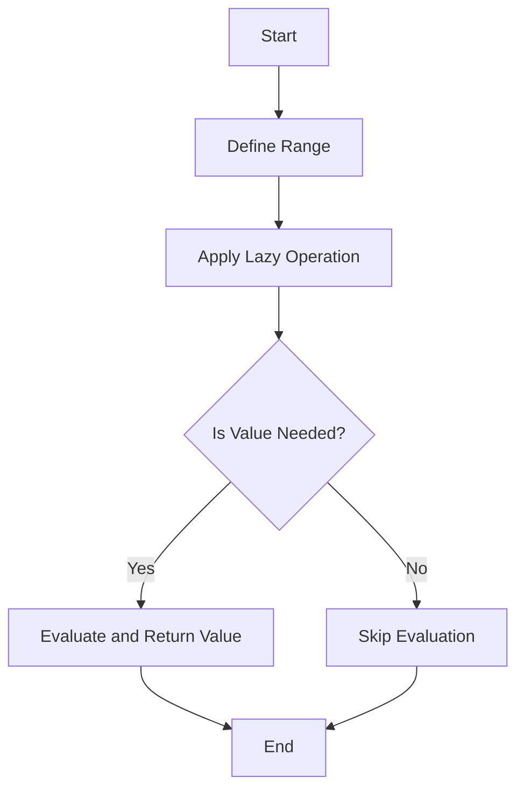

## 9.5 Lazy Evaluation with Ranges

Lazy evaluation is a powerful concept in functional programming that allows for the deferral of computation until the results are actually needed. In the D programming language, this concept is elegantly implemented through the use of ranges. Ranges provide a way to work with sequences of data in a lazy manner, enabling efficient computation and memory usage. In this section, we will explore the intricacies of lazy evaluation with ranges in D, focusing on deferring computation, generating infinite sequences, and optimizing performance through stream processing.

### Understanding Lazy Evaluation

Lazy evaluation is a strategy that delays the evaluation of an expression until its value is needed. This can lead to significant performance improvements by avoiding unnecessary calculations and reducing memory usage. In D, lazy evaluation is closely tied to the concept of ranges, which are a central feature of the language's standard library.

#### Key Benefits of Lazy Evaluation

- **Efficiency**: By deferring computation, lazy evaluation can reduce the time complexity of algorithms by avoiding unnecessary work.
- **Memory Usage**: Lazy evaluation can minimize memory consumption by generating values on-the-fly rather than storing them all at once.
- **Infinite Sequences**: Lazy evaluation allows for the creation and manipulation of infinite sequences, which can be processed incrementally.

### Ranges in D

Ranges are a core abstraction in D that represent a sequence of elements. They are similar to iterators in other languages but offer more flexibility and power. Ranges can be finite or infinite, and they support lazy evaluation by default. This makes them ideal for implementing lazy evaluation patterns.

#### Types of Ranges

1. **Input Ranges**: These are the simplest form of ranges and allow for one-pass iteration over a sequence.
2. **Forward Ranges**: These ranges can be iterated multiple times and support the `save` method to create a copy of the range.
3. **Bidirectional Ranges**: These ranges can be iterated in both directions, supporting both `front` and `back` operations.
4. **Random Access Ranges**: These ranges allow for direct access to elements by index, similar to arrays.

### Deferring Computation with Ranges

Deferring computation is a hallmark of lazy evaluation. In D, ranges enable this by allowing computations to be specified but not executed until the results are needed. This can be particularly useful in scenarios where not all elements of a sequence are required, or when working with large datasets.

#### Example: Lazy Filtering

Consider a scenario where we want to filter a large dataset to find elements that match a certain condition. Using lazy evaluation with ranges, we can define the filtering operation without immediately executing it.

```d
import std.algorithm.iteration : filter;
import std.range : iota;
import std.stdio : writeln;

void main() {
    auto numbers = iota(1, 100); // Generate numbers from 1 to 99
    auto evenNumbers = numbers.filter!(n => n % 2 == 0); // Define a lazy filter

    // The filter is only applied when we iterate over the range
    foreach (n; evenNumbers) {
        writeln(n);
    }
}
```

In this example, the `filter` function creates a lazy range that only evaluates the condition when iterating over the elements. This defers the computation until the `foreach` loop is executed.

### Infinite Sequences

One of the most powerful applications of lazy evaluation is the ability to work with infinite sequences. Since values are generated on-demand, we can define sequences that conceptually have no end.

#### Example: Infinite Fibonacci Sequence

Let's create an infinite sequence of Fibonacci numbers using lazy evaluation with ranges.

```d
import std.range : generate;
import std.stdio : writeln;

void main() {
    auto fibonacci = generate!((ulong a = 0, ulong b = 1) {
        auto next = a + b;
        a = b;
        b = next;
        return a;
    });

    // Print the first 10 Fibonacci numbers
    foreach (n; fibonacci.take(10)) {
        writeln(n);
    }
}
```

In this example, the `generate` function creates an infinite range of Fibonacci numbers. The `take` function is used to limit the output to the first 10 numbers, demonstrating how we can work with infinite sequences in a controlled manner.

### Use Cases and Examples

Lazy evaluation with ranges is particularly useful in scenarios where performance optimization and efficient resource management are critical. Let's explore some common use cases.

#### Optimized Performance

By deferring computation, lazy evaluation can significantly reduce the computational overhead of processing large datasets. This is especially beneficial in systems programming, where performance is paramount.

##### Example: Lazy Map-Reduce

Consider a map-reduce operation where we want to transform and aggregate a large dataset.

```d
import std.algorithm.iteration : map, reduce;
import std.range : iota;
import std.stdio : writeln;

void main() {
    auto numbers = iota(1, 1000000); // Large dataset
    auto squares = numbers.map!(n => n * n); // Lazy map operation
    auto sumOfSquares = reduce!((a, b) => a + b)(squares); // Lazy reduce operation

    writeln("Sum of squares: ", sumOfSquares);
}
```

In this example, the `map` and `reduce` operations are performed lazily, ensuring that only the necessary computations are executed. This can lead to significant performance improvements, especially for large datasets.

#### Stream Processing

Lazy evaluation is also well-suited for stream processing, where data is processed incrementally as it becomes available. This is common in applications that handle continuous data flows, such as network protocols or real-time data analytics.

##### Example: Processing a Stream of Data

Let's simulate processing a stream of data using lazy evaluation with ranges.

```d
import std.algorithm.iteration : filter, map;
import std.range : iota;
import std.stdio : writeln;

void main() {
    auto dataStream = iota(1, 100); // Simulated data stream
    auto processedStream = dataStream
        .filter!(n => n % 2 == 0) // Filter even numbers
        .map!(n => n * n); // Square the numbers

    // Process the stream lazily
    foreach (n; processedStream) {
        writeln(n);
    }
}
```

In this example, the data stream is processed lazily, allowing for efficient handling of potentially large or infinite data sources.

### Visualizing Lazy Evaluation with Ranges

To better understand how lazy evaluation with ranges works, let's visualize the process using a flowchart. This will help illustrate the deferred computation and on-demand generation of values.



**Figure 1**: This flowchart illustrates the process of lazy evaluation with ranges. The computation is deferred until the value is needed, at which point it is evaluated and returned.

### Design Considerations

When using lazy evaluation with ranges, there are several design considerations to keep in mind:

- **Memory Usage**: While lazy evaluation can reduce memory usage by generating values on-demand, it can also lead to increased memory consumption if not managed carefully. Ensure that ranges are consumed promptly to avoid holding onto unnecessary resources.
- **Performance**: Lazy evaluation can improve performance by deferring computation, but it can also introduce overhead if the deferred operations are complex. Profile your code to ensure that lazy evaluation is providing the desired performance benefits.
- **Complexity**: Lazy evaluation can add complexity to your code, especially when dealing with infinite sequences or complex transformations. Ensure that your code remains readable and maintainable.

### Differences and Similarities with Other Patterns

Lazy evaluation with ranges shares similarities with other functional programming patterns, such as map-reduce and stream processing. However, it is distinct in its focus on deferring computation and generating values on-demand. Unlike eager evaluation, where all computations are performed upfront, lazy evaluation allows for more flexible and efficient handling of data.

### Try It Yourself

To deepen your understanding of lazy evaluation with ranges, try modifying the code examples provided in this section. Experiment with different range operations, such as `filter`, `map`, and `reduce`, and observe how they affect the performance and behavior of your programs. Consider implementing your own infinite sequences or stream processing pipelines to explore the full potential of lazy evaluation in D.

### Knowledge Check

Before moving on, take a moment to reflect on the key concepts covered in this section. Consider the benefits and challenges of lazy evaluation with ranges, and think about how you might apply these techniques in your own projects.

### Embrace the Journey

Remember, mastering lazy evaluation with ranges is just one step in your journey to becoming an expert in D programming. As you continue to explore the language and its features, you'll discover new ways to optimize your code and build high-performance systems. Stay curious, keep experimenting, and enjoy the process of learning and growing as a developer.

## Quiz Time!



### What is lazy evaluation?

- [x] A strategy that delays the evaluation of an expression until its value is needed.
- [ ] A method of pre-computing all values in a sequence.
- [ ] A technique for optimizing memory usage by storing all values at once.
- [ ] A way to immediately execute all computations in a program.

> **Explanation:** Lazy evaluation defers computation until the result is needed, optimizing performance and memory usage.

### What is a key benefit of using lazy evaluation with ranges?

- [x] It reduces unnecessary calculations.
- [ ] It increases the complexity of code.
- [ ] It requires more memory upfront.
- [ ] It executes all operations immediately.

> **Explanation:** Lazy evaluation with ranges reduces unnecessary calculations by deferring them until needed.

### Which type of range allows for one-pass iteration over a sequence?

- [x] Input Range
- [ ] Forward Range
- [ ] Bidirectional Range
- [ ] Random Access Range

> **Explanation:** Input ranges support one-pass iteration, making them the simplest form of ranges.

### How does lazy evaluation handle infinite sequences?

- [x] By generating values on-demand.
- [ ] By storing all values in memory.
- [ ] By pre-computing a fixed number of values.
- [ ] By limiting the sequence to a finite length.

> **Explanation:** Lazy evaluation generates values on-demand, allowing for the handling of infinite sequences.

### What function is used to create an infinite range in D?

- [x] `generate`
- [ ] `iota`
- [ ] `filter`
- [ ] `map`

> **Explanation:** The `generate` function creates an infinite range by repeatedly applying a function.

### What is a common use case for lazy evaluation with ranges?

- [x] Stream processing
- [ ] Immediate computation
- [ ] Static data analysis
- [ ] Pre-computed datasets

> **Explanation:** Lazy evaluation is ideal for stream processing, where data is processed incrementally.

### What is the purpose of the `take` function in the context of ranges?

- [x] To limit the number of elements processed.
- [ ] To filter elements based on a condition.
- [ ] To map elements to new values.
- [ ] To sort elements in a range.

> **Explanation:** The `take` function limits the number of elements processed in a range.

### How can lazy evaluation improve performance?

- [x] By deferring computation until necessary.
- [ ] By executing all operations upfront.
- [ ] By increasing memory usage.
- [ ] By storing all values in memory.

> **Explanation:** Lazy evaluation improves performance by deferring computation until necessary.

### What is a potential drawback of lazy evaluation?

- [x] It can introduce complexity to the code.
- [ ] It always reduces memory usage.
- [ ] It executes computations immediately.
- [ ] It simplifies all code structures.

> **Explanation:** Lazy evaluation can add complexity, especially with infinite sequences or complex transformations.

### True or False: Lazy evaluation with ranges can only be used with finite sequences.

- [ ] True
- [x] False

> **Explanation:** Lazy evaluation with ranges can be used with both finite and infinite sequences, generating values on-demand.


