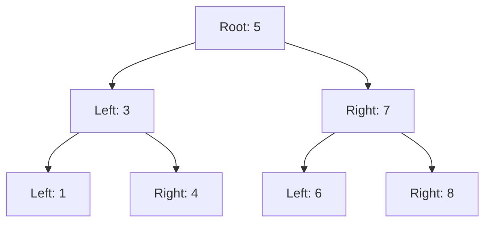

## 9.6 Functional Data Structures and Algorithms

Functional programming paradigms have gained significant traction in modern software development due to their emphasis on immutability and declarative code. In this section, we delve into functional data structures and algorithms in the D programming language, focusing on immutability, persistence, and their practical applications in systems programming. By understanding these concepts, you can build robust, concurrent, and maintainable software systems.

### Introduction to Functional Data Structures

Functional data structures are designed to be immutable, meaning once they are created, they cannot be changed. This immutability offers several advantages, such as easier reasoning about code, reduced side effects, and enhanced concurrency support. Let's explore these concepts in detail.

#### Immutable Data Structures

**Immutable Data Structures** are those that do not change after they are created. Instead of modifying the structure, operations on immutable data structures return a new structure with the desired changes. This approach eliminates side effects and makes reasoning about code easier.

##### Benefits of Immutability

1. **Simplified Reasoning**: Since data does not change, you can reason about the state of your program more easily.
2. **Concurrency**: Immutable data structures are inherently thread-safe, as there are no changes to synchronize.
3. **Predictability**: Functions that operate on immutable data structures are pure, meaning they always produce the same output for the same input.

##### Example: Immutable List

Let's look at an example of an immutable list in D:

```d
import std.stdio;

struct ImmutableList(T) {
    private T[] data;

    this(T[] elements) {
        data = elements.dup; // Duplicate to ensure immutability
    }

    ImmutableList!T append(T element) {
        T[] newData = data ~ element; // Create a new array with the element
        return ImmutableList!T(newData);
    }

    void print() const {
        writeln(data);
    }
}

void main() {
    auto list = ImmutableList!int([1, 2, 3]);
    auto newList = list.append(4);

    list.print(); // Output: [1, 2, 3]
    newList.print(); // Output: [1, 2, 3, 4]
}
```

In this example, the `ImmutableList` struct provides an `append` method that returns a new list with the added element, preserving the immutability of the original list.

### Persistent Data Structures

**Persistent Data Structures** are a type of immutable data structure that efficiently share data between different versions. They allow you to maintain multiple versions of a data structure without duplicating the entire structure, which is crucial for performance.

#### Efficiency Through Sharing

Persistent data structures achieve efficiency by sharing parts of the data structure that remain unchanged between versions. This sharing minimizes memory usage and improves performance.

##### Example: Persistent Binary Tree

Consider a persistent binary tree where each modification creates a new version of the tree:

```d
import std.stdio;

struct PersistentTree(T) {
    T value;
    PersistentTree* left;
    PersistentTree* right;

    this(T value, PersistentTree* left = null, PersistentTree* right = null) {
        this.value = value;
        this.left = left;
        this.right = right;
    }

    PersistentTree* insert(T newValue) {
        if (newValue < value) {
            return new PersistentTree(value, left ? left.insert(newValue) : new PersistentTree(newValue), right);
        } else {
            return new PersistentTree(value, left, right ? right.insert(newValue) : new PersistentTree(newValue));
        }
    }

    void printInOrder() const {
        if (left) left.printInOrder();
        writeln(value);
        if (right) right.printInOrder();
    }
}

void main() {
    auto tree = new PersistentTree!int(5);
    auto newTree = tree.insert(3);
    newTree = newTree.insert(7);

    writeln("Original Tree:");
    tree.printInOrder(); // Output: 5

    writeln("New Tree:");
    newTree.printInOrder(); // Output: 3, 5, 7
}
```

In this example, each insertion creates a new version of the tree, sharing unchanged nodes with previous versions.

### Use Cases and Examples

Functional data structures and algorithms have numerous applications in software development. Let's explore some common use cases.

#### Undo Mechanisms

One of the most common applications of persistent data structures is implementing undo mechanisms. By maintaining a history of states, you can easily revert to previous states without complex state management.

##### Example: Undo Stack

```d
import std.stdio;

struct UndoStack(T) {
    private T[] history;

    this(T initialState) {
        history = [initialState];
    }

    void push(T state) {
        history ~= state;
    }

    T undo() {
        if (history.length > 1) {
            history = history[0 .. $ - 1];
        }
        return history[$ - 1];
    }

    void printCurrentState() const {
        writeln("Current State: ", history[$ - 1]);
    }
}

void main() {
    auto stack = UndoStack!string("Initial");
    stack.push("State 1");
    stack.push("State 2");

    stack.printCurrentState(); // Output: Current State: State 2
    stack.undo();
    stack.printCurrentState(); // Output: Current State: State 1
}
```

In this example, the `UndoStack` maintains a history of states, allowing you to revert to previous states using the `undo` method.

#### Concurrency

Immutable and persistent data structures are ideal for concurrent programming, as they eliminate the need for synchronization mechanisms like locks.

##### Example: Concurrent Access

```d
import std.stdio;
import std.parallelism;

struct ConcurrentList(T) {
    private T[] data;

    this(T[] elements) {
        data = elements.dup;
    }

    ConcurrentList!T append(T element) {
        T[] newData = data ~ element;
        return ConcurrentList!T(newData);
    }

    void print() const {
        writeln(data);
    }
}

void main() {
    auto list = ConcurrentList!int([1, 2, 3]);

    auto tasks = taskPool.map!(i => {
        auto newList = list.append(i);
        newList.print();
    })([4, 5, 6]);

    foreach (result; tasks) {
        result();
    }
}
```

In this example, multiple tasks append elements to the list concurrently without any synchronization issues, thanks to the immutability of `ConcurrentList`.

### Visualizing Functional Data Structures

To better understand the concept of persistent data structures, let's visualize a persistent binary tree using a diagram.



**Diagram Description**: This diagram represents a persistent binary tree with a root node of 5. The left child is 3, and the right child is 7. Each node can have its own left and right children, forming a tree structure.

### Designing Functional Algorithms

Functional algorithms are designed to work with immutable data structures, emphasizing recursion and higher-order functions. Let's explore some common functional algorithms.

#### Map and Filter

The `map` and `filter` functions are fundamental in functional programming, allowing you to transform and filter data collections.

##### Example: Map and Filter

```d
import std.stdio;
import std.algorithm;

void main() {
    int[] numbers = [1, 2, 3, 4, 5];

    auto squared = numbers.map!(n => n * n).array;
    auto evenNumbers = numbers.filter!(n => n % 2 == 0).array;

    writeln("Squared: ", squared); // Output: Squared: [1, 4, 9, 16, 25]
    writeln("Even Numbers: ", evenNumbers); // Output: Even Numbers: [2, 4]
}
```

In this example, `map` is used to square each number, and `filter` is used to select even numbers from the list.

#### Reduce

The `reduce` function aggregates data by applying a binary function to elements in a collection.

##### Example: Reduce

```d
import std.stdio;
import std.algorithm;

void main() {
    int[] numbers = [1, 2, 3, 4, 5];

    auto sum = numbers.reduce!((a, b) => a + b);
    writeln("Sum: ", sum); // Output: Sum: 15
}
```

In this example, `reduce` is used to calculate the sum of the numbers in the list.

### Try It Yourself

Now that we've explored functional data structures and algorithms, try experimenting with the code examples. Here are some suggestions:

- Modify the `ImmutableList` to support additional operations like `remove` or `find`.
- Implement a persistent stack or queue using similar principles.
- Experiment with different functional algorithms, such as `fold` or `scan`.

### References and Further Reading

- [MDN Web Docs: Functional Programming](https://developer.mozilla.org/en-US/docs/Glossary/Functional_programming)
- [Wikipedia: Persistent Data Structure](https://en.wikipedia.org/wiki/Persistent_data_structure)
- [D Programming Language: std.algorithm](https://dlang.org/phobos/std_algorithm.html)

### Knowledge Check

Before we conclude, let's reinforce what we've learned with some questions and exercises.

1. **What are the benefits of using immutable data structures?**
2. **How do persistent data structures achieve efficiency?**
3. **Implement a persistent linked list in D.**
4. **What are the advantages of using functional algorithms like `map` and `filter`?**

### Embrace the Journey

Remember, mastering functional data structures and algorithms is a journey. As you continue to explore these concepts, you'll discover new ways to build efficient and maintainable software systems. Keep experimenting, stay curious, and enjoy the journey!

## Quiz Time!



### What is a key advantage of immutable data structures?

- [x] They simplify reasoning about code.
- [ ] They require more memory.
- [ ] They are slower to access.
- [ ] They are difficult to implement.

> **Explanation:** Immutable data structures simplify reasoning about code because they do not change state, making it easier to predict behavior.

### How do persistent data structures achieve efficiency?

- [x] By sharing unchanged parts between versions.
- [ ] By duplicating data for each version.
- [ ] By using more memory.
- [ ] By avoiding recursion.

> **Explanation:** Persistent data structures achieve efficiency by sharing unchanged parts between versions, minimizing memory usage.

### Which function is used to transform elements in a collection?

- [x] map
- [ ] filter
- [ ] reduce
- [ ] fold

> **Explanation:** The `map` function is used to transform elements in a collection by applying a function to each element.

### What is the purpose of the `reduce` function?

- [x] To aggregate data by applying a binary function.
- [ ] To filter elements based on a condition.
- [ ] To transform elements in a collection.
- [ ] To duplicate data.

> **Explanation:** The `reduce` function aggregates data by applying a binary function to elements in a collection.

### Which of the following is a use case for persistent data structures?

- [x] Undo mechanisms
- [ ] Real-time processing
- [ ] Data duplication
- [ ] Memory-intensive applications

> **Explanation:** Persistent data structures are commonly used in undo mechanisms to maintain a history of states.

### What is a benefit of using functional algorithms like `map` and `filter`?

- [x] They promote declarative code.
- [ ] They increase code complexity.
- [ ] They require more memory.
- [ ] They are slower to execute.

> **Explanation:** Functional algorithms like `map` and `filter` promote declarative code by focusing on what to do rather than how to do it.

### How can you implement concurrency with immutable data structures?

- [x] By eliminating the need for synchronization.
- [ ] By using locks.
- [ ] By duplicating data.
- [ ] By avoiding recursion.

> **Explanation:** Immutable data structures eliminate the need for synchronization, making them ideal for concurrent programming.

### What is a persistent binary tree?

- [x] A tree that shares unchanged nodes between versions.
- [ ] A tree that duplicates nodes for each version.
- [ ] A tree that uses more memory.
- [ ] A tree that avoids recursion.

> **Explanation:** A persistent binary tree shares unchanged nodes between versions, allowing efficient versioning.

### Which D module provides functional programming utilities?

- [x] std.algorithm
- [ ] std.parallelism
- [ ] std.concurrency
- [ ] std.math

> **Explanation:** The `std.algorithm` module in D provides functional programming utilities like `map`, `filter`, and `reduce`.

### True or False: Immutable data structures are inherently thread-safe.

- [x] True
- [ ] False

> **Explanation:** Immutable data structures are inherently thread-safe because they do not change state, eliminating the need for synchronization.




