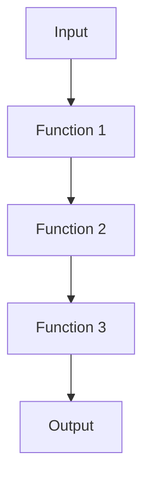

## 9.7 Using `std.functional` Module

The D programming language offers a rich set of features that make it an excellent choice for systems programming. Among these features is the `std.functional` module, which provides a suite of tools for functional programming. This module allows developers to write more concise, expressive, and reusable code by leveraging functions as first-class citizens. In this section, we will explore the key functions of the `std.functional` module, including `compose`, `memoize`, and `partial`, and demonstrate how they can be used to improve code reusability and performance.

### Introduction to Functional Programming in D

Functional programming is a paradigm that treats computation as the evaluation of mathematical functions and avoids changing state or mutable data. D supports functional programming through its powerful type system, first-class functions, and the `std.functional` module. By using functional programming techniques, you can write code that is easier to reason about, test, and maintain.

### Key Functions in `std.functional`

The `std.functional` module provides several key functions that are essential for functional programming in D. Let's explore each of these functions in detail.

#### `compose`

The `compose` function allows you to combine multiple functions into a single function. This is useful for creating complex operations from simple building blocks. The `compose` function takes two or more functions as arguments and returns a new function that applies the input functions in sequence.

**Example:**

```d
import std.functional : compose;
import std.stdio : writeln;

int add(int x, int y) {
    return x + y;
}

int multiply(int x, int y) {
    return x * y;
}

void main() {
    auto addThenMultiply = compose!((a, b) => multiply(a, b), (a, b) => add(a, b));
    writeln(addThenMultiply(2, 3)); // Output: 15
}
```

In this example, `compose` is used to create a new function `addThenMultiply` that first adds two numbers and then multiplies the result.

#### `memoize`

The `memoize` function is used to cache the results of expensive function calls and return the cached result when the same inputs occur again. This can significantly improve performance by avoiding redundant computations.

**Example:**

```d
import std.functional : memoize;
import std.stdio : writeln;

int fibonacci(int n) {
    if (n <= 1) return n;
    return fibonacci(n - 1) + fibonacci(n - 2);
}

void main() {
    auto memoizedFibonacci = memoize!fibonacci;
    writeln(memoizedFibonacci(40)); // Output: 102334155
}
```

In this example, `memoize` is used to optimize the computation of the Fibonacci sequence by caching previously computed results.

#### `partial`

The `partial` function allows you to fix a number of arguments to a function, producing a new function with fewer arguments. This is useful for creating specialized functions from more general ones.

**Example:**

```d
import std.functional : partial;
import std.stdio : writeln;

int power(int base, int exponent) {
    int result = 1;
    for (int i = 0; i < exponent; i++) {
        result *= base;
    }
    return result;
}

void main() {
    auto square = partial!(power, 2);
    writeln(square(3)); // Output: 8
}
```

In this example, `partial` is used to create a new function `square` that computes the square of a number by fixing the base argument of the `power` function to 2.

### Use Cases and Examples

#### Code Reusability

One of the main advantages of using the `std.functional` module is the ability to create reusable code. By composing simple functions into more complex ones, you can build a library of reusable components that can be easily combined and extended.

**Example:**

```d
import std.functional : compose, partial;
import std.stdio : writeln;

int increment(int x) {
    return x + 1;
}

int doubleValue(int x) {
    return x * 2;
}

void main() {
    auto incrementThenDouble = compose!(doubleValue, increment);
    writeln(incrementThenDouble(3)); // Output: 8
}
```

In this example, `compose` is used to create a new function `incrementThenDouble` that first increments a number and then doubles it. This demonstrates how simple functions can be combined to create more complex operations.

#### Performance Improvements

The `memoize` function can be used to improve the performance of functions that are called repeatedly with the same arguments. By caching the results of these function calls, you can avoid redundant computations and reduce the overall execution time of your program.

**Example:**

```d
import std.functional : memoize;
import std.stdio : writeln;
import std.datetime : StopWatch;

int factorial(int n) {
    if (n <= 1) return 1;
    return n * factorial(n - 1);
}

void main() {
    auto memoizedFactorial = memoize!factorial;
    StopWatch sw;

    sw.start();
    writeln(memoizedFactorial(20)); // Output: 2432902008176640000
    writeln("Time taken: ", sw.peek().to!string);

    sw.reset();
    sw.start();
    writeln(memoizedFactorial(20)); // Output: 2432902008176640000
    writeln("Time taken: ", sw.peek().to!string);
}
```

In this example, `memoize` is used to optimize the computation of the factorial function. The first call to `memoizedFactorial` computes the result and caches it, while the second call retrieves the result from the cache, significantly reducing the execution time.

### Visualizing Function Composition

To better understand how function composition works, let's visualize the process using a flowchart. This will help you see how data flows through the composed functions.



In this flowchart, the input is passed to Function 1, which processes it and passes the result to Function 2. Function 2 processes the result and passes it to Function 3, which produces the final output. This illustrates how function composition allows you to chain multiple functions together to create complex operations.

### Try It Yourself

Now that we've covered the basics of the `std.functional` module, it's time to experiment with the concepts we've discussed. Try modifying the code examples to create your own composed functions, memoized functions, and partially applied functions. Here are some suggestions:

- Create a new function that composes three or more functions.
- Use `memoize` to optimize a different recursive function.
- Use `partial` to create a specialized version of a function with multiple arguments.

### References and Links

For more information on the `std.functional` module and functional programming in D, check out the following resources:

- [D Programming Language Documentation](https://dlang.org/library/std/functional.html)
- [Functional Programming in D](https://wiki.dlang.org/Functional_Programming)
- [MDN Web Docs on Functional Programming](https://developer.mozilla.org/en-US/docs/Glossary/Functional_programming)

### Knowledge Check

To reinforce your understanding of the `std.functional` module, try answering the following questions:

1. What is the purpose of the `compose` function in the `std.functional` module?
2. How does `memoize` improve the performance of a function?
3. What is the difference between `compose` and `partial`?
4. How can you use `partial` to create a specialized function?
5. What are some use cases for function composition?

### Embrace the Journey

Remember, mastering functional programming in D is a journey. As you continue to explore the `std.functional` module, you'll discover new ways to write more expressive and efficient code. Keep experimenting, stay curious, and enjoy the process!

## Quiz Time!



### What is the primary purpose of the `compose` function in the `std.functional` module?

- [x] To combine multiple functions into a single function
- [ ] To cache the results of function calls
- [ ] To fix a number of arguments to a function
- [ ] To improve the performance of recursive functions

> **Explanation:** The `compose` function is used to combine multiple functions into a single function, allowing for complex operations to be built from simple building blocks.

### How does `memoize` improve the performance of a function?

- [x] By caching the results of expensive function calls
- [ ] By combining multiple functions into one
- [ ] By fixing a number of arguments to a function
- [ ] By reducing the number of arguments a function takes

> **Explanation:** `memoize` improves performance by caching the results of expensive function calls and returning the cached result when the same inputs occur again.

### What is the difference between `compose` and `partial`?

- [x] `compose` combines functions, while `partial` fixes arguments to a function
- [ ] `compose` caches results, while `partial` combines functions
- [ ] `compose` fixes arguments, while `partial` caches results
- [ ] `compose` and `partial` perform the same function

> **Explanation:** `compose` is used to combine functions into a single function, whereas `partial` is used to fix a number of arguments to a function, creating a new function with fewer arguments.

### How can you use `partial` to create a specialized function?

- [x] By fixing one or more arguments of a general function
- [ ] By combining multiple functions into one
- [ ] By caching the results of function calls
- [ ] By reducing the number of arguments a function takes

> **Explanation:** `partial` allows you to fix one or more arguments of a general function, creating a specialized function with fewer arguments.

### What are some use cases for function composition?

- [x] Creating complex operations from simple functions
- [x] Improving code reusability
- [ ] Caching function results
- [ ] Fixing arguments to a function

> **Explanation:** Function composition is used to create complex operations from simple functions and improve code reusability by allowing functions to be easily combined and extended.

### Which function in `std.functional` is used to cache results of function calls?

- [x] `memoize`
- [ ] `compose`
- [ ] `partial`
- [ ] `reduce`

> **Explanation:** The `memoize` function is used to cache the results of function calls, improving performance by avoiding redundant computations.

### What is a benefit of using `partial` in functional programming?

- [x] It allows for the creation of specialized functions from general ones
- [ ] It combines multiple functions into one
- [ ] It caches the results of function calls
- [ ] It reduces the number of arguments a function takes

> **Explanation:** `partial` is beneficial in functional programming as it allows for the creation of specialized functions from general ones by fixing certain arguments.

### Which function would you use to create a new function that first increments a number and then doubles it?

- [x] `compose`
- [ ] `memoize`
- [ ] `partial`
- [ ] `map`

> **Explanation:** The `compose` function is used to create a new function by combining two functions, such as one that increments a number and another that doubles it.

### What is the output of the following code snippet?
```d
import std.functional : compose;
int add(int x, int y) { return x + y; }
int multiply(int x, int y) { return x * y; }
auto addThenMultiply = compose!((a, b) => multiply(a, b), (a, b) => add(a, b));
writeln(addThenMultiply(2, 3));
```

- [x] 15
- [ ] 5
- [ ] 6
- [ ] 10

> **Explanation:** The `addThenMultiply` function first adds the numbers (2 + 3 = 5) and then multiplies the result by the second number (5 * 3 = 15).

### True or False: The `std.functional` module is only useful for functional programming in D.

- [ ] True
- [x] False

> **Explanation:** While the `std.functional` module is particularly useful for functional programming, its features can be leveraged in various programming paradigms to improve code reusability and performance.


