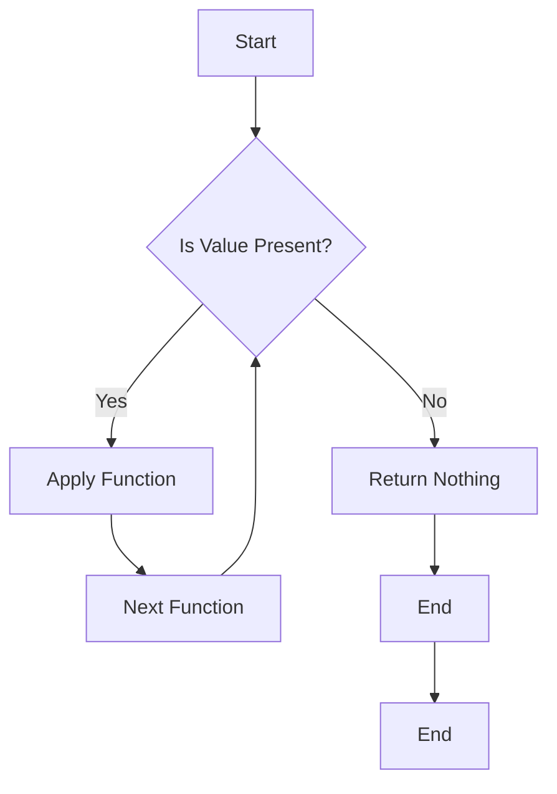

## 9.8 Monads and Functors in D

In the realm of functional programming, Monads and Functors are powerful abstractions that allow developers to handle computations with context, such as optional values, error handling, and side effects. In this section, we will delve into the concepts of Monads and Functors in the D programming language, explore their implementation, and demonstrate their use cases with practical examples.

### Understanding Monads

Monads are a design pattern used to handle computations that involve context, such as optional values, errors, or state. They provide a way to chain operations together, allowing for clean and maintainable code. A Monad is essentially a type that implements two fundamental operations: `bind` (also known as `flatMap`) and `unit` (or `return`).

#### Key Concepts of Monads

- **Unit (Return)**: This operation takes a value and wraps it in a monadic context. It is the entry point for values into the monadic world.
- **Bind (FlatMap)**: This operation takes a monadic value and a function that returns a monadic value, and chains them together. It allows for sequencing operations while maintaining the context.

#### Implementing Monads in D

Let's explore how to implement Monads in D, focusing on the `Maybe` and `Result` types, which are commonly used to handle optional and error-prone computations.

##### Maybe Monad

The `Maybe` Monad is used to represent computations that may fail or return nothing. It encapsulates an optional value, which can either be `Just` a value or `Nothing`.

```d
// Define the Maybe type
struct Maybe(T) {
    T* value;

    // Unit operation: Wrap a value in a Maybe context
    static Maybe!T just(T value) {
        return Maybe!T(&value);
    }

    // Bind operation: Chain computations
    Maybe!U bind(U)(U delegate(T) func) {
        if (value is null) {
            return Maybe!U(null);
        }
        return Maybe!U.just(func(*value));
    }

    // Helper function to check if the Maybe is Nothing
    bool isNothing() {
        return value is null;
    }
}

// Example usage of Maybe Monad
void main() {
    auto maybeValue = Maybe!int.just(5);

    auto result = maybeValue.bind!(x => x * 2)
                            .bind!(x => x + 3);

    if (!result.isNothing()) {
        writeln("Result: ", *result.value);
    } else {
        writeln("No value present.");
    }
}
```

In this example, the `Maybe` Monad is used to chain computations that may or may not produce a value. The `bind` function allows us to apply transformations to the value if it exists, while gracefully handling the absence of a value.

##### Result Monad

The `Result` Monad is used to handle computations that may result in an error. It encapsulates either a successful value (`Ok`) or an error (`Err`).

```d
// Define the Result type
struct Result(T, E) {
    T* okValue;
    E* errValue;

    // Unit operation: Wrap a value in a Result context
    static Result!T!E ok(T value) {
        return Result!T!E(&value, null);
    }

    static Result!T!E err(E error) {
        return Result!T!E(null, &error);
    }

    // Bind operation: Chain computations
    Result!U!E bind(U)(Result!U!E delegate(T) func) {
        if (errValue !is null) {
            return Result!U!E.err(*errValue);
        }
        return func(*okValue);
    }

    // Helper functions to check the state of the Result
    bool isOk() {
        return okValue !is null;
    }

    bool isErr() {
        return errValue !is null;
    }
}

// Example usage of Result Monad
void main() {
    auto result = Result!int!string.ok(10);

    auto finalResult = result.bind!(x => Result!int!string.ok(x * 2))
                             .bind!(x => Result!int!string.ok(x + 5));

    if (finalResult.isOk()) {
        writeln("Success: ", *finalResult.okValue);
    } else {
        writeln("Error: ", *finalResult.errValue);
    }
}
```

In this example, the `Result` Monad is used to chain computations that may produce an error. The `bind` function allows us to apply transformations to the value if it is successful, while propagating errors through the chain.

### Use Cases and Examples

Monads are particularly useful in scenarios where computations need to be chained together, and each step may involve context such as optional values or errors. Let's explore some common use cases.

#### Error Handling

Monads provide a structured way to handle errors without resorting to exceptions. By using the `Result` Monad, we can propagate errors through a chain of computations and handle them at the end.

```d
// Function that may fail
Result!int!string divide(int a, int b) {
    if (b == 0) {
        return Result!int!string.err("Division by zero");
    }
    return Result!int!string.ok(a / b);
}

void main() {
    auto result = divide(10, 0)
                  .bind!(x => Result!int!string.ok(x * 2));

    if (result.isOk()) {
        writeln("Success: ", *result.okValue);
    } else {
        writeln("Error: ", *result.errValue);
    }
}
```

In this example, the `divide` function returns a `Result` Monad, allowing us to chain further computations while handling the division by zero error gracefully.

#### Chained Computations

Monads enable us to sequence dependent operations, ensuring that each step is executed only if the previous one was successful.

```d
// Function that performs a computation
Maybe!int addFive(int x) {
    return Maybe!int.just(x + 5);
}

void main() {
    auto maybeValue = Maybe!int.just(10);

    auto result = maybeValue.bind!(addFive)
                            .bind!(x => Maybe!int.just(x * 2));

    if (!result.isNothing()) {
        writeln("Result: ", *result.value);
    } else {
        writeln("No value present.");
    }
}
```

In this example, we use the `Maybe` Monad to chain computations, ensuring that each step is executed only if the value is present.

### Visualizing Monads and Functors

To better understand the flow of computations in Monads, let's visualize the process using a diagram.



**Diagram Description:** This flowchart illustrates the process of chaining computations in a Monad. If a value is present, the function is applied, and the next function is executed. If no value is present, the computation returns nothing.

### Functors in D

Functors are a simpler abstraction compared to Monads. They provide a way to apply a function to a wrapped value, transforming it while maintaining the context. In D, Functors can be implemented using the `map` function.

#### Implementing Functors

Let's implement a simple Functor for the `Maybe` type.

```d
// Define the Functor interface
interface Functor(T) {
    Functor!U map(U)(U delegate(T) func);
}

// Extend Maybe to implement Functor
struct Maybe(T) : Functor!T {
    T* value;

    // Map operation: Apply a function to the wrapped value
    Maybe!U map(U)(U delegate(T) func) {
        if (value is null) {
            return Maybe!U(null);
        }
        return Maybe!U.just(func(*value));
    }
}

// Example usage of Functor
void main() {
    auto maybeValue = Maybe!int.just(5);

    auto result = maybeValue.map!(x => x * 2)
                            .map!(x => x + 3);

    if (!result.isNothing()) {
        writeln("Result: ", *result.value);
    } else {
        writeln("No value present.");
    }
}
```

In this example, the `map` function is used to apply transformations to the value inside the `Maybe` Functor, demonstrating how Functors allow for function application while maintaining context.

### Differences and Similarities

Monads and Functors are related concepts, but they serve different purposes:

- **Functors**: Allow for function application to a wrapped value, maintaining context. They provide a `map` operation.
- **Monads**: Extend Functors by providing a `bind` operation, allowing for chaining computations with context.

### Try It Yourself

Experiment with the code examples provided by modifying the functions and values. Try creating your own Monads and Functors for different use cases, such as handling asynchronous computations or stateful operations.

### Knowledge Check

- Explain the difference between `bind` and `map` operations.
- Implement a custom Monad for handling asynchronous computations.
- Describe a scenario where using a Monad would be beneficial.

### Embrace the Journey

Remember, mastering Monads and Functors is a journey. As you explore these concepts, you'll gain a deeper understanding of functional programming patterns and how they can be applied to build robust and maintainable software systems. Keep experimenting, stay curious, and enjoy the journey!

## Quiz Time!



### What is the primary purpose of a Monad?

- [x] To handle computations with context, such as optional values or errors.
- [ ] To apply a function to a wrapped value.
- [ ] To manage memory allocation.
- [ ] To optimize performance.

> **Explanation:** Monads are used to handle computations with context, such as optional values or errors, allowing for chaining operations.

### What operation does a Functor provide?

- [x] Map
- [ ] Bind
- [ ] Unit
- [ ] Return

> **Explanation:** Functors provide a `map` operation, which allows for applying a function to a wrapped value while maintaining context.

### How does the `bind` operation differ from `map`?

- [x] `bind` chains computations, while `map` applies a function to a wrapped value.
- [ ] `bind` applies a function to a wrapped value, while `map` chains computations.
- [ ] Both `bind` and `map` perform the same operation.
- [ ] `bind` is used for error handling, while `map` is not.

> **Explanation:** `bind` is used to chain computations, while `map` applies a function to a wrapped value.

### What is the `Maybe` Monad used for?

- [x] Handling computations that may fail or return nothing.
- [ ] Managing memory allocation.
- [ ] Optimizing performance.
- [ ] Handling asynchronous computations.

> **Explanation:** The `Maybe` Monad is used to handle computations that may fail or return nothing, encapsulating an optional value.

### Which Monad is commonly used for error handling?

- [x] Result
- [ ] Maybe
- [ ] List
- [ ] State

> **Explanation:** The `Result` Monad is commonly used for error handling, encapsulating either a successful value or an error.

### What does the `unit` operation do in a Monad?

- [x] Wraps a value in a monadic context.
- [ ] Chains computations together.
- [ ] Applies a function to a wrapped value.
- [ ] Manages memory allocation.

> **Explanation:** The `unit` operation wraps a value in a monadic context, serving as the entry point for values into the monadic world.

### How can Monads help with error handling?

- [x] By propagating errors through a chain of computations.
- [ ] By optimizing performance.
- [ ] By managing memory allocation.
- [ ] By applying functions to wrapped values.

> **Explanation:** Monads help with error handling by propagating errors through a chain of computations, allowing for structured error management.

### What is a key difference between Monads and Functors?

- [x] Monads provide a `bind` operation, while Functors provide a `map` operation.
- [ ] Monads provide a `map` operation, while Functors provide a `bind` operation.
- [ ] Both Monads and Functors provide the same operations.
- [ ] Monads are used for memory management, while Functors are not.

> **Explanation:** Monads provide a `bind` operation for chaining computations, while Functors provide a `map` operation for applying functions to wrapped values.

### Can Monads be used for asynchronous computations?

- [x] True
- [ ] False

> **Explanation:** Monads can be used for asynchronous computations by encapsulating asynchronous operations and chaining them together.

### What is the purpose of the `Result` Monad?

- [x] To handle computations that may result in an error.
- [ ] To manage memory allocation.
- [ ] To optimize performance.
- [ ] To handle asynchronous computations.

> **Explanation:** The `Result` Monad is used to handle computations that may result in an error, encapsulating either a successful value or an error.


