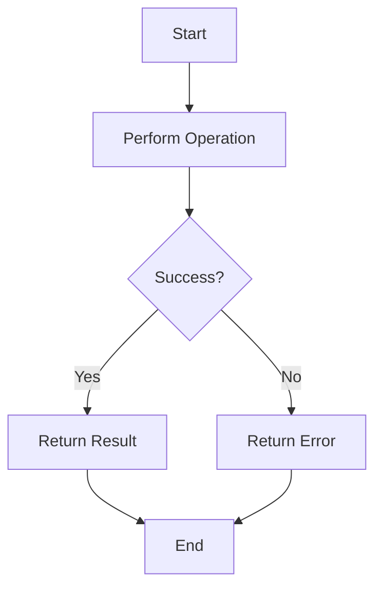

## 9.9 Error Handling using Functional Patterns

In the realm of software development, error handling is a critical aspect that can significantly influence the robustness and maintainability of a system. Traditional error handling mechanisms, such as exceptions, can often lead to complex control flows and unpredictable behavior. In contrast, functional programming offers alternative approaches that emphasize explicit error handling and predictable outcomes. In this section, we will explore how to leverage functional patterns in the D programming language to handle errors effectively.

### Avoiding Exceptions: Using Functional Approaches

Functional programming encourages the use of pure functions and immutable data structures, which inherently promote more predictable and testable code. One of the key strategies in functional error handling is to avoid exceptions and instead use types that explicitly represent the possibility of failure. This approach not only simplifies the logic but also makes error handling more explicit and manageable.

#### Result Types

A common pattern in functional programming for handling errors is the use of result types. These types encapsulate either a successful result or an error, allowing functions to return a value that explicitly indicates success or failure. In D, we can define a simple `Result` type using a template:

```d
// Define a Result type using a template
template Result(T, E)
{
    struct Result
    {
        T value;
        E error;
        bool isSuccess;

        // Constructor for success
        this(T value)
        {
            this.value = value;
            this.isSuccess = true;
        }

        // Constructor for error
        this(E error)
        {
            this.error = error;
            this.isSuccess = false;
        }
    }
}
```

In this example, the `Result` type is a template that takes two parameters: `T` for the successful value type and `E` for the error type. The `Result` struct has a boolean flag `isSuccess` to indicate whether the operation was successful or not.

#### Propagating Errors: Explicitly Handling Error Cases

Using result types, we can propagate errors explicitly through the call chain. This approach ensures that errors are handled at the appropriate level and that the control flow remains clear and predictable. Let's consider a simple example of a function that reads a file and returns its content or an error:

```d
import std.stdio;
import std.file;

// Define a custom error type
enum FileError
{
    FileNotFound,
    ReadError
}

// Function to read a file and return a Result
Result!(string, FileError) readFile(string fileName)
{
    try
    {
        string content = readText(fileName);
        return Result!(string, FileError)(content);
    }
    catch (FileException)
    {
        return Result!(string, FileError)(FileError.FileNotFound);
    }
    catch (Exception)
    {
        return Result!(string, FileError)(FileError.ReadError);
    }
}

void main()
{
    auto result = readFile("example.txt");

    if (result.isSuccess)
    {
        writeln("File content: ", result.value);
    }
    else
    {
        writeln("Error reading file: ", result.error);
    }
}
```

In this example, the `readFile` function returns a `Result` type that encapsulates either the file content or an error. The caller can then check the `isSuccess` flag to determine whether the operation was successful and handle the error accordingly.

### Use Cases and Examples

Functional error handling patterns can be applied to various scenarios to create robust and predictable APIs. Let's explore some use cases and examples.

#### Robust APIs: Providing Predictable Behavior

When designing APIs, it's crucial to provide predictable behavior, especially in error scenarios. By using result types, we can ensure that API consumers are aware of potential errors and handle them explicitly. Consider an API for a simple calculator:

```d
// Define an error type for the calculator
enum CalculatorError
{
    DivisionByZero,
    InvalidOperation
}

// Function to perform division and return a Result
Result!(double, CalculatorError) divide(double numerator, double denominator)
{
    if (denominator == 0)
    {
        return Result!(double, CalculatorError)(CalculatorError.DivisionByZero);
    }
    return Result!(double, CalculatorError)(numerator / denominator);
}

void main()
{
    auto result = divide(10, 0);

    if (result.isSuccess)
    {
        writeln("Result: ", result.value);
    }
    else
    {
        writeln("Error: ", result.error);
    }
}
```

In this example, the `divide` function returns a `Result` type that indicates whether the division was successful or if there was a division by zero error. This approach makes the API more robust and predictable.

#### Simplified Logic: Reducing Complexity

Functional error handling patterns can also simplify the logic by reducing the need for complex control structures. By using result types, we can chain operations and handle errors in a more streamlined manner. Consider a scenario where we need to perform multiple operations that may fail:

```d
// Function to perform a series of operations and return a Result
Result!(double, CalculatorError) performOperations(double a, double b)
{
    auto result = divide(a, b);
    if (!result.isSuccess)
    {
        return result;
    }

    // Perform additional operations
    double value = result.value * 2;
    return Result!(double, CalculatorError)(value);
}

void main()
{
    auto result = performOperations(10, 0);

    if (result.isSuccess)
    {
        writeln("Final result: ", result.value);
    }
    else
    {
        writeln("Error: ", result.error);
    }
}
```

In this example, the `performOperations` function performs a series of operations and returns a `Result` type. If any operation fails, the error is propagated, and the subsequent operations are not executed. This approach simplifies the logic and reduces complexity.

### Visualizing Error Handling with Functional Patterns

To better understand the flow of error handling using functional patterns, let's visualize the process using a flowchart:



In this flowchart, we start by performing an operation. If the operation is successful, we return the result. Otherwise, we return an error. This flowchart illustrates the simplicity and predictability of functional error handling patterns.

### Try It Yourself

To gain a deeper understanding of functional error handling patterns, try modifying the code examples provided in this section. Experiment with different error scenarios and observe how the result types propagate errors through the call chain. Consider implementing additional operations and chaining them together using result types.

### References and Links

For further reading on functional programming and error handling patterns, consider the following resources:

- [Functional Programming in D](https://dlang.org)
- [Error Handling in Functional Programming](https://www.manning.com/books/functional-programming-in-scala)
- [Result Types in Functional Programming](https://fsharpforfunandprofit.com/posts/recipe-part2/)

### Knowledge Check

To reinforce your understanding of functional error handling patterns, consider the following questions and challenges:

- How do result types differ from traditional exception handling mechanisms?
- What are the benefits of using result types in API design?
- How can functional error handling patterns simplify complex logic?
- Implement a function that performs multiple operations and returns a result type.
- Experiment with different error scenarios and observe how they are propagated through the call chain.

### Embrace the Journey

Remember, this is just the beginning. As you progress, you'll discover more advanced functional programming patterns and techniques. Keep experimenting, stay curious, and enjoy the journey!

## Quiz Time!



### What is a key advantage of using functional error handling patterns over traditional exception handling?

- [x] Predictable control flow
- [ ] Faster execution
- [ ] Less memory usage
- [ ] Easier debugging

> **Explanation:** Functional error handling patterns provide predictable control flow by explicitly handling errors, unlike exceptions which can lead to unpredictable behavior.

### What is a `Result` type in functional programming?

- [x] A type that encapsulates either a success or an error
- [ ] A type that always returns a successful result
- [ ] A type that only handles exceptions
- [ ] A type that is used for logging

> **Explanation:** A `Result` type encapsulates either a successful result or an error, allowing for explicit error handling.

### How does the `Result` type improve API design?

- [x] By making error handling explicit and predictable
- [ ] By reducing the number of function parameters
- [ ] By increasing the speed of function execution
- [ ] By simplifying the user interface

> **Explanation:** The `Result` type improves API design by making error handling explicit and predictable, ensuring that API consumers are aware of potential errors.

### What is the purpose of the `isSuccess` flag in a `Result` type?

- [x] To indicate whether the operation was successful
- [ ] To store the error message
- [ ] To log the operation
- [ ] To track the number of retries

> **Explanation:** The `isSuccess` flag indicates whether the operation was successful, allowing the caller to handle the result accordingly.

### How can functional error handling patterns simplify complex logic?

- [x] By reducing the need for complex control structures
- [ ] By increasing the number of function calls
- [ ] By using more memory
- [ ] By adding more error messages

> **Explanation:** Functional error handling patterns simplify complex logic by reducing the need for complex control structures, making the code more streamlined.

### What is a common use case for functional error handling patterns?

- [x] Designing robust APIs
- [ ] Writing low-level assembly code
- [ ] Creating graphical user interfaces
- [ ] Implementing machine learning algorithms

> **Explanation:** A common use case for functional error handling patterns is designing robust APIs that provide predictable behavior.

### How does the `Result` type propagate errors through the call chain?

- [x] By returning an error type that can be checked by the caller
- [ ] By throwing exceptions
- [ ] By logging errors to a file
- [ ] By ignoring errors

> **Explanation:** The `Result` type propagates errors through the call chain by returning an error type that can be checked by the caller.

### What is the benefit of using result types in error handling?

- [x] Explicit error handling
- [ ] Faster execution
- [ ] Less code
- [ ] More complex logic

> **Explanation:** The benefit of using result types in error handling is explicit error handling, which makes the control flow more predictable.

### How can you visualize the flow of error handling using functional patterns?

- [x] Using flowcharts
- [ ] Using pie charts
- [ ] Using bar graphs
- [ ] Using histograms

> **Explanation:** Flowcharts can be used to visualize the flow of error handling using functional patterns, illustrating the simplicity and predictability of the process.

### True or False: Functional error handling patterns can reduce the complexity of control structures.

- [x] True
- [ ] False

> **Explanation:** True. Functional error handling patterns can reduce the complexity of control structures by making error handling explicit and streamlined.


