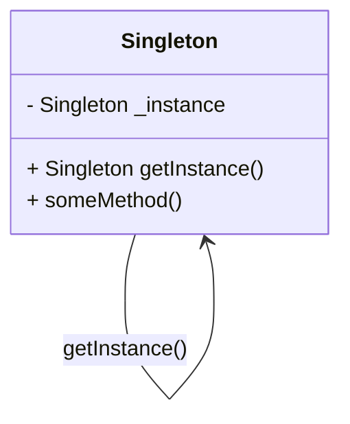
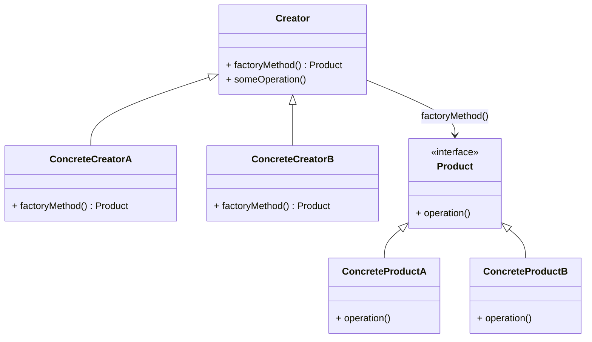

## 1.1 What are Design Patterns in Dart?

In the ever-evolving world of software development, design patterns have emerged as essential tools for developers. They provide a structured approach to solving common design problems, ensuring that code is not only functional but also maintainable and scalable. In this section, we will delve into the concept of design patterns, their relevance in Dart programming, and their role in enhancing code quality.

### Definition of Design Patterns

Design patterns are established solutions to recurring design problems encountered in software development. They are not specific pieces of code but rather templates or blueprints that guide developers in crafting solutions that are both efficient and effective. By leveraging design patterns, developers can avoid reinventing the wheel and instead rely on proven methodologies to address common challenges.

#### Key Characteristics of Design Patterns

1. **Reusability**: Design patterns offer reusable solutions that can be applied across different projects and contexts.
2. **Scalability**: They provide a framework that supports the growth and expansion of software applications.
3. **Maintainability**: By promoting organized and structured code, design patterns make it easier to maintain and update software.
4. **Readability**: Patterns enhance code readability, making it easier for developers to understand and collaborate on projects.

### Relevance in Dart Programming

Dart, a client-optimized language for fast apps on any platform, is the backbone of Flutter, Google's UI toolkit for building natively compiled applications. As Dart continues to gain traction, understanding how design patterns apply to this language is crucial for developers aiming to build robust and efficient applications.

#### Why Design Patterns Matter in Dart

1. **Language Features**: Dart's unique features, such as its strong typing, asynchronous programming capabilities, and support for mixins, make it an ideal candidate for implementing design patterns.
2. **Flutter Integration**: As the primary language for Flutter, Dart benefits from design patterns that enhance UI development, state management, and more.
3. **Community and Ecosystem**: The growing Dart community actively contributes to the development of design patterns tailored for Dart and Flutter, providing a wealth of resources and examples.

### Role in Code Quality

Design patterns play a pivotal role in improving code quality by addressing several key aspects:

1. **Maintainability**: Patterns encourage the use of modular and organized code, making it easier to manage and update.
2. **Scalability**: By providing a solid architectural foundation, design patterns support the growth and expansion of applications.
3. **Readability**: Patterns promote clear and understandable code, facilitating collaboration and reducing the learning curve for new developers.

#### Enhancing Code Quality with Design Patterns

- **Consistency**: Design patterns ensure a consistent approach to solving problems, reducing the likelihood of errors and inconsistencies.
- **Best Practices**: By adhering to established patterns, developers can follow industry best practices and avoid common pitfalls.
- **Efficiency**: Patterns streamline the development process, allowing developers to focus on building features rather than solving design issues.

### Types of Design Patterns

Design patterns are typically categorized into three main types: creational, structural, and behavioral. Each category addresses different aspects of software design and offers unique solutions to common problems.

#### Creational Patterns

Creational patterns focus on the process of object creation, ensuring that objects are created in a manner suitable for the situation. They help manage the complexity of object creation and provide flexibility in how objects are instantiated.

- **Singleton**: Ensures a class has only one instance and provides a global point of access to it.
- **Factory Method**: Defines an interface for creating objects but allows subclasses to alter the type of objects that will be created.
- **Builder**: Separates the construction of a complex object from its representation, allowing the same construction process to create different representations.

#### Structural Patterns

Structural patterns deal with the composition of classes and objects, focusing on simplifying the structure by identifying relationships. They help ensure that if one part of a system changes, the entire system doesn't need to be modified.

- **Adapter**: Allows incompatible interfaces to work together by acting as a bridge between them.
- **Composite**: Composes objects into tree structures to represent part-whole hierarchies, allowing clients to treat individual objects and compositions uniformly.
- **Decorator**: Adds new functionality to an existing object without altering its structure.

#### Behavioral Patterns

Behavioral patterns are concerned with algorithms and the assignment of responsibilities between objects. They help manage complex control flows and interactions between objects.

- **Observer**: Defines a one-to-many dependency between objects so that when one object changes state, all its dependents are notified and updated automatically.
- **Strategy**: Defines a family of algorithms, encapsulates each one, and makes them interchangeable, allowing the algorithm to vary independently from clients that use it.
- **Command**: Encapsulates a request as an object, thereby allowing for parameterization of clients with queues, requests, and operations.

### Implementing Design Patterns in Dart

Implementing design patterns in Dart involves understanding the language's features and how they can be leveraged to create efficient and effective solutions. Let's explore some examples of how design patterns can be implemented in Dart.

#### Singleton Pattern in Dart

The Singleton pattern ensures that a class has only one instance and provides a global point of access to it. This pattern is useful when exactly one object is needed to coordinate actions across the system.

```dart
class Singleton {
  // Private constructor
  Singleton._privateConstructor();

  // Static field to hold the single instance
  static final Singleton _instance = Singleton._privateConstructor();

  // Factory constructor to return the single instance
  factory Singleton() {
    return _instance;
  }

  void someMethod() {
    print('Singleton method called');
  }
}

void main() {
  var singleton1 = Singleton();
  var singleton2 = Singleton();

  // Both variables should point to the same instance
  print(singleton1 == singleton2); // Output: true

  singleton1.someMethod(); // Output: Singleton method called
}
```

In this example, the Singleton class has a private constructor and a static field that holds the single instance. The factory constructor returns this instance, ensuring that only one instance exists.

#### Factory Method Pattern in Dart

The Factory Method pattern defines an interface for creating objects but allows subclasses to alter the type of objects that will be created. This pattern is useful when a class cannot anticipate the class of objects it must create.

```dart
abstract class Product {
  void operation();
}

class ConcreteProductA implements Product {
  @override
  void operation() {
    print('Operation of ConcreteProductA');
  }
}

class ConcreteProductB implements Product {
  @override
  void operation() {
    print('Operation of ConcreteProductB');
  }
}

abstract class Creator {
  Product factoryMethod();

  void someOperation() {
    var product = factoryMethod();
    product.operation();
  }
}

class ConcreteCreatorA extends Creator {
  @override
  Product factoryMethod() {
    return ConcreteProductA();
  }
}

class ConcreteCreatorB extends Creator {
  @override
  Product factoryMethod() {
    return ConcreteProductB();
  }
}

void main() {
  Creator creatorA = ConcreteCreatorA();
  creatorA.someOperation(); // Output: Operation of ConcreteProductA

  Creator creatorB = ConcreteCreatorB();
  creatorB.someOperation(); // Output: Operation of ConcreteProductB
}
```

In this example, the Creator class defines a factory method that subclasses override to create specific products. This allows the client code to work with products through the Creator interface without knowing the concrete classes.

### Visualizing Design Patterns in Dart

To better understand how design patterns work in Dart, let's visualize the relationships and interactions between classes and objects using diagrams.

#### Singleton Pattern Diagram



**Description**: This diagram illustrates the Singleton pattern, showing the private instance and the method to access it.

#### Factory Method Pattern Diagram



**Description**: This diagram represents the Factory Method pattern, showing the Creator and Product interfaces and their concrete implementations.

### Try It Yourself

To deepen your understanding of design patterns in Dart, try modifying the code examples provided:

- **Singleton Pattern**: Add a method to the Singleton class that tracks how many times it has been called.
- **Factory Method Pattern**: Create a new product type and a corresponding creator class to handle it.

### References and Links

For further reading on design patterns and their implementation in Dart, consider the following resources:

- [Design Patterns: Elements of Reusable Object-Oriented Software](https://en.wikipedia.org/wiki/Design_Patterns) - A foundational book on design patterns.
- [Dart Language Tour](https://dart.dev/guides/language/language-tour) - Official Dart documentation.
- [Flutter Documentation](https://flutter.dev/docs) - Comprehensive guide to Flutter development.

### Knowledge Check

To reinforce your understanding of design patterns in Dart, consider the following questions:

- What are the key characteristics of design patterns?
- How do design patterns improve code quality in Dart?
- What are the main categories of design patterns?
- How does the Singleton pattern ensure only one instance of a class exists?
- What is the role of the factory method in the Factory Method pattern?

### Embrace the Journey

Remember, mastering design patterns is a journey. As you continue to explore and implement these patterns in Dart, you'll gain a deeper understanding of software design and architecture. Keep experimenting, stay curious, and enjoy the process of becoming a more proficient Dart developer.

## Quiz Time!



### What is a design pattern?

- [x] A reusable solution to a common software design problem
- [ ] A specific piece of code
- [ ] A programming language feature
- [ ] A type of software bug

> **Explanation:** A design pattern is a reusable solution to a common software design problem, not a specific piece of code.

### Which of the following is a key characteristic of design patterns?

- [x] Reusability
- [ ] Complexity
- [ ] Obsolescence
- [ ] Inconsistency

> **Explanation:** Reusability is a key characteristic of design patterns, allowing them to be applied across different projects.

### How do design patterns improve code quality?

- [x] By promoting organized and structured code
- [ ] By increasing code complexity
- [ ] By making code harder to read
- [ ] By introducing more bugs

> **Explanation:** Design patterns improve code quality by promoting organized and structured code, making it easier to maintain and update.

### What is the main purpose of the Singleton pattern?

- [x] To ensure a class has only one instance
- [ ] To create multiple instances of a class
- [ ] To define a family of algorithms
- [ ] To encapsulate a request as an object

> **Explanation:** The Singleton pattern ensures a class has only one instance and provides a global point of access to it.

### Which pattern defines an interface for creating objects but allows subclasses to alter the type of objects that will be created?

- [x] Factory Method
- [ ] Singleton
- [ ] Observer
- [ ] Strategy

> **Explanation:** The Factory Method pattern defines an interface for creating objects but allows subclasses to alter the type of objects that will be created.

### What is the role of the factory method in the Factory Method pattern?

- [x] To create objects
- [ ] To destroy objects
- [ ] To manage object state
- [ ] To encapsulate object behavior

> **Explanation:** The factory method in the Factory Method pattern is responsible for creating objects.

### Which of the following is a creational design pattern?

- [x] Builder
- [ ] Adapter
- [ ] Observer
- [ ] Strategy

> **Explanation:** The Builder pattern is a creational design pattern that separates the construction of a complex object from its representation.

### What does the Adapter pattern do?

- [x] Allows incompatible interfaces to work together
- [ ] Ensures a class has only one instance
- [ ] Defines a family of algorithms
- [ ] Encapsulates a request as an object

> **Explanation:** The Adapter pattern allows incompatible interfaces to work together by acting as a bridge between them.

### How does the Composite pattern help in software design?

- [x] By composing objects into tree structures
- [ ] By creating a single instance of a class
- [ ] By defining a family of algorithms
- [ ] By encapsulating a request as an object

> **Explanation:** The Composite pattern helps in software design by composing objects into tree structures to represent part-whole hierarchies.

### True or False: Design patterns are specific pieces of code.

- [x] False
- [ ] True

> **Explanation:** Design patterns are not specific pieces of code; they are templates or blueprints for solving common design problems.


