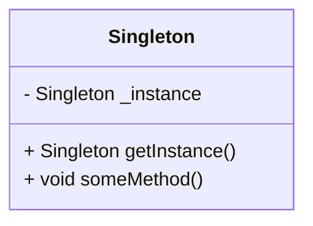
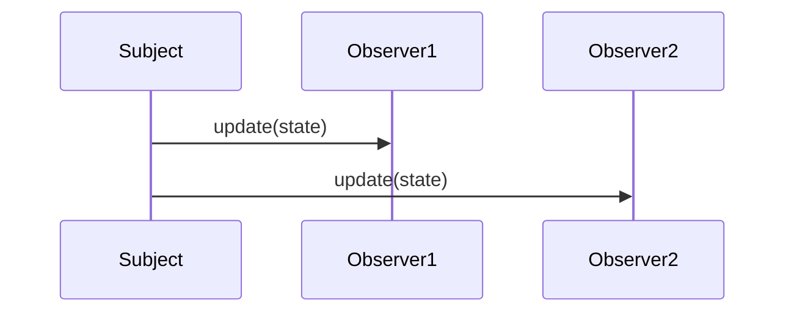

## 1.2 Types of Design Patterns in Dart

Design patterns are essential tools in a developer's toolkit, providing proven solutions to common problems in software design. In Dart, these patterns are categorized into four main types: Creational, Structural, Behavioral, and Concurrency patterns. Each category addresses different aspects of software design, helping developers create robust, maintainable, and scalable applications. Let's delve into each type and explore how they can be effectively applied in Dart and Flutter development.

### Creational Patterns

Creational patterns focus on the process of object creation, providing various ways to instantiate objects while keeping the system flexible and independent of the specific classes that are instantiated. These patterns are particularly useful in Dart, where object-oriented principles are fundamental.

#### 1. Singleton Pattern

**Intent**: Ensure a class has only one instance and provide a global point of access to it.

**Key Participants**:
- Singleton: The class that is responsible for creating and managing its own instance.

**Applicability**: Use the Singleton pattern when you need exactly one instance of a class, and you want to provide a global point of access to it.

**Sample Code Snippet**:
```dart
class Singleton {
  static final Singleton _instance = Singleton._internal();

  factory Singleton() {
    return _instance;
  }

  Singleton._internal();

  void someMethod() {
    // Implementation
  }
}

void main() {
  var singleton = Singleton();
  singleton.someMethod();
}
```

**Design Considerations**: Be cautious of thread safety when implementing Singletons in a multi-threaded environment.

#### 2. Factory Method Pattern

**Intent**: Define an interface for creating an object, but let subclasses alter the type of objects that will be created.

**Key Participants**:
- Creator: Declares the factory method.
- ConcreteCreator: Implements the factory method to return an instance of a ConcreteProduct.

**Applicability**: Use the Factory Method pattern when a class can't anticipate the class of objects it must create.

**Sample Code Snippet**:
```dart
abstract class Product {
  void operation();
}

class ConcreteProductA implements Product {
  @override
  void operation() {
    print('ConcreteProductA operation');
  }
}

class ConcreteProductB implements Product {
  @override
  void operation() {
    print('ConcreteProductB operation');
  }
}

abstract class Creator {
  Product factoryMethod();

  void someOperation() {
    var product = factoryMethod();
    product.operation();
  }
}

class ConcreteCreatorA extends Creator {
  @override
  Product factoryMethod() {
    return ConcreteProductA();
  }
}

class ConcreteCreatorB extends Creator {
  @override
  Product factoryMethod() {
    return ConcreteProductB();
  }
}

void main() {
  Creator creator = ConcreteCreatorA();
  creator.someOperation();

  creator = ConcreteCreatorB();
  creator.someOperation();
}
```

**Design Considerations**: The Factory Method pattern promotes loose coupling by eliminating the need to bind application-specific classes into the code.

### Structural Patterns

Structural patterns deal with object composition, helping to ensure that if one part of a system changes, the entire system doesn't need to change. They focus on simplifying the design by identifying a simple way to realize relationships among entities.

#### 1. Adapter Pattern

**Intent**: Convert the interface of a class into another interface clients expect. Adapter lets classes work together that couldn't otherwise because of incompatible interfaces.

**Key Participants**:
- Target: Defines the domain-specific interface that Client uses.
- Adapter: Adapts the interface of Adaptee to the Target interface.
- Adaptee: Defines an existing interface that needs adapting.

**Applicability**: Use the Adapter pattern when you want to use an existing class, and its interface does not match the one you need.

**Sample Code Snippet**:
```dart
class Target {
  void request() {
    print('Target request');
  }
}

class Adaptee {
  void specificRequest() {
    print('Adaptee specific request');
  }
}

class Adapter implements Target {
  final Adaptee _adaptee;

  Adapter(this._adaptee);

  @override
  void request() {
    _adaptee.specificRequest();
  }
}

void main() {
  var adaptee = Adaptee();
  var adapter = Adapter(adaptee);
  adapter.request();
}
```

**Design Considerations**: The Adapter pattern can be implemented in two ways: class adapter and object adapter. Dart supports only object adapters due to its single inheritance model.

#### 2. Composite Pattern

**Intent**: Compose objects into tree structures to represent part-whole hierarchies. Composite lets clients treat individual objects and compositions of objects uniformly.

**Key Participants**:
- Component: Declares the interface for objects in the composition.
- Leaf: Represents leaf objects in the composition.
- Composite: Defines behavior for components having children.

**Applicability**: Use the Composite pattern when you want to represent part-whole hierarchies of objects.

**Sample Code Snippet**:
```dart
abstract class Component {
  void operation();
}

class Leaf implements Component {
  @override
  void operation() {
    print('Leaf operation');
  }
}

class Composite implements Component {
  final List<Component> _children = [];

  void add(Component component) {
    _children.add(component);
  }

  void remove(Component component) {
    _children.remove(component);
  }

  @override
  void operation() {
    for (var child in _children) {
      child.operation();
    }
  }
}

void main() {
  var leaf1 = Leaf();
  var leaf2 = Leaf();
  var composite = Composite();
  composite.add(leaf1);
  composite.add(leaf2);
  composite.operation();
}
```

**Design Considerations**: The Composite pattern makes the client simple because it can treat individual objects and compositions uniformly.

### Behavioral Patterns

Behavioral patterns are concerned with algorithms and the assignment of responsibilities between objects. They help manage complex control flows and communication between objects.

#### 1. Observer Pattern

**Intent**: Define a one-to-many dependency between objects so that when one object changes state, all its dependents are notified and updated automatically.

**Key Participants**:
- Subject: Knows its observers and provides an interface for attaching and detaching Observer objects.
- Observer: Defines an updating interface for objects that should be notified of changes in a Subject.

**Applicability**: Use the Observer pattern when a change to one object requires changing others, and you don't know how many objects need to be changed.

**Sample Code Snippet**:
```dart
abstract class Observer {
  void update(String state);
}

class ConcreteObserver implements Observer {
  final String name;

  ConcreteObserver(this.name);

  @override
  void update(String state) {
    print('$name received update: $state');
  }
}

class Subject {
  final List<Observer> _observers = [];
  String _state;

  void attach(Observer observer) {
    _observers.add(observer);
  }

  void detach(Observer observer) {
    _observers.remove(observer);
  }

  void notify() {
    for (var observer in _observers) {
      observer.update(_state);
    }
  }

  set state(String state) {
    _state = state;
    notify();
  }
}

void main() {
  var observer1 = ConcreteObserver('Observer 1');
  var observer2 = ConcreteObserver('Observer 2');
  var subject = Subject();

  subject.attach(observer1);
  subject.attach(observer2);

  subject.state = 'New State';
}
```

**Design Considerations**: The Observer pattern can lead to memory leaks if observers are not correctly removed.

#### 2. Strategy Pattern

**Intent**: Define a family of algorithms, encapsulate each one, and make them interchangeable. Strategy lets the algorithm vary independently from clients that use it.

**Key Participants**:
- Strategy: Declares an interface common to all supported algorithms.
- ConcreteStrategy: Implements the algorithm using the Strategy interface.
- Context: Maintains a reference to a Strategy object.

**Applicability**: Use the Strategy pattern when you have a family of algorithms and you want to make them interchangeable.

**Sample Code Snippet**:
```dart
abstract class Strategy {
  void execute();
}

class ConcreteStrategyA implements Strategy {
  @override
  void execute() {
    print('ConcreteStrategyA execution');
  }
}

class ConcreteStrategyB implements Strategy {
  @override
  void execute() {
    print('ConcreteStrategyB execution');
  }
}

class Context {
  Strategy _strategy;

  Context(this._strategy);

  void setStrategy(Strategy strategy) {
    _strategy = strategy;
  }

  void executeStrategy() {
    _strategy.execute();
  }
}

void main() {
  var context = Context(ConcreteStrategyA());
  context.executeStrategy();

  context.setStrategy(ConcreteStrategyB());
  context.executeStrategy();
}
```

**Design Considerations**: The Strategy pattern increases the number of objects in the system, which can be a concern in resource-constrained environments.

### Concurrency Patterns

Concurrency patterns are essential in managing multi-threading and asynchronous programming, especially in Dart, which is designed to handle asynchronous operations efficiently.

#### 1. Future Pattern

**Intent**: Represent a value that will be available in the future, allowing asynchronous programming.

**Key Participants**:
- Future: Represents a computation that will complete at some point in the future.

**Applicability**: Use the Future pattern when you need to perform asynchronous operations and handle their results.

**Sample Code Snippet**:
```dart
Future<String> fetchData() async {
  await Future.delayed(Duration(seconds: 2));
  return 'Data fetched';
}

void main() async {
  print('Fetching data...');
  var data = await fetchData();
  print(data);
}
```

**Design Considerations**: Futures are a core part of Dart's asynchronous programming model and are used extensively in Flutter for tasks like network requests and file I/O.

#### 2. Isolate Pattern

**Intent**: Run code in parallel by using isolates, which are independent workers that do not share memory.

**Key Participants**:
- Isolate: A separate worker that runs code independently.

**Applicability**: Use the Isolate pattern when you need to perform heavy computations without blocking the main thread.

**Sample Code Snippet**:
```dart
import 'dart:isolate';

void heavyComputation(SendPort sendPort) {
  var result = 0;
  for (var i = 0; i < 1000000000; i++) {
    result += i;
  }
  sendPort.send(result);
}

void main() async {
  var receivePort = ReceivePort();
  await Isolate.spawn(heavyComputation, receivePort.sendPort);

  receivePort.listen((message) {
    print('Computation result: $message');
    receivePort.close();
  });
}
```

**Design Considerations**: Isolates are useful for parallel processing but require message passing for communication, which can be complex to manage.

### Visualizing Design Patterns

To better understand the relationships and interactions between different design patterns, let's visualize them using Mermaid.js diagrams.

#### Class Diagram for Singleton Pattern



**Description**: This diagram illustrates the Singleton pattern, showing the private instance and the method to access it.

#### Sequence Diagram for Observer Pattern



**Description**: This sequence diagram demonstrates how the Subject notifies multiple Observers of a state change.

### Try It Yourself

Now that we've explored various design patterns, it's time to experiment. Try modifying the code examples to see how changes affect the behavior. For instance, in the Strategy pattern, create a new strategy and integrate it into the context. Observe how easily you can swap strategies without altering the context's code.

### Knowledge Check

To reinforce your understanding, consider these questions:

- How does the Singleton pattern ensure only one instance of a class is created?
- What are the benefits of using the Factory Method pattern?
- How can the Adapter pattern help in integrating legacy code?
- Why is the Observer pattern useful in event-driven systems?
- How do Futures facilitate asynchronous programming in Dart?

### Embrace the Journey

Remember, mastering design patterns is a journey. As you continue to explore and apply these patterns, you'll gain deeper insights into their benefits and nuances. Keep experimenting, stay curious, and enjoy the process of becoming a more proficient Dart and Flutter developer!

## Quiz Time!



### What is the primary purpose of creational design patterns?

- [x] To manage object creation mechanisms
- [ ] To define object communication patterns
- [ ] To simplify object composition
- [ ] To handle concurrency

> **Explanation:** Creational design patterns focus on managing object creation mechanisms to ensure flexibility and independence from specific classes.

### Which pattern ensures a class has only one instance?

- [x] Singleton Pattern
- [ ] Factory Method Pattern
- [ ] Adapter Pattern
- [ ] Observer Pattern

> **Explanation:** The Singleton pattern ensures that a class has only one instance and provides a global point of access to it.

### In the Adapter pattern, what is the role of the Adapter class?

- [x] To adapt the interface of an existing class to a new interface
- [ ] To define a family of algorithms
- [ ] To compose objects into tree structures
- [ ] To represent a computation that will complete in the future

> **Explanation:** The Adapter class adapts the interface of an existing class (Adaptee) to a new interface (Target).

### What is a key benefit of the Composite pattern?

- [x] It allows clients to treat individual objects and compositions uniformly.
- [ ] It defines a one-to-many dependency between objects.
- [ ] It encapsulates a family of algorithms.
- [ ] It represents a value that will be available in the future.

> **Explanation:** The Composite pattern allows clients to treat individual objects and compositions uniformly, simplifying client code.

### How does the Observer pattern facilitate communication?

- [x] By defining a one-to-many dependency between objects
- [ ] By encapsulating algorithms
- [ ] By adapting interfaces
- [ ] By composing objects into tree structures

> **Explanation:** The Observer pattern defines a one-to-many dependency between objects, allowing dependents to be notified of state changes.

### What is the main advantage of using the Strategy pattern?

- [x] It allows algorithms to be interchangeable.
- [ ] It ensures a class has only one instance.
- [ ] It adapts interfaces.
- [ ] It composes objects into tree structures.

> **Explanation:** The Strategy pattern allows algorithms to be interchangeable, enabling flexibility in choosing the appropriate algorithm.

### Which pattern is essential for asynchronous programming in Dart?

- [x] Future Pattern
- [ ] Singleton Pattern
- [ ] Adapter Pattern
- [ ] Composite Pattern

> **Explanation:** The Future pattern is essential for asynchronous programming in Dart, representing computations that will complete in the future.

### What is the role of an Isolate in Dart?

- [x] To run code in parallel without sharing memory
- [ ] To define a family of algorithms
- [ ] To adapt interfaces
- [ ] To notify observers of state changes

> **Explanation:** An Isolate in Dart runs code in parallel without sharing memory, making it useful for heavy computations.

### How does the Factory Method pattern promote loose coupling?

- [x] By eliminating the need to bind application-specific classes into the code
- [ ] By ensuring a class has only one instance
- [ ] By adapting interfaces
- [ ] By defining a one-to-many dependency

> **Explanation:** The Factory Method pattern promotes loose coupling by eliminating the need to bind application-specific classes into the code, allowing for flexibility in object creation.

### True or False: The Adapter pattern can be implemented using both class and object adapters in Dart.

- [ ] True
- [x] False

> **Explanation:** False. Dart supports only object adapters due to its single inheritance model.



Remember, this is just the beginning. As you progress, you'll build more complex and interactive applications. Keep experimenting, stay curious, and enjoy the journey!
