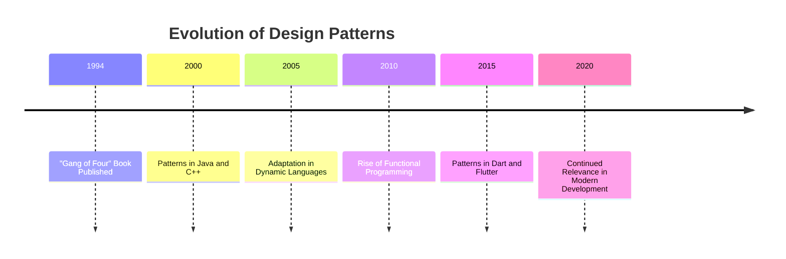

## 1.3 History and Evolution of Design Patterns

Design patterns have become a cornerstone of modern software development, providing developers with proven solutions to common problems. Understanding their history and evolution is crucial for any developer aiming to master their application, especially in the context of Dart and Flutter. In this section, we will explore the origins of design patterns, their adaptation across various programming languages, and their continued relevance in modern development environments.

### Origins: The "Gang of Four" and the Seminal Book

The concept of design patterns in software engineering was popularized by the "Gang of Four" (GoF), a group of authors consisting of Erich Gamma, Richard Helm, Ralph Johnson, and John Vlissides. Their seminal book, *Design Patterns: Elements of Reusable Object-Oriented Software*, published in 1994, introduced 23 classic design patterns that have since become foundational in object-oriented design.

#### The Influence of Architecture

The idea of patterns was inspired by the work of architect Christopher Alexander, who introduced the concept of a "pattern language" in architecture. Alexander's work emphasized the importance of recurring solutions to common design problems, which the GoF adapted to software engineering. This adaptation was a pivotal moment, as it provided a structured approach to solving software design challenges.

#### The 23 Classic Patterns

The GoF book categorized these patterns into three types: Creational, Structural, and Behavioral. Each pattern addressed specific design issues, offering a template for solving them. This categorization helped developers understand the context and applicability of each pattern, making it easier to implement them in their projects.

### Evolution in Programming Languages

As programming languages evolved, so did the implementation and adaptation of design patterns. Each language brought its own set of features and paradigms, influencing how patterns were applied.

#### Object-Oriented Languages

Languages like Java and C++ were among the first to embrace design patterns, given their strong support for object-oriented programming (OOP). The principles outlined by the GoF fit naturally with the OOP paradigm, making these languages ideal candidates for pattern implementation.

#### Functional and Dynamic Languages

With the rise of functional programming languages like Haskell and dynamic languages like Python and JavaScript, design patterns underwent further adaptation. These languages introduced new paradigms and features, such as first-class functions and dynamic typing, which required rethinking traditional pattern implementations.

#### Dart and Flutter

Dart, with its unique blend of object-oriented and functional programming features, offers a fresh perspective on design patterns. Flutter, built on Dart, leverages these patterns to create high-performance, scalable applications. The adaptation of design patterns in Dart and Flutter is a testament to their flexibility and enduring relevance.

### Design Patterns in Modern Development

In today's fast-paced development environment, design patterns continue to play a crucial role. They provide a common language for developers, facilitating communication and collaboration. Moreover, they offer a proven approach to solving complex design problems, enhancing code maintainability and scalability.

#### The Role of Design Patterns in Dart

Dart's language features, such as mixins, extensions, and async/await, offer new opportunities for pattern implementation. These features allow developers to create more expressive and efficient solutions, tailored to the specific needs of their applications.

#### Flutter and the Widget Tree

Flutter's widget-based architecture is a natural fit for design patterns. Patterns like the Composite and Decorator are particularly relevant, as they align with Flutter's approach to building complex UIs from simple, reusable components.

### Key Participants in the Evolution of Design Patterns

Understanding the key participants in the evolution of design patterns helps us appreciate their impact on software development.

#### The "Gang of Four"

The GoF's contribution cannot be overstated. Their work laid the foundation for modern design patterns, providing a structured approach to software design that has stood the test of time.

#### The Software Development Community

The broader software development community has played a crucial role in the evolution of design patterns. Through open-source projects, conferences, and publications, developers have shared their experiences and insights, contributing to the refinement and adaptation of patterns.

#### Academic and Industry Research

Research in both academia and industry has furthered our understanding of design patterns. Studies on pattern effectiveness, usability, and adaptation have provided valuable insights, guiding developers in their application.

### Applicability of Design Patterns in Dart and Flutter

Design patterns are not a one-size-fits-all solution. Their applicability depends on the specific context and requirements of a project.

#### When to Use Design Patterns

Design patterns are most effective when used to solve recurring design problems. They provide a template for addressing common challenges, reducing the need for ad-hoc solutions.

#### Considerations for Dart and Flutter

In Dart and Flutter, patterns should be adapted to leverage the language's unique features. For example, Dart's async/await can be used to implement the Observer pattern in a more efficient and expressive way.

### Sample Code Snippet: Implementing the Singleton Pattern in Dart

To illustrate the application of design patterns in Dart, let's consider the Singleton pattern. This pattern ensures that a class has only one instance and provides a global point of access to it.

```dart
class Singleton {
  // Private constructor
  Singleton._privateConstructor();

  // The single instance of the class
  static final Singleton _instance = Singleton._privateConstructor();

  // Factory constructor to return the single instance
  factory Singleton() {
    return _instance;
  }

  // Example method
  void showMessage() {
    print("Hello from Singleton!");
  }
}

void main() {
  // Access the Singleton instance
  var singleton = Singleton();
  singleton.showMessage();
}
```

In this example, we define a private constructor and a static instance of the class. The factory constructor returns the single instance, ensuring that only one instance of the class exists.

### Design Considerations: When to Use the Singleton Pattern

The Singleton pattern is useful when exactly one instance of a class is needed to coordinate actions across the system. However, it should be used judiciously, as it can introduce global state into an application, making it harder to test and maintain.

### Differences and Similarities with Other Patterns

The Singleton pattern is often compared to the Factory pattern, as both involve controlling the instantiation of objects. However, while the Factory pattern focuses on creating objects, the Singleton pattern ensures a single instance.

### Visualizing the Evolution of Design Patterns

To better understand the evolution of design patterns, let's visualize their development over time.



This timeline highlights key milestones in the evolution of design patterns, illustrating their adaptation across different languages and paradigms.

### References and Links

For further reading on the history and evolution of design patterns, consider the following resources:

- [Design Patterns: Elements of Reusable Object-Oriented Software](https://en.wikipedia.org/wiki/Design_Patterns) - The seminal book by the "Gang of Four".
- [Christopher Alexander's Pattern Language](https://www.patternlanguage.com/) - The architectural work that inspired the concept of design patterns.
- [Dart Programming Language](https://dart.dev/) - Official documentation for Dart, including its features and capabilities.
- [Flutter Documentation](https://flutter.dev/docs) - Comprehensive guide to building applications with Flutter.

### Knowledge Check

Let's test your understanding of the history and evolution of design patterns with a few questions:

- What inspired the concept of design patterns in software engineering?
- How have design patterns evolved with the rise of functional programming languages?
- Why are design patterns still relevant in modern development environments?

### Embrace the Journey

Remember, understanding the history and evolution of design patterns is just the beginning. As you continue your journey in mastering Dart and Flutter, you'll discover new ways to apply these patterns, enhancing your development skills and creating more robust applications. Keep experimenting, stay curious, and enjoy the journey!

### Quiz Time!



### What was the primary inspiration for the concept of design patterns in software engineering?

- [x] Christopher Alexander's architectural work
- [ ] The rise of object-oriented programming
- [ ] The development of the C++ language
- [ ] The invention of the internet

> **Explanation:** Christopher Alexander's work on pattern language in architecture inspired the adaptation of design patterns in software engineering.

### Which book popularized the concept of design patterns in software development?

- [x] Design Patterns: Elements of Reusable Object-Oriented Software
- [ ] The Pragmatic Programmer
- [ ] Clean Code
- [ ] The Art of Computer Programming

> **Explanation:** The book *Design Patterns: Elements of Reusable Object-Oriented Software* by the "Gang of Four" popularized design patterns in software development.

### How many classic design patterns were introduced in the "Gang of Four" book?

- [x] 23
- [ ] 15
- [ ] 30
- [ ] 10

> **Explanation:** The "Gang of Four" book introduced 23 classic design patterns.

### What are the three categories of design patterns introduced by the "Gang of Four"?

- [x] Creational, Structural, Behavioral
- [ ] Functional, Object-Oriented, Procedural
- [ ] Static, Dynamic, Hybrid
- [ ] Synchronous, Asynchronous, Reactive

> **Explanation:** The "Gang of Four" categorized design patterns into Creational, Structural, and Behavioral patterns.

### Which programming languages were among the first to embrace design patterns?

- [x] Java and C++
- [ ] Python and JavaScript
- [ ] Haskell and Scala
- [ ] Ruby and PHP

> **Explanation:** Java and C++ were among the first languages to embrace design patterns due to their strong support for object-oriented programming.

### How have functional programming languages influenced the evolution of design patterns?

- [x] By introducing new paradigms and features like first-class functions
- [ ] By eliminating the need for design patterns
- [ ] By making design patterns obsolete
- [ ] By simplifying object-oriented design

> **Explanation:** Functional programming languages introduced new paradigms and features, such as first-class functions, which influenced the adaptation of design patterns.

### What is a key feature of Dart that influences the implementation of design patterns?

- [x] Mixins and extensions
- [ ] Static typing only
- [ ] Lack of object-oriented support
- [ ] Absence of async/await

> **Explanation:** Dart's mixins and extensions are key features that influence the implementation of design patterns.

### In Flutter, which design pattern is particularly relevant due to its widget-based architecture?

- [x] Composite and Decorator
- [ ] Singleton and Factory
- [ ] Observer and Mediator
- [ ] Strategy and Command

> **Explanation:** The Composite and Decorator patterns are particularly relevant in Flutter due to its widget-based architecture.

### What is the primary purpose of the Singleton pattern?

- [x] To ensure a class has only one instance
- [ ] To create multiple instances of a class
- [ ] To provide a global point of access to multiple instances
- [ ] To facilitate communication between objects

> **Explanation:** The Singleton pattern ensures that a class has only one instance and provides a global point of access to it.

### True or False: Design patterns are a one-size-fits-all solution.

- [ ] True
- [x] False

> **Explanation:** Design patterns are not a one-size-fits-all solution; their applicability depends on the specific context and requirements of a project.




