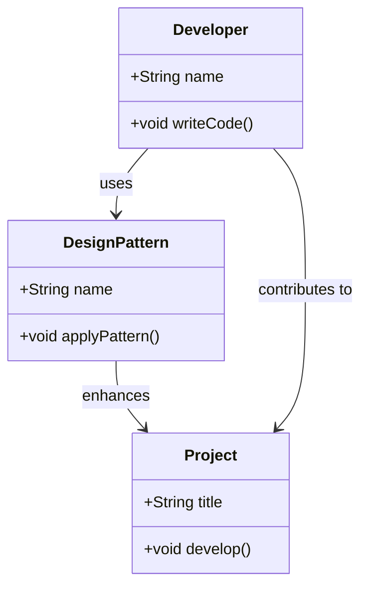

## 1.4 Importance of Design Patterns in Software Development

In the ever-evolving landscape of software development, design patterns have emerged as a cornerstone for building robust, scalable, and maintainable applications. As we delve into the world of Dart and Flutter, understanding the importance of design patterns becomes paramount. This section will explore the multifaceted benefits of design patterns, focusing on standardization, efficiency, quality assurance, and team collaboration.

### Standardization: Promoting a Common Language Among Developers

Design patterns serve as a universal language that bridges the gap between developers, regardless of their background or expertise. By providing a standardized vocabulary, design patterns facilitate clear communication and understanding within development teams. This common language helps developers articulate complex ideas succinctly, reducing the likelihood of misunderstandings and errors.

#### The Role of Standardization in Software Development

Standardization in software development is akin to having a set of blueprints for constructing a building. Just as architects rely on standardized symbols and notations to convey their designs, developers use design patterns to express software architecture. This standardization ensures that all team members are on the same page, leading to more cohesive and efficient development processes.

#### Example: The Singleton Pattern

Consider the Singleton pattern, a widely recognized design pattern used to ensure a class has only one instance. By referring to this pattern by name, developers instantly understand the intent and implementation details, without needing lengthy explanations.

```dart
class Singleton {
  static final Singleton _instance = Singleton._internal();

  factory Singleton() {
    return _instance;
  }

  Singleton._internal();
}

// Usage
void main() {
  var singleton1 = Singleton();
  var singleton2 = Singleton();

  print(singleton1 == singleton2); // Outputs: true
}
```

In this example, the Singleton pattern is implemented in Dart, ensuring that only one instance of the `Singleton` class exists. This pattern is universally understood, allowing developers to quickly grasp its purpose and functionality.

### Efficiency: Saving Time by Reusing Proven Solutions

Efficiency is a critical factor in software development, and design patterns play a significant role in enhancing it. By providing reusable solutions to common problems, design patterns save developers time and effort. Instead of reinventing the wheel, developers can leverage existing patterns to address recurring challenges, allowing them to focus on more complex and unique aspects of their projects.

#### The Impact of Efficiency on Development

Efficiency in software development translates to faster delivery times, reduced costs, and improved productivity. By adopting design patterns, developers can streamline their workflows, minimize errors, and accelerate the development process.

#### Example: The Factory Method Pattern

The Factory Method pattern is a creational pattern that provides an interface for creating objects, allowing subclasses to alter the type of objects that will be created. This pattern promotes efficiency by decoupling the client code from the object creation process.

```dart
abstract class Product {
  void operation();
}

class ConcreteProductA implements Product {
  @override
  void operation() {
    print('Operation of ConcreteProductA');
  }
}

class ConcreteProductB implements Product {
  @override
  void operation() {
    print('Operation of ConcreteProductB');
  }
}

abstract class Creator {
  Product factoryMethod();

  void someOperation() {
    var product = factoryMethod();
    product.operation();
  }
}

class ConcreteCreatorA extends Creator {
  @override
  Product factoryMethod() {
    return ConcreteProductA();
  }
}

class ConcreteCreatorB extends Creator {
  @override
  Product factoryMethod() {
    return ConcreteProductB();
  }
}

// Usage
void main() {
  Creator creatorA = ConcreteCreatorA();
  creatorA.someOperation();

  Creator creatorB = ConcreteCreatorB();
  creatorB.someOperation();
}
```

In this example, the Factory Method pattern allows for the creation of different product types without modifying the client code. This flexibility and reusability contribute to the overall efficiency of the development process.

### Quality Assurance: Enhancing Code Robustness and Testability

Quality assurance is a fundamental aspect of software development, and design patterns significantly contribute to it. By promoting best practices and proven solutions, design patterns enhance the robustness and testability of code. They provide a solid foundation for building reliable and maintainable applications.

#### The Role of Design Patterns in Quality Assurance

Design patterns encourage developers to adhere to best practices, such as separation of concerns, loose coupling, and high cohesion. These principles lead to cleaner, more modular code that is easier to test and maintain. By following established patterns, developers can reduce the likelihood of bugs and ensure that their code meets high-quality standards.

#### Example: The Observer Pattern

The Observer pattern is a behavioral pattern that defines a one-to-many dependency between objects, allowing multiple observers to listen for changes in a subject. This pattern enhances code robustness by promoting loose coupling between the subject and its observers.

```dart
abstract class Observer {
  void update(String message);
}

class ConcreteObserverA implements Observer {
  @override
  void update(String message) {
    print('ConcreteObserverA received: $message');
  }
}

class ConcreteObserverB implements Observer {
  @override
  void update(String message) {
    print('ConcreteObserverB received: $message');
  }
}

class Subject {
  final List<Observer> _observers = [];

  void attach(Observer observer) {
    _observers.add(observer);
  }

  void detach(Observer observer) {
    _observers.remove(observer);
  }

  void notify(String message) {
    for (var observer in _observers) {
      observer.update(message);
    }
  }
}

// Usage
void main() {
  var subject = Subject();

  var observerA = ConcreteObserverA();
  var observerB = ConcreteObserverB();

  subject.attach(observerA);
  subject.attach(observerB);

  subject.notify('Hello Observers!');
}
```

In this example, the Observer pattern allows multiple observers to receive updates from a subject. This pattern promotes loose coupling, making the code more robust and easier to test.

### Team Collaboration: Facilitating Better Communication and Understanding

Effective team collaboration is essential for the success of any software development project. Design patterns play a crucial role in facilitating better communication and understanding within development teams. By providing a common framework, design patterns help team members collaborate more effectively, leading to improved project outcomes.

#### The Importance of Team Collaboration in Software Development

Team collaboration is the backbone of successful software development. It enables developers to share knowledge, exchange ideas, and work together towards a common goal. Design patterns provide a shared language that enhances collaboration, ensuring that all team members are aligned and working efficiently.

#### Example: The MVC Pattern

The Model-View-Controller (MVC) pattern is a structural pattern that separates an application into three interconnected components: the model, the view, and the controller. This separation of concerns facilitates team collaboration by allowing developers to work on different components independently.

```dart
// Model
class CounterModel {
  int _counter = 0;

  int get counter => _counter;

  void increment() {
    _counter++;
  }
}

// View
class CounterView {
  void display(int counter) {
    print('Counter: $counter');
  }
}

// Controller
class CounterController {
  final CounterModel _model;
  final CounterView _view;

  CounterController(this._model, this._view);

  void incrementCounter() {
    _model.increment();
    _view.display(_model.counter);
  }
}

// Usage
void main() {
  var model = CounterModel();
  var view = CounterView();
  var controller = CounterController(model, view);

  controller.incrementCounter();
  controller.incrementCounter();
}
```

In this example, the MVC pattern separates the application into distinct components, allowing developers to work on the model, view, and controller independently. This separation enhances team collaboration and improves the overall development process.

### Visualizing the Impact of Design Patterns

To further illustrate the importance of design patterns, let's visualize their impact on software development using a class diagram. This diagram represents the relationships between different components in a software application, highlighting the role of design patterns in promoting standardization, efficiency, quality assurance, and team collaboration.



In this class diagram, we see how developers use design patterns to enhance their projects. The relationships between developers, design patterns, and projects highlight the critical role of design patterns in software development.

### Try It Yourself

To deepen your understanding of design patterns, try modifying the code examples provided in this section. Experiment with different patterns, such as the Singleton, Factory Method, Observer, and MVC patterns. Consider how these patterns can be applied to your own projects and explore their impact on standardization, efficiency, quality assurance, and team collaboration.

### References and Further Reading

For more information on design patterns and their role in software development, consider exploring the following resources:

- [Design Patterns: Elements of Reusable Object-Oriented Software](https://en.wikipedia.org/wiki/Design_Patterns) by Erich Gamma, Richard Helm, Ralph Johnson, and John Vlissides
- [Refactoring: Improving the Design of Existing Code](https://martinfowler.com/books/refactoring.html) by Martin Fowler
- [Clean Code: A Handbook of Agile Software Craftsmanship](https://www.oreilly.com/library/view/clean-code-a/9780136083238/) by Robert C. Martin

### Knowledge Check

To reinforce your understanding of the importance of design patterns, consider the following questions and challenges:

- How do design patterns promote standardization in software development?
- What are the benefits of using design patterns to enhance efficiency?
- How do design patterns contribute to quality assurance and code robustness?
- In what ways do design patterns facilitate team collaboration?
- Experiment with implementing a new design pattern in Dart and observe its impact on your code.

### Embrace the Journey

Remember, mastering design patterns is a journey that requires practice and exploration. As you continue to develop your skills, you'll discover new ways to apply design patterns to your projects. Keep experimenting, stay curious, and enjoy the journey of becoming a more proficient and effective software developer.

## Quiz Time!



### What is the primary benefit of using design patterns in software development?

- [x] They provide a standardized vocabulary for developers.
- [ ] They eliminate the need for testing.
- [ ] They automatically generate code.
- [ ] They replace the need for documentation.

> **Explanation:** Design patterns provide a standardized vocabulary that facilitates clear communication and understanding among developers.

### How do design patterns enhance efficiency in software development?

- [x] By providing reusable solutions to common problems.
- [ ] By automating the coding process.
- [ ] By eliminating the need for debugging.
- [ ] By reducing the number of developers needed.

> **Explanation:** Design patterns enhance efficiency by offering reusable solutions to common problems, allowing developers to focus on more complex aspects of their projects.

### Which design pattern is used to ensure a class has only one instance?

- [x] Singleton Pattern
- [ ] Factory Method Pattern
- [ ] Observer Pattern
- [ ] MVC Pattern

> **Explanation:** The Singleton pattern is used to ensure that a class has only one instance, providing a global point of access to it.

### What is the role of the Observer pattern in software development?

- [x] It defines a one-to-many dependency between objects.
- [ ] It creates a single instance of a class.
- [ ] It separates an application into three components.
- [ ] It provides an interface for creating objects.

> **Explanation:** The Observer pattern defines a one-to-many dependency between objects, allowing multiple observers to listen for changes in a subject.

### How does the MVC pattern facilitate team collaboration?

- [x] By separating an application into distinct components.
- [ ] By eliminating the need for communication.
- [ ] By automating the development process.
- [ ] By reducing the number of developers needed.

> **Explanation:** The MVC pattern facilitates team collaboration by separating an application into distinct components, allowing developers to work on different parts independently.

### What is the primary purpose of standardization in software development?

- [x] To ensure all team members are on the same page.
- [ ] To eliminate the need for testing.
- [ ] To automate the coding process.
- [ ] To reduce the number of developers needed.

> **Explanation:** Standardization ensures that all team members are on the same page, leading to more cohesive and efficient development processes.

### How do design patterns contribute to quality assurance?

- [x] By promoting best practices and proven solutions.
- [ ] By eliminating the need for debugging.
- [ ] By automating the testing process.
- [ ] By reducing the number of developers needed.

> **Explanation:** Design patterns contribute to quality assurance by promoting best practices and proven solutions, enhancing code robustness and testability.

### What is the primary benefit of using the Factory Method pattern?

- [x] It decouples the client code from the object creation process.
- [ ] It ensures a class has only one instance.
- [ ] It defines a one-to-many dependency between objects.
- [ ] It separates an application into three components.

> **Explanation:** The Factory Method pattern decouples the client code from the object creation process, allowing for more flexible and reusable code.

### How do design patterns facilitate better communication within development teams?

- [x] By providing a common framework and language.
- [ ] By eliminating the need for meetings.
- [ ] By automating the communication process.
- [ ] By reducing the number of developers needed.

> **Explanation:** Design patterns facilitate better communication within development teams by providing a common framework and language, ensuring all team members are aligned.

### True or False: Design patterns replace the need for documentation in software development.

- [ ] True
- [x] False

> **Explanation:** Design patterns do not replace the need for documentation; they complement it by providing a standardized vocabulary and framework for developers.


