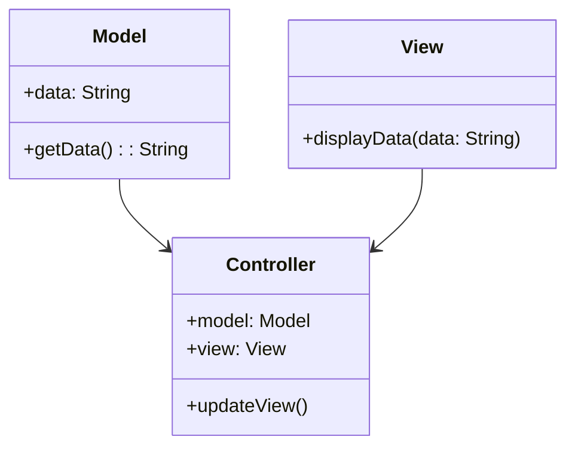
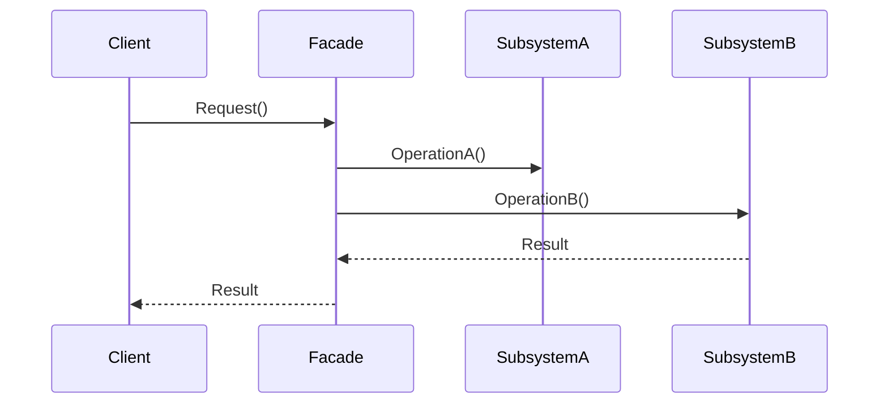

## 1.5 Benefits of Using Design Patterns in Dart

Design patterns are proven solutions to common software design problems. They provide a template for how to solve a problem in a way that is efficient, reusable, and scalable. In the context of Dart and Flutter development, design patterns are particularly beneficial due to Dart's unique features and the demands of building complex, high-performance mobile applications. In this section, we will explore the various benefits of using design patterns in Dart, focusing on how they leverage Dart's features, enhance code reusability and maintenance, and improve development speed.

### Leverage Dart's Features

Dart is a versatile language that offers several features that can be effectively utilized through design patterns. These features include mixins, extension methods, and async/await, among others. By incorporating design patterns, developers can harness these features to create more robust and efficient applications.

#### Mixins

Mixins in Dart allow developers to reuse a class's code in multiple class hierarchies. This feature is particularly useful in implementing design patterns like the Decorator or Strategy pattern, where behavior needs to be shared across different classes without using inheritance.

```dart
mixin Logger {
  void log(String message) {
    print('Log: $message');
  }
}

class NetworkService with Logger {
  void fetchData() {
    log('Fetching data...');
    // Fetch data logic
  }
}

void main() {
  var service = NetworkService();
  service.fetchData();
}
```

In this example, the `Logger` mixin provides logging functionality that can be reused across different classes, demonstrating the power of mixins in promoting code reuse.

#### Extension Methods

Extension methods allow developers to add new functionality to existing classes without modifying them. This feature is particularly useful in implementing the Adapter pattern, where you might need to extend the functionality of a class to fit a specific interface.

```dart
extension StringParsing on String {
  int toInt() {
    return int.parse(this);
  }
}

void main() {
  String number = "123";
  print(number.toInt()); // Outputs: 123
}
```

Here, the `StringParsing` extension adds a `toInt` method to the `String` class, showcasing how extension methods can be used to adapt existing classes to new requirements.

#### Async/Await

Dart's async/await syntax simplifies asynchronous programming, making it easier to implement patterns like the Observer or Command pattern, which often involve asynchronous operations.

```dart
Future<void> fetchData() async {
  await Future.delayed(Duration(seconds: 2));
  print('Data fetched');
}

void main() async {
  print('Start fetching');
  await fetchData();
  print('Fetching complete');
}
```

This example demonstrates how async/await can be used to handle asynchronous operations cleanly, which is essential in many design patterns that deal with asynchronous data flows.

### Code Reusability and Maintenance

One of the primary benefits of design patterns is that they promote code reusability and ease of maintenance. By using design patterns, developers can create solutions that are not only reusable across different parts of an application but also easier to maintain and extend over time.

#### Simplifying Future Updates

Design patterns provide a structured approach to solving problems, which makes it easier to update and modify code in the future. For instance, the Factory Method pattern allows developers to introduce new types of objects without changing the code that uses them.

```dart
abstract class Button {
  void render();
}

class WindowsButton implements Button {
  @override
  void render() {
    print('Render Windows button');
  }
}

class MacOSButton implements Button {
  @override
  void render() {
    print('Render MacOS button');
  }
}

class ButtonFactory {
  static Button createButton(String type) {
    if (type == 'Windows') {
      return WindowsButton();
    } else if (type == 'MacOS') {
      return MacOSButton();
    } else {
      throw Exception('Unsupported button type');
    }
  }
}

void main() {
  Button button = ButtonFactory.createButton('Windows');
  button.render();
}
```

In this example, the `ButtonFactory` class encapsulates the creation logic, allowing new button types to be added without modifying existing code.

#### Scalability

Design patterns also enhance the scalability of applications. By providing a clear structure and separation of concerns, patterns like MVC (Model-View-Controller) or MVVM (Model-View-ViewModel) make it easier to scale applications as they grow in complexity.



This diagram illustrates the MVC pattern, where the `Model`, `View`, and `Controller` are separate components that interact with each other, promoting scalability and maintainability.

### Improved Development Speed

Design patterns can significantly speed up the development process by providing a proven template for solving common problems. This allows developers to focus on the unique aspects of their application rather than reinventing the wheel.

#### Faster Problem-Solving

By using established patterns, developers can quickly identify the best solution for a given problem, reducing the time spent on trial and error. For example, the Singleton pattern provides a straightforward way to ensure a class has only one instance, which is a common requirement in many applications.

```dart
class Singleton {
  static final Singleton _instance = Singleton._internal();

  factory Singleton() {
    return _instance;
  }

  Singleton._internal();
}

void main() {
  var s1 = Singleton();
  var s2 = Singleton();
  print(identical(s1, s2)); // Outputs: true
}
```

In this example, the Singleton pattern ensures that only one instance of the `Singleton` class is created, simplifying the problem of managing global state.

#### Reducing Complexity

Design patterns help reduce the complexity of code by providing a clear and consistent structure. This makes it easier for developers to understand and work with the code, even if they are not the original authors.



This sequence diagram illustrates the Facade pattern, where a `Facade` class provides a simplified interface to a complex subsystem, reducing the complexity for the client.

### Try It Yourself

To truly understand the benefits of design patterns in Dart, try modifying the code examples provided. For instance, add a new button type to the `ButtonFactory` example or implement a new feature using the Facade pattern. Experimenting with these patterns will deepen your understanding and help you see their practical benefits in action.

### Knowledge Check

- **Question:** How do mixins in Dart promote code reuse?
- **Exercise:** Implement a simple Observer pattern using Dart's async/await syntax.

### Embrace the Journey

Remember, mastering design patterns is a journey. As you continue to explore and experiment with these patterns, you'll become more adept at solving complex problems and building high-quality applications. Keep experimenting, stay curious, and enjoy the journey!

## Quiz Time!



### What is one of the main benefits of using design patterns in Dart?

- [x] Code reusability and maintenance
- [ ] Increased code complexity
- [ ] Slower development speed
- [ ] Reduced application performance

> **Explanation:** Design patterns promote code reusability and ease of maintenance by providing a structured approach to solving common problems.

### How do mixins in Dart enhance code reusability?

- [x] By allowing code to be reused across multiple class hierarchies
- [ ] By enforcing strict inheritance rules
- [ ] By providing a way to modify existing classes
- [ ] By simplifying asynchronous programming

> **Explanation:** Mixins allow developers to reuse code across different class hierarchies without using inheritance, promoting code reuse.

### Which Dart feature is particularly useful for implementing the Adapter pattern?

- [x] Extension methods
- [ ] Mixins
- [ ] Async/await
- [ ] Singleton

> **Explanation:** Extension methods allow developers to add new functionality to existing classes, making them ideal for implementing the Adapter pattern.

### What is the primary purpose of the Singleton pattern?

- [x] To ensure a class has only one instance
- [ ] To provide a simplified interface to a complex subsystem
- [ ] To separate the concerns of data, presentation, and control
- [ ] To allow code reuse across multiple class hierarchies

> **Explanation:** The Singleton pattern ensures that a class has only one instance, which is a common requirement in many applications.

### How do design patterns improve development speed?

- [x] By providing a proven template for solving common problems
- [ ] By increasing code complexity
- [ ] By enforcing strict coding standards
- [ ] By reducing the need for testing

> **Explanation:** Design patterns provide a proven template for solving common problems, allowing developers to focus on the unique aspects of their application.

### Which pattern is illustrated by a sequence diagram showing a Facade class interacting with subsystems?

- [x] Facade pattern
- [ ] Singleton pattern
- [ ] Observer pattern
- [ ] Factory Method pattern

> **Explanation:** The sequence diagram illustrates the Facade pattern, where a Facade class provides a simplified interface to a complex subsystem.

### What is a key benefit of using the Factory Method pattern?

- [x] It allows new types of objects to be introduced without changing existing code
- [ ] It ensures a class has only one instance
- [ ] It provides a simplified interface to a complex subsystem
- [ ] It separates the concerns of data, presentation, and control

> **Explanation:** The Factory Method pattern allows new types of objects to be introduced without changing the code that uses them, promoting flexibility and scalability.

### How do design patterns help reduce code complexity?

- [x] By providing a clear and consistent structure
- [ ] By enforcing strict inheritance rules
- [ ] By increasing the number of classes
- [ ] By simplifying asynchronous programming

> **Explanation:** Design patterns provide a clear and consistent structure, making it easier for developers to understand and work with the code.

### What is the role of the Controller in the MVC pattern?

- [x] To interact with both the Model and the View
- [ ] To store and manage data
- [ ] To display data to the user
- [ ] To provide a simplified interface to a complex subsystem

> **Explanation:** In the MVC pattern, the Controller interacts with both the Model and the View, coordinating the flow of data and user interactions.

### True or False: Design patterns can only be used in object-oriented programming languages.

- [ ] True
- [x] False

> **Explanation:** While design patterns are often associated with object-oriented programming, they can be adapted and used in other programming paradigms as well.



By understanding and applying design patterns in Dart, you can create more efficient, maintainable, and scalable applications. As you continue to explore these patterns, you'll gain valuable insights into how to solve complex problems and build high-quality software. Keep experimenting, stay curious, and enjoy the journey!
