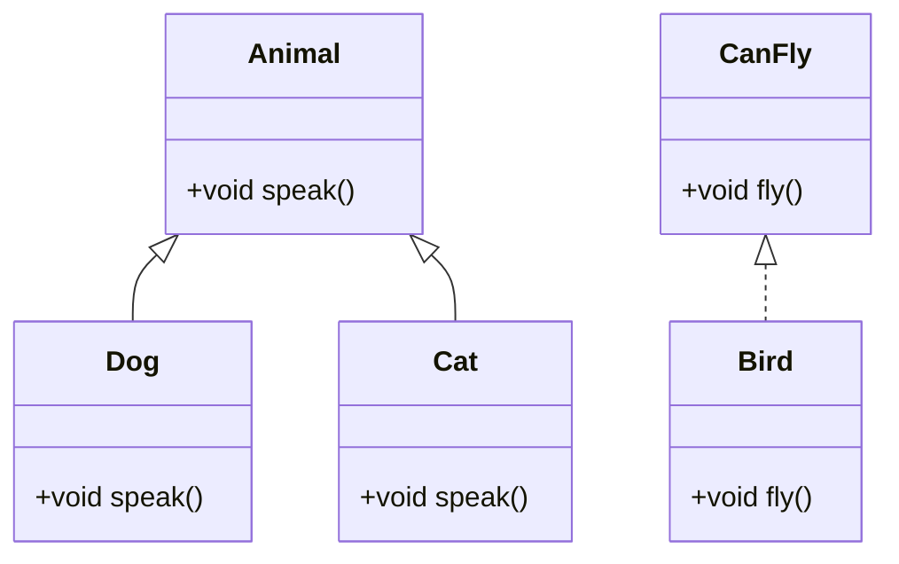

## 1.6 Overview of Dart Features Relevant to Design Patterns

In the realm of software development, design patterns serve as time-tested solutions to common problems. Dart, with its robust set of features, provides a fertile ground for implementing these patterns effectively. This section delves into the Dart features that are particularly relevant to design patterns, including object-oriented principles, functional programming support, asynchronous programming capabilities, and unique constructs like mixins and null safety.

### Object-Oriented Features in Dart

Dart is a class-based, object-oriented language with a rich set of features that facilitate the implementation of design patterns. Let's explore these features in detail:

#### Classes and Inheritance

Classes are the blueprint for creating objects in Dart. They encapsulate data and behavior, making them fundamental to object-oriented programming (OOP). Inheritance allows a class to inherit properties and methods from another class, promoting code reuse and the creation of hierarchical class structures.

```dart
class Animal {
  void speak() {
    print('Animal speaks');
  }
}

class Dog extends Animal {
  @override
  void speak() {
    print('Bark');
  }
}

void main() {
  Dog dog = Dog();
  dog.speak(); // Output: Bark
}
```

**Key Points:**
- **Encapsulation**: Classes encapsulate data and behavior, providing a clear structure.
- **Inheritance**: Enables the creation of a class hierarchy, facilitating code reuse.

#### Polymorphism

Polymorphism allows objects to be treated as instances of their parent class. This feature is crucial for implementing design patterns like Strategy and Command, where behavior can be dynamically changed at runtime.

```dart
class Animal {
  void speak() {
    print('Animal speaks');
  }
}

class Dog extends Animal {
  @override
  void speak() {
    print('Bark');
  }
}

class Cat extends Animal {
  @override
  void speak() {
    print('Meow');
  }
}

void main() {
  List<Animal> animals = [Dog(), Cat()];
  for (var animal in animals) {
    animal.speak();
  }
  // Output: Bark
  //         Meow
}
```

**Key Points:**
- **Dynamic Behavior**: Polymorphism allows for dynamic method invocation.
- **Flexibility**: Facilitates flexible and scalable code design.

#### Encapsulation

Encapsulation is the bundling of data with the methods that operate on that data. Dart supports encapsulation through access modifiers, allowing developers to hide implementation details and expose only necessary parts of a class.

```dart
class BankAccount {
  double _balance;

  BankAccount(this._balance);

  void deposit(double amount) {
    _balance += amount;
  }

  double get balance => _balance;
}

void main() {
  BankAccount account = BankAccount(1000);
  account.deposit(500);
  print(account.balance); // Output: 1500
}
```

**Key Points:**
- **Data Hiding**: Protects the internal state of an object.
- **Controlled Access**: Provides controlled access to class members.

### Functional Programming Support

Dart embraces functional programming paradigms, offering features like first-class functions, closures, and higher-order functions. These features are instrumental in implementing design patterns that benefit from functional approaches.

#### First-Class Functions

In Dart, functions are first-class citizens, meaning they can be assigned to variables, passed as arguments, and returned from other functions. This capability is essential for patterns like Strategy and Command, where functions can be used to encapsulate behavior.

```dart
void greet(String message) {
  print(message);
}

void main() {
  Function sayHello = greet;
  sayHello('Hello, Dart!'); // Output: Hello, Dart!
}
```

**Key Points:**
- **Flexibility**: Functions can be manipulated like any other object.
- **Behavior Encapsulation**: Functions can encapsulate behavior and be passed around.

#### Closures

Closures are functions that capture variables from their surrounding scope. They are powerful tools for maintaining state and implementing patterns like Observer and Iterator.

```dart
Function makeAdder(int addBy) {
  return (int i) => addBy + i;
}

void main() {
  var add2 = makeAdder(2);
  var add5 = makeAdder(5);

  print(add2(3)); // Output: 5
  print(add5(3)); // Output: 8
}
```

**Key Points:**
- **State Maintenance**: Closures can maintain state across function calls.
- **Scope Access**: Capture and use variables from their lexical scope.

#### Higher-Order Functions

Higher-order functions are functions that take other functions as arguments or return them as results. They are pivotal in implementing patterns that require flexible behavior, such as Strategy and Template Method.

```dart
void execute(Function operation) {
  operation();
}

void main() {
  execute(() => print('Executing operation')); // Output: Executing operation
}
```

**Key Points:**
- **Behavior Abstraction**: Abstract behavior by passing functions as parameters.
- **Code Reusability**: Enhance code reusability and modularity.

### Asynchronous Programming

Dart's asynchronous programming model is built around Futures, Streams, async/await, and Isolates. These features are crucial for implementing patterns that deal with concurrency and asynchronous operations.

#### Futures and async/await

Futures represent a potential value or error that will be available at some point in the future. The async/await syntax simplifies working with asynchronous code, making it more readable and maintainable.

```dart
Future<String> fetchData() async {
  return Future.delayed(Duration(seconds: 2), () => 'Data loaded');
}

void main() async {
  print('Fetching data...');
  String data = await fetchData();
  print(data); // Output: Data loaded
}
```

**Key Points:**
- **Concurrency**: Handle asynchronous operations seamlessly.
- **Readability**: async/await syntax improves code readability.

#### Streams

Streams provide a sequence of asynchronous events. They are ideal for handling data that arrives over time, such as user input or network responses, and are essential for implementing patterns like Observer and Publisher-Subscriber.

```dart
Stream<int> countStream(int max) async* {
  for (int i = 1; i <= max; i++) {
    yield i;
  }
}

void main() async {
  await for (int value in countStream(5)) {
    print(value);
  }
  // Output: 1
  //         2
  //         3
  //         4
  //         5
}
```

**Key Points:**
- **Event Handling**: Handle sequences of asynchronous events.
- **Data Streams**: Ideal for processing continuous data streams.

#### Isolates

Isolates are Dart's way of achieving parallelism. They run in separate memory spaces, allowing for concurrent execution without shared state. This feature is crucial for implementing concurrency patterns.

```dart
import 'dart:isolate';

void isolateFunction(SendPort sendPort) {
  sendPort.send('Hello from isolate!');
}

void main() async {
  ReceivePort receivePort = ReceivePort();
  await Isolate.spawn(isolateFunction, receivePort.sendPort);

  receivePort.listen((message) {
    print(message); // Output: Hello from isolate!
  });
}
```

**Key Points:**
- **Parallel Execution**: Achieve parallelism without shared state.
- **Concurrency**: Enhance application performance with concurrent execution.

### Unique Dart Constructs

Dart offers unique constructs like mixins, extension methods, and null safety, which are instrumental in implementing design patterns effectively.

#### Mixins

Mixins allow classes to inherit behavior from multiple sources. They are a powerful tool for code reuse and implementing patterns like Decorator and Composite.

```dart
mixin CanFly {
  void fly() {
    print('Flying');
  }
}

class Bird with CanFly {}

void main() {
  Bird bird = Bird();
  bird.fly(); // Output: Flying
}
```

**Key Points:**
- **Code Reuse**: Reuse code across multiple classes.
- **Behavior Composition**: Compose behavior from multiple sources.

#### Extension Methods

Extension methods allow developers to add new functionality to existing classes without modifying them. This feature is useful for implementing patterns that require extending class behavior, such as Adapter and Decorator.

```dart
extension StringExtension on String {
  String get reversed => split('').reversed.join();
}

void main() {
  print('hello'.reversed); // Output: olleh
}
```

**Key Points:**
- **Non-Intrusive**: Add functionality without altering existing code.
- **Flexibility**: Extend behavior of existing classes.

#### Null Safety

Null safety is a feature that helps developers avoid null reference errors by distinguishing between nullable and non-nullable types. This feature is crucial for implementing robust and error-free design patterns.

```dart
void printLength(String? text) {
  if (text != null) {
    print('Length: ${text.length}');
  } else {
    print('Text is null');
  }
}

void main() {
  printLength('Hello'); // Output: Length: 5
  printLength(null);    // Output: Text is null
}
```

**Key Points:**
- **Error Prevention**: Prevent null reference errors.
- **Type Safety**: Ensure type safety in your code.

### Visualizing Dart's Features

To better understand how these features interact and support design patterns, let's visualize them using a class diagram that illustrates the relationships between classes, mixins, and extension methods in Dart.



**Diagram Description:** This class diagram illustrates the inheritance hierarchy of `Animal`, `Dog`, and `Cat`, as well as the use of mixins with `CanFly` and `Bird`. It demonstrates how Dart's object-oriented features and mixins can be used to create flexible and reusable code structures.

### Try It Yourself

To solidify your understanding of Dart's features, try modifying the code examples provided. For instance, create a new class that uses both inheritance and mixins, or extend an existing class with an extension method to add new functionality. Experiment with asynchronous programming by creating a new Stream or Future.

### Knowledge Check

- **What is the purpose of using mixins in Dart?**
- **How do extension methods enhance existing classes?**
- **Explain the benefits of null safety in Dart.**
- **Describe how polymorphism is used in design patterns.**

### Embrace the Journey

Remember, mastering Dart's features is a journey. As you continue to explore and experiment, you'll gain a deeper understanding of how these features can be leveraged to implement design patterns effectively. Stay curious, keep experimenting, and enjoy the process of learning and growing as a developer!

## Quiz Time!



### What is the primary purpose of using mixins in Dart?

- [x] To allow code reuse across multiple classes
- [ ] To enforce strict type checking
- [ ] To manage asynchronous operations
- [ ] To handle null safety

> **Explanation:** Mixins are used to allow code reuse across multiple classes, enabling behavior composition without inheritance.

### How do extension methods benefit existing classes in Dart?

- [x] By adding new functionality without modifying the original class
- [ ] By enforcing encapsulation
- [ ] By improving performance
- [ ] By managing state

> **Explanation:** Extension methods allow developers to add new functionality to existing classes without altering their source code, enhancing flexibility.

### What feature of Dart helps prevent null reference errors?

- [x] Null safety
- [ ] Mixins
- [ ] Futures
- [ ] Isolates

> **Explanation:** Null safety in Dart helps prevent null reference errors by distinguishing between nullable and non-nullable types.

### Which Dart feature is essential for handling sequences of asynchronous events?

- [x] Streams
- [ ] Futures
- [ ] Mixins
- [ ] Extension methods

> **Explanation:** Streams are used to handle sequences of asynchronous events, making them ideal for processing continuous data streams.

### What is the role of polymorphism in design patterns?

- [x] To allow objects to be treated as instances of their parent class
- [ ] To enforce strict type checking
- [ ] To manage asynchronous operations
- [ ] To handle null safety

> **Explanation:** Polymorphism allows objects to be treated as instances of their parent class, enabling dynamic behavior and flexibility in design patterns.

### How does Dart's async/await syntax improve code?

- [x] By making asynchronous code more readable and maintainable
- [ ] By enforcing strict type checking
- [ ] By improving performance
- [ ] By handling null safety

> **Explanation:** The async/await syntax in Dart simplifies working with asynchronous code, making it more readable and maintainable.

### What is the advantage of using first-class functions in Dart?

- [x] They can be assigned to variables and passed as arguments
- [ ] They enforce encapsulation
- [ ] They improve performance
- [ ] They manage state

> **Explanation:** First-class functions in Dart can be assigned to variables, passed as arguments, and returned from other functions, providing flexibility in behavior encapsulation.

### Which Dart feature allows for parallel execution without shared state?

- [x] Isolates
- [ ] Streams
- [ ] Mixins
- [ ] Extension methods

> **Explanation:** Isolates in Dart allow for parallel execution without shared state, enhancing application performance with concurrent execution.

### How do closures maintain state in Dart?

- [x] By capturing variables from their surrounding scope
- [ ] By enforcing encapsulation
- [ ] By improving performance
- [ ] By managing state

> **Explanation:** Closures in Dart capture variables from their surrounding scope, allowing them to maintain state across function calls.

### True or False: Dart's null safety feature distinguishes between nullable and non-nullable types.

- [x] True
- [ ] False

> **Explanation:** True. Dart's null safety feature distinguishes between nullable and non-nullable types, helping prevent null reference errors.



By understanding and leveraging these Dart features, you can effectively implement design patterns and build robust, scalable applications. Keep exploring and experimenting with these features to enhance your development skills and create high-quality software solutions.
