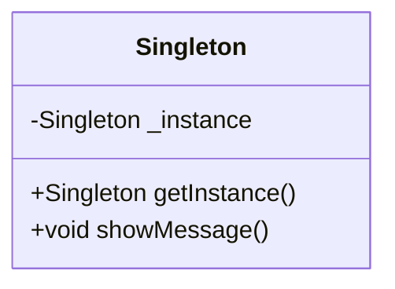

## 1.7 How to Use This Guide

Welcome to the **Mastering Dart Design Patterns: The Comprehensive Guide to Effective Flutter Development**. This guide is meticulously crafted to serve as your go-to resource for mastering design patterns in Dart, specifically tailored for Flutter development. Whether you're a seasoned developer looking to refine your skills or a newcomer eager to learn, this guide is structured to provide you with the knowledge and tools necessary to build high-performance, scalable applications with confidence.

### Structure of the Guide

Understanding the structure of this guide will help you navigate through the wealth of information it contains. The guide is organized into several key sections, each focusing on different aspects of design patterns and their application in Dart and Flutter development.

#### 1. Introduction to Design Patterns in Dart

This section lays the foundation by introducing you to the concept of design patterns, their history, and their importance in software development. You'll learn about the different types of design patterns and how they have evolved over time. This section also highlights the benefits of using design patterns in Dart and provides an overview of Dart features relevant to design patterns.

#### 2. Principles of Object-Oriented Design in Dart

Here, we delve into the principles of object-oriented programming (OOP) that are crucial for understanding and implementing design patterns. You'll explore concepts like composition over inheritance, the SOLID principles, and other best practices that form the backbone of effective software design.

#### 3. Dart Language Features and Best Practices

This section provides a comprehensive overview of Dart's language features, such as null safety, asynchronous programming, and error handling. You'll learn best practices for using these features effectively in your code.

#### 4. Creational Design Patterns in Dart

Explore various creational design patterns, such as Singleton, Factory Method, and Builder, and learn how to implement them in Dart. This section includes detailed explanations, code examples, and practical exercises to reinforce your understanding.

#### 5. Structural Design Patterns in Dart

Discover structural design patterns like Adapter, Bridge, and Composite, and see how they can be applied to organize your code more efficiently. This section also covers data access patterns and architectural patterns used in Flutter applications.

#### 6. Behavioral Design Patterns in Dart

Learn about behavioral design patterns, including Strategy, Observer, and Command, and how they can be used to manage complex interactions within your applications. This section provides insights into the BLoC pattern and other state management techniques.

#### 7. Idiomatic Dart Patterns

This section focuses on idiomatic patterns in Dart, such as using mixins for code reuse and effective use of extension methods. You'll also explore patterns for handling state in Flutter applications and implementing value objects.

#### 8. Concurrency Patterns in Dart

Concurrency is a critical aspect of modern application development. This section introduces you to concurrency patterns in Dart, including async/await, streams, and isolates, and provides best practices for managing concurrency in your applications.

#### 9. State Management Patterns in Flutter

State management is a crucial part of Flutter development. This section covers various state management patterns, such as Provider, BLoC, and Redux, and provides guidance on choosing the right pattern for your application.

#### 10. Functional Programming Patterns in Dart

Explore functional programming concepts and patterns in Dart, such as higher-order functions, immutable data structures, and functional reactive programming. This section demonstrates how to apply these patterns in Flutter applications.

#### 11. Reactive Programming Patterns in Dart

Reactive programming is a powerful paradigm for building responsive applications. This section covers reactive programming patterns, including working with streams, observables, and RxDart, and provides best practices for implementing reactive state management.

#### 12. Networking and Data Patterns in Dart

Learn how to handle networking and data in Dart applications. This section covers HTTP and RESTful API consumption, data access patterns, and techniques for offline data storage and persistence.

#### 13. Security Patterns in Dart and Flutter

Security is paramount in application development. This section provides guidance on implementing security patterns in Dart and Flutter, including authentication, secure data storage, and secure communication.

#### 14. Performance Optimization Patterns

Optimize the performance of your Flutter applications with patterns for widget build optimization, lazy loading, and efficient use of isolates. This section also covers caching strategies and best practices for smooth animations.

#### 15. Testing and Design Patterns

Testing is an integral part of the development process. This section covers unit testing, widget testing, and integration testing in Dart and Flutter, and provides guidance on using design patterns to facilitate testing.

#### 16. Anti-Patterns

Avoid common pitfalls in Dart and Flutter development by learning about anti-patterns. This section highlights common anti-patterns, such as overusing stateful widgets and mismanaging async/await, and provides strategies for refactoring them.

#### 17. Best Practices

This section provides best practices for selecting the right design pattern, organizing your code, and maintaining code quality. You'll also learn about documentation, version control, and collaboration techniques.

#### 18. Case Studies

Gain practical insights from real-world case studies that demonstrate the application of design patterns in various domains, such as game development, e-commerce, and IoT systems.

#### 19. Conclusion

The conclusion recaps key concepts covered in the guide and provides resources for continuing your education in Dart and Flutter development.

#### 20. Appendices

The appendices include a glossary of terms, a bibliography for further reading, and a pattern reference cheat sheet. You'll also find common interview questions on design patterns and links to online resources and communities.

### Code Examples and Exercises

Throughout the guide, you'll find numerous code examples and exercises designed to reinforce your understanding of the concepts discussed. These examples are carefully crafted to demonstrate the practical application of design patterns in Dart and Flutter development.

#### Code Examples

Each design pattern is accompanied by clear, well-commented code examples that illustrate its implementation in Dart. These examples are functional, error-free, and tested to ensure they work as expected. Key lines or sections within the code are highlighted to draw attention to important points.

```dart
// Example of Singleton Design Pattern in Dart

class Singleton {
  // Private constructor
  Singleton._privateConstructor();

  // Static instance of the class
  static final Singleton _instance = Singleton._privateConstructor();

  // Factory method to return the instance
  factory Singleton() {
    return _instance;
  }

  // Method to demonstrate functionality
  void showMessage() {
    print("Hello from Singleton!");
  }
}

void main() {
  // Accessing the Singleton instance
  Singleton singleton = Singleton();
  singleton.showMessage();
}
```

In this example, we demonstrate the Singleton design pattern in Dart. The `Singleton` class has a private constructor and a static instance of itself. The factory method returns this instance, ensuring that only one instance of the class exists.

#### Exercises

At the end of each section, you'll find exercises that challenge you to apply what you've learned. These exercises are designed to reinforce your understanding and encourage experimentation.

**Exercise: Implement a Factory Method Pattern**

- Create a simple application that uses the Factory Method pattern to create different types of vehicles (e.g., Car, Bike, Truck).
- Implement a factory class that returns an instance of the appropriate vehicle based on input parameters.
- Test your implementation by creating instances of different vehicles and calling their methods.

### Further Reading and Resources

To deepen your understanding of design patterns and their application in Dart and Flutter, we've included links to reputable external resources throughout the guide. These resources provide additional insights and examples that complement the material covered in this guide.

- [Dart Language Tour](https://dart.dev/guides/language/language-tour): A comprehensive overview of Dart's language features.
- [Flutter Documentation](https://flutter.dev/docs): Official documentation for Flutter, including tutorials and best practices.
- [Design Patterns in Object-Oriented Programming](https://refactoring.guru/design-patterns): An in-depth exploration of design patterns and their application in software development.

### Visualizing Concepts

To enhance your understanding of complex concepts, we've incorporated diagrams, tables, and charts throughout the guide. These visual aids are created using Hugo-compatible Mermaid.js diagrams and provide a clear representation of architectures, workflows, and relationships between objects.



The above class diagram illustrates the structure of the Singleton design pattern, showing the private instance and the public method to access it.

### Knowledge Check

To ensure you're retaining the information covered in each section, we've included knowledge check questions and small challenges. These questions are designed to engage you and reinforce your learning.

**Knowledge Check:**

- What is the primary purpose of the Singleton design pattern?
- How does the Factory Method pattern differ from the Abstract Factory pattern?

### Embrace the Journey

Remember, this guide is just the beginning of your journey into mastering Dart design patterns. As you progress through the guide, you'll build more complex and interactive applications. Keep experimenting, stay curious, and enjoy the journey!

### Formatting and Structure

The guide is organized with clear headings and subheadings to help you navigate through the content easily. Bullet points are used to break down complex information, and important terms or concepts are highlighted using bold or italic text sparingly.

### Writing Style

We've adopted a collaborative writing style, using first-person plural (we, let's) to create a sense of partnership in your learning journey. We've also avoided gender-specific pronouns to ensure inclusivity.

### Quiz Time!

To test your understanding of the material covered in this section, we've prepared a quiz with questions that challenge your knowledge and reinforce key concepts.



### What is the primary purpose of the Singleton design pattern?

- [x] To ensure a class has only one instance
- [ ] To create multiple instances of a class
- [ ] To allow subclasses to alter the type of objects created
- [ ] To provide a way to access a collection of objects

> **Explanation:** The Singleton design pattern ensures that a class has only one instance and provides a global point of access to it.

### How does the Factory Method pattern differ from the Abstract Factory pattern?

- [x] Factory Method creates objects without specifying the exact class
- [ ] Factory Method uses multiple factories to create objects
- [ ] Abstract Factory creates a single object
- [ ] Abstract Factory does not involve inheritance

> **Explanation:** The Factory Method pattern defines an interface for creating an object but lets subclasses alter the type of objects that will be created, whereas the Abstract Factory pattern provides an interface for creating families of related or dependent objects.

### What is the benefit of using design patterns in software development?

- [x] They provide proven solutions to common problems
- [ ] They make code more complex
- [ ] They are only useful in large projects
- [ ] They eliminate the need for testing

> **Explanation:** Design patterns provide proven solutions to common problems, making code more maintainable and scalable.

### Which principle emphasizes the importance of composition over inheritance?

- [x] Composition Over Inheritance
- [ ] DRY (Don't Repeat Yourself)
- [ ] KISS (Keep It Simple, Stupid)
- [ ] YAGNI (You Aren't Gonna Need It)

> **Explanation:** The principle of Composition Over Inheritance emphasizes using composition to achieve code reuse rather than relying solely on inheritance.

### What is the purpose of the SOLID principles?

- [x] To improve software design and maintainability
- [ ] To increase the complexity of code
- [x] To provide guidelines for object-oriented design
- [ ] To eliminate the need for testing

> **Explanation:** The SOLID principles are a set of guidelines for object-oriented design that aim to improve software design and maintainability.

### What is the role of the BLoC pattern in Flutter development?

- [x] To manage business logic and state
- [ ] To handle network requests
- [ ] To create UI components
- [ ] To manage database operations

> **Explanation:** The BLoC (Business Logic Component) pattern is used in Flutter development to manage business logic and state, separating it from the UI.

### What is the advantage of using async/await in Dart?

- [x] It simplifies asynchronous code
- [ ] It makes code run faster
- [x] It improves readability
- [ ] It eliminates the need for error handling

> **Explanation:** The async/await syntax in Dart simplifies asynchronous code, making it more readable and easier to manage.

### What is the purpose of the Provider pattern in Flutter?

- [x] To manage state and dependencies
- [ ] To create UI components
- [ ] To handle network requests
- [ ] To manage database operations

> **Explanation:** The Provider pattern in Flutter is used to manage state and dependencies, providing a way to share data across the widget tree.

### What is the benefit of using immutable data structures in functional programming?

- [x] They prevent unintended side effects
- [ ] They make code run faster
- [ ] They increase memory usage
- [ ] They eliminate the need for error handling

> **Explanation:** Immutable data structures in functional programming prevent unintended side effects by ensuring that data cannot be modified once created.

### True or False: Reactive programming is only useful for handling UI events.

- [ ] True
- [x] False

> **Explanation:** Reactive programming is useful for handling a wide range of asynchronous data streams, not just UI events.



By following this guide, you'll gain a deep understanding of design patterns and their application in Dart and Flutter development. You'll be equipped with the knowledge and skills to build robust, scalable applications and take your development skills to the next level. Happy coding!
